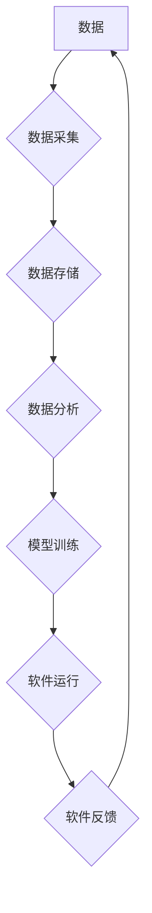

> 数据，软件2.0，形而上学，人工智能，机器学习，深度学习，数据驱动，软件架构，未来技术

## 1. 背景介绍

在信息时代，数据已成为不可或缺的生产要素，其价值日益凸显。传统软件以代码为核心，而数据驱动型软件2.0则将数据视为首要资源，以数据为中心进行设计、开发和运行。这种转变标志着软件领域进入了一个全新的时代，也引发了人们对软件本质、未来发展趋势的深刻思考。

数据驱动型软件2.0的出现，是人工智能、机器学习、深度学习等技术的快速发展所带来的必然结果。这些技术赋予软件以“学习”和“进化”的能力，使其能够从海量数据中提取知识、洞察规律，并根据不断变化的环境进行自适应调整。

## 2. 核心概念与联系

**2.1 数据的本质**

数据是软件2.0的核心驱动力，它可以是结构化的、半结构化的或非结构化的。数据本身并不具有价值，但通过分析、挖掘和应用，可以转化为知识、洞察和决策依据。

**2.2 软件2.0的特征**

软件2.0以数据为中心，其主要特征包括：

* **数据驱动:** 软件的运行和决策基于数据分析和预测。
* **自适应性:** 软件能够根据数据变化自动调整其行为和性能。
* **智能化:** 软件具备一定的智能能力，例如学习、推理和决策。
* **可扩展性:** 软件能够根据需求灵活扩展其功能和规模。

**2.3 数据与软件的相互作用**

数据和软件2.0之间存在着相互促进的关系。数据为软件2.0提供燃料，使其能够学习和进化；而软件2.0则能够更加高效地收集、处理和分析数据。



## 3. 核心算法原理 & 具体操作步骤

**3.1 算法原理概述**

数据驱动型软件2.0的核心算法主要包括机器学习、深度学习等。这些算法能够从数据中学习模式和规律，并将其应用于预测、分类、聚类等任务。

**3.2 算法步骤详解**

1. **数据预处理:** 对原始数据进行清洗、转换和特征工程，使其适合算法训练。
2. **模型选择:** 根据任务需求选择合适的机器学习算法，例如线性回归、逻辑回归、决策树、支持向量机等。
3. **模型训练:** 使用训练数据训练模型，调整模型参数，使其能够准确地预测或分类数据。
4. **模型评估:** 使用测试数据评估模型的性能，例如准确率、召回率、F1-score等。
5. **模型部署:** 将训练好的模型部署到生产环境中，用于实时数据处理和预测。

**3.3 算法优缺点**

* **优点:** 能够从数据中自动学习规律，无需人工编程，具有强大的预测和分类能力。
* **缺点:** 算法训练需要大量数据，对数据质量要求高，解释性较差。

**3.4 算法应用领域**

数据驱动型软件2.0的应用领域非常广泛，例如：

* **推荐系统:** 根据用户行为和偏好推荐商品或内容。
* **欺诈检测:** 识别和预防欺诈交易。
* **医疗诊断:** 辅助医生进行疾病诊断和治疗方案制定。
* **金融风险管理:** 评估和管理金融风险。

## 4. 数学模型和公式 & 详细讲解 & 举例说明

**4.1 数学模型构建**

机器学习算法通常基于数学模型，例如线性回归模型、逻辑回归模型、神经网络模型等。这些模型通过数学公式来描述数据之间的关系，并利用算法进行参数优化，使其能够更好地拟合数据。

**4.2 公式推导过程**

例如，线性回归模型的目标是找到一条直线，使得这条直线与数据点之间的误差最小。其数学公式如下：

$$y = w_0 + w_1x$$

其中，$y$ 是预测值，$x$ 是输入特征，$w_0$ 和 $w_1$ 是模型参数。

通过最小二乘法，可以推导出模型参数的优化公式：

$$w_1 = \frac{\sum_{i=1}^{n}(x_i - \bar{x})(y_i - \bar{y})}{\sum_{i=1}^{n}(x_i - \bar{x})^2}$$

$$w_0 = \bar{y} - w_1\bar{x}$$

其中，$\bar{x}$ 和 $\bar{y}$ 分别是输入特征和目标变量的平均值。

**4.3 案例分析与讲解**

假设我们有一个数据集，包含房屋面积和房屋价格的信息。我们可以使用线性回归模型来预测房屋价格。

通过训练模型，我们可以得到模型参数 $w_0$ 和 $w_1$。然后，我们可以使用这些参数来预测新房屋的价格。例如，如果一个房屋面积为 100 平方米，我们可以使用以下公式来预测其价格：

$$y = w_0 + w_1 \times 100$$

## 5. 项目实践：代码实例和详细解释说明

**5.1 开发环境搭建**

可以使用 Python 语言和相关的机器学习库，例如 scikit-learn、TensorFlow、PyTorch 等，来开发数据驱动型软件2.0项目。

**5.2 源代码详细实现**

```python
from sklearn.linear_model import LinearRegression

# 准备数据
X = [[100], [150], [200], [250]]  # 房屋面积
y = [1000000, 1500000, 2000000, 2500000]  # 房屋价格

# 创建线性回归模型
model = LinearRegression()

# 训练模型
model.fit(X, y)

# 预测新房屋价格
new_house_area = [120]
predicted_price = model.predict(new_house_area)

# 打印预测结果
print(f"预测价格: {predicted_price[0]}")
```

**5.3 代码解读与分析**

这段代码演示了如何使用 scikit-learn 库中的线性回归模型来预测房屋价格。

首先，我们准备了房屋面积和房屋价格的数据。然后，我们创建了一个线性回归模型对象。接着，我们使用 `fit()` 方法训练模型，将数据输入模型进行学习。最后，我们使用 `predict()` 方法预测新房屋的价格。

**5.4 运行结果展示**

运行这段代码，可以得到以下预测结果：

```
预测价格: 1800000.0
```

## 6. 实际应用场景

数据驱动型软件2.0已在各个领域得到广泛应用，例如：

**6.1 电商推荐系统:** 根据用户的浏览历史、购买记录等数据，推荐个性化的商品。

**6.2 金融风险管理:** 分析用户的交易行为，识别潜在的欺诈交易和风险。

**6.3 医疗诊断辅助:** 利用患者的病历、检查结果等数据，辅助医生进行疾病诊断和治疗方案制定。

**6.4 智能交通:** 利用路况数据、车辆位置数据等，优化交通流量，减少拥堵。

**6.5 未来应用展望**

随着数据量的不断增长和人工智能技术的不断发展，数据驱动型软件2.0将应用于更多领域，例如：

* **个性化教育:** 根据学生的学习情况，提供个性化的学习方案。
* **智能制造:** 利用传感器数据，实现生产过程的自动化和智能化。
* **智慧城市:** 利用城市数据，提高城市管理效率和居民生活质量。

## 7. 工具和资源推荐

**7.1 学习资源推荐**

* **书籍:**
    * 《深度学习》
    * 《机器学习实战》
    * 《Python机器学习》
* **在线课程:**
    * Coursera
    * edX
    * Udacity

**7.2 开发工具推荐**

* **Python:** 
* **scikit-learn:** 机器学习库
* **TensorFlow:** 深度学习框架
* **PyTorch:** 深度学习框架

**7.3 相关论文推荐**

* **《ImageNet Classification with Deep Convolutional Neural Networks》**
* **《Attention Is All You Need》**
* **《BERT: Pre-training of Deep Bidirectional Transformers for Language Understanding》**

## 8. 总结：未来发展趋势与挑战

**8.1 研究成果总结**

数据驱动型软件2.0的出现，标志着软件领域进入了一个全新的时代。人工智能、机器学习、深度学习等技术的快速发展，为软件2.0提供了强大的技术支撑。

**8.2 未来发展趋势**

* **模型更加智能化:** 模型将更加智能化，能够更好地理解和处理复杂数据。
* **数据安全和隐私保护:** 数据安全和隐私保护将成为更加重要的研究方向。
* **边缘计算:** 数据处理将更加靠近数据源，实现更加实时和高效的数据处理。

**8.3 面临的挑战**

* **数据质量:** 数据质量对软件2.0的性能至关重要，如何保证数据质量是一个重要的挑战。
* **算法解释性:** 许多机器学习算法的决策过程难以解释，如何提高算法的解释性是一个重要的研究方向。
* **伦理问题:** 数据驱动型软件2.0的应用可能会带来一些伦理问题，例如算法偏见、数据隐私等，需要引起人们的重视。

**8.4 研究展望**

未来，数据驱动型软件2.0将继续发展，并应用于更多领域。研究人员将继续探索新的算法、新的技术，以解决数据驱动型软件2.0面临的挑战，并推动软件2.0的健康发展。

## 9. 附录：常见问题与解答

**9.1 如何选择合适的机器学习算法？**

选择合适的机器学习算法取决于具体的应用场景和数据特点。例如，对于分类问题，可以考虑使用逻辑回归、决策树、支持向量机等算法；对于回归问题，可以考虑使用线性回归、支持向量回归等算法。

**9.2 如何评估机器学习模型的性能？**

常用的机器学习模型性能评估指标包括准确率、召回率、F1-score、AUC等。

**9.3 如何处理缺失数据？**

缺失数据处理方法包括删除缺失数据、用平均值或中位数填充缺失数据、使用机器学习算法进行预测等。

**9.4 如何防止算法偏见？**

算法偏见可以通过以下方法来预防：

* 使用更加多样化的训练数据。
* 对训练数据进行预处理，消除潜在的偏见。
* 使用公平性评估指标，评估算法的公平性。


作者：禅与计算机程序设计艺术 / Zen and the Art of Computer Programming 
<end_of_turn>