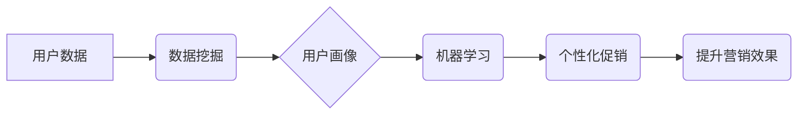

> 智能促销、机器学习、推荐系统、数据挖掘、预测分析、个性化营销

## 1. 背景介绍

在当今数据爆炸的时代，企业拥有海量用户数据，如何有效利用这些数据提升营销效率，实现精准营销，成为企业亟需解决的关键问题。智能促销策略作为一种基于数据分析和机器学习的营销方式，正逐渐成为企业提升营销效益的重要手段。

传统的促销策略往往依赖于经验和直觉，缺乏数据支撑，难以精准定位目标用户，导致营销资源浪费严重。而智能促销策略则通过对用户行为、偏好等数据的分析，构建用户画像，预测用户需求，从而制定个性化、精准的促销方案，提高营销效果。

## 2. 核心概念与联系

智能促销策略的核心概念包括：

* **用户画像:** 通过对用户行为、偏好、购买历史等数据的分析，构建用户画像，了解用户的需求和特征。
* **数据挖掘:** 从海量用户数据中挖掘出有价值的信息，例如用户购买偏好、消费习惯、兴趣爱好等。
* **机器学习:** 利用机器学习算法，对用户数据进行分析和预测，例如预测用户购买意愿、推荐合适的促销活动等。
* **个性化营销:** 根据用户画像和预测结果，为不同用户提供个性化的促销方案，提高用户体验和转化率。

**核心概念架构图:**



## 3. 核心算法原理 & 具体操作步骤

### 3.1  算法原理概述

智能促销策略中常用的算法包括：

* **协同过滤:** 根据用户的历史行为数据，预测用户对商品的喜好。
* **内容过滤:** 根据商品的特征和用户偏好，推荐用户可能感兴趣的商品。
* **深度学习:** 利用深度神经网络，对用户数据进行更深入的分析和预测。

### 3.2  算法步骤详解

以协同过滤算法为例，其具体操作步骤如下：

1. **数据收集:** 收集用户对商品的评分或购买记录数据。
2. **数据预处理:** 对数据进行清洗、去噪、标准化等处理。
3. **相似度计算:** 计算用户之间的相似度或商品之间的相似度。
4. **推荐生成:** 根据用户与商品的相似度，推荐用户可能感兴趣的商品。

### 3.3  算法优缺点

**协同过滤算法:**

* **优点:** 可以发现用户之间的隐性关系，推荐个性化商品。
* **缺点:** 数据稀疏性问题，新用户或新商品难以推荐。

**内容过滤算法:**

* **优点:** 不需要用户历史数据，可以推荐符合用户偏好的商品。
* **缺点:** 容易陷入“同质化推荐”问题，缺乏多样性。

**深度学习算法:**

* **优点:** 可以学习更复杂的特征，提高推荐准确率。
* **缺点:** 需要大量数据训练，计算资源消耗大。

### 3.4  算法应用领域

智能促销策略的算法广泛应用于：

* **电商平台:** 商品推荐、促销活动策划、用户画像分析。
* **社交媒体:** 广告投放、内容推荐、用户行为分析。
* **金融行业:** 贷款审批、风险控制、个性化金融产品推荐。

## 4. 数学模型和公式 & 详细讲解 & 举例说明

### 4.1  数学模型构建

协同过滤算法的数学模型可以表示为用户-商品评分矩阵，其中每个元素表示用户对商品的评分。

**用户-商品评分矩阵:**

```
| 用户 | 商品1 | 商品2 | 商品3 |
|---|---|---|---|
| 用户1 | 5 | 3 | 4 |
| 用户2 | 4 | 5 | 2 |
| 用户3 | 3 | 4 | 5 |
```

### 4.2  公式推导过程

用户相似度计算可以使用余弦相似度公式：

```latex
\text{相似度} = \frac{\mathbf{u} \cdot \mathbf{v}}{\|\mathbf{u}\| \|\mathbf{v}\| }
```

其中：

* $\mathbf{u}$ 和 $\mathbf{v}$ 是两个用户的评分向量。
* $\cdot$ 表示向量点积。
* $\|\mathbf{u}\|$ 和 $\|\mathbf{v}\|$ 表示向量的模长。

### 4.3  案例分析与讲解

假设有两个用户，用户1的评分向量为 [5, 3, 4]，用户2的评分向量为 [4, 5, 2]。

使用余弦相似度公式计算用户1和用户2的相似度：

```latex
\text{相似度} = \frac{(5 \times 4) + (3 \times 5) + (4 \times 2)}{( \sqrt{5^2 + 3^2 + 4^2}) \times (\sqrt{4^2 + 5^2 + 2^2})} = 0.78
```

相似度为0.78，表明用户1和用户2的评分偏好有一定的相似性。

## 5. 项目实践：代码实例和详细解释说明

### 5.1  开发环境搭建

* 操作系统: Ubuntu 20.04
* Python 版本: 3.8
* 依赖库: pandas, numpy, scikit-learn

### 5.2  源代码详细实现

```python
import pandas as pd
from sklearn.metrics.pairwise import cosine_similarity

# 加载用户评分数据
ratings_data = pd.read_csv('ratings.csv')

# 计算用户相似度矩阵
user_similarity = cosine_similarity(ratings_data)

# 获取用户1的相似用户
similar_users = user_similarity[0].argsort()[:-6:-1]  # 排序并获取前5个相似用户

# 推荐商品
recommended_items = ratings_data.iloc[similar_users, :].mean().sort_values(ascending=False)
```

### 5.3  代码解读与分析

* `ratings_data` 变量加载用户评分数据，数据格式为用户ID、商品ID、评分。
* `cosine_similarity` 函数计算用户之间的余弦相似度，生成用户相似度矩阵。
* `similar_users` 变量获取用户1的相似用户，并排序。
* `recommended_items` 变量根据相似用户的评分平均值，推荐用户1可能感兴趣的商品。

### 5.4  运行结果展示

运行代码后，将输出用户1可能感兴趣的商品列表，并根据评分排序。

## 6. 实际应用场景

智能促销策略在电商平台、社交媒体、金融行业等领域都有广泛的应用场景。

### 6.1  电商平台

* **商品推荐:** 根据用户的浏览历史、购买记录等数据，推荐用户可能感兴趣的商品。
* **促销活动策划:** 分析用户行为数据，预测用户对不同促销活动的兴趣，制定精准的促销方案。
* **用户画像分析:** 建立用户画像，了解用户的需求和偏好，为用户提供个性化的购物体验。

### 6.2  社交媒体

* **广告投放:** 根据用户的兴趣爱好、行为特征等数据，精准投放广告，提高广告转化率。
* **内容推荐:** 根据用户的浏览历史、点赞记录等数据，推荐用户可能感兴趣的内容。
* **用户行为分析:** 分析用户的行为数据，了解用户的兴趣趋势和消费习惯，为平台运营提供数据支持。

### 6.3  金融行业

* **贷款审批:** 分析用户的信用记录、收入状况等数据，提高贷款审批效率和准确率。
* **风险控制:** 分析用户的交易行为数据，识别潜在的风险用户，降低金融风险。
* **个性化金融产品推荐:** 根据用户的风险偏好、投资目标等数据，推荐合适的金融产品。

### 6.4  未来应用展望

随着人工智能技术的不断发展，智能促销策略将更加智能化、个性化、精准化。未来，智能促销策略将应用于更多领域，例如医疗、教育、旅游等，为用户提供更加个性化、便捷的服务。

## 7. 工具和资源推荐

### 7.1  学习资源推荐

* **书籍:**
    * 《推荐系统实践》
    * 《机器学习》
* **在线课程:**
    * Coursera: 机器学习
    * edX: 数据科学

### 7.2  开发工具推荐

* **Python:** 
    * pandas
    * numpy
    * scikit-learn
* **Spark:** 大数据处理框架

### 7.3  相关论文推荐

* **协同过滤算法:**
    * "Collaborative Filtering for Implicit Feedback Datasets"
* **深度学习推荐系统:**
    * "Deep Learning for Recommender Systems"

## 8. 总结：未来发展趋势与挑战

### 8.1  研究成果总结

智能促销策略的研究取得了显著成果，为企业提升营销效率、实现精准营销提供了有效手段。

### 8.2  未来发展趋势

* **更加智能化:** 利用更先进的人工智能算法，例如深度学习、强化学习等，提高促销策略的智能化水平。
* **更加个性化:** 基于更细粒度的用户数据，为每个用户提供更加个性化的促销方案。
* **更加精准化:** 利用更精准的预测模型，预测用户的购买意愿和行为，提高促销活动的转化率。

### 8.3  面临的挑战

* **数据隐私保护:** 智能促销策略需要大量用户数据，如何保护用户隐私成为一个重要挑战。
* **算法解释性:** 许多人工智能算法的决策过程难以解释，如何提高算法的透明度和可解释性也是一个挑战。
* **算法公平性:** 智能促销策略可能存在偏见，导致某些用户受到不公平的对待，如何确保算法的公平性也是一个重要问题。

### 8.4  研究展望

未来，智能促销策略的研究将继续深入，探索更智能、更个性化、更精准的促销方案，为企业和用户创造更大的价值。

## 9. 附录：常见问题与解答

**Q1: 智能促销策略是否会取代传统的促销方式？**

**A1:** 智能促销策略并非要取代传统的促销方式，而是要与传统的促销方式相结合，形成更加有效的营销体系。

**Q2: 如何保证智能促销策略的公平性？**

**A2:** 

* 使用公平的算法模型，避免算法偏见。
* 定期评估算法的公平性，及时调整算法参数。
* 建立透明的算法解释机制，让用户了解算法的决策过程。

**Q3: 智能促销策略需要哪些数据支持？**

**A3:** 智能促销策略需要以下数据支持：

* 用户行为数据：例如浏览历史、购买记录、点赞记录等。
* 用户画像数据：例如用户年龄、性别、兴趣爱好、消费习惯等。
* 商品数据：例如商品类别、价格、库存等。


作者：禅与计算机程序设计艺术 / Zen and the Art of Computer Programming 
<end_of_turn>