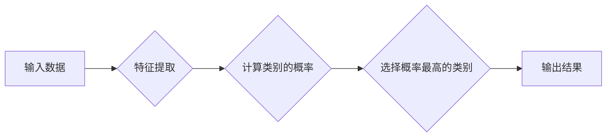

>朴素贝叶斯，分类算法，概率论，贝叶斯定理，机器学习，代码实例

## 1. 背景介绍

在机器学习领域，分类算法占据着重要地位，它能够根据已有的数据样本，学习出分类规则，从而对新的数据进行分类。朴素贝叶斯算法作为一种经典的分类算法，以其简单易懂、训练速度快、效果稳定的特点，在文本分类、图像识别、医疗诊断等领域得到了广泛应用。

朴素贝叶斯算法基于贝叶斯定理，假设特征之间相互独立，从而简化了计算过程。尽管这种“朴素”的假设在现实世界中并不总是成立，但朴素贝叶斯算法仍然表现出令人印象深刻的性能，尤其是在高维数据和少量样本的情况下。

## 2. 核心概念与联系

### 2.1 贝叶斯定理

贝叶斯定理是朴素贝叶斯算法的核心，它描述了在已知条件下，事件发生的概率如何更新。

$$P(A|B) = \frac{P(B|A)P(A)}{P(B)}$$

其中：

* $P(A|B)$ 表示事件 A 在事件 B 发生的情况下发生的概率。
* $P(B|A)$ 表示事件 B 在事件 A 发生的情况下发生的概率。
* $P(A)$ 表示事件 A 发生的概率。
* $P(B)$ 表示事件 B 发生的概率。

### 2.2 朴素贝叶斯假设

朴素贝叶斯算法的核心假设是特征之间相互独立。这意味着，一个特征的取值不会影响其他特征的取值。

**Mermaid 流程图**



## 3. 核心算法原理 & 具体操作步骤

### 3.1 算法原理概述

朴素贝叶斯算法的基本思想是：

1. 根据训练数据，计算每个类别出现的概率。
2. 计算每个特征在每个类别下出现的概率。
3. 对新的数据样本，根据贝叶斯定理计算每个类别出现的概率。
4. 选择概率最高的类别作为预测结果。

### 3.2 算法步骤详解

1. **数据预处理:** 对训练数据进行清洗、转换和特征工程，例如删除缺失值、编码类别特征等。
2. **计算类别概率:** 计算每个类别的出现概率，例如，如果训练数据中有100个样本，其中50个属于类别A，则类别A的出现概率为0.5。
3. **计算特征概率:** 对于每个特征，计算在每个类别下出现的概率。例如，如果特征是“颜色”，类别是“苹果”和“香蕉”，则计算在“苹果”类别下“红色”颜色出现的概率，以及在“香蕉”类别下“黄色”颜色出现的概率。
4. **预测类别:** 对新的数据样本，根据贝叶斯定理计算每个类别出现的概率。
5. **选择类别:** 选择概率最高的类别作为预测结果。

### 3.3 算法优缺点

**优点:**

* 简单易懂，易于实现。
* 训练速度快，适合处理大规模数据。
* 对缺失数据处理较为灵活。

**缺点:**

* 朴素贝叶斯算法假设特征之间相互独立，这在现实世界中并不总是成立。
* 对训练数据质量要求较高，如果训练数据不充分或存在噪声，则算法性能会下降。

### 3.4 算法应用领域

朴素贝叶斯算法广泛应用于以下领域：

* 文本分类：例如垃圾邮件过滤、情感分析、主题分类。
* 图像识别：例如手写数字识别、物体检测。
* 医疗诊断：例如疾病预测、药物推荐。
* 欺诈检测：例如信用卡欺诈检测、网络安全。

## 4. 数学模型和公式 & 详细讲解 & 举例说明

### 4.1 数学模型构建

假设我们有一个分类问题，有 $C$ 个类别，$D$ 个特征。训练数据包含 $N$ 个样本，每个样本包含一个类别标签和 $D$ 个特征值。

* $C$：类别集合
* $D$：特征集合
* $N$：训练样本数量
* $x$：单个样本
* $y$：样本类别标签

### 4.2 公式推导过程

根据贝叶斯定理，我们可以计算样本 $x$ 属于类别 $c$ 的概率：

$$P(c|x) = \frac{P(x|c)P(c)}{P(x)}$$

其中：

* $P(c|x)$：样本 $x$ 属于类别 $c$ 的概率。
* $P(x|c)$：类别 $c$ 下，样本 $x$ 出现的概率。
* $P(c)$：类别 $c$ 出现的概率。
* $P(x)$：样本 $x$ 出现的概率。

由于特征之间相互独立，我们可以将 $P(x|c)$ 进一步分解：

$$P(x|c) = \prod_{i=1}^{D} P(x_i|c)$$

其中：

* $x_i$：特征 $i$ 的值。

### 4.3 案例分析与讲解

假设我们有一个分类问题，要判断邮件是否为垃圾邮件。

* 类别：垃圾邮件（spam）和正常邮件（ham）
* 特征：邮件内容中的关键词，例如“免费”、“奖品”、“点击此处”等。

我们可以使用朴素贝叶斯算法训练一个模型，根据邮件内容预测邮件是否为垃圾邮件。

训练数据包含大量已标记的邮件样本，我们可以根据训练数据计算每个类别出现的概率，以及每个关键词在每个类别下出现的概率。

对于新的邮件样本，我们可以根据贝叶斯定理计算邮件属于垃圾邮件和正常邮件的概率，并选择概率最高的类别作为预测结果。

## 5. 项目实践：代码实例和详细解释说明

### 5.1 开发环境搭建

* Python 3.x
* scikit-learn 库

### 5.2 源代码详细实现

```python
from sklearn.naive_bayes import GaussianNB
from sklearn.model_selection import train_test_split
from sklearn.metrics import accuracy_score

# 加载数据
# ...

# 将数据分割为训练集和测试集
X_train, X_test, y_train, y_test = train_test_split(X, y, test_size=0.2, random_state=42)

# 创建朴素贝叶斯模型
model = GaussianNB()

# 训练模型
model.fit(X_train, y_train)

# 对测试集进行预测
y_pred = model.predict(X_test)

# 计算准确率
accuracy = accuracy_score(y_test, y_pred)
print(f"准确率: {accuracy}")
```

### 5.3 代码解读与分析

* `GaussianNB()` 创建一个高斯朴素贝叶斯模型。
* `train_test_split()` 将数据分割为训练集和测试集。
* `fit()` 方法训练模型。
* `predict()` 方法对测试集进行预测。
* `accuracy_score()` 计算模型的准确率。

### 5.4 运行结果展示

运行代码后，会输出模型的准确率。

## 6. 实际应用场景

### 6.1 文本分类

朴素贝叶斯算法在文本分类领域有着广泛的应用，例如：

* 垃圾邮件过滤：根据邮件内容识别垃圾邮件。
* 情感分析：分析文本表达的情感倾向，例如正面、负面或中性。
* 主题分类：将文本归类到不同的主题类别，例如新闻、科技、体育等。

### 6.2 图像识别

朴素贝叶斯算法也可以用于图像识别，例如：

* 手写数字识别：识别手写数字的类别。
* 物体检测：识别图像中存在的物体，例如人、车、树等。

### 6.3 医疗诊断

朴素贝叶斯算法在医疗诊断领域也有应用，例如：

* 疾病预测：根据患者的症状和病史预测疾病的可能性。
* 药物推荐：根据患者的病史和基因信息推荐合适的药物。

### 6.4 未来应用展望

随着机器学习技术的不断发展，朴素贝叶斯算法在未来将有更多新的应用场景，例如：

* 自然语言处理：例如机器翻译、对话系统等。
* 欺诈检测：例如信用卡欺诈检测、网络安全等。
* 个性化推荐：例如商品推荐、音乐推荐等。

## 7. 工具和资源推荐

### 7.1 学习资源推荐

* **书籍:**
    * 《机器学习》 - 周志华
    * 《Python机器学习实战》 - 塞缪尔·阿布拉姆斯
* **在线课程:**
    * Coursera: Machine Learning
    * edX: Introduction to Machine Learning

### 7.2 开发工具推荐

* **Python:** 
    * scikit-learn: 机器学习库
    * pandas: 数据处理库
    * numpy: 数值计算库

### 7.3 相关论文推荐

* **朴素贝叶斯分类算法** -  R.O. Duda, P.E. Hart, D.G. Stork
* **朴素贝叶斯算法在文本分类中的应用** -  A. McCallum, K. Nigam

## 8. 总结：未来发展趋势与挑战

### 8.1 研究成果总结

朴素贝叶斯算法是一种简单易懂、高效的分类算法，在许多领域取得了成功应用。

### 8.2 未来发展趋势

* **半朴素贝叶斯:** 为了解决朴素贝叶斯算法的“朴素”假设，研究者们提出了半朴素贝叶斯算法，它允许特征之间存在一定的相关性。
* **贝叶斯网络:** 贝叶斯网络是一种更复杂的概率图模型，可以表示更复杂的依赖关系，并用于更复杂的分类任务。
* **深度学习:** 深度学习算法近年来取得了突破性进展，也开始应用于分类任务，例如深度贝叶斯网络。

### 8.3 面临的挑战

* **高维数据:** 当特征数量很多时，朴素贝叶斯算法的性能会下降。
* **数据稀疏性:** 当数据样本数量较少时，朴素贝叶斯算法的性能也会下降。
* **特征选择:** 选择合适的特征对于朴素贝叶斯算法的性能至关重要。

### 8.4 研究展望

未来研究方向包括：

* 针对高维数据和数据稀疏性问题，开发新的朴素贝叶斯算法。
* 研究更有效的特征选择方法。
* 将朴素贝叶斯算法与其他机器学习算法结合，提高算法性能。

## 9. 附录：常见问题与解答

### 9.1 什么是朴素贝叶斯假设？

朴素贝叶斯假设是指特征之间相互独立。这意味着，一个特征的取值不会影响其他特征的取值。

### 9.2 朴素贝叶斯算法的优缺点是什么？

**优点:**

* 简单易懂，易于实现。
* 训练速度快，适合处理大规模数据。
* 对缺失数据处理较为灵活。

**缺点:**

* 朴素贝叶斯算法假设特征之间相互独立，这在现实世界中并不总是成立。
* 对训练数据质量要求较高，如果训练数据不充分或存在噪声，则算法性能会下降。

### 9.3 朴素贝叶斯算法的应用场景有哪些？

朴素贝叶斯算法广泛应用于以下领域：

* 文本分类：例如垃圾邮件过滤、情感分析、主题分类。
* 图像识别：例如手写数字识别、物体检测。
* 医疗诊断：例如疾病预测、药物推荐。
* 欺诈检测：例如信用卡欺诈检测、网络安全。


作者：禅与计算机程序设计艺术 / Zen and the Art of Computer Programming 
<end_of_turn>