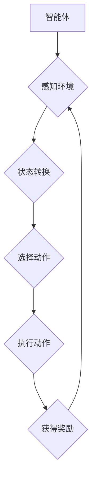

> 深度 Q-learning，智能城市，强化学习，决策优化，环境感知

## 1. 背景介绍

智能城市作为未来城市发展的重要方向，旨在通过信息化、数字化、智能化手段提升城市管理水平、提高居民生活质量。在智能城市建设中，高效、智能的决策系统至关重要。传统的决策系统往往依赖于预设规则和静态数据，难以应对复杂、动态变化的城市环境。强化学习作为一种机器学习范式，能够通过与环境交互学习最优策略，为智能城市决策提供新的思路。

深度 Q-learning 作为强化学习的一种重要算法，能够学习复杂环境下的决策策略，并将其应用于智能城市建设中的多个场景。例如，交通流量优化、能源管理、公共安全保障等。

## 2. 核心概念与联系

**2.1 强化学习**

强化学习是一种基于交互学习的机器学习方法，其核心在于智能体通过与环境交互，不断学习最优策略以最大化累积奖励。

* **智能体 (Agent):**  决策者，例如自动驾驶汽车、交通信号灯控制系统等。
* **环境 (Environment):** 智能体所处的外部世界，例如城市道路网络、能源系统等。
* **状态 (State):** 环境的当前状态，例如道路拥堵程度、能源消耗情况等。
* **动作 (Action):** 智能体可以采取的行动，例如调整交通信号灯时间、调节能源供应量等。
* **奖励 (Reward):** 环境对智能体动作的反馈，例如减少交通拥堵获得正向奖励、降低能源消耗获得正向奖励等。
* **策略 (Policy):** 智能体根据当前状态选择动作的规则。

**2.2 深度 Q-learning**

深度 Q-learning 结合了深度神经网络和 Q-learning 算法，能够学习复杂环境下的决策策略。

* **Q-table:**  传统 Q-learning 算法使用 Q-table 来存储每个状态-动作对的价值函数，但对于高维状态空间，Q-table 会变得过于庞大。
* **深度神经网络:** 深度 Q-learning 使用深度神经网络来逼近 Q-value 函数，能够处理高维状态空间。

**2.3 智能城市应用场景**

深度 Q-learning 在智能城市建设中具有广泛的应用场景：

* **交通流量优化:**  通过学习交通流量数据，优化交通信号灯控制策略，减少交通拥堵。
* **能源管理:**  通过学习能源消耗数据，优化能源分配策略，提高能源利用效率。
* **公共安全保障:**  通过学习城市安全数据，优化巡逻路线，提高公共安全保障水平。

**2.4 Mermaid 流程图**



## 3. 核心算法原理 & 具体操作步骤

### 3.1 算法原理概述

深度 Q-learning 算法的核心思想是通过深度神经网络学习状态-动作对的价值函数，并根据价值函数选择最优动作。

* **价值函数 (Q-value):**  表示在特定状态下执行特定动作的预期累积奖励。
* **目标函数:**  最小化价值函数与实际奖励之间的误差。
* **梯度下降:**  使用梯度下降算法更新神经网络参数，以最小化目标函数。

### 3.2 算法步骤详解

1. **初始化:**  初始化深度神经网络参数，并设置学习率、折扣因子等超参数。
2. **环境交互:**  智能体与环境交互，感知环境状态，并根据策略选择动作。
3. **奖励获取:**  环境根据智能体动作反馈奖励。
4. **价值更新:**  根据奖励和下一个状态的价值函数，更新当前状态-动作对的价值函数。
5. **参数更新:**  使用梯度下降算法更新神经网络参数，以最小化目标函数。
6. **重复步骤 2-5:**  重复以上步骤，直到智能体学习到最优策略。

### 3.3 算法优缺点

**优点:**

* 能够学习复杂环境下的决策策略。
* 不需要预设规则，能够适应动态变化的环境。
* 能够处理高维状态空间。

**缺点:**

* 训练过程可能需要大量数据和计算资源。
* 算法参数的设置对性能有很大影响。
* 难以解释模型决策过程。

### 3.4 算法应用领域

深度 Q-learning 算法在以下领域具有广泛的应用:

* **机器人控制:**  学习机器人运动控制策略。
* **游戏 AI:**  开发智能游戏对手。
* **金融投资:**  优化投资策略。
* **医疗诊断:**  辅助医生进行疾病诊断。

## 4. 数学模型和公式 & 详细讲解 & 举例说明

### 4.1 数学模型构建

深度 Q-learning 的核心数学模型是 Q-value 函数，其定义如下:

$$
Q(s, a) = E[\sum_{t=0}^{\infty} \gamma^t r_{t+1} | s_t = s, a_t = a]
$$

其中:

* $s$ 表示状态。
* $a$ 表示动作。
* $r_{t+1}$ 表示在时间步 $t+1$ 获得的奖励。
* $\gamma$ 表示折扣因子，控制未来奖励的权重。
* $E$ 表示期望值。

### 4.2 公式推导过程

深度 Q-learning 算法的目标是最大化 Q-value 函数，可以使用梯度下降算法进行优化。

目标函数定义为:

$$
J(\theta) = \frac{1}{N} \sum_{i=1}^{N} (Q(s_i, a_i) - Q'(s_i, a_i))^2
$$

其中:

* $\theta$ 表示神经网络参数。
* $N$ 表示训练样本数量。
* $Q(s_i, a_i)$ 表示真实 Q-value。
* $Q'(s_i, a_i)$ 表示预测 Q-value。

梯度下降算法更新神经网络参数:

$$
\theta = \theta - \alpha \nabla J(\theta)
$$

其中:

* $\alpha$ 表示学习率。
* $\nabla J(\theta)$ 表示目标函数的梯度。

### 4.3 案例分析与讲解

假设我们有一个智能体需要学习玩一个简单的游戏，游戏环境包含两个状态： "开始" 和 "结束"，智能体可以选择 "前进" 或 "后退" 两种动作。

* 当智能体处于 "开始" 状态，选择 "前进" 动作，可以获得 1 点奖励，并进入 "结束" 状态。
* 当智能体处于 "开始" 状态，选择 "后退" 动作，可以获得 0 点奖励，并保持在 "开始" 状态。
* 当智能体处于 "结束" 状态，无论选择哪种动作，都不会获得奖励。

深度 Q-learning 算法可以学习到以下策略:

* 当智能体处于 "开始" 状态时，选择 "前进" 动作。

## 5. 项目实践：代码实例和详细解释说明

### 5.1 开发环境搭建

* Python 3.x
* TensorFlow 或 PyTorch 深度学习框架
* NumPy 科学计算库
* Matplotlib 数据可视化库

### 5.2 源代码详细实现

```python
import tensorflow as tf

# 定义神经网络模型
model = tf.keras.models.Sequential([
    tf.keras.layers.Dense(128, activation='relu', input_shape=(state_size,)),
    tf.keras.layers.Dense(64, activation='relu'),
    tf.keras.layers.Dense(action_size)
])

# 定义损失函数和优化器
loss_fn = tf.keras.losses.MeanSquaredError()
optimizer = tf.keras.optimizers.Adam(learning_rate=0.001)

# 训练模型
for episode in range(num_episodes):
    state = env.reset()
    done = False
    while not done:
        # 选择动作
        action = tf.argmax(model(tf.expand_dims(state, axis=0))).numpy()[0]

        # 执行动作并获取奖励和下一个状态
        next_state, reward, done, _ = env.step(action)

        # 更新 Q-value
        target = reward + gamma * tf.reduce_max(model(tf.expand_dims(next_state, axis=0)))
        with tf.GradientTape() as tape:
            q_value = model(tf.expand_dims(state, axis=0))
            loss = loss_fn(target, q_value[0, action])
        gradients = tape.gradient(loss, model.trainable_variables)
        optimizer.apply_gradients(zip(gradients, model.trainable_variables))

        state = next_state

```

### 5.3 代码解读与分析

* 代码首先定义了神经网络模型，使用两层全连接层，激活函数为 ReLU。
* 然后定义了损失函数和优化器，使用均方误差损失函数和 Adam 优化器。
* 训练模型的循环结构中，智能体与环境交互，选择动作，执行动作，获取奖励和下一个状态。
* 根据奖励和下一个状态的 Q-value，更新当前状态-动作对的 Q-value。
* 使用梯度下降算法更新神经网络参数。

### 5.4 运行结果展示

训练完成后，可以评估模型性能，例如在测试环境中测试智能体的策略效果。

## 6. 实际应用场景

### 6.1 交通流量优化

深度 Q-learning 可以用于优化交通信号灯控制策略，根据实时交通流量数据，动态调整信号灯时间，减少交通拥堵。

### 6.2 能源管理

深度 Q-learning 可以用于优化能源分配策略，根据能源消耗数据和预测需求，动态调整能源供应量，提高能源利用效率。

### 6.3 公共安全保障

深度 Q-learning 可以用于优化巡逻路线，根据城市安全数据和风险评估，动态调整巡逻路线，提高公共安全保障水平。

### 6.4 未来应用展望

随着人工智能技术的不断发展，深度 Q-learning 在智能城市建设中的应用场景将会更加广泛，例如:

* 智能交通: 自动驾驶、无人配送、智能停车等。
* 智能能源: 智能电网、分布式能源管理等。
* 智能环境: 环境监测、污染控制等。
* 智能生活: 智能家居、智慧医疗等。

## 7. 工具和资源推荐

### 7.1 学习资源推荐

* **书籍:**
    * Reinforcement Learning: An Introduction by Richard S. Sutton and Andrew G. Barto
    * Deep Reinforcement Learning Hands-On by Maxim Lapan
* **在线课程:**
    * Deep Reinforcement Learning Specialization by DeepLearning.AI
    * Reinforcement Learning by David Silver (University of DeepMind)

### 7.2 开发工具推荐

* **Python:**  深度学习编程语言
* **TensorFlow:**  开源深度学习框架
* **PyTorch:**  开源深度学习框架
* **OpenAI Gym:**  强化学习环境库

### 7.3 相关论文推荐

* Deep Q-Network (DQN) by Volodymyr Mnih et al. (2015)
* Dueling Network Architectures for Deep Reinforcement Learning by Hado van Hasselt et al. (2016)
* Double Q-Learning by  van Hasselt et al. (2015)

## 8. 总结：未来发展趋势与挑战

### 8.1 研究成果总结

深度 Q-learning 算法取得了显著的成果，在多个领域取得了突破性进展，例如游戏 AI、机器人控制等。

### 8.2 未来发展趋势

* **模型效率提升:**  研究更高效的深度 Q-learning 模型，例如模型压缩、知识蒸馏等。
* **样本效率提升:**  研究减少训练数据需求的深度 Q-learning 方法，例如迁移学习、元学习