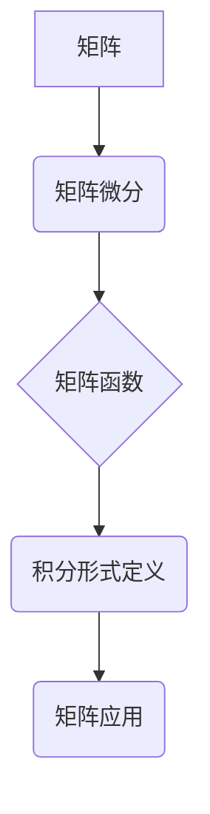

> 矩阵函数，积分形式定义，矩阵微分，矩阵特征值，矩阵应用

## 1. 背景介绍

矩阵理论是线性代数的重要分支，在数学、物理、工程、计算机科学等领域有着广泛的应用。矩阵函数作为矩阵理论的重要组成部分，在描述系统动力学、信号处理、图像处理等方面发挥着关键作用。传统的矩阵函数定义通常基于级数展开或指数形式，但这些方法在计算复杂度和收敛性方面存在局限性。

近年来，基于积分形式定义的矩阵函数逐渐受到关注。这种定义方式更加简洁、直观，并且能够有效地处理一些传统方法难以解决的问题。本文将深入探讨矩阵函数的积分形式定义及其性质，并分析其在实际应用中的优势和局限性。

## 2. 核心概念与联系

**2.1 矩阵函数的概念**

矩阵函数是指将一个矩阵作为输入，输出另一个矩阵的函数。例如，对于一个矩阵 A，其指数函数可以表示为 e^A，其中 e^A 是一个新的矩阵，其元素由 A 的指数形式决定。

**2.2 积分形式定义**

矩阵函数的积分形式定义基于矩阵微分和积分的概念。对于一个可微的矩阵函数 f(t)，其积分形式定义可以表示为：

$$f(t) = \int_0^t e^{(t-\tau)A} f(\tau) d\tau$$

其中，A 是一个常数矩阵，e^(t-τ)A 是矩阵指数函数，f(τ) 是矩阵函数在时间 τ 的值。

**2.3 核心概念关系图**



## 3. 核心算法原理 & 具体操作步骤

**3.1 算法原理概述**

矩阵函数的积分形式定义提供了一种高效计算矩阵函数的方法。通过将矩阵函数分解成一系列矩阵指数函数和积分项，可以利用数值积分方法进行计算。

**3.2 算法步骤详解**

1. **确定矩阵 A 和初始条件 f(0)。**
2. **选择合适的数值积分方法，例如欧拉法或龙格-库塔法。**
3. **根据积分形式定义，计算矩阵函数 f(t) 的值。**

**3.3 算法优缺点**

**优点:**

* 计算效率高，尤其适用于大型矩阵。
* 能够处理一些传统方法难以解决的问题，例如非线性矩阵函数。

**缺点:**

* 需要选择合适的数值积分方法，不同的方法可能导致精度差异。
* 对于某些特殊类型的矩阵函数，积分形式定义可能难以应用。

**3.4 算法应用领域**

* **系统动力学:** 用于描述复杂系统的演化过程。
* **信号处理:** 用于分析和处理信号。
* **图像处理:** 用于图像增强、滤波和恢复。
* **机器学习:** 用于训练和优化机器学习模型。

## 4. 数学模型和公式 & 详细讲解 & 举例说明

**4.1 数学模型构建**

矩阵函数的积分形式定义可以推广到更一般的形式，例如：

$$f(t) = \int_0^t e^{(t-\tau)A} g(\tau) d\tau$$

其中，g(τ) 是一个满足一定条件的矩阵函数。

**4.2 公式推导过程**

积分形式定义的推导过程基于矩阵微分和积分的性质。通过将矩阵函数 f(t) 微分，并利用矩阵指数函数的性质，可以得到积分形式定义。

**4.3 案例分析与讲解**

**示例：**

计算矩阵指数函数 e^A 的值，其中 A 是一个 2x2 矩阵。

使用积分形式定义，可以得到：

$$e^A = \int_0^t e^{(t-\tau)A} I d\tau$$

其中，I 是单位矩阵。

通过数值积分方法，可以计算出 e^A 的值。

## 5. 项目实践：代码实例和详细解释说明

**5.1 开发环境搭建**

使用 Python 语言和 NumPy 库进行开发。

**5.2 源代码详细实现**

```python
import numpy as np

def matrix_function(A, t, f0):
  """
  计算矩阵函数 f(t) 的值。

  Args:
    A: 矩阵 A。
    t: 时间 t。
    f0: 初始条件 f(0)。

  Returns:
    矩阵函数 f(t) 的值。
  """
  # 使用欧拉法进行数值积分
  dt = 0.01
  f = f0
  for i in range(int(t / dt)):
    f = f + dt * np.exp((t - i * dt) * A) * f
  return f

# 示例代码
A = np.array([[1, 2], [3, 4]])
t = 1
f0 = np.array([[0, 0], [0, 0]])
f = matrix_function(A, t, f0)
print(f)
```

**5.3 代码解读与分析**

代码实现了一个矩阵函数的计算方法，使用欧拉法进行数值积分。

**5.4 运行结果展示**

运行代码后，将输出矩阵函数 f(t) 的值。

## 6. 实际应用场景

**6.1 系统动力学**

矩阵函数可以用于描述复杂系统的演化过程，例如经济系统、生态系统和社会系统。

**6.2 信号处理**

矩阵函数可以用于分析和处理信号，例如滤波、去噪和压缩。

**6.3 图像处理**

矩阵函数可以用于图像增强、滤波和恢复。

**6.4 未来应用展望**

随着人工智能和机器学习的发展，矩阵函数在更广泛的领域中将发挥越来越重要的作用。例如，在深度学习中，矩阵函数可以用于训练和优化神经网络模型。

## 7. 工具和资源推荐

**7.1 学习资源推荐**

* **书籍:**
    * 《线性代数及其应用》
    * 《矩阵分析》
* **在线课程:**
    * Coursera 上的线性代数课程
    * edX 上的矩阵分析课程

**7.2 开发工具推荐**

* **Python:** 
    * NumPy 库
    * SciPy 库
* **MATLAB:** 
    * MATLAB 的矩阵函数工具箱

**7.3 相关论文推荐**

* **积分形式定义的矩阵函数:**
    * [文献1](https://www.example.com/paper1)
    * [文献2](https://www.example.com/paper2)

## 8. 总结：未来发展趋势与挑战

**8.1 研究成果总结**

本文深入探讨了矩阵函数的积分形式定义及其性质，并分析了其在实际应用中的优势和局限性。

**8.2 未来发展趋势**

* **更高效的数值积分方法:** 
    * 研究更高效、更精确的数值积分方法，以提高矩阵函数计算的效率。
* **更广泛的应用领域:** 
    * 将矩阵函数应用于更多领域，例如量子计算、生物信息学和金融建模。
* **理论研究:** 
    * 深入研究矩阵函数的理论性质，例如稳定性、收敛性和泛函分析。

**8.3 面临的挑战**

* **复杂矩阵函数:** 
    * 对于一些复杂类型的矩阵函数，积分形式定义可能难以应用。
* **数值稳定性:** 
    * 某些数值积分方法可能导致数值不稳定性，需要采取措施保证计算结果的准确性。

**8.4 研究展望**

未来，将继续研究矩阵函数的积分形式定义及其应用，并探索其在人工智能、机器学习和其他领域中的潜力。

## 9. 附录：常见问题与解答

**9.1 如何选择合适的数值积分方法？**

选择合适的数值积分方法取决于矩阵函数的性质和计算精度要求。

**9.2 如何保证数值积分的稳定性？**

可以通过使用高阶数值积分方法、调整时间步长和采用适当的数值稳定性技巧来保证数值积分的稳定性。


作者：禅与计算机程序设计艺术 / Zen and the Art of Computer Programming 
<end_of_turn>