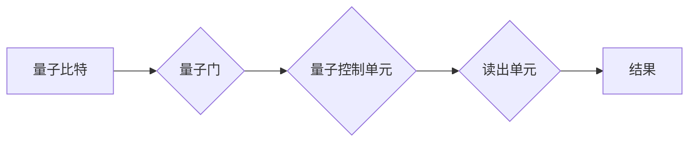

> 量子计算机，量子算法，量子纠缠，超导量子比特，硅谷，人工智能，机器学习

## 1. 背景介绍

量子计算机作为一种新兴的计算 paradigms，其独特的量子力学原理赋予其超越经典计算机的强大计算能力。近年来，量子计算领域取得了显著进展，吸引了全球科技巨头的关注，硅谷也成为了量子计算发展的重要中心。

传统计算机基于二进制系统，每个比特只能存储0或1的信息。而量子计算机利用量子力学的叠加和纠缠特性，每个量子比特可以同时存储0、1或两者叠加态，从而实现指数级的计算能力提升。

## 2. 核心概念与联系

**2.1 量子力学原理**

量子力学是描述微观世界行为的物理学理论，其核心概念包括：

* **叠加态:** 量子比特可以同时处于0和1的叠加态，即既不是0也不是1，而是两者同时存在。
* **纠缠态:** 两个或多个量子比特可以相互纠缠，即使相隔很远，它们的状态也相互关联。测量一个纠缠量子比特的状态，可以立即确定另一个纠缠量子比特的状态。
* **量子测量:** 量子测量会将量子比特从叠加态坍缩到一个确定的状态（0或1）。

**2.2 量子计算架构**

量子计算机的架构通常由以下部分组成：

* **量子比特:** 量子计算机的基本计算单元，可以存储量子信息。
* **量子门:** 用于操作量子比特的逻辑门，类似于经典计算机中的逻辑门。
* **量子控制单元:** 用于控制量子比特的演化和测量。
* **读出单元:** 用于读取量子比特的状态。

**2.3 量子算法**

量子算法是利用量子力学原理进行计算的算法，其计算效率通常比经典算法更高。一些著名的量子算法包括：

* ** Shor 算法:** 用于快速分解大整数，对密码学安全构成威胁。
* **Grover 算法:** 用于加速搜索算法，在数据库搜索等领域有应用。
* **量子模拟算法:** 用于模拟量子系统，在药物发现、材料科学等领域有应用。

**Mermaid 流程图**

## 3. 核心算法原理 & 具体操作步骤

**3.1 算法原理概述**

Shor 算法是一种用于快速分解大整数的量子算法，其原理基于量子傅里叶变换和离散对数的计算。

**3.2 算法步骤详解**

1. 将大整数分解为两个较小的整数。
2. 使用量子傅里叶变换将整数转换为量子态。
3. 使用量子门进行离散对数的计算。
4. 使用量子测量将结果转换为经典信息。

**3.3 算法优缺点**

* **优点:** 计算效率远高于经典算法。
* **缺点:** 需要构建大型、稳定的量子计算机。

**3.4 算法应用领域**

* 密码学安全
* 药物发现
* 材料科学

## 4. 数学模型和公式 & 详细讲解 & 举例说明

**4.1 数学模型构建**

Shor 算法的核心是利用量子傅里叶变换和离散对数的计算。

**4.2 公式推导过程**

* 量子傅里叶变换公式:

$$
\hat{F}_N |j\rangle = \frac{1}{\sqrt{N}} \sum_{k=0}^{N-1} e^{2\pi i jk/N} |k\rangle
$$

* 离散对数公式:

$$
a^x \equiv b \pmod{N}
$$

**4.3 案例分析与讲解**

假设要分解一个大整数N，可以使用Shor算法找到N的两个因数。

## 5. 项目实践：代码实例和详细解释说明

**5.1 开发环境搭建**

使用量子计算平台，例如IBM Quantum Experience或Google Quantum AI，搭建开发环境。

**5.2 源代码详细实现**

使用量子编程语言，例如Qiskit或Cirq，实现Shor算法的代码。

**5.3 代码解读与分析**

解释代码中的量子门操作、量子测量和结果处理等步骤。

**5.4 运行结果展示**

展示Shor算法运行的结果，例如分解大整数的因数。

## 6. 实际应用场景

**6.1 密码学安全**

Shor算法可以破解基于大整数分解的密码算法，例如RSA算法，因此对密码学安全构成威胁。

**6.2 药物发现**

量子模拟算法可以模拟分子之间的相互作用，加速药物发现过程。

**6.3 材料科学**

量子模拟算法可以模拟材料的性质，例如导电性和磁性，帮助设计新型材料。

**6.4 未来应用展望**

量子计算机在人工智能、机器学习、金融建模等领域也有着巨大的应用潜力。

## 7. 工具和资源推荐

**7.1 学习资源推荐**

* 量子计算入门书籍
* 在线量子计算课程
* 量子计算社区论坛

**7.2 开发工具推荐**

* Qiskit
* Cirq
* PennyLane

**7.3 相关论文推荐**

* Shor, P. W. (1994). Polynomial-time algorithms for prime factorization and discrete logarithms on a quantum computer. SIAM Journal on Computing, 26(5), 1484-1509.

## 8. 总结：未来发展趋势与挑战

**8.1 研究成果总结**

近年来，量子计算领域取得了显著进展，包括量子比特的制备、控制和纠缠，以及量子算法的开发。

**8.2 未来发展趋势**

* 量子比特的稳定性和可控性将得到进一步提升。
* 新型量子算法将不断涌现，并应用于更多领域。
* 量子计算平台将更加成熟和易于使用。

**8.3 面临的挑战**

* 量子计算机的构建和操作仍然面临着技术挑战。
* 量子算法的开发和应用需要大量的研究和开发投入。
* 量子计算的安全性、隐私和伦理问题需要得到重视。

**8.4 研究展望**

未来，量子计算将成为颠覆性技术，对人工智能、机器学习、药物发现、材料科学等领域产生深远影响。

## 9. 附录：常见问题与解答

**9.1 量子计算机和经典计算机的区别是什么？**

**9.2 量子算法的优势是什么？**

**9.3 量子计算的应用领域有哪些？**

**9.4 量子计算的未来发展趋势是什么？**

**9.5 量子计算面临哪些挑战？**

作者：禅与计算机程序设计艺术 / Zen and the Art of Computer Programming

<end_of_turn>