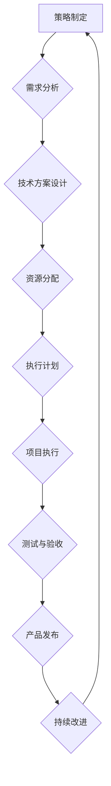

> 软件架构、系统设计、敏捷开发、团队管理、项目管理、执行力、策略制定

## 1. 背景介绍

在当今瞬息万变的科技时代，软件开发已成为推动社会进步的引擎。然而，仅仅拥有顶尖的技术人才和先进的工具远远不够，高效的管理和执行力才是决定项目成功与否的关键因素。

传统的管理模式往往过于僵化，难以适应软件开发的快速迭代和不断变化的需求。而敏捷开发理念的兴起，为软件开发管理带来了新的思路和方法。敏捷开发强调团队协作、快速反馈和持续改进，旨在提高开发效率和产品质量。

然而，将敏捷开发理念付诸实践并非易事。许多团队在实际操作中仍然面临着沟通障碍、决策效率低下、执行力不足等问题。因此，我们需要深入探讨如何将敏捷开发理念与实际项目相结合，提升团队的管理智慧，从策略制定到执行落地，实现项目高效运转。

## 2. 核心概念与联系

### 2.1 策略与执行

在软件开发项目中，策略是指团队对项目目标、技术路线、资源分配等方面的规划和决策。而执行则是将策略付诸实践，完成项目目标的过程。

策略与执行是相互依存、不可分割的两个环节。良好的策略需要基于对市场需求、技术趋势和团队能力的深入分析，而有效的执行则需要清晰的行动计划、明确的责任划分和高效的沟通机制。

### 2.2 敏捷开发

敏捷开发是一种迭代式软件开发方法，强调团队协作、快速反馈和持续改进。其核心价值观包括：

* **个人与交互** 优先于流程和工具
* **工作软件** 优先于详尽文档
* **客户合作** 优先于合同谈判
* **响应变化** 优先于遵循计划

敏捷开发的核心原则包括：

* **个人与交互**：团队成员之间保持密切的沟通和协作，共同完成项目目标。
* **工作软件**：注重交付可运行的软件产品，而不是沉重的文档。
* **客户合作**：与客户保持密切的合作，及时获取反馈并进行调整。
* **响应变化**：灵活应对项目需求的变化，不断改进开发流程。

### 2.3 流程图



## 3. 核心算法原理 & 具体操作步骤

### 3.1 算法原理概述

在软件开发项目中，算法设计和优化是提高开发效率和产品质量的关键环节。

算法设计需要考虑算法的复杂度、时间效率和空间效率等因素。

### 3.2 算法步骤详解

1. **问题分析**: 首先需要对需要解决的问题进行深入分析，明确问题的本质和目标。
2. **算法设计**: 根据问题分析结果，设计出满足需求的算法方案。
3. **算法实现**: 将算法方案转化为具体的代码实现。
4. **算法测试**: 对算法进行测试，验证其正确性和效率。
5. **算法优化**: 根据测试结果，对算法进行优化，提高其性能。

### 3.3 算法优缺点

不同的算法具有不同的优缺点，需要根据实际情况选择合适的算法。

### 3.4 算法应用领域

算法广泛应用于软件开发的各个领域，例如：

* **数据结构**: 算法用于实现各种数据结构，例如数组、链表、树、图等。
* **排序算法**: 算法用于对数据进行排序，例如冒泡排序、插入排序、快速排序等。
* **搜索算法**: 算法用于在数据中查找特定元素，例如线性搜索、二分搜索等。
* **路径规划**: 算法用于规划路径，例如 Dijkstra 算法、A* 算法等。

## 4. 数学模型和公式 & 详细讲解 & 举例说明

### 4.1 数学模型构建

在软件开发中，数学模型可以用于描述系统行为、分析性能、预测需求等。

例如，我们可以使用数学模型来描述软件系统的复杂度，并根据复杂度进行估算开发时间和资源需求。

### 4.2 公式推导过程

```latex
$$
复杂度 = \sum_{i=1}^{n} c_i \cdot t_i
$$
```

其中：

* $c_i$ 表示第 $i$ 个模块的代码量
* $t_i$ 表示第 $i$ 个模块的执行时间

### 4.3 案例分析与讲解

假设一个软件系统由三个模块组成，其代码量和执行时间分别为：

* 模块 1：$c_1 = 100$ 行，$t_1 = 0.1$ 秒
* 模块 2：$c_2 = 200$ 行，$t_2 = 0.2$ 秒
* 模块 3：$c_3 = 300$ 行，$t_3 = 0.3$ 秒

则该软件系统的复杂度为：

```latex
$$
复杂度 = 100 \cdot 0.1 + 200 \cdot 0.2 + 300 \cdot 0.3 = 10 + 40 + 90 = 140
$$
```

## 5. 项目实践：代码实例和详细解释说明

### 5.1 开发环境搭建

* 操作系统：Windows/macOS/Linux
* 编程语言：Python/Java/C++
* 开发工具：IDE (IntelliJ IDEA/Eclipse/VS Code)
* 版本控制系统：Git

### 5.2 源代码详细实现

```python
# 这是一个简单的示例代码，用于演示算法实现
def bubble_sort(arr):
    n = len(arr)
    for i in range(n):
        for j in range(0, n-i-1):
            if arr[j] > arr[j+1]:
                arr[j], arr[j+1] = arr[j+1], arr[j]
    return arr

# 测试代码
arr = [64, 34, 25, 12, 22, 11, 90]
sorted_arr = bubble_sort(arr)
print("排序后的数组:", sorted_arr)
```

### 5.3 代码解读与分析

* `bubble_sort(arr)` 函数实现冒泡排序算法。
* 算法的核心思想是重复地遍历数组，比较相邻元素，并将较大的元素向后移动。
* 循环嵌套结构用于遍历数组，比较和交换元素。
* `return arr` 返回排序后的数组。

### 5.4 运行结果展示

```
排序后的数组: [11, 12, 22, 25, 34, 64, 90]
```

## 6. 实际应用场景

### 6.1 软件开发项目

敏捷开发理念广泛应用于软件开发项目，例如：

* **迭代开发**: 将项目拆分成多个迭代周期，每个迭代周期完成一个可交付的功能模块。
* **每日站会**: 团队成员每天进行简短的会议，汇报工作进度和遇到的问题。
* **产品看板**: 使用看板工具展示项目进度、任务分配和风险管理等信息。

### 6.2 产品管理

敏捷开发理念也适用于产品管理，例如：

* **用户故事**: 将用户需求描述为简短的叙述，方便团队理解和优先级排序。
* **产品路线图**: 制定产品发展方向和未来规划。
* **A/B 测试**: 对产品功能进行测试，比较不同版本的效果。

### 6.4 未来应用展望

敏捷开发理念将继续在软件开发和产品管理领域得到广泛应用，并不断演进和完善。

未来，敏捷开发将更加注重自动化、数据驱动和人工智能等技术，提高开发效率和产品质量。

## 7. 工具和资源推荐

### 7.1 学习资源推荐

* **书籍**: 《敏捷软件开发》
* **网站**: Agile Alliance (https://www.agilealliance.org/)
* **在线课程**: Udemy, Coursera

### 7.2 开发工具推荐

* **版本控制系统**: Git
* **项目管理工具**: Jira, Trello
* **协作工具**: Slack, Microsoft Teams

### 7.3 相关论文推荐

* **敏捷软件开发的实践与研究**
* **敏捷开发方法的比较与分析**

## 8. 总结：未来发展趋势与挑战

### 8.1 研究成果总结

敏捷开发理念已成为软件开发行业的重要趋势，并取得了显著的成果。

敏捷开发提高了开发效率、产品质量和团队协作能力。

### 8.2 未来发展趋势

未来，敏捷开发将更加注重自动化、数据驱动和人工智能等技术，提高开发效率和产品质量。

### 8.3 面临的挑战

敏捷开发的实施需要团队成员具备相应的技能和意识，并需要不断学习和改进。

### 8.4 研究展望

未来，需要进一步研究敏捷开发的最佳实践、评估方法和应用场景，推动敏捷开发理念的持续发展和完善。

## 9. 附录：常见问题与解答

### 9.1 什么是敏捷开发？

敏捷开发是一种迭代式软件开发方法，强调团队协作、快速反馈和持续改进。

### 9.2 敏捷开发有哪些原则？

敏捷开发的核心原则包括：

* **个人与交互**
* **工作软件**
* **客户合作**
* **响应变化**

### 9.3 如何实施敏捷开发？

实施敏捷开发需要团队成员具备相应的技能和意识，并需要采用合适的工具和方法。

### 9.4 敏捷开发有哪些优势？

敏捷开发的优势包括：

* 提高开发效率
* 提升产品质量
* 增强团队协作能力
* 适应变化的需求

### 9.5 敏捷开发有哪些挑战？

敏捷开发的挑战包括：

* 需要团队成员具备相应的技能和意识
* 需要不断学习和改进
* 需要有效的沟通和协作机制

作者：禅与计算机程序设计艺术 / Zen and the Art of Computer Programming


<end_of_turn>