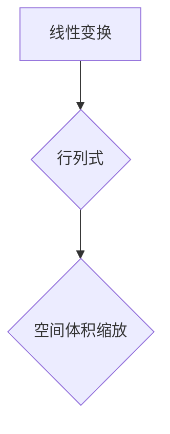

> 线性代数，行列式，几何解释，线性变换，向量空间，矩阵，多项式

## 1. 背景介绍

线性代数是数学的一个分支，它研究向量空间、线性变换、矩阵和线性方程组等概念。行列式是线性代数中一个重要的概念，它与线性变换、向量空间的维数、矩阵的逆等密切相关。

行列式最初被用于求解线性方程组，后来被广泛应用于各种数学领域，例如微积分、概率论、统计学等。在计算机科学领域，行列式也扮演着重要的角色，例如在计算机图形学、机器学习、数据分析等领域都有广泛的应用。

## 2. 核心概念与联系

行列式可以看作是线性变换的“量度”。它描述了线性变换对空间体积的缩放程度。

**Mermaid 流程图：**



**核心概念：**

* **线性变换:**  将向量空间映射到另一个向量空间的函数，满足以下性质：
    * **加性:** T(u + v) = T(u) + T(v)
    * **齐次性:** T(cu) = cT(u)
* **行列式:**  一个数，它与一个方阵相关联，可以用来描述线性变换的性质。

**联系：**

* 行列式的大小反映了线性变换对空间体积的缩放程度。
* 行列式为零意味着线性变换将空间压缩到一个较小的维数，即线性变换的核空间不为零。

## 3. 核心算法原理 & 具体操作步骤

### 3.1  算法原理概述

计算行列式的算法有很多种，其中最常见的是** cofactor expansion** 方法。

**Cofactor expansion** 方法的基本思想是将行列式分解成若干个较小的行列式，然后递归地计算这些较小的行列式。

### 3.2  算法步骤详解

1. 选择行列式的某一行或某一列。
2. 对于该行或列中的每个元素，计算其对应的** cofactor**。
3. cofactor 是一个数，它等于该元素对应的子式行列式乘以一个符号。
4. 将每个元素与其对应的 cofactor 相乘，然后将这些乘积相加，得到行列式的值。

### 3.3  算法优缺点

**优点:**

* 算法简单易懂，易于实现。
* 可以用于计算任意大小的行列式。

**缺点:**

* 对于大型行列式，计算效率较低，容易出现数值误差。

### 3.4  算法应用领域

* 线性方程组求解
* 逆矩阵计算
* 线性变换的性质分析
* 几何图形的变换

## 4. 数学模型和公式 & 详细讲解 & 举例说明

### 4.1  数学模型构建

设 A 是一个 n × n 的方阵，则 A 的行列式记为 det(A) 或 |A|。

### 4.2  公式推导过程

**Cofactor expansion** 方法的公式如下：

```latex
det(A) = \sum_{i=1}^{n} a_{i j} C_{i j}
```

其中：

* $a_{ij}$ 是 A 的第 i 行第 j 列的元素。
* $C_{ij}$ 是 $a_{ij}$ 的 cofactor，定义为：

```latex
C_{ij} = (-1)^{i+j} M_{ij}
```

其中：

* $M_{ij}$ 是 $a_{ij}$ 对应的子式行列式，即删除 A 的第 i 行和第 j 列后得到的子矩阵的行列式。

### 4.3  案例分析与讲解

**例子:**

计算以下 2 × 2 行列式的行列式：

```
A = \begin{bmatrix}
2 & 3 \\
1 & 4
\end{bmatrix}
```

**解:**

根据 cofactor expansion 方法，我们可以选择第一行进行计算：

```latex
det(A) = 2 \cdot C_{11} + 3 \cdot C_{12}
```

其中：

* $C_{11} = (-1)^{1+1} M_{11} = 4$
* $C_{12} = (-1)^{1+2} M_{12} = -1$

所以：

```latex
det(A) = 2 \cdot 4 + 3 \cdot (-1) = 5
```

## 5. 项目实践：代码实例和详细解释说明

### 5.1  开发环境搭建

本项目使用 Python 语言进行开发，需要安装 Python 3.x 及相关库。

### 5.2  源代码详细实现

```python
import numpy as np

def determinant(matrix):
  """
  计算矩阵的行列式。

  Args:
    matrix: 一个 NumPy 数组，表示矩阵。

  Returns:
    矩阵的行列式。
  """
  n = len(matrix)
  if n == 1:
    return matrix[0][0]
  elif n == 2:
    return matrix[0][0] * matrix[1][1] - matrix[0][1] * matrix[1][0]
  else:
    det = 0
    for i in range(n):
      submatrix = np.delete(np.delete(matrix, i, axis=0), i, axis=1)
      det += ((-1)**i) * matrix[0][i] * determinant(submatrix)
    return det

# 测试代码
matrix = np.array([[2, 3], [1, 4]])
det = determinant(matrix)
print(f"矩阵的行列式为: {det}")
```

### 5.3  代码解读与分析

* 函数 `determinant(matrix)` 计算给定矩阵的行列式。
* 对于 1 × 1 和 2 × 2 的矩阵，直接计算行列式。
* 对于大于 2 × 2 的矩阵，使用 cofactor expansion 方法递归计算行列式。
* `np.delete()` 函数用于删除矩阵的行和列。

### 5.4  运行结果展示

```
矩阵的行列式为: 5
```

## 6. 实际应用场景

行列式在许多实际应用场景中都有广泛的应用，例如：

* **线性方程组求解:**  行列式可以用来判断线性方程组是否有解，以及解的唯一性。
* **逆矩阵计算:**  如果一个矩阵的行列式不为零，则该矩阵有逆矩阵，可以使用行列式来计算逆矩阵。
* **几何图形的变换:**  行列式可以用来描述线性变换对空间体积的缩放程度，例如旋转、缩放、投影等变换。
* **机器学习:**  行列式在机器学习算法中也扮演着重要的角色，例如在特征选择、模型参数估计等方面。

### 6.4  未来应用展望

随着人工智能和机器学习的发展，行列式在未来将有更广泛的应用场景。例如：

* **图像处理:**  行列式可以用于图像的特征提取、图像压缩、图像恢复等方面。
* **自然语言处理:**  行列式可以用于文本分类、文本聚类、机器翻译等方面。
* **生物信息学:**  行列式可以用于基因表达分析、蛋白质结构预测等方面。

## 7. 工具和资源推荐

### 7.1  学习资源推荐

* **书籍:**
    * 《线性代数及其应用》 - Gilbert Strang
    * 《线性代数及其几何解释》 - David C. Lay
* **在线课程:**
    * MIT OpenCourseWare - Linear Algebra
    * Coursera - Linear Algebra

### 7.2  开发工具推荐

* **Python:**  一个开源的编程语言，广泛用于科学计算、数据分析、机器学习等领域。
* **NumPy:**  Python 的科学计算库，提供高效的数组操作和线性代数运算。
* **SciPy:**  Python 的科学计算库，提供更高级的科学计算功能，包括线性代数、优化、积分等。

### 7.3  相关论文推荐

* **The determinant of a matrix** - Wikipedia
* **Cofactor expansion** - Wikipedia
* **Applications of determinants in machine learning** - arXiv

## 8. 总结：未来发展趋势与挑战

### 8.1  研究成果总结

行列式是线性代数中一个重要的概念，它与线性变换、向量空间的维数、矩阵的逆等密切相关。

### 8.2  未来发展趋势

随着人工智能和机器学习的发展，行列式在未来将有更广泛的应用场景。例如：

* **图像处理:**  行列式可以用于图像的特征提取、图像压缩、图像恢复等方面。
* **自然语言处理:**  行列式可以用于文本分类、文本聚类、机器翻译等方面。
* **生物信息学:**  行列式可以用于基因表达分析、蛋白质结构预测等方面。

### 8.3  面临的挑战

* **计算效率:**  对于大型矩阵，计算行列式的时间复杂度较高，需要开发更有效的算法。
* **数值稳定性:**  在实际应用中，可能会遇到浮点数的精度问题，导致行列式计算结果不稳定。

### 8.4  研究展望

未来研究方向包括：

* 开发更高效的行列式计算算法。
* 研究行列式在人工智能和机器学习中的应用。
* 探索行列式在其他领域的新应用。

## 9. 附录：常见问题与解答

**问题 1:** 行列式为什么等于零意味着线性变换的核空间不为零？

**解答:**

如果行列式为零，意味着线性变换将空间压缩到一个较小的维数。这意味着存在非零向量被线性变换映射到零向量，即核空间不为零。

**问题 2:** 如何理解 cofactor expansion 方法？

**解答:**

Cofactor expansion 方法将行列式分解成若干个较小的行列式，然后递归地计算这些较小的行列式。每个元素与其对应的 cofactor 相乘，然后将这些乘积相加，得到行列式的值。

**问题 3:** 行列式有什么实际应用场景？

**解答:**

行列式在许多实际应用场景中都有广泛的应用，例如：

* 线性方程组求解
* 逆矩阵计算
* 几何图形的变换
* 机器学习


作者：禅与计算机程序设计艺术 / Zen and the Art of Computer Programming<end_of_turn>