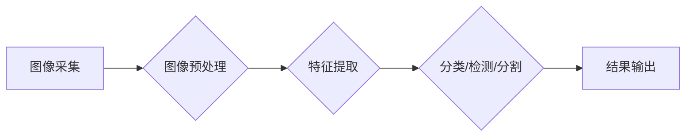

> 计算机视觉，CV，图像处理，深度学习，卷积神经网络，目标检测，图像分类，实例讲解

## 1. 背景介绍

计算机视觉 (Computer Vision，CV) 作为人工智能 (Artificial Intelligence，AI) 的重要分支，致力于赋予计算机“看”的能力，使其能够理解和解释图像和视频信息。近年来，随着深度学习技术的飞速发展，计算机视觉取得了令人瞩目的进展，在各个领域得到了广泛应用，例如：

* **自动驾驶:**  识别道路标志、车辆、行人等，实现自动驾驶功能。
* **医疗诊断:**  辅助医生诊断疾病，例如识别肿瘤、分析X光片等。
* **人脸识别:**  用于身份验证、安全监控等场景。
* **图像搜索:**  根据图像内容进行搜索，提高搜索效率。
* **机器人视觉:**  帮助机器人感知周围环境，进行导航和操作。

## 2. 核心概念与联系

计算机视觉的核心概念包括图像处理、特征提取、图像分类、目标检测、图像分割等。这些概念相互关联，共同构成了计算机视觉的整体框架。

**Mermaid 流程图:**



**核心概念解释:**

* **图像采集:**  获取图像数据，可以来自摄像头、扫描仪等设备。
* **图像预处理:**  对图像进行一系列处理，例如调整亮度、对比度、去除噪声等，以提高图像质量。
* **特征提取:**  从图像中提取关键信息，例如边缘、纹理、颜色等，用于后续的分析和识别。
* **分类/检测/分割:**  根据提取的特征，对图像进行分类、检测目标或分割图像区域。
* **结果输出:**  将处理结果以图像、文本或其他形式输出。

## 3. 核心算法原理 & 具体操作步骤

### 3.1  算法原理概述

本节将介绍计算机视觉中常用的算法原理，例如卷积神经网络 (Convolutional Neural Network，CNN) 和支持向量机 (Support Vector Machine，SVM)。

**卷积神经网络 (CNN):**

CNN 是一种专门用于处理图像数据的深度学习算法。其核心结构是卷积层和池化层。卷积层通过卷积核对图像进行卷积运算，提取图像特征。池化层对卷积层的输出进行降维，减少计算量并提高鲁棒性。

**支持向量机 (SVM):**

SVM 是一种监督学习算法，用于分类和回归问题。其目标是找到一个最佳的超平面，将不同类别的数据点分开。

### 3.2  算法步骤详解

**CNN 算法步骤:**

1. **输入图像:** 将图像数据作为输入，送入 CNN 网络。
2. **卷积层:**  使用卷积核对图像进行卷积运算，提取图像特征。
3. **池化层:** 对卷积层的输出进行池化操作，例如最大池化或平均池化，减少计算量并提高鲁棒性。
4. **全连接层:** 将池化层的输出连接到全连接层，进行分类或回归。
5. **输出结果:**  输出分类结果或回归值。

**SVM 算法步骤:**

1. **数据预处理:** 对数据进行预处理，例如归一化。
2. **核函数选择:** 选择合适的核函数，例如线性核、径向基函数核等。
3. **训练模型:** 使用训练数据训练 SVM 模型，找到最佳的超平面。
4. **预测结果:** 使用训练好的模型对新数据进行预测。

### 3.3  算法优缺点

**CNN 算法:**

* **优点:**  能够自动学习图像特征，具有较高的识别精度。
* **缺点:**  训练时间长，参数量大，需要大量的训练数据。

**SVM 算法:**

* **优点:**  具有较好的泛化能力，对数据分布变化鲁棒性强。
* **缺点:**  对高维数据处理效率较低，难以处理非线性问题。

### 3.4  算法应用领域

**CNN 算法:**

* **图像分类:**  识别图像中的物体类别，例如猫、狗、车等。
* **目标检测:**  定位图像中的目标，并识别目标类别。
* **图像分割:**  将图像分割成不同的区域，例如分割前景和背景。

**SVM 算法:**

* **人脸识别:**  识别图像中的特定人脸。
* **文本分类:**  将文本分类到不同的类别，例如情感分析、主题分类等。
* **图像检索:**  根据图像内容进行检索。

## 4. 数学模型和公式 & 详细讲解 & 举例说明

### 4.1  数学模型构建

本节将介绍 CNN 和 SVM 的数学模型。

**CNN 数学模型:**

CNN 的数学模型主要包括卷积运算、池化运算和激活函数。

* **卷积运算:**  使用卷积核对图像进行卷积运算，提取图像特征。卷积运算的数学公式如下:

$$
y(i,j) = \sum_{m=0}^{M-1} \sum_{n=0}^{N-1} x(i+m,j+n) * w(m,n)
$$

其中，$x(i,j)$ 是图像像素值，$w(m,n)$ 是卷积核权值，$y(i,j)$ 是卷积运算结果。

* **池化运算:**  对卷积层的输出进行池化操作，例如最大池化或平均池化。最大池化操作的数学公式如下:

$$
y(i,j) = \max_{m=0}^{M-1} \max_{n=0}^{N-1} x(i*s+m,j*s+n)
$$

其中，$x(i*s+m,j*s+n)$ 是池化窗口内的像素值，$s$ 是池化窗口大小，$y(i,j)$ 是池化运算结果。

* **激活函数:**  对卷积和池化层的输出进行非线性变换，例如ReLU函数。

**SVM 数学模型:**

SVM 的数学模型主要包括支持向量和超平面。

* **支持向量:**  距离超平面最近的训练样本点。
* **超平面:**  将不同类别的数据点分开的分界线。

SVM 的目标是找到一个最佳的超平面，使得支持向量之间的距离最大化。

### 4.2  公式推导过程

本节将详细推导 CNN 和 SVM 的数学公式。

**CNN 公式推导:**

CNN 的公式推导过程较为复杂，涉及到卷积运算、池化运算、激活函数等多个步骤。

**SVM 公式推导:**

SVM 的公式推导过程主要包括拉格朗日乘子法和KKT条件。

### 4.3  案例分析与讲解

本节将通过案例分析，讲解 CNN 和 SVM 的应用。

**CNN 案例分析:**

* **图像分类:**  使用 CNN 对图像进行分类，例如识别猫、狗、车等。

**SVM 案例分析:**

* **人脸识别:**  使用 SVM 对人脸进行识别，例如用于身份验证。

## 5. 项目实践：代码实例和详细解释说明

### 5.1  开发环境搭建

本节将介绍如何搭建计算机视觉开发环境。

* **操作系统:**  Windows、macOS 或 Linux。
* **编程语言:**  Python。
* **深度学习框架:**  TensorFlow、PyTorch 或 Keras。
* **图像处理库:**  OpenCV。

### 5.2  源代码详细实现

本节将提供一个简单的图像分类代码实例，使用 TensorFlow 框架。

```python
import tensorflow as tf

# 定义模型结构
model = tf.keras.models.Sequential([
    tf.keras.layers.Conv2D(32, (3, 3), activation='relu', input_shape=(28, 28, 1)),
    tf.keras.layers.MaxPooling2D((2, 2)),
    tf.keras.layers.Conv2D(64, (3, 3), activation='relu'),
    tf.keras.layers.MaxPooling2D((2, 2)),
    tf.keras.layers.Flatten(),
    tf.keras.layers.Dense(10, activation='softmax')
])

# 编译模型
model.compile(optimizer='adam',
              loss='sparse_categorical_crossentropy',
              metrics=['accuracy'])

# 训练模型
model.fit(x_train, y_train, epochs=10)

# 评估模型
loss, accuracy = model.evaluate(x_test, y_test)
print('Test loss:', loss)
print('Test accuracy:', accuracy)
```

### 5.3  代码解读与分析

* **模型结构:**  该模型是一个简单的 CNN 模型，包含两个卷积层、两个池化层和一个全连接层。
* **激活函数:**  使用 ReLU 激活函数，可以提高模型的表达能力。
* **损失函数:**  使用 sparse_categorical_crossentropy 损失函数，用于多分类问题。
* **优化器:**  使用 Adam 优化器，可以加速模型训练。

### 5.4  运行结果展示

运行上述代码，可以训练一个简单的图像分类模型，并评估其性能。

## 6. 实际应用场景

### 6.1  自动驾驶

计算机视觉在自动驾驶中扮演着至关重要的角色，例如：

* **道路标志识别:**  识别道路标志，例如限速标志、禁行标志等，帮助车辆做出正确的驾驶决策。
* **车辆检测:**  检测周围行驶的车辆，避免碰撞事故。
* **行人检测:**  检测行人，避免与行人发生碰撞。

### 6.2  医疗诊断

计算机视觉在医疗诊断中可以辅助医生诊断疾病，例如：

* **肿瘤检测:**  识别图像中的肿瘤，帮助医生进行早期诊断。
* **X光片分析:**  分析 X 光片，识别骨折、肺炎等疾病。
* **眼底图像分析:**  分析眼底图像，识别糖尿病视网膜病变等眼部疾病。

### 6.3  人脸识别

计算机视觉在人脸识别领域有广泛的应用，例如：

* **身份验证:**  用于手机解锁、银行卡验证等场景。
* **安全监控:**  用于监控人员进出，识别嫌疑人。
* **人脸搜索:**  根据人脸图像进行搜索，例如查找丢失人员。

### 6.4  未来应用展望

随着计算机视觉技术的不断发展，其应用场景将更加广泛，例如：

* **智能家居:**  实现智能家居设备的语音控制、图像识别等功能。
* **虚拟现实 (VR) 和增强现实 (AR):**  为 VR 和 AR 应用提供更逼真的视觉体验。
* **机器人技术:**  赋予机器人更强的视觉感知能力，使其能够更好地理解周围环境。

## 7. 工具和资源推荐

### 7.1  学习资源推荐

* **书籍:**
    * 《深度学习》
    * 《计算机视觉:算法与应用》
* **在线课程:**
    * Coursera: 深度学习
    * Udacity: 计算机视觉
* **博客:**
    * https://blog.openai.com/
    * https://towardsdatascience.com/

### 7.2  开发工具推荐

* **深度学习框架:**
    * TensorFlow
    * PyTorch
    * Keras
* **图像处理库:**
    * OpenCV
    * Pillow
* **数据标注工具:**
    * LabelImg
    * VGG Image Annotator (VIA)

### 7.3  相关论文推荐

* **AlexNet:**
    * Krizhevsky, A., Sutskever, I., & Hinton, G. E. (2012). Imagenet classification with deep convolutional neural networks. In Advances in neural information processing systems (pp. 1097-1105).
* **ResNet:**
    * He, K., Zhang, X., Ren, S., & Sun, J.