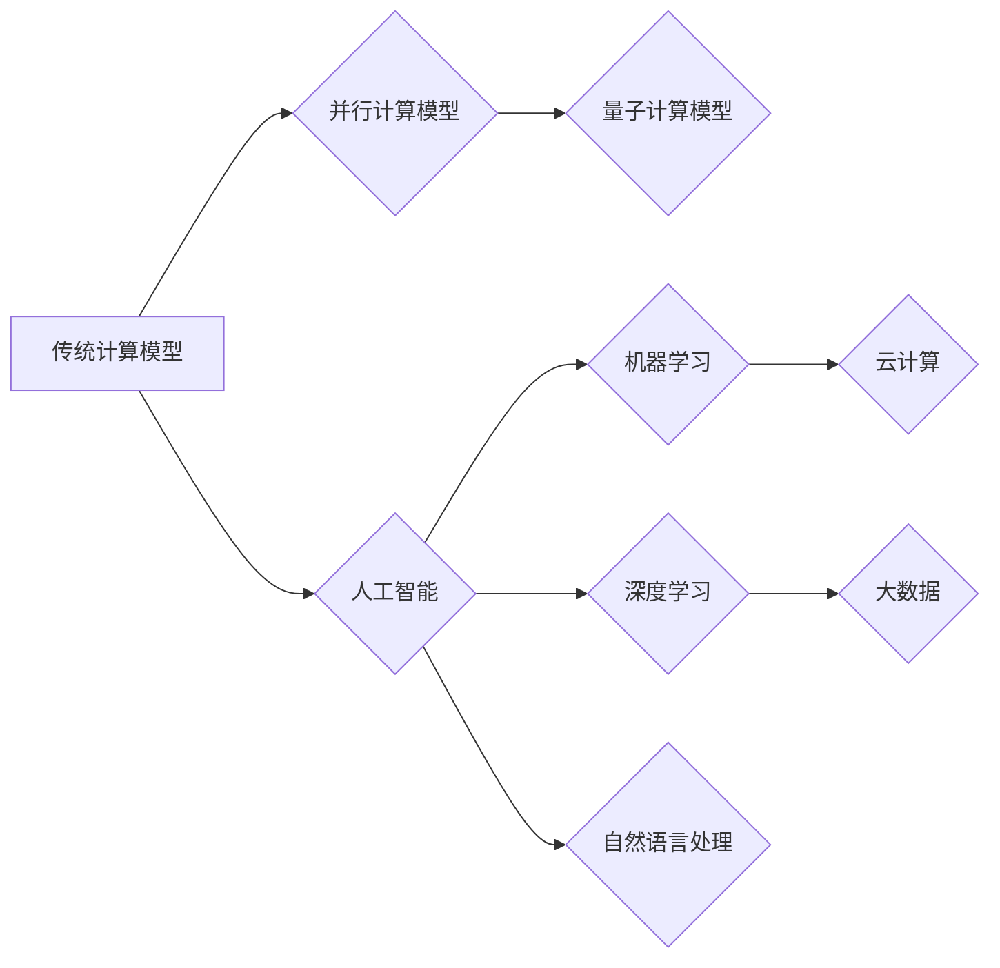

> 计算模型、人工智能、量子计算、深度学习、云计算、大数据、可解释性、伦理

## 1. 背景介绍

计算，作为人类文明进步的基石，自诞生以来便经历了从简单的机械计算到如今的复杂智能计算的飞跃。从阿巴斯·班伯的算盘到现代的超级计算机，从图灵机的抽象模型到深度学习算法的复杂网络，计算的本质一直在发生着深刻的变化。

当前，我们正处于一个计算革命的浪潮中。人工智能、量子计算、云计算等新兴技术正在深刻地改变着计算的形态和应用场景。这些技术不仅推动着计算能力的指数级增长，也为我们打开了通往全新计算范式的门户。

## 2. 核心概念与联系

### 2.1 计算模型

计算模型是描述计算过程的抽象框架，它定义了数据、算法和计算资源之间的关系。不同的计算模型具有不同的特点和适用场景。

* **传统计算模型:** 基于冯·诺伊曼体系结构，以指令集处理器和存储器为核心，采用串行执行指令的方式进行计算。
* **并行计算模型:** 通过并行执行多个任务，提高计算效率。常见的并行计算模型包括多核处理器、GPU计算和分布式计算。
* **量子计算模型:** 利用量子力学原理，以量子比特为基本单元，实现超越经典计算能力的计算。

### 2.2 人工智能

人工智能 (AI) 是模拟和扩展人类智能的计算机科学领域。它涵盖了机器学习、深度学习、自然语言处理、计算机视觉等多个子领域。

* **机器学习:** 算法从数据中学习，发现模式和规律，从而进行预测或决策。
* **深度学习:** 基于多层神经网络，能够学习更复杂的模式和表示。
* **自然语言处理:** 使计算机能够理解和生成人类语言。

### 2.3 云计算

云计算是一种按需提供的计算资源和服务模式。它提供弹性、可扩展性和成本效益，为各种应用场景提供了强大的计算能力。

* **基础设施即服务 (IaaS):** 提供计算、存储和网络基础设施。
* **平台即服务 (PaaS):** 提供开发和部署应用程序的平台。
* **软件即服务 (SaaS):** 提供已完成的软件应用程序。

### 2.4 大数据

大数据是指海量、高速度、高多样性的数据。大数据分析技术能够从海量数据中挖掘价值，为决策提供支持。

* **数据存储:** 构建高效的数据存储系统，能够存储和管理海量数据。
* **数据处理:** 开发高效的数据处理算法，能够快速处理海量数据。
* **数据分析:** 利用统计学、机器学习等方法，从数据中发现模式和规律。

**Mermaid 流程图**



## 3. 核心算法原理 & 具体操作步骤

### 3.1 算法原理概述

深度学习算法是一种基于多层神经网络的机器学习算法。它能够学习复杂的模式和表示，从而实现图像识别、语音识别、自然语言处理等任务。

深度学习算法的核心思想是通过多层神经网络来模拟人类大脑的学习过程。每个神经元接收来自其他神经元的输入，并对其进行处理，然后将处理后的结果传递给下一层神经元。通过不断调整神经元的权重，深度学习算法能够学习到数据的特征和规律。

### 3.2 算法步骤详解

1. **数据预处理:** 将原始数据转换为深度学习算法可以理解的格式。
2. **网络结构设计:** 设计多层神经网络的结构，包括神经元的数量、连接方式和激活函数等。
3. **参数初始化:** 为神经网络的参数进行随机初始化。
4. **前向传播:** 将输入数据通过神经网络进行前向传播，得到输出结果。
5. **反向传播:** 计算输出结果与真实值的误差，并根据误差反向传播，更新神经网络的参数。
6. **训练:** 重复前向传播和反向传播的过程，直到模型的性能达到预期的水平。
7. **测试:** 使用测试数据评估模型的性能。

### 3.3 算法优缺点

**优点:**

* 能够学习复杂的模式和表示。
* 性能优于传统机器学习算法。
* 能够处理海量数据。

**缺点:**

* 训练时间长，需要大量的计算资源。
* 对数据质量要求高。
* 模型解释性差。

### 3.4 算法应用领域

* **图像识别:** 人脸识别、物体检测、图像分类。
* **语音识别:** 语音转文本、语音助手。
* **自然语言处理:** 机器翻译、文本摘要、情感分析。
* **推荐系统:** 商品推荐、内容推荐。
* **医疗诊断:** 病情预测、疾病诊断。

## 4. 数学模型和公式 & 详细讲解 & 举例说明

### 4.1 数学模型构建

深度学习算法的数学模型主要基于线性代数、微积分和概率论。

* **线性代数:** 用于表示和操作神经网络的权重和激活值。
* **微积分:** 用于计算梯度，更新神经网络的参数。
* **概率论:** 用于描述神经网络的输出概率分布。

### 4.2 公式推导过程

**激活函数:**

$$
f(x) = \sigma(x) = \frac{1}{1 + e^{-x}}
$$

**损失函数:**

$$
L = \frac{1}{N} \sum_{i=1}^{N} (y_i - \hat{y}_i)^2
$$

**梯度下降算法:**

$$
\theta = \theta - \alpha \nabla L(\theta)
$$

### 4.3 案例分析与讲解

**举例说明:**

假设我们有一个简单的线性回归模型，用于预测房价。输入特征包括房屋面积和房间数量，输出目标是房价。

* **线性模型:**

$$
\hat{y} = w_1 x_1 + w_2 x_2 + b
$$

* **损失函数:** 均方误差

$$
L = \frac{1}{N} \sum_{i=1}^{N} (y_i - \hat{y}_i)^2
$$

* **梯度下降算法:** 更新权重和偏置

$$
w_1 = w_1 - \alpha \frac{\partial L}{\partial w_1}
$$

$$
w_2 = w_2 - \alpha \frac{\partial L}{\partial w_2}
$$

$$
b = b - \alpha \frac{\partial L}{\partial b}
$$

## 5. 项目实践：代码实例和详细解释说明

### 5.1 开发环境搭建

* **操作系统:** Ubuntu 20.04
* **编程语言:** Python 3.8
* **深度学习框架:** TensorFlow 2.0

### 5.2 源代码详细实现

```python
import tensorflow as tf

# 定义模型
model = tf.keras.models.Sequential([
    tf.keras.layers.Dense(64, activation='relu', input_shape=(2,)),
    tf.keras.layers.Dense(1)
])

# 编译模型
model.compile(optimizer='adam', loss='mse')

# 训练模型
model.fit(x_train, y_train, epochs=100)

# 评估模型
loss = model.evaluate(x_test, y_test)
print('Loss:', loss)
```

### 5.3 代码解读与分析

* **模型定义:** 使用 `tf.keras.models.Sequential` 创建一个顺序模型，包含两层全连接层。
* **激活函数:** 使用 `relu` 作为激活函数，提高模型的非线性表达能力。
* **编译模型:** 使用 `adam` 优化器和 `mse` 损失函数编译模型。
* **训练模型:** 使用 `model.fit` 方法训练模型，指定训练数据、 epochs 数目等参数。
* **评估模型:** 使用 `model.evaluate` 方法评估模型在测试数据上的性能。

### 5.4 运行结果展示

训练完成后，模型会输出训练过程中的损失值，以及在测试数据上的损失值。

## 6. 实际应用场景

### 6.1 图像识别

深度学习算法在图像识别领域取得了突破性的进展，例如人脸识别、物体检测、图像分类等。

### 6.2 语音识别

深度学习算法能够实现语音转文本、语音助手等功能，例如苹果的 Siri、谷歌的 Google Assistant 等。

### 6.3 自然语言处理

深度学习算法能够理解和生成人类语言，例如机器翻译、文本摘要、情感分析等。

### 6.4 未来应用展望

* **自动驾驶:** 深度学习算法可以帮助自动驾驶汽车识别道路、交通信号灯和行人等。
* **医疗诊断:** 深度学习算法可以辅助医生诊断疾病、预测病情。
* **个性化推荐:** 深度学习算法可以根据用户的喜好推荐商品、内容等。

## 7. 工具和资源推荐

### 7.1 学习资源推荐

* **书籍:**
    * 深度学习
    * 人工智能：一种现代方法
* **在线课程:**
    * Coursera 深度学习课程
    * Udacity 深度学习工程师 Nanodegree

### 7.2 开发工具推荐

* **深度学习框架:** TensorFlow, PyTorch, Keras
* **编程语言:** Python
* **云计算平台:** AWS, Azure, Google Cloud

### 7.3 相关论文推荐

* **ImageNet Classification with Deep Convolutional Neural Networks**
* **Attention Is All You Need**
* **BERT: Pre-training of Deep Bidirectional Transformers for Language Understanding**

## 8. 总结：未来发展趋势与挑战

### 8.1 研究成果总结

近年来，深度学习算法取得了显著的进展，在图像识别、语音识别、自然语言处理等领域取得了突破性的成果。

### 8.2 未来发展趋势

* **模型规模和复杂度:** 模型规模和复杂度将继续增加，从而提高模型的性能。
* **数据增强和合成:** 数据增强和合成技术将帮助解决数据稀缺问题。
* **可解释性:** 研究更可解释的深度学习模型，提高模型的透明度和信任度。
* **边缘计算:** 将深度学习模型部署到边缘设备，实现更低延迟和更高效率的计算。

### 8.3 面临的挑战

* **数据隐私和安全:** 深度学习算法对大量数据依赖，如何保护数据隐私和安全是一个重要挑战。
* **算法偏见:** 深度学习算法可能存在偏见，需要研究如何消除算法偏见。
* **计算资源:** 训练大型深度学习模型需要大量的计算资源，如何降低训练成本是一个挑战。

### 8.4 研究展望

未来，深度学习领域将继续朝着更强大、更智能、更安全的方向发展。

## 9. 附录：常见问题与解答

**常见问题:**

* **深度学习算法的训练时间很长，如何加速训练过程？**

**解答:**

* 使用更强大的计算硬件，例如GPU和TPU。
* 使用数据并行和模型并行等技术，将训练任务分解到多个设备上进行并行计算。
* 使用模型压缩和量化技术，减小模型大小，降低训练时间。

* **深度学习算法的解释性差，如何提高模型的可解释性？**

**解答:**

* 使用可解释性分析工具，例如LIME和SHAP，解释模型的决策过程。
* 设计更可解释的深度学习模型，例如规则学习和神经网络解释器。
* 结合专家知识和领域经验，解释模型的预测结果。


作者：禅与计算机程序设计艺术 / Zen and the Art of Computer Programming 
<end_of_turn>