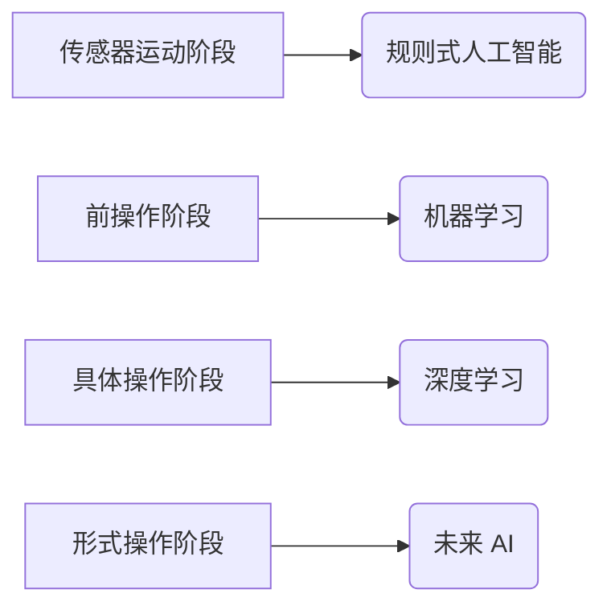

> 认知发展，阶段性变化，人工智能，机器学习，深度学习，神经网络，迁移学习，知识表示

## 1. 背景介绍

认知发展是人类从出生到成熟过程中，思维、感知、记忆、语言等认知能力逐渐完善的过程。这个过程并非线性发展，而是经历着不同的阶段，每个阶段都有其独特的特征和发展规律。

人工智能（AI）的发展也经历着类似的阶段性变化。从早期的规则式人工智能到现在的深度学习，AI技术也在不断进化，其认知能力也在逐步提升。

## 2. 核心概念与联系

**2.1 认知发展阶段**

认知发展理论认为，认知发展并非连续的，而是经历着不同的阶段。

* **传感器运动阶段（0-2岁）：** 婴儿通过感官和运动来探索世界，建立对周围环境的初步认知。
* **前操作阶段（2-7岁）：** 幼儿开始使用语言和符号进行思考，但思维还比较中心化，难以进行逻辑推理。
* **具体操作阶段（7-11岁）：** 儿童能够进行逻辑推理和分类，但思维还局限于具体的事物。
* **形式操作阶段（11岁以上）：** 青少年能够进行抽象思维和逻辑推理，能够理解复杂的概念和关系。

**2.2 AI 发展阶段**

* **规则式人工智能（1950s-1980s）：** 基于人工设计的规则和知识库，能够解决特定领域的简单问题。
* **机器学习（1980s-2010s）：** 通过数据训练模型，学习发现数据中的规律，能够解决更复杂的问题。
* **深度学习（2010s-present）：** 利用多层神经网络，能够学习更复杂的特征和模式，在图像识别、自然语言处理等领域取得突破性进展。

**2.3 联系与映射**

我们可以将认知发展阶段与 AI 发展阶段进行映射，发现一些有趣的规律：

* **传感器运动阶段** 与 **规则式人工智能** 相对应，两者都依赖于人工设计的规则和知识库。
* **前操作阶段** 与 **机器学习** 的早期阶段相对应，两者都依赖于数据训练，但思维能力有限。
* **具体操作阶段** 与 **深度学习** 的早期阶段相对应，两者都能够进行更复杂的推理和决策。
* **形式操作阶段** 与 **未来 AI** 的发展方向相对应，目标是实现更接近人类的认知能力。

**2.4 Mermaid 流程图**



## 3. 核心算法原理 & 具体操作步骤

### 3.1 算法原理概述

深度学习算法的核心是多层神经网络。神经网络模仿了人脑的神经元结构，通过连接多个神经元层，学习数据中的特征和模式。

### 3.2 算法步骤详解

1. **数据预处理:** 将原始数据转换为深度学习模型可以理解的格式。
2. **网络结构设计:** 根据任务需求设计神经网络的层数、节点数和激活函数等参数。
3. **模型训练:** 使用训练数据训练神经网络，调整网络参数，使模型能够准确预测输出。
4. **模型评估:** 使用测试数据评估模型的性能，例如准确率、召回率等指标。
5. **模型部署:** 将训练好的模型部署到实际应用场景中。

### 3.3 算法优缺点

**优点:**

* 能够学习复杂特征和模式。
* 性能优于传统机器学习算法。
* 能够处理大规模数据。

**缺点:**

* 训练时间长，计算资源消耗大。
* 对数据质量要求高。
* 模型解释性差。

### 3.4 算法应用领域

* **图像识别:** 人脸识别、物体检测、图像分类等。
* **自然语言处理:** 文本分类、机器翻译、语音识别等。
* **推荐系统:** 商品推荐、内容推荐等。
* **医疗诊断:** 疾病诊断、影像分析等。

## 4. 数学模型和公式 & 详细讲解 & 举例说明

### 4.1 数学模型构建

深度学习模型的核心是神经网络，其数学模型可以表示为多层感知机（MLP）。

**4.1.1 单层感知机模型**

单层感知机模型的输出可以表示为：

$$
y = f(w^T x + b)
$$

其中：

* $x$ 是输入向量。
* $w$ 是权重向量。
* $b$ 是偏置项。
* $f$ 是激活函数。

**4.1.2 多层感知机模型**

多层感知机模型由多个单层感知机组成，每个单层感知机输出作为下一个单层感知机的输入。

### 4.2 公式推导过程

深度学习模型的训练过程是通过反向传播算法来进行的。反向传播算法的核心是计算误差梯度，并根据梯度更新网络参数。

**4.2.1 损失函数**

损失函数用于衡量模型预测结果与真实结果之间的差异。常用的损失函数包括均方误差（MSE）和交叉熵损失（Cross-Entropy Loss）。

**4.2.2 梯度下降算法**

梯度下降算法是一种迭代优化算法，用于更新网络参数，使其能够最小化损失函数。

### 4.3 案例分析与讲解

**4.3.1 图像分类案例**

假设我们有一个图像分类任务，目标是将图像分类为不同的类别，例如猫、狗、鸟等。我们可以使用深度学习模型，例如卷积神经网络（CNN），来解决这个问题。

CNN 可以学习图像的特征，例如边缘、纹理等，并将其用于分类。训练过程中，我们会使用大量的图像数据，并根据图像的标签调整网络参数，使其能够准确地分类图像。

## 5. 项目实践：代码实例和详细解释说明

### 5.1 开发环境搭建

* **操作系统:** Ubuntu 20.04
* **编程语言:** Python 3.8
* **深度学习框架:** TensorFlow 2.0

### 5.2 源代码详细实现

```python
import tensorflow as tf

# 定义模型结构
model = tf.keras.models.Sequential([
    tf.keras.layers.Conv2D(32, (3, 3), activation='relu', input_shape=(28, 28, 1)),
    tf.keras.layers.MaxPooling2D((2, 2)),
    tf.keras.layers.Conv2D(64, (3, 3), activation='relu'),
    tf.keras.layers.MaxPooling2D((2, 2)),
    tf.keras.layers.Flatten(),
    tf.keras.layers.Dense(10, activation='softmax')
])

# 编译模型
model.compile(optimizer='adam',
              loss='sparse_categorical_crossentropy',
              metrics=['accuracy'])

# 训练模型
model.fit(x_train, y_train, epochs=5)

# 评估模型
loss, accuracy = model.evaluate(x_test, y_test)
print('Test loss:', loss)
print('Test accuracy:', accuracy)
```

### 5.3 代码解读与分析

* **模型结构:** 该代码定义了一个简单的卷积神经网络模型，用于图像分类任务。模型包含两层卷积层、两层最大池化层、一层全连接层和一层输出层。
* **编译模型:** 使用 Adam 优化器、稀疏类别交叉熵损失函数和准确率作为评估指标来编译模型。
* **训练模型:** 使用训练数据训练模型，训练 epochs 为 5。
* **评估模型:** 使用测试数据评估模型的性能，输出测试损失和准确率。

### 5.4 运行结果展示

训练完成后，我们可以使用测试数据评估模型的性能。

## 6. 实际应用场景

### 6.1 图像识别

深度学习在图像识别领域取得了突破性进展，例如人脸识别、物体检测、图像分类等。

### 6.2 自然语言处理

深度学习也应用于自然语言处理领域，例如文本分类、机器翻译、语音识别等。

### 6.3 医疗诊断

深度学习可以用于辅助医疗诊断，例如疾病诊断、影像分析等。

### 6.4 未来应用展望

未来，深度学习将在更多领域得到应用，例如自动驾驶、机器人、个性化教育等。

## 7. 工具和资源推荐

### 7.1 学习资源推荐

* **书籍:**
    * 深度学习
    * 构建深度学习模型
* **在线课程:**
    * Coursera 深度学习课程
    * Udacity 深度学习工程师 Nanodegree

### 7.2 开发工具推荐

* **深度学习框架:** TensorFlow, PyTorch, Keras
* **编程语言:** Python

### 7.3 相关论文推荐

* **AlexNet:** ImageNet Classification with Deep Convolutional Neural Networks
* **VGGNet:** Very Deep Convolutional Networks for Large-Scale Image Recognition
* **ResNet:** Deep Residual Learning for Image Recognition

## 8. 总结：未来发展趋势与挑战

### 8.1 研究成果总结

深度学习在过去几年取得了显著进展，在图像识别、自然语言处理等领域取得了突破性成果。

### 8.2 未来发展趋势

* **模型规模和复杂度提升:** 未来深度学习模型将更加庞大，更加复杂。
* **迁移学习和知识蒸馏:** 提高模型的泛化能力和效率。
* **解释性AI:** 提高深度学习模型的解释性，使其更加透明和可信。

### 8.3 面临的挑战

* **数据获取和标注:** 深度学习模型需要大量的训练数据，数据获取和标注成本高昂。
* **计算资源:** 训练大型深度学习模型需要大量的计算资源，成本高昂。
* **模型安全性:** 深度学习模型容易受到攻击，需要提高模型的安全性。

### 8.4 研究展望

未来，深度学习研究将继续朝着更智能、更安全、更可解释的方向发展。


## 9. 附录：常见问题与解答

### 9.1 什么是深度学习？

深度学习是一种机器学习的子领域，它使用多层神经网络来学习数据中的复杂特征和模式。

### 9.2 深度学习有什么优势？

深度学习能够学习复杂特征和模式，性能优于传统机器学习算法，能够处理大规模数据。

### 9.3 深度学习有哪些应用场景？

深度学习应用于图像识别、自然语言处理、医疗诊断、自动驾驶等领域。

### 9.4 如何学习深度学习？

可以通过阅读书籍、在线课程、参加培训等方式学习深度学习。

作者：禅与计算机程序设计艺术 / Zen and the Art of Computer Programming


<end_of_turn>