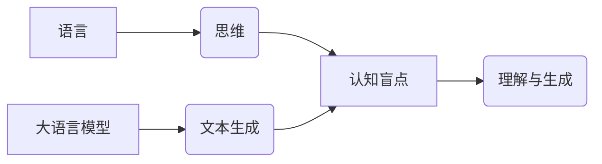

> 大语言模型，认知盲点，语言理解，思维模拟，知识表示，安全风险

## 1. 背景介绍

近年来，大语言模型（LLM）的蓬勃发展，标志着人工智能领域迈向新的里程碑。这些模型，例如GPT-3、LaMDA和BERT，展现出惊人的文本生成、翻译、摘要和问答能力，甚至能够创作诗歌、剧本和代码。然而，尽管LLM取得了显著成就，它们仍然存在着一些深刻的认知盲点，这些盲点限制了它们真正理解和生成人类语言的能力。

LLM的训练方式基于大量的文本数据，通过统计学习的方式，学习语言的模式和结构。然而，语言不仅仅是符号的排列组合，它还蕴含着丰富的语义、逻辑和情感信息。LLM虽然能够模仿人类语言的表象，但缺乏真正理解语言深层含义的能力。

## 2. 核心概念与联系

**2.1 语言与思维的联系**

语言是人类思维的重要载体，它不仅用于表达思想，也塑造了我们的思维方式。语言的结构和语法影响着我们对世界的认知和理解。

**2.2 大语言模型的认知机制**

LLM通过神经网络结构学习语言的统计规律，并利用这些规律生成文本。然而，神经网络本质上是一个复杂的数学模型，缺乏人类大脑的生物学基础和认知能力。

**2.3 认知盲点的本质**

LLM的认知盲点主要体现在以下几个方面：

* **缺乏世界知识:** LLM的知识主要来源于训练数据，而训练数据往往局限于文本信息，缺乏对现实世界的丰富感知和理解。
* **语义理解的局限性:** LLM能够识别单词和短语的含义，但难以理解复杂的语义关系和上下文信息。
* **逻辑推理能力不足:** LLM在处理逻辑推理和抽象概念方面表现欠佳，难以进行深层次的思考和分析。
* **情感理解和生成能力有限:** LLM难以理解和生成人类的情感，其生成的文本缺乏情感色彩和感染力。

**2.4 核心概念关系图**



## 3. 核心算法原理 & 具体操作步骤

**3.1 算法原理概述**

LLM的核心算法是基于Transformer网络结构的深度学习模型。Transformer网络通过自注意力机制学习语言的上下文关系，并利用多层编码器-解码器结构进行文本生成。

**3.2 算法步骤详解**

1. **词嵌入:** 将输入的文本序列转换为向量表示，每个词对应一个向量。
2. **编码器:** 利用多层Transformer编码器，将词向量序列编码成上下文相关的表示。
3. **解码器:** 利用多层Transformer解码器，根据编码后的表示生成目标文本序列。
4. **损失函数:** 使用交叉熵损失函数，计算模型生成的文本与真实文本之间的差异。
5. **反向传播:** 利用梯度下降算法，更新模型参数，降低损失函数值。

**3.3 算法优缺点**

**优点:**

* 能够学习复杂的语言模式和结构。
* 具有强大的文本生成能力。
* 可以应用于多种自然语言处理任务。

**缺点:**

* 训练成本高，需要大量的计算资源和数据。
* 容易受到训练数据偏差的影响。
* 缺乏对世界知识和逻辑推理的理解。

**3.4 算法应用领域**

* 文本生成：小说、诗歌、剧本、代码等。
* 机器翻译：将一种语言翻译成另一种语言。
* 文本摘要：提取文本的关键信息。
* 问答系统：回答用户提出的问题。
* 对话系统：与用户进行自然语言对话。

## 4. 数学模型和公式 & 详细讲解 & 举例说明

**4.1 数学模型构建**

LLM的核心数学模型是Transformer网络，它由编码器和解码器两部分组成。编码器利用多层自注意力机制学习文本序列的上下文关系，解码器则根据编码后的表示生成目标文本序列。

**4.2 公式推导过程**

Transformer网络的注意力机制的核心公式是：

$$
Attention(Q, K, V) = softmax(\frac{QK^T}{\sqrt{d_k}})V
$$

其中：

* $Q$：查询矩阵
* $K$：键矩阵
* $V$：值矩阵
* $d_k$：键向量的维度
* $softmax$：softmax函数

**4.3 案例分析与讲解**

假设我们有一个句子“我爱吃苹果”，我们要计算每个词的注意力权重。

* $Q$：查询矩阵包含每个词的查询向量。
* $K$：键矩阵包含每个词的键向量。
* $V$：值矩阵包含每个词的值向量。

通过计算 $QK^T$，我们可以得到每个词对其他词的注意力得分。然后，使用softmax函数将这些得分归一化，得到每个词的注意力权重。

## 5. 项目实践：代码实例和详细解释说明

**5.1 开发环境搭建**

* Python 3.7+
* PyTorch 1.7+
* CUDA 10.2+

**5.2 源代码详细实现**

```python
import torch
import torch.nn as nn

class Transformer(nn.Module):
    def __init__(self, vocab_size, embedding_dim, num_heads, num_layers):
        super(Transformer, self).__init__()
        self.embedding = nn.Embedding(vocab_size, embedding_dim)
        self.encoder = nn.TransformerEncoder(nn.TransformerEncoderLayer(embedding_dim, num_heads), num_layers)
        self.decoder = nn.TransformerDecoder(nn.TransformerDecoderLayer(embedding_dim, num_heads), num_layers)
        self.linear = nn.Linear(embedding_dim, vocab_size)

    def forward(self, src, tgt):
        src = self.embedding(src)
        tgt = self.embedding(tgt)
        src = self.encoder(src)
        tgt = self.decoder(tgt, src)
        output = self.linear(tgt)
        return output
```

**5.3 代码解读与分析**

* `Transformer`类定义了Transformer网络的结构。
* `embedding`层将词向量化。
* `encoder`和`decoder`层分别负责编码和解码文本序列。
* `linear`层将编码后的表示映射到词汇表大小。

**5.4 运行结果展示**

训练好的Transformer模型可以用于文本生成、机器翻译等任务。

## 6. 实际应用场景

**6.1 文本生成**

LLM可以用于生成各种类型的文本，例如小说、诗歌、剧本、代码等。

**6.2 机器翻译**

LLM可以用于将一种语言翻译成另一种语言。

**6.3 文本摘要**

LLM可以用于提取文本的关键信息，生成文本摘要。

**6.4 对话系统**

LLM可以用于构建对话系统，与用户进行自然语言对话。

**6.5 未来应用展望**

LLM在未来将应用于更广泛的领域，例如教育、医疗、法律等。

## 7. 工具和资源推荐

**7.1 学习资源推荐**

* **论文:**
    * Attention Is All You Need (Vaswani et al., 2017)
    * BERT: Pre-training of Deep Bidirectional Transformers for Language Understanding (Devlin et al., 2018)
    * GPT-3: Language Models are Few-Shot Learners (Brown et al., 2020)
* **书籍:**
    * Deep Learning (Goodfellow et al., 2016)
    * Natural Language Processing with Python (Bird et al., 2009)

**7.2 开发工具推荐**

* **PyTorch:** 深度学习框架
* **TensorFlow:** 深度学习框架
* **Hugging Face Transformers:** 预训练模型库

**7.3 相关论文推荐**

* **GPT-3: Language Models are Few-Shot Learners**
* **BERT: Pre-training of Deep Bidirectional Transformers for Language Understanding**
* **T5: Text-to-Text Transfer Transformer**

## 8. 总结：未来发展趋势与挑战

**8.1 研究成果总结**

LLM取得了显著的进展，展现出强大的文本生成和理解能力。

**8.2 未来发展趋势**

* **模型规模的进一步扩大:** 更大的模型规模将带来更强的性能。
* **多模态学习:** 将文本与其他模态（图像、音频、视频）相结合。
* **可解释性研究:** 提高LLM的透明度和可解释性。
* **安全性和伦理问题:** 应对LLM带来的潜在风险。

**8.3 面临的挑战**

* **数据获取和标注:** 训练高质量的LLM需要大量的文本数据和标注。
* **计算资源:** 训练大型LLM需要大量的计算资源。
* **可解释性和信任:** LLM的决策过程难以理解，这可能会导致信任问题。
* **安全性和伦理:** LLM可能被用于生成虚假信息、进行攻击等恶意活动。

**8.4 研究展望**

未来研究将集中在解决LLM的认知盲点，提高其理解和生成能力，并确保其安全、可靠和伦理地应用。

## 9. 附录：常见问题与解答

**9.1 如何训练一个LLM？**

训练一个LLM需要大量的计算资源、数据和专业知识。

**9.2 如何评估LLM的性能？**

LLM的性能可以通过各种指标评估，例如困惑度、BLEU分数等。

**9.3 LLM有哪些潜在的风险？**

LLM可能被用于生成虚假信息、进行攻击等恶意活动。

**9.4 如何确保LLM的安全和伦理使用？**

需要制定相应的规范和政策，并加强对LLM的监管。


作者：禅与计算机程序设计艺术 / Zen and the Art of Computer Programming 
<end_of_turn>