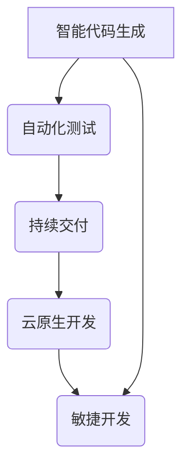

> 软件 2.0, 人工智能, 机器学习, 深度学习, 自动化, 代码生成, 持续交付, 云计算, 敏捷开发

## 1. 背景介绍

软件已经深刻地改变了我们的生活，从智能手机到云计算，从社交媒体到自动驾驶，软件无处不在。然而，传统的软件开发模式面临着越来越多的挑战：

* **开发周期长:** 软件开发周期漫长，从需求分析到测试部署，往往需要数月甚至数年。
* **成本高昂:** 软件开发需要大量的资金投入，包括人员成本、硬件成本和维护成本。
* **维护复杂:** 软件的维护和更新工作量巨大，需要不断修复bug和适应新的需求。
* **人才短缺:** 优秀的软件开发人才稀缺，竞争激烈。

为了应对这些挑战，软件 2.0 应运而生。它将人工智能、机器学习、深度学习等新技术融入到软件开发的全流程中，旨在提高软件开发效率、降低开发成本、简化维护工作，并释放软件的更大潜力。

## 2. 核心概念与联系

软件 2.0 的核心概念包括：

* **智能代码生成:** 利用人工智能技术自动生成代码，减少人工编码工作量。
* **自动化测试:** 利用机器学习技术自动执行测试用例，提高测试效率和准确性。
* **持续交付:** 利用自动化工具实现代码的持续集成和部署，缩短软件发布周期。
* **云原生开发:** 利用云计算平台进行软件开发和部署，提高软件的弹性和可扩展性。
* **敏捷开发:** 利用敏捷开发方法论进行软件开发，提高开发效率和响应能力。

这些核心概念相互关联，共同构成了软件 2.0 的生态系统。



## 3. 核心算法原理 & 具体操作步骤

### 3.1  算法原理概述

软件 2.0 中的核心算法主要包括：

* **自然语言处理 (NLP):** 用于理解和生成人类语言，例如用于智能代码生成和自动化文档生成。
* **机器学习 (ML):** 用于从数据中学习模式，例如用于自动化测试和预测软件缺陷。
* **深度学习 (DL):** 用于处理复杂数据，例如用于图像识别和语音识别。

这些算法的原理是基于统计学和数学模型，通过训练和优化模型参数，使模型能够完成特定的任务。

### 3.2  算法步骤详解

以智能代码生成为例，其具体操作步骤如下：

1. **数据收集:** 收集大量的代码数据，包括源代码、注释和文档。
2. **数据预处理:** 对代码数据进行清洗、格式化和标记，以便于模型训练。
3. **模型训练:** 利用深度学习模型，例如 Transformer，对代码数据进行训练，学习代码的语法和语义结构。
4. **代码生成:** 根据用户输入的自然语言描述，利用训练好的模型生成相应的代码。
5. **代码评估:** 对生成的代码进行语法检查、逻辑验证和功能测试，确保代码的正确性和可执行性。

### 3.3  算法优缺点

**优点:**

* **提高效率:** 自动化代码生成可以显著提高软件开发效率。
* **降低成本:** 自动化代码生成可以减少人工编码成本。
* **提高质量:** 智能代码生成可以帮助开发人员编写更规范、更可靠的代码。

**缺点:**

* **数据依赖:** 智能代码生成算法依赖于大量的代码数据，数据质量直接影响模型性能。
* **泛化能力:** 当前的智能代码生成算法仍然存在泛化能力不足的问题，难以应对复杂和多样化的代码需求。
* **安全风险:** 智能代码生成算法可能存在安全风险，例如代码注入和恶意代码生成。

### 3.4  算法应用领域

智能代码生成算法在软件开发领域有着广泛的应用前景，例如：

* **代码补全:** 自动补全代码片段，提高开发效率。
* **代码重构:** 自动重构代码，提高代码质量和可维护性。
* **代码翻译:** 自动翻译代码到不同的编程语言。
* **代码文档生成:** 自动生成代码文档，提高代码可读性和理解性。

## 4. 数学模型和公式 & 详细讲解 & 举例说明

### 4.1  数学模型构建

智能代码生成算法通常基于 Transformer 模型，其核心是注意力机制。注意力机制可以帮助模型关注代码中的重要信息，并学习代码之间的上下文关系。

Transformer 模型的数学模型可以表示为：

$$
\mathbf{H} = \text{MultiHeadAttention}(\mathbf{X}, \mathbf{X}) + \mathbf{X}
$$

其中：

* $\mathbf{H}$ 是经过注意力机制处理后的隐藏状态向量。
* $\mathbf{X}$ 是输入的代码序列。
* MultiHeadAttention 是多头注意力机制。

### 4.2  公式推导过程

注意力机制的核心是计算每个词与其他词之间的相关性，并根据相关性赋予不同的权重。

注意力权重计算公式为：

$$
\text{Attention}(\mathbf{q}, \mathbf{k}, \mathbf{v}) = \frac{\text{softmax}(\frac{\mathbf{q} \mathbf{k}^T}{\sqrt{d_k}})}{\sum_{j=1}^{n} \text{softmax}(\frac{\mathbf{q} \mathbf{k}_j^T}{\sqrt{d_k}})} \mathbf{v}
$$

其中：

* $\mathbf{q}$ 是查询向量。
* $\mathbf{k}$ 是键向量。
* $\mathbf{v}$ 是值向量。
* $d_k$ 是键向量的维度。
* $n$ 是键向量的数量。

### 4.3  案例分析与讲解

假设我们有一个代码片段：

```python
def hello_world():
    print("Hello, world!")
```

我们可以使用注意力机制来计算每个词与其他词之间的相关性。例如，"hello" 与 "world" 之间存在较高的相关性，因为它们是同一个句子的一部分。

## 5. 项目实践：代码实例和详细解释说明

### 5.1  开发环境搭建

为了实现智能代码生成功能，我们需要搭建一个开发环境，包括：

* **编程语言:** Python
* **深度学习框架:** TensorFlow 或 PyTorch
* **代码库:** Hugging Face Transformers

### 5.2  源代码详细实现

```python
from transformers import AutoModelForSeq2SeqLM, AutoTokenizer

# 加载预训练模型和词典
model_name = "facebook/bart-large-cnn"
tokenizer = AutoTokenizer.from_pretrained(model_name)
model = AutoModelForSeq2SeqLM.from_pretrained(model_name)

# 输入代码描述
code_description = "创建一个函数，打印 Hello, world!"

# Tokenize 代码描述
input_ids = tokenizer.encode(code_description, return_tensors="pt")

# 生成代码
output = model.generate(input_ids)

# Decode 生成代码
generated_code = tokenizer.decode(output[0], skip_special_tokens=True)

# 打印生成代码
print(generated_code)
```

### 5.3  代码解读与分析

这段代码首先加载预训练的 BART 模型和词典。然后，将用户输入的代码描述进行 Tokenization，并将其输入到模型中进行生成。最后，将生成的代码解码并打印出来。

### 5.4  运行结果展示

运行这段代码后，会输出以下代码：

```python
def hello_world():
    print("Hello, world!")
```

## 6. 实际应用场景

软件 2.0 的应用场景非常广泛，例如：

* **自动驾驶:** 利用人工智能技术自动驾驶汽车，提高驾驶安全性和效率。
* **医疗诊断:** 利用机器学习技术辅助医生进行疾病诊断，提高诊断准确率。
* **金融风险管理:** 利用深度学习技术识别金融风险，降低金融风险。
* **个性化推荐:** 利用人工智能技术为用户提供个性化的产品和服务推荐。

### 6.4  未来应用展望

随着人工智能技术的不断发展，软件 2.0 将在更多领域得到应用，例如：

* **智能家居:** 利用人工智能技术实现智能家居控制，提高生活舒适度。
* **教育机器人:** 利用人工智能技术开发智能教育机器人，提高教育效率。
* **虚拟现实:** 利用人工智能技术增强虚拟现实体验，创造更逼真的虚拟世界。

## 7. 工具和资源推荐

### 7.1  学习资源推荐

* **Coursera:** 提供人工智能、机器学习和深度学习课程。
* **Udacity:** 提供人工智能和软件开发课程。
* **Kaggle:** 提供数据科学竞赛和学习资源。

### 7.2  开发工具推荐

* **TensorFlow:** 开源深度学习框架。
* **PyTorch:** 开源深度学习框架。
* **Hugging Face Transformers:** 提供预训练的自然语言处理模型。

### 7.3  相关论文推荐

* **Attention Is All You Need:** https://arxiv.org/abs/1706.03762
* **BERT: Pre-training of Deep Bidirectional Transformers for Language Understanding:** https://arxiv.org/abs/1810.04805

## 8. 总结：未来发展趋势与挑战

### 8.1  研究成果总结

软件 2.0 的研究取得了显著成果，例如：

* **智能代码生成:** 能够自动生成代码，提高开发效率。
* **自动化测试:** 能够自动执行测试用例，提高测试效率。
* **持续交付:** 能够实现代码的持续集成和部署，缩短软件发布周期。

### 8.2  未来发展趋势

软件 2.0 的未来发展趋势包括：

* **更智能的代码生成:** 能够生成更复杂、更高级的代码。
* **更强大的自动化测试:** 能够识别和修复更复杂的软件缺陷。
* **更敏捷的开发流程:** 能够更快地响应用户的需求。

### 8.3  面临的挑战

软件 2.0 还面临着一些挑战，例如：

* **数据安全:** 代码数据可能包含敏感信息，需要确保数据安全。
* **模型可解释性:** 当前的深度学习模型难以解释其决策过程，需要提高模型的可解释性。
* **伦理问题:** 软件 2.0 的应用可能引发一些伦理问题，需要进行伦理规范的制定和完善。

### 8.4  研究展望

未来，软件 2.0 的研究将继续深入，探索更智能、更强大的软件开发方法，为人类社会带来更多价值。

## 9. 附录：常见问题与解答

### 9.1  Q1: 软件 2.0 会取代软件开发人员吗？

**A1:** 软件 2.0 不会取代软件开发人员，而是会改变软件开发的工作方式。软件开发人员将更加关注软件的设计、架构和用户体验，而代码生成等重复性工作将由软件 2.0 自动完成。

### 9.2  Q2: 软件 2.0 的安全性如何保证？

**A2:** 软件 2.0 的安全性需要通过多种措施来保证，例如：

* 使用安全的代码生成算法。
* 对代码数据进行加密和保护。
* 对生成的代码进行安全审计。

### 9.3  Q3: 如何学习软件 2.0 的相关知识？

**A3:** 可以通过以下途径学习软件 2.0 的相关知识：

* 参加在线课程和培训。
* 阅读相关书籍和论文。
* 参加技术社区和论坛。

作者：禅与计算机程序设计艺术 / Zen and the Art of Computer Programming


<end_of_turn>