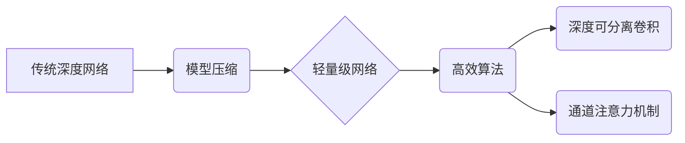

> 轻量级网络,深度学习,计算机视觉,模型压缩,高效算法,代码实战

## 1. 背景介绍

深度学习在计算机视觉、自然语言处理等领域取得了显著成就，但其模型规模庞大，部署成本高昂，对硬件资源要求苛刻。这限制了深度学习在移动设备、嵌入式系统等资源受限环境中的应用。轻量级网络应运而生，旨在通过模型压缩、高效算法等手段，构建更小、更快、更节能的深度学习模型，以满足资源受限环境下的应用需求。

近年来，轻量级网络研究取得了快速发展，涌现出许多优秀的网络架构，例如MobileNet、ShuffleNet、EfficientNet等。这些网络架构在模型精度和效率之间取得了良好的平衡，在图像分类、目标检测、语义分割等任务中表现出色。

## 2. 核心概念与联系

轻量级网络的设计目标是**在保证模型精度的前提下，尽可能减少模型参数量和计算复杂度**。

**核心概念：**

* **模型压缩:** 通过各种技术手段，例如权值量化、剪枝、知识蒸馏等，减少模型参数量和计算量。
* **高效算法:** 设计更具效率的卷积运算、池化运算等操作，降低模型计算复杂度。
* **深度可分离卷积:** 将传统的卷积运算分解为深度卷积和空间卷积，有效减少计算量。
* **通道注意力机制:** 学习每个通道的重要性，动态调整通道权重，提高模型的表达能力和效率。

**架构关系：**



## 3. 核心算法原理 & 具体操作步骤

### 3.1  算法原理概述

深度可分离卷积是轻量级网络的核心算法之一，它将传统的卷积运算分解为两个步骤：深度卷积和空间卷积。

* **深度卷积:** 对每个输入通道分别进行卷积运算，得到多个输出通道。
* **空间卷积:** 对每个输出通道进行卷积运算，得到最终的输出。

这种分解方式有效减少了计算量，因为深度卷积和空间卷积的计算量分别远小于传统的卷积运算。

### 3.2  算法步骤详解

1. **输入数据:** 输入数据为一个多通道的图像。
2. **深度卷积:** 对每个输入通道分别进行卷积运算，得到多个输出通道。
3. **空间卷积:** 对每个输出通道进行卷积运算，得到最终的输出。

### 3.3  算法优缺点

**优点:**

* 计算量大幅减少，提高模型效率。
* 模型参数量减少，降低存储成本。

**缺点:**

* 可能会导致模型精度下降。

### 3.4  算法应用领域

深度可分离卷积广泛应用于轻量级网络的构建，例如MobileNet、ShuffleNet等。

## 4. 数学模型和公式 & 详细讲解 & 举例说明

### 4.1  数学模型构建

假设输入数据为一个大小为 $H \times W \times C$ 的图像，其中 $H$ 和 $W$ 分别表示图像高度和宽度，$C$ 表示通道数。深度可分离卷积的数学模型可以表示为：

$$
y_{i,j,k} = \sum_{l=1}^{C} \sigma(W_{i,j,k,l} * x_{i,j,l} + b_{k})
$$

其中：

* $y_{i,j,k}$ 表示输出特征图上第 $i$ 行、第 $j$ 列、第 $k$ 个通道的特征值。
* $x_{i,j,l}$ 表示输入图像上第 $i$ 行、第 $j$ 列、第 $l$ 个通道的像素值。
* $W_{i,j,k,l}$ 表示深度卷积核的权重。
* $b_{k}$ 表示深度卷积核的偏置项。
* $\sigma$ 表示激活函数，例如ReLU函数。

### 4.2  公式推导过程

深度可分离卷积的数学模型可以由以下步骤推导得出：

1. **深度卷积:** 对每个输入通道分别进行卷积运算，得到多个输出通道。
2. **空间卷积:** 对每个输出通道进行卷积运算，得到最终的输出。

### 4.3  案例分析与讲解

假设输入图像大小为 $224 \times 224 \times 3$，深度可分离卷积核大小为 $3 \times 3$，输出通道数为 64。

在深度卷积阶段，每个输入通道（3 个）分别与深度卷积核进行卷积运算，得到 64 个输出通道。

在空间卷积阶段，每个输出通道（64 个）分别与空间卷积核进行卷积运算，得到最终的输出特征图。

## 5. 项目实践：代码实例和详细解释说明

### 5.1  开发环境搭建

* Python 3.7+
* TensorFlow 2.0+
* Keras

### 5.2  源代码详细实现

```python
import tensorflow as tf

def depthwise_conv(input_tensor, kernel_size, strides, padding):
    """深度可分离卷积操作"""
    depthwise_conv = tf.keras.layers.DepthwiseConv2D(
        kernel_size=kernel_size, strides=strides, padding=padding
    )
    return depthwise_conv(input_tensor)

def pointwise_conv(input_tensor, filters):
    """空间卷积操作"""
    pointwise_conv = tf.keras.layers.Conv2D(
        filters=filters, kernel_size=1, padding="same"
    )
    return pointwise_conv(input_tensor)

# 定义轻量级网络模型
def create_light_model():
    inputs = tf.keras.Input(shape=(224, 224, 3))
    x = depthwise_conv(inputs, kernel_size=3, strides=2, padding="same")
    x = tf.keras.layers.BatchNormalization()(x)
    x = tf.keras.layers.ReLU()(x)
    x = pointwise_conv(x, filters=64)
    # ... 其他层

    outputs = tf.keras.layers.GlobalAveragePooling2D()(x)
    outputs = tf.keras.layers.Dense(1000, activation="softmax")(outputs)

    model = tf.keras.Model(inputs=inputs, outputs=outputs)
    return model

# 创建模型实例
model = create_light_model()
model.summary()
```

### 5.3  代码解读与分析

* `depthwise_conv` 函数实现深度卷积操作。
* `pointwise_conv` 函数实现空间卷积操作。
* `create_light_model` 函数定义轻量级网络模型，包含深度卷积、空间卷积、池化层、全连接层等。
* `model.summary()` 函数打印模型结构信息。

### 5.4  运行结果展示

运行代码后，会输出模型结构信息，并可以根据需要进行训练和测试。

## 6. 实际应用场景

轻量级网络在以下场景中具有广泛应用：

* **移动设备:** 在手机、平板电脑等移动设备上部署深度学习模型，实现人脸识别、物体检测、图像分类等功能。
* **嵌入式系统:** 在资源受限的嵌入式系统中部署深度学习模型，例如智能家居、工业自动化等。
* **边缘计算:** 在边缘设备上进行数据处理和分析，降低网络传输成本和延迟。

### 6.4  未来应用展望

随着人工智能技术的不断发展，轻量级网络将在更多领域得到应用，例如：

* **实时视频分析:** 实现实时视频监控、目标跟踪、行为识别等功能。
* **自动驾驶:** 构建轻量级模型，用于车辆感知、路径规划、决策控制等。
* **医疗诊断:** 利用轻量级模型进行图像分析，辅助医生进行疾病诊断。

## 7. 工具和资源推荐

### 7.1  学习资源推荐

* **论文:**
    * MobileNet: Efficient Convolutional Neural Networks for Mobile Vision Applications
    * ShuffleNet: An Extremely Efficient Convolutional Neural Network for Mobile Devices
    * EfficientNet: Rethinking Model Scaling for Convolutional Neural Networks
* **博客:**
    * https://blog.paperspace.com/
    * https://towardsdatascience.com/

### 7.2  开发工具推荐

* **TensorFlow:** https://www.tensorflow.org/
* **PyTorch:** https://pytorch.org/
* **Keras:** https://keras.io/

### 7.3  相关论文推荐

* **深度可分离卷积:**
    * Xception: Deep Learning with Depthwise Separable Convolutions
* **模型压缩:**
    * Network Pruning: A Survey
    * Quantization-aware Training: A Methodology for Quantized Neural Networks

## 8. 总结：未来发展趋势与挑战

### 8.1  研究成果总结

轻量级网络研究取得了显著进展，涌现出许多优秀的网络架构和模型压缩技术，为深度学习在资源受限环境中的应用提供了新的可能性。

### 8.2  未来发展趋势

* **更小、更快、更节能:** 继续探索更有效的模型压缩和高效算法，构建更轻量级的深度学习模型。
* **自适应性:** 设计能够根据不同硬件平台和应用场景自适应调整模型大小和精度的轻量级网络。
* **可解释性:** 研究轻量级网络的结构和行为，提高模型的可解释性和可信任性。

### 8.3  面临的挑战

* **模型精度:** 降低模型参数量和计算复杂度可能会导致模型精度下降，需要进一步探索提高模型精度的技术。
* **硬件平台:** 不同硬件平台的性能和资源限制不同，需要针对不同的硬件平台进行模型优化。
* **应用场景:** 不同应用场景对模型性能和效率的要求不同，需要根据具体应用场景进行模型设计和选择。

### 8.4  研究展望

未来，轻量级网络研究将继续朝着更小、更快、更节能、更自适应、更可解释的方向发展，为深度学习的广泛应用提供坚实的基础。

## 9. 附录：常见问题与解答

* **Q: 轻量级网络的精度如何？**
* **A:** 轻量级网络的精度与模型架构、训练数据和训练方法等因素有关，一般来说，轻量级网络的精度与传统深度网络相比有所下降，但随着模型压缩技术的不断发展，轻量级网络的精度也在不断提高。
* **Q: 轻量级网络的应用场景有哪些？**
* **A:** 轻量级网络广泛应用于移动设备、嵌入式系统、边缘计算等资源受限环境，例如人脸识别、物体检测、图像分类、语音识别等。
* **Q: 如何选择合适的轻量级网络架构？**
* **A:** 选择合适的轻量级网络架构需要根据具体的应用场景和硬件平台进行考虑，例如，对于精度要求较高的应用场景，可以选择精度更高的轻量级网络架构，而对于资源受限的应用场景，可以选择更轻量级的网络架构。


作者：禅与计算机程序设计艺术 / Zen and the Art of Computer Programming 
<end_of_turn>