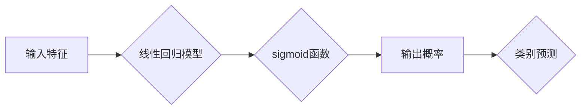

> 逻辑回归，分类算法，线性模型，sigmoid函数，概率预测，机器学习

## 1. 背景介绍

在机器学习领域，分类问题占据着重要地位。分类问题旨在将数据点划分为预定义的类别。例如，判断电子邮件是否为垃圾邮件，识别图像中的物体，预测客户是否会购买商品等。

逻辑回归作为一种经典的分类算法，在解决二分类问题方面表现出色。它以其易于理解、实现和解释的特性而广受欢迎。

## 2. 核心概念与联系

逻辑回归的核心思想是将线性回归模型应用于分类问题。线性回归模型试图找到一条直线来拟合数据点，而逻辑回归则通过sigmoid函数将线性回归模型的输出映射到0到1之间的概率区间，从而实现对类别概率的预测。

**逻辑回归流程图:**



## 3. 核心算法原理 & 具体操作步骤

### 3.1  算法原理概述

逻辑回归的核心在于使用sigmoid函数将线性回归模型的输出转换为概率。sigmoid函数的输出范围在0到1之间，可以被解释为样本属于特定类别的概率。

### 3.2  算法步骤详解

1. **特征选择和预处理:** 选择与目标变量相关的特征，并对特征进行预处理，例如标准化或归一化。

2. **线性回归模型构建:** 使用线性回归模型对特征进行线性组合，得到一个预测值。

3. **sigmoid函数应用:** 将线性回归模型的预测值输入sigmoid函数，得到样本属于特定类别的概率。

4. **概率阈值设定:** 设置一个概率阈值，将概率高于阈值的样本分类为一类，低于阈值的样本分类为另一类。

5. **模型评估和优化:** 使用评估指标，例如准确率、召回率和F1-score，评估模型性能。通过调整模型参数，例如学习率和正则化参数，优化模型性能。

### 3.3  算法优缺点

**优点:**

* 易于理解和实现。
* 计算效率高。
* 可解释性强，可以分析特征对预测的影响。

**缺点:**

* 只能处理线性可分的数据。
* 对异常值敏感。
* 对于高维数据，容易出现过拟合问题。

### 3.4  算法应用领域

逻辑回归广泛应用于以下领域:

* **金融领域:** 欺诈检测、信用评分、客户流失预测。
* **医疗领域:** 疾病诊断、患者风险评估、药物疗效预测。
* **市场营销领域:** 客户分群、广告点击率预测、市场趋势分析。

## 4. 数学模型和公式 & 详细讲解 & 举例说明

### 4.1  数学模型构建

逻辑回归模型的数学模型可以表示为:

$$
p(y=1|x) = \frac{1}{1 + e^{-(w^T x + b)}}
$$

其中:

* $p(y=1|x)$ 是样本 $x$ 属于类别 1 的概率。
* $w$ 是模型参数向量。
* $x$ 是样本特征向量。
* $b$ 是模型偏置项。
* $e$ 是自然对数的底数。

### 4.2  公式推导过程

sigmoid函数的输出范围在0到1之间，可以被解释为样本属于特定类别的概率。

### 4.3  案例分析与讲解

假设我们有一个二分类问题，目标是判断电子邮件是否为垃圾邮件。

特征包括电子邮件的长度、单词数量、特定关键词的出现次数等。

使用逻辑回归模型，我们可以训练一个模型来预测电子邮件是否为垃圾邮件。

## 5. 项目实践：代码实例和详细解释说明

### 5.1  开发环境搭建

使用Python语言和scikit-learn库进行逻辑回归模型的实现。

### 5.2  源代码详细实现

```python
from sklearn.linear_model import LogisticRegression
from sklearn.model_selection import train_test_split
from sklearn.metrics import accuracy_score

# 加载数据
# ...

# 将数据分为训练集和测试集
X_train, X_test, y_train, y_test = train_test_split(X, y, test_size=0.2, random_state=42)

# 创建逻辑回归模型
model = LogisticRegression()

# 训练模型
model.fit(X_train, y_train)

# 预测测试集结果
y_pred = model.predict(X_test)

# 计算模型准确率
accuracy = accuracy_score(y_test, y_pred)
print(f"模型准确率: {accuracy}")
```

### 5.3  代码解读与分析

* 使用`train_test_split`函数将数据分为训练集和测试集。
* 使用`LogisticRegression`类创建逻辑回归模型。
* 使用`fit`方法训练模型。
* 使用`predict`方法预测测试集结果。
* 使用`accuracy_score`函数计算模型准确率。

### 5.4  运行结果展示

运行代码后，会输出模型的准确率。

## 6. 实际应用场景

### 6.1  垃圾邮件过滤

逻辑回归可以用于识别垃圾邮件。

特征包括电子邮件的长度、单词数量、特定关键词的出现次数等。

### 6.2  客户流失预测

逻辑回归可以用于预测客户是否会流失。

特征包括客户的购买历史、使用频率、客户服务交互等。

### 6.3  疾病诊断

逻辑回归可以用于辅助医生诊断疾病。

特征包括患者的症状、病史、检查结果等。

### 6.4  未来应用展望

随着机器学习技术的不断发展，逻辑回归在更多领域将发挥重要作用。

例如，在医疗领域，逻辑回归可以用于个性化医疗方案的制定；在金融领域，逻辑回归可以用于风险评估和欺诈检测。

## 7. 工具和资源推荐

### 7.1  学习资源推荐

* **书籍:**
    * 《机器学习》 by Tom Mitchell
    * 《深入理解机器学习》 by 周志华
* **在线课程:**
    * Coursera: Machine Learning by Andrew Ng
    * edX: Introduction to Machine Learning

### 7.2  开发工具推荐

* **Python:** 
    * scikit-learn
    * TensorFlow
    * PyTorch

### 7.3  相关论文推荐

* **Logistic Regression: A Review** by Hosmer, Lemeshow, and Sturdivant
* **A Gentle Introduction to Logistic Regression** by James, Witten, Hastie, and Tibshirani

## 8. 总结：未来发展趋势与挑战

### 8.1  研究成果总结

逻辑回归作为一种经典的分类算法，在解决二分类问题方面取得了显著的成果。

其易于理解、实现和解释的特性使其在实际应用中得到广泛应用。

### 8.2  未来发展趋势

未来，逻辑回归的研究将朝着以下方向发展:

* **提升模型性能:** 研究新的优化算法和正则化技术，提高逻辑回归模型的准确率和泛化能力。
* **扩展应用场景:** 将逻辑回归应用于更多领域，例如多分类问题、时间序列分析等。
* **结合深度学习:** 将逻辑回归与深度学习模型结合，构建更强大的分类模型。

### 8.3  面临的挑战

逻辑回归在处理高维数据和非线性关系方面存在局限性。

未来研究需要克服这些挑战，使其能够更好地应对复杂的数据场景。

### 8.4  研究展望

逻辑回归作为一种基础的机器学习算法，其研究将继续推动机器学习领域的进步。

未来，我们将看到更多基于逻辑回归的创新应用，为解决实际问题提供更有效的解决方案。

## 9. 附录：常见问题与解答

**问题 1:** 逻辑回归模型的输出范围是什么？

**答案:** 逻辑回归模型的输出范围在0到1之间，可以被解释为样本属于特定类别的概率。

**问题 2:** 如何选择逻辑回归模型的概率阈值？

**答案:** 概率阈值的选择取决于具体的应用场景。

通常情况下，可以根据实际需求调整阈值，以达到最佳的分类效果。

**问题 3:** 逻辑回归模型对异常值敏感吗？

**答案:** 是的，逻辑回归模型对异常值敏感。

在处理含有异常值的的数据时，需要进行数据预处理，例如删除异常值或进行异常值处理。


作者：禅与计算机程序设计艺术 / Zen and the Art of Computer Programming 
<end_of_turn>