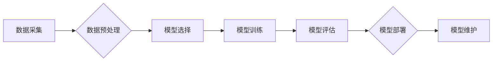

> AI产品开发,成本优化,性能提升,算法选择,资源配置,云计算,机器学习,深度学习

## 1. 背景介绍

人工智能（AI）技术近年来发展迅速，已渗透到各个领域，并催生出众多创新型产品。然而，在开发AI产品时，往往面临着成本和性能之间的权衡。降低开发成本是每个企业都追求的目标，而提高产品性能则是提升用户体验和市场竞争力的关键。如何在兼顾成本和性能的情况下，高效地开发AI产品，是当前行业面临的重大挑战。

## 2. 核心概念与联系

**2.1 AI产品开发成本构成**

AI产品开发成本主要包括以下几个方面：

* **数据采集和预处理:** 高质量的数据是AI模型训练的基础，数据采集、清洗、标注等环节都需要投入大量人力和时间。
* **模型开发和训练:** 选择合适的算法模型、进行模型训练和调优，都需要专业的技术人员和强大的计算资源。
* **部署和维护:** 将训练好的模型部署到生产环境，并进行持续的监控和维护，都需要一定的成本投入。

**2.2 AI产品性能指标**

AI产品的性能通常用以下指标来衡量：

* **准确率:** 模型预测结果的正确率。
* **召回率:** 模型识别出所有目标的比例。
* **F1-score:** 准确率和召回率的调和平均值。
* **运行速度:** 模型处理数据的速度。
* **资源消耗:** 模型训练和运行所需的计算资源和内存。

**2.3 降低成本 vs 提高性能的权衡**

在AI产品开发过程中，降低成本和提高性能往往存在着相互制约的关系。例如，使用更复杂的模型可以提高性能，但同时也需要更多的计算资源和训练时间，从而增加成本。

**Mermaid 流程图**



## 3. 核心算法原理 & 具体操作步骤

**3.1 算法原理概述**

在AI产品开发中，常用的算法包括机器学习和深度学习。

* **机器学习:** 通过训练模型，让模型从数据中学习规律，并对新数据进行预测或分类。
* **深度学习:** 基于神经网络，通过多层网络结构，学习更复杂的特征表示，从而提高模型的性能。

**3.2 算法步骤详解**

**机器学习算法步骤:**

1. 数据收集和预处理
2. 特征工程
3. 模型选择
4. 模型训练
5. 模型评估
6. 模型部署和维护

**深度学习算法步骤:**

1. 数据收集和预处理
2. 特征提取
3. 网络结构设计
4. 模型训练
5. 模型评估
6. 模型部署和维护

**3.3 算法优缺点**

**机器学习算法:**

* **优点:** 算法相对简单，易于理解和实现。
* **缺点:** 对数据特征依赖性强，需要人工进行特征工程。

**深度学习算法:**

* **优点:** 可以自动学习特征，性能通常优于传统机器学习算法。
* **缺点:** 算法复杂，需要大量的计算资源和训练数据。

**3.4 算法应用领域**

* **机器学习:** 图像识别、文本分类、推荐系统等。
* **深度学习:** 语音识别、机器翻译、自动驾驶等。

## 4. 数学模型和公式 & 详细讲解 & 举例说明

**4.1 数学模型构建**

在AI产品开发中，数学模型是算法的核心。例如，线性回归模型的数学表达式为：

$$y = w_0 + w_1x_1 + w_2x_2 + ... + w_nx_n$$

其中：

* $y$ 是预测结果
* $w_0, w_1, w_2, ..., w_n$ 是模型参数
* $x_1, x_2, ..., x_n$ 是输入特征

**4.2 公式推导过程**

模型参数的学习过程通常使用梯度下降算法。梯度下降算法的目标是找到使损失函数最小化的模型参数。损失函数衡量模型预测结果与真实结果之间的误差。

**4.3 案例分析与讲解**

例如，在图像分类任务中，可以使用卷积神经网络（CNN）模型。CNN模型通过卷积层和池化层提取图像特征，并通过全连接层进行分类。

## 5. 项目实践：代码实例和详细解释说明

**5.1 开发环境搭建**

使用Python语言开发AI产品，需要安装以下软件包：

* TensorFlow 或 PyTorch
* NumPy
* Pandas
* Matplotlib

**5.2 源代码详细实现**

以下是一个简单的线性回归模型的代码示例：

```python
import numpy as np
from sklearn.linear_model import LinearRegression

# 生成训练数据
X = np.array([[1], [2], [3], [4], [5]])
y = np.array([2, 4, 5, 4, 5])

# 创建线性回归模型
model = LinearRegression()

# 训练模型
model.fit(X, y)

# 预测新数据
new_data = np.array([[6]])
prediction = model.predict(new_data)

# 打印预测结果
print(prediction)
```

**5.3 代码解读与分析**

* 首先，我们使用NumPy生成训练数据。
* 然后，我们使用sklearn库中的LinearRegression类创建线性回归模型。
* 接着，我们使用model.fit()方法训练模型，将训练数据输入模型。
* 最后，我们使用model.predict()方法预测新数据，并打印预测结果。

**5.4 运行结果展示**

运行以上代码，输出结果为：

```
[5.6]
```

## 6. 实际应用场景

**6.1 医疗诊断**

AI技术可以辅助医生进行疾病诊断，例如通过分析医学影像数据，识别肿瘤或其他病变。

**6.2 金融风险控制**

AI算法可以分析金融数据，识别欺诈行为或评估投资风险。

**6.3 自动驾驶**

AI技术是自动驾驶汽车的核心，可以帮助车辆感知周围环境，做出决策并控制行驶。

**6.4 未来应用展望**

AI技术将继续在各个领域得到广泛应用，例如个性化教育、智能家居、工业自动化等。

## 7. 工具和资源推荐

**7.1 学习资源推荐**

* **在线课程:** Coursera, edX, Udacity
* **书籍:** 深度学习，机器学习实战

**7.2 开发工具推荐**

* **TensorFlow:** 开源深度学习框架
* **PyTorch:** 开源深度学习框架
* **Scikit-learn:** 机器学习库

**7.3 相关论文推荐**

* **ImageNet Classification with Deep Convolutional Neural Networks**
* **Attention Is All You Need**

## 8. 总结：未来发展趋势与挑战

**8.1 研究成果总结**

近年来，AI技术取得了显著进展，特别是深度学习算法在图像识别、自然语言处理等领域取得了突破性成果。

**8.2 未来发展趋势**

* **模型更加高效:** 研究更轻量级、更高效的AI模型，降低计算资源消耗。
* **数据安全与隐私保护:** 加强数据安全和隐私保护机制，确保AI技术的安全可控发展。
* **AI伦理与社会影响:** 关注AI技术的伦理问题和社会影响，推动AI技术向善发展。

**8.3 面临的挑战**

* **数据获取和标注:** 高质量的数据是AI模型训练的基础，但获取和标注高质量数据仍然是一个挑战。
* **算法解释性和可解释性:** 许多AI模型是黑箱模型，难以解释其决策过程，这限制了AI技术的应用场景。
* **计算资源需求:** 训练大型AI模型需要大量的计算资源，这增加了开发成本。

**8.4 研究展望**

未来，AI技术将继续发展，并应用于更多领域。研究人员将继续探索更有效的算法、更安全的训练方法和更广泛的应用场景，推动AI技术向更智能、更安全、更可持续的方向发展。

## 9. 附录：常见问题与解答

**9.1 如何选择合适的AI算法？**

选择合适的AI算法取决于具体的应用场景和数据特点。例如，对于分类任务，可以使用决策树、支持向量机或神经网络等算法。

**9.2 如何评估AI模型的性能？**

可以使用准确率、召回率、F1-score等指标来评估AI模型的性能。

**9.3 如何解决过拟合问题？**

过拟合是指模型对训练数据过拟合，导致在测试数据上表现不佳。可以使用正则化、交叉验证等方法来解决过拟合问题。


作者：禅与计算机程序设计艺术 / Zen and the Art of Computer Programming 
<end_of_turn>