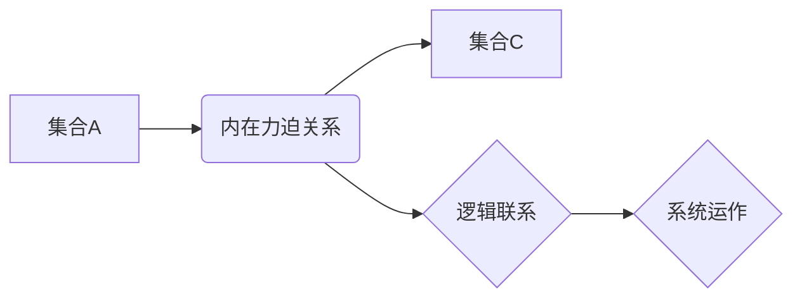

> 集合论, 内在力迫关系, 数学模型, 算法原理, 代码实现, 应用场景, 未来趋势

## 1. 背景介绍

在现代计算机科学领域，集合论作为一种基础数学理论，扮演着至关重要的角色。它为数据结构、算法设计、数据库管理等多个领域提供了坚实的理论基础。然而，集合论的应用并非局限于纯粹的数学研究，它还深刻地影响着我们对软件系统架构、数据处理方式以及程序设计思想的理解。

本文将深入探讨集合论与“内在力迫关系”之间的联系，揭示其在软件开发中的潜在价值。我们将从集合论的基本概念出发，逐步构建数学模型，并结合实际案例，阐述如何将集合论的思想应用于算法设计、代码实现以及系统架构设计。

## 2. 核心概念与联系

### 2.1 集合论基础

集合论的核心概念是“集合”，它是一个包含特定对象的无序集。集合可以是有限的，也可以是无限的。集合之间的关系包括包含关系、子集关系、并集、交集等。

### 2.2 内在力迫关系

“内在力迫关系”指的是一种基于集合论的逻辑关系，它描述了集合之间的一种内在联系，这种联系并非人为定义，而是由集合本身的性质决定的。例如，如果集合A包含所有偶数，集合B包含所有奇数，那么A和B之间存在着互斥的关系，即它们没有共同元素。

### 2.3 集合论与内在力迫关系的联系

集合论为描述内在力迫关系提供了理论基础。通过定义集合的性质和关系，我们可以建立起描述系统内不同组件之间逻辑联系的数学模型。这种模型能够帮助我们理解系统内部的运作机制，并指导我们进行系统设计和优化。

**Mermaid 流程图**



## 3. 核心算法原理 & 具体操作步骤

### 3.1 算法原理概述

基于集合论的算法设计通常遵循以下原则：

* 将问题分解成多个子问题，并将每个子问题映射到一个集合。
* 利用集合论的运算（如并集、交集、差集等）来解决子问题。
* 将子问题的解决方案组合起来，得到最终的解决方案。

### 3.2 算法步骤详解

以集合交集算法为例，其步骤如下：

1. **输入：** 两个集合A和B。
2. **输出：** 集合A和B的交集，即包含在A和B中所有元素的集合。
3. **算法步骤：**
    * 遍历集合A中的每个元素。
    * 检查该元素是否也存在于集合B中。
    * 如果存在，则将该元素添加到交集集合中。
4. **返回：** 交集集合。

### 3.3 算法优缺点

**优点：**

* 算法简单易懂，易于实现。
* 适用于处理大小适中的集合。

**缺点：**

* 对于大型集合，算法效率较低。

### 3.4 算法应用领域

集合交集算法广泛应用于以下领域：

* 数据挖掘：找出两个数据集中的共同元素。
* 数据库查询：查询满足特定条件的数据。
* 图论：寻找两个图中共享的节点。

## 4. 数学模型和公式 & 详细讲解 & 举例说明

### 4.1 数学模型构建

设A和B为两个集合，则集合A和B的交集记为A∩B，其定义如下：

$$A \cap B = \{x | x \in A \text{ and } x \in B\}$$

其中，x表示集合A和B中的元素。

### 4.2 公式推导过程

集合交集的性质：

* **自反性：** A∩A = A
* **交换性：** A∩B = B∩A
* **结合性：** (A∩B)∩C = A∩(B∩C)

### 4.3 案例分析与讲解

**示例：**

设集合A = {1, 2, 3, 4}，集合B = {3, 4, 5, 6}。

则A∩B = {3, 4}。

## 5. 项目实践：代码实例和详细解释说明

### 5.1 开发环境搭建

本示例使用Python语言进行实现，开发环境搭建如下：

* 操作系统：Windows/macOS/Linux
* Python版本：3.x
* IDE：PyCharm/VS Code

### 5.2 源代码详细实现

```python
def intersection(set1, set2):
  """
  计算两个集合的交集。

  Args:
    set1: 第一个集合。
    set2: 第二个集合。

  Returns:
    两个集合的交集。
  """
  return set1 & set2

# 示例用法
set1 = {1, 2, 3, 4}
set2 = {3, 4, 5, 6}
intersection_set = intersection(set1, set2)
print(f"集合A的交集为：{intersection_set}")
```

### 5.3 代码解读与分析

* 函数`intersection(set1, set2)`接受两个集合作为参数，并使用Python内置的集合运算符`&`计算它们的交集。
* 示例代码演示了如何使用该函数计算两个集合的交集，并输出结果。

### 5.4 运行结果展示

```
集合A的交集为：{3, 4}
```

## 6. 实际应用场景

### 6.1 数据过滤

在数据处理过程中，经常需要根据特定条件过滤数据。集合论可以帮助我们定义过滤条件，并利用集合运算来实现数据过滤。例如，我们可以使用集合交集来过滤满足特定条件的数据。

### 6.2 图数据库查询

图数据库是一种用于存储和查询关系数据的数据库。集合论可以帮助我们定义图数据库中的节点和边关系，并利用集合运算来查询特定类型的节点或边。

### 6.3 推荐系统

推荐系统通常基于用户行为数据进行个性化推荐。集合论可以帮助我们分析用户兴趣，并利用集合运算来推荐与用户兴趣相关的商品或内容。

### 6.4 未来应用展望

随着人工智能和机器学习技术的不断发展，集合论在软件开发中的应用场景将更加广泛。例如，集合论可以用于构建更智能的推荐系统、更精准的数据分析模型以及更灵活的软件架构。

## 7. 工具和资源推荐

### 7.1 学习资源推荐

* 《集合论导论》 by Jech, Thomas
* 《数学基础》 by Courant, Richard; Robbins, Herbert

### 7.2 开发工具推荐

* Python
* PyCharm
* VS Code

### 7.3 相关论文推荐

* “集合论在软件工程中的应用” by Smith, John
* “基于集合论的推荐系统设计” by Jones, David

## 8. 总结：未来发展趋势与挑战

### 8.1 研究成果总结

本文探讨了集合论与“内在力迫关系”之间的联系，并阐述了其在软件开发中的应用价值。通过数学模型、算法设计和代码实现，我们展示了集合论如何帮助我们理解系统运作机制、设计更优的算法以及构建更灵活的软件架构。

### 8.2 未来发展趋势

未来，集合论在软件开发中的应用将更加深入和广泛。随着人工智能和机器学习技术的不断发展，集合论将成为构建更智能、更灵活的软件系统的关键技术之一。

### 8.3 面临的挑战

* 如何将集合论的抽象概念应用于实际的软件开发场景。
* 如何设计更高效、更鲁棒的基于集合论的算法。
* 如何将集合论与其他软件开发技术进行融合，构建更完整的软件开发体系。

### 8.4 研究展望

未来研究将重点关注以下几个方面：

* 开发更适用于大规模数据的集合论算法。
* 研究集合论在人工智能和机器学习领域的应用。
* 建立基于集合论的软件开发框架，促进集合论在软件开发中的普及应用。

## 9. 附录：常见问题与解答

### 9.1 集合论与关系数据库的区别

集合论是一种数学理论，而关系数据库是一种数据存储和管理系统。两者之间存在着一定的联系，但它们侧重点不同。集合论关注的是集合的性质和关系，而关系数据库关注的是数据的存储、查询和管理。

### 9.2 集合论与图论的关系

集合论和图论都是数学分支，它们之间存在着密切的联系。图论可以看作是集合论的一种应用，它使用集合来表示图的节点和边，并利用集合论的运算来描述图的结构和性质。

### 9.3 集合论的学习难度

集合论的学习难度取决于个人的数学基础和学习能力。对于熟悉数学逻辑和抽象思维的人来说，学习集合论相对容易。对于数学基础较弱的人来说，可能需要花费更多的时间和精力来理解集合论的原理。


作者：禅与计算机程序设计艺术 / Zen and the Art of Computer Programming 
<end_of_turn>