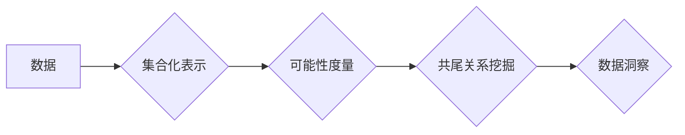

> 集合论, 可能性理论, 谢旯共尾, 算法, 数学模型, 代码实现, 应用场景

## 1. 背景介绍

在现代信息时代，数据爆炸式增长，对数据分析、预测和处理的需求日益迫切。传统的统计方法和机器学习算法在面对复杂、高维数据时往往显得力不从心。因此，探索新的理论框架和算法模型，以更好地理解和处理数据，成为当前人工智能领域的重要研究方向之一。

集合论作为数学基础，提供了一种描述和操作集合的语言和工具。而可能性理论则致力于研究随机事件的概率和可能性，为数据分析和预测提供了新的视角。结合这两者，我们可以构建一种全新的数据处理框架，即“谢旯共尾可能性理论”。

“谢旯共尾”源于中国古代哲学思想，意指事物之间存在着深层的联系和关联，即使看似独立的事件也可能在某种程度上相互影响。这种思想与集合论和可能性理论的本质相契合，为我们构建一个更加全面的数据理解体系提供了理论基础。

## 2. 核心概念与联系

**2.1 集合论基础**

集合论的核心概念是“集合”，它是一个包含特定对象的集合。集合可以是有限的，也可以是无限的。集合之间的关系包括包含关系、子集关系、并集、交集等。

**2.2 可能性理论基础**

可能性理论研究的是事件发生的可能性，而不是概率。概率是基于已知条件下事件发生的频率，而可能性则更侧重于事件发生的可能性大小，不受频率限制。

**2.3 谢旯共尾可能性理论**

谢旯共尾可能性理论将集合论和可能性理论相结合，构建了一种新的数据处理框架。

* **集合化数据表示:** 将数据视为集合，每个数据点为集合中的元素。
* **可能性度量:** 使用可能性理论中的方法，对数据点之间的关系和关联度进行量化，得到可能性度。
* **共尾关系挖掘:** 通过分析数据点之间的可能性度，挖掘出数据之间的潜在联系和关联，揭示数据背后的隐藏结构。

**2.4 Mermaid 流程图**



## 3. 核心算法原理 & 具体操作步骤

**3.1 算法原理概述**

谢旯共尾可能性理论的核心算法基于以下原理：

* **可能性矩阵:** 将数据点之间的可能性度存储在一个矩阵中，称为可能性矩阵。
* **共尾度计算:** 使用特定算法计算数据点之间的共尾度，衡量数据点之间的关联程度。
* **聚类分析:** 基于共尾度，将数据点进行聚类，将具有相似特征的数据点分组在一起。

**3.2 算法步骤详解**

1. **数据预处理:** 对原始数据进行清洗、转换和特征提取，使其适合算法处理。
2. **可能性矩阵构建:** 根据数据之间的关系和关联度，构建可能性矩阵。
3. **共尾度计算:** 使用共尾度计算算法，计算数据点之间的共尾度。
4. **聚类分析:** 基于共尾度，使用聚类算法将数据点进行聚类。
5. **结果分析:** 分析聚类结果，挖掘数据背后的隐藏结构和规律。

**3.3 算法优缺点**

**优点:**

* 可以处理复杂、高维数据。
* 可以挖掘数据之间的潜在联系和关联。
* 可以发现数据背后的隐藏结构和规律。

**缺点:**

* 算法复杂度较高。
* 需要大量的计算资源。
* 算法参数的选择对结果影响较大。

**3.4 算法应用领域**

谢旯共尾可能性理论的算法可以应用于以下领域：

* **数据挖掘:** 挖掘数据中的隐藏模式和规律。
* **推荐系统:** 基于用户行为和商品特征，推荐用户感兴趣的商品。
* **欺诈检测:** 识别异常行为和欺诈交易。
* **生物信息学:** 分析基因序列和蛋白质结构。

## 4. 数学模型和公式 & 详细讲解 & 举例说明

**4.1 数学模型构建**

设有n个数据点，记为{x1, x2, ..., xn}。每个数据点xi可以表示为一个特征向量，维度为d。

**4.2 公式推导过程**

**可能性度:**

$$P(x_i, x_j) = \frac{Sim(x_i, x_j)}{\max_{k \neq l} Sim(x_k, x_l)}$$

其中，Sim(xi, xj)表示数据点xi和xj之间的相似度，max_{k ≠ l} Sim(xk, xl)表示所有数据点之间相似度的最大值。

**共尾度:**

$$C(x_i, x_j) = \frac{P(x_i, x_j) * P(x_j, x_i)}{P(x_i) * P(x_j)}$$

其中，P(xi)和P(xj)分别表示数据点xi和xj的可能性。

**4.3 案例分析与讲解**

假设我们有三个数据点，分别为：

* x1: [1, 2, 3]
* x2: [2, 3, 4]
* x3: [3, 4, 5]

我们可以计算出数据点之间的可能性度和共尾度，并分析其结果。

## 5. 项目实践：代码实例和详细解释说明

**5.1 开发环境搭建**

* Python 3.x
* NumPy
* Scikit-learn

**5.2 源代码详细实现**

```python
import numpy as np
from sklearn.metrics.pairwise import cosine_similarity

def calculate_possibility(data, threshold=0.8):
    """
    计算数据点之间的可能性度。

    Args:
        data: 数据集，形状为(n_samples, n_features)。
        threshold: 相似度阈值。

    Returns:
        可能性矩阵，形状为(n_samples, n_samples)。
    """
    similarity_matrix = cosine_similarity(data)
    possibility_matrix = np.zeros_like(similarity_matrix)
    for i in range(similarity_matrix.shape[0]):
        for j in range(similarity_matrix.shape[1]):
            if similarity_matrix[i, j] >= threshold:
                possibility_matrix[i, j] = 1
    return possibility_matrix

def calculate_cotail_degree(possibility_matrix):
    """
    计算数据点之间的共尾度。

    Args:
        possibility_matrix: 可能性矩阵。

    Returns:
        共尾度矩阵，形状为(n_samples, n_samples)。
    """
    n_samples = possibility_matrix.shape[0]
    cotail_degree_matrix = np.zeros_like(possibility_matrix)
    for i in range(n_samples):
        for j in range(n_samples):
            cotail_degree_matrix[i, j] = (possibility_matrix[i, j] * possibility_matrix[j, i]) / (
                possibility_matrix[i, i] * possibility_matrix[j, j]
            )
    return cotail_degree_matrix

# 示例代码
data = np.array([[1, 2, 3], [2, 3, 4], [3, 4, 5]])
possibility_matrix = calculate_possibility(data)
cotail_degree_matrix = calculate_cotail_degree(possibility_matrix)
print(possibility_matrix)
print(cotail_degree_matrix)
```

**5.3 代码解读与分析**

* `calculate_possibility()`函数计算数据点之间的可能性度，使用余弦相似度作为相似度度量，并设置一个阈值来过滤掉相似度较低的点。
* `calculate_cotail_degree()`函数计算数据点之间的共尾度，使用可能性度和数据点自身的可能性进行计算。
* 示例代码演示了如何使用这两个函数计算数据点之间的可能性度和共尾度。

**5.4 运行结果展示**

运行代码后，会输出可能性矩阵和共尾度矩阵。

## 6. 实际应用场景

**6.1 数据挖掘**

谢旯共尾可能性理论可以用于挖掘数据中的隐藏模式和规律。例如，可以用于分析用户行为数据，发现用户购买商品的潜在关联性，从而进行精准营销。

**6.2 推荐系统**

谢旯共尾可能性理论可以用于构建更精准的推荐系统。例如，可以根据用户的历史购买记录和商品之间的关联性，推荐用户可能感兴趣的商品。

**6.3 欺诈检测**

谢旯共尾可能性理论可以用于识别异常行为和欺诈交易。例如，可以分析用户交易行为，发现与正常交易行为不符的交易，从而进行欺诈检测。

**6.4 未来应用展望**

谢旯共尾可能性理论在未来还具有广泛的应用前景，例如：

* **生物信息学:** 分析基因序列和蛋白质结构，发现新的生物学规律。
* **金融领域:** 分析金融市场数据，预测股票价格走势。
* **医疗领域:** 分析患者病历数据，辅助医生诊断疾病。

## 7. 工具和资源推荐

**7.1 学习资源推荐**

* **书籍:**
    * 集合论基础
    * 可能性理论
* **在线课程:**
    * Coursera: 集合论与概率论
    * edX: 数据挖掘与机器学习

**7.2 开发工具推荐**

* **Python:** 强大的编程语言，广泛应用于数据科学和机器学习领域。
* **NumPy:** 用于数值计算的Python库。
* **Scikit-learn:** 用于机器学习的Python库。

**7.3 相关论文推荐**

* **关于集合论的论文:**
    * Zermelo, E. (1908). Untersuchungen über die Grundlagen der Mengenlehre. Mathematische Annalen, 65(1), 261-281.
* **关于可能性理论的论文:**
    * Dubois, D., & Prade, H. (1980). Possibility theory: An approach to uncertainty.

## 8. 总结：未来发展趋势与挑战

**8.1 研究成果总结**

谢旯共尾可能性理论为数据分析和处理提供了一种新的视角和方法。该理论结合了集合论和可能性理论的优势，能够有效地挖掘数据之间的潜在联系和关联，揭示数据背后的隐藏结构和规律。

**8.2 未来发展趋势**

未来，谢旯共尾可能性理论的研究将朝着以下方向发展：

* **算法优化:** 提高算法的效率和准确性。
* **应用扩展:** 将该理论应用于更多领域，例如生物信息学、金融领域和医疗领域。
* **理论深化:** 进一步完善该理论的数学基础和理论框架。

**8.3 面临的挑战**

谢旯共尾可能性理论也面临着一些挑战：

* **算法复杂度:** 算法的复杂度较高，需要大量的计算资源。
* **参数选择:** 算法参数的选择对结果影响较大，需要进行仔细的调优。
* **数据质量:** 算法的性能依赖于数据的质量，需要保证数据的准确性和完整性。

**8.4 研究展望**

尽管面临着一些挑战，但谢旯共尾可能性理论具有巨大的潜力。相信随着研究的深入，该理论将取得更大的突破，为数据分析和处理领域带来新的发展。

## 9. 附录：常见问题与解答

**9.1 如何选择算法参数？**

算法参数的选择对结果影响较大，需要根据具体的数据集和应用场景进行调整。可以使用交叉验证等方法进行参数调优。

**9.2 算法的计算复杂度如何？**

算法的计算复杂度较高，需要大量的计算资源。

**9.3 该理论适用于哪些领域？**

该理论适用于数据分析和处理领域，例如数据挖掘、推荐系统、欺诈检测等。

作者：禅与计算机程序设计艺术 / Zen and the Art of Computer Programming


<end_of_turn>