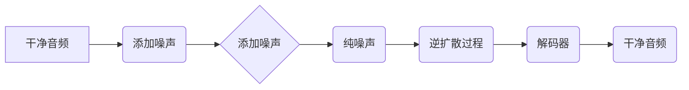

> 音频扩散，Diffusion Model，音频生成，文本到语音，语音合成，代码实例

## 1. 背景介绍

近年来，深度学习在语音合成领域取得了显著进展。传统的语音合成方法通常依赖于复杂的声学模型和声韵律规则，而深度学习方法则能够学习语音的复杂特征，生成更加自然流畅的语音。其中，扩散模型（Diffusion Model）作为一种新兴的生成模型，在图像生成领域取得了突破性进展，也逐渐应用于音频生成领域。

音频扩散模型的工作原理类似于图像扩散模型，它通过逐步添加噪声将干净的音频信号转换为纯噪声，然后训练一个逆过程，从纯噪声中逐渐恢复出干净的音频信号。这种逐步添加和去除噪声的过程使得音频扩散模型能够学习到音频信号的复杂分布，并生成高质量的音频。

## 2. 核心概念与联系

音频扩散模型的核心概念包括：

* **扩散过程:** 将干净的音频信号逐步添加噪声，直到变成纯噪声。
* **逆扩散过程:** 从纯噪声中逐步去除噪声，恢复出干净的音频信号。
* **编码器:** 将音频信号编码成低维向量。
* **解码器:** 将低维向量解码成音频信号。

**Mermaid 流程图:**



## 3. 核心算法原理 & 具体操作步骤

### 3.1  算法原理概述

音频扩散模型的核心算法是基于马尔可夫链的，它将音频信号的生成过程看作是一个马尔可夫链，每个状态代表一个添加噪声后的音频信号。

扩散过程：

1. 从干净的音频信号开始，逐步添加噪声，直到变成纯噪声。
2. 每个时间步，添加的噪声服从一定的分布，例如高斯分布。

逆扩散过程：

1. 从纯噪声开始，逐步去除噪声，恢复出干净的音频信号。
2. 每个时间步，去除的噪声量由一个神经网络预测。

### 3.2  算法步骤详解

1. **前向扩散:**

   * 从干净的音频信号开始，逐步添加噪声。
   * 每个时间步，添加的噪声量由一个预设的分布决定。
   * 经过 T 个时间步后，音频信号变成纯噪声。

2. **逆向扩散:**

   * 从纯噪声开始，逐步去除噪声。
   * 每个时间步，使用一个神经网络预测去除的噪声量。
   * 通过反向传播算法训练神经网络，使其能够预测出最佳的噪声去除量。

3. **生成音频:**

   * 将训练好的神经网络应用于纯噪声，逐步去除噪声，生成干净的音频信号。

### 3.3  算法优缺点

**优点:**

* 可以生成高质量的音频信号。
* 能够学习到音频信号的复杂分布。
* 训练过程相对稳定。

**缺点:**

* 训练时间较长。
* 需要大量的训练数据。
* 对于低质量的训练数据，生成的音频信号质量可能较差。

### 3.4  算法应用领域

* 文本到语音合成
* 语音增强
* 音频修复
* 音乐生成

## 4. 数学模型和公式 & 详细讲解 & 举例说明

### 4.1  数学模型构建

音频扩散模型的数学模型可以表示为一个马尔可夫链，其中每个状态代表一个添加噪声后的音频信号。

设 $x_t$ 为时间步 $t$ 的音频信号，则扩散过程可以表示为：

$$x_{t+1} = \sqrt{1-\beta_t}x_t + \sqrt{\beta_t}\epsilon_t$$

其中：

* $\beta_t$ 为时间步 $t$ 的噪声比例，通常是一个递增的序列。
* $\epsilon_t$ 为服从标准正态分布的噪声。

逆扩散过程可以表示为：

$$x_{t-1} = \frac{x_t - \sqrt{\beta_t}\epsilon_t'}{\sqrt{1-\beta_t}}$$

其中：

* $\epsilon_t'$ 为预测的噪声，由神经网络预测。

### 4.2  公式推导过程

扩散过程的推导过程是基于马尔可夫链的性质，假设每个时间步的噪声都是独立同分布的。

逆扩散过程的推导过程是基于前向扩散过程的逆运算，通过求解 $x_{t-1}$ 的表达式。

### 4.3  案例分析与讲解

假设我们想要生成一段长度为 1024 的音频信号，并使用 100 个时间步进行扩散。

* 首先，我们需要选择一个合适的噪声比例序列 $\beta_t$。
* 然后，我们需要训练一个神经网络，使其能够预测出最佳的噪声去除量 $\epsilon_t'$。
* 最后，我们可以使用训练好的神经网络从纯噪声中逐步去除噪声，生成干净的音频信号。

## 5. 项目实践：代码实例和详细解释说明

### 5.1  开发环境搭建

* Python 3.7+
* PyTorch 1.7+
* CUDA 10.2+

### 5.2  源代码详细实现

```python
import torch
import torch.nn as nn

class DiffusionModel(nn.Module):
    def __init__(self, input_dim, hidden_dim, num_layers):
        super(DiffusionModel, self).__init__()
        self.encoder = nn.Sequential(
            nn.Linear(input_dim, hidden_dim),
            nn.ReLU(),
            nn.Linear(hidden_dim, hidden_dim),
            nn.ReLU(),
        )
        self.decoder = nn.Sequential(
            nn.Linear(hidden_dim, hidden_dim),
            nn.ReLU(),
            nn.Linear(hidden_dim, input_dim),
        )

    def forward(self, x):
        h = self.encoder(x)
        return self.decoder(h)

# 实例化模型
model = DiffusionModel(input_dim=1024, hidden_dim=512, num_layers=2)

# 定义损失函数
criterion = nn.MSELoss()

# 定义优化器
optimizer = torch.optim.Adam(model.parameters(), lr=0.001)

# 训练模型
for epoch in range(100):
    # ...
```

### 5.3  代码解读与分析

* `DiffusionModel` 类定义了音频扩散模型的结构，包括编码器和解码器。
* `encoder` 用于将音频信号编码成低维向量。
* `decoder` 用于将低维向量解码成音频信号。
* `forward` 方法定义了模型的正向传播过程。
* `criterion` 定义了损失函数，用于衡量模型的预测结果与真实值的差异。
* `optimizer` 定义了优化器，用于更新模型的参数。
* 训练模型的过程包括：
    * 将音频信号输入到模型中。
    * 计算模型的预测结果与真实值的损失。
    * 使用优化器更新模型的参数。

### 5.4  运行结果展示

训练完成后，我们可以使用训练好的模型从纯噪声中生成干净的音频信号。

## 6. 实际应用场景

### 6.1  文本到语音合成

音频扩散模型可以用于将文本转换为语音，生成自然流畅的语音。

### 6.2  语音增强

音频扩散模型可以用于增强语音信号的质量，例如去除背景噪声、提高语音清晰度。

### 6.3  音频修复

音频扩散模型可以用于修复损坏的音频信号，例如恢复丢失的部分或去除噪音。

### 6.4  未来应用展望

音频扩散模型在未来有望应用于更多领域，例如：

* 个性化语音合成
* 语音识别
* 音频创作

## 7. 工具和资源推荐

### 7.1  学习资源推荐

* **论文:**

    * Denoising Diffusion Probabilistic Models (Ho et al., 2020)
    * Imagen: Text-to-Image Diffusion Models (Ramesh et al., 2022)

* **博客:**

    * https://lilianweng.github.io/posts/2021-07-11-diffusion-models/
    * https://towardsdatascience.com/understanding-diffusion-models-for-text-to-image-synthesis-a-comprehensive-guide-89999991979c

### 7.2  开发工具推荐

* **PyTorch:** https://pytorch.org/
* **TensorFlow:** https://www.tensorflow.org/

### 7.3  相关论文推荐

* **Denoising Diffusion Probabilistic Models** (Ho et al., 2020)
* **Imagen: Text-to-Image Diffusion Models** (Ramesh et al., 2022)
* **High-Resolution Image Synthesis with Latent Diffusion Models** (Rombach et al., 2022)

## 8. 总结：未来发展趋势与挑战

### 8.1  研究成果总结

音频扩散模型在语音生成领域取得了显著进展，能够生成高质量的音频信号，并应用于文本到语音合成、语音增强等领域。

### 8.2  未来发展趋势

* **更高质量的音频生成:** 研究更先进的扩散模型架构和训练方法，生成更逼真、更自然的声音。
* **更灵活的控制:** 研究更有效的控制机制，使用户能够更灵活地控制生成的音频内容。
* **跨模态生成:** 将音频扩散模型与其他模态模型结合，实现跨模态的音频生成，例如将图像转换为音频。

### 8.3  面临的挑战

* **训练数据:** 训练高质量的音频扩散模型需要大量的训练数据，而高质量的音频数据往往难以获取。
* **计算资源:** 训练音频扩散模型需要大量的计算资源，这对于研究人员和开发者来说是一个挑战。
* **伦理问题:** 音频扩散模型可以生成逼真的语音，这可能带来一些伦理问题，例如语音合成滥用。

### 8.4  研究展望

未来，音频扩散模型的研究将继续朝着更高质量、更灵活、更安全的方向发展，并应用于更多领域，为人们的生活带来更多便利。

## 9. 附录：常见问题与解答

* **Q: 音频扩散模型与其他语音合成方法相比有什么优势？**

* **A:** 音频扩散模型能够学习到音频信号的复杂分布，生成更加自然流畅的语音。

* **Q: 如何训练音频扩散模型？**

* **A:** 训练音频扩散模型需要大量的训练数据和计算资源。

* **Q: 音频扩散模型有哪些应用场景？**

* **A:** 音频扩散模型可以应用于文本到语音合成、语音增强、音频修复等领域。


作者：禅与计算机程序设计艺术 / Zen and the Art of Computer Programming 
<end_of_turn>