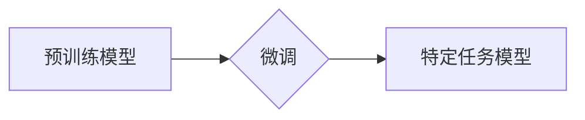

> 预训练模型，微调，深度学习，自然语言处理，计算机视觉，迁移学习，模型压缩

## 1. 背景介绍

深度学习近年来取得了令人瞩目的成就，在图像识别、自然语言处理、语音识别等领域取得了突破性的进展。这些成就很大程度上得益于预训练模型的出现。预训练模型是指在大量未标记数据上进行训练的深度学习模型，它已经学习到了一些通用的特征和知识，可以作为其他任务的起点，通过微调来适应特定任务的需求。

传统的深度学习模型需要在每个特定任务上进行大量的标注数据训练，这不仅耗时耗力，而且对于一些小规模数据集来说，效果可能并不理想。预训练模型的出现有效解决了这个问题，它可以利用海量未标记数据的优势，学习到更通用的特征表示，从而提高模型的泛化能力和效率。

## 2. 核心概念与联系

**2.1 预训练模型**

预训练模型是指在大量未标记数据上进行训练的深度学习模型。它通过学习数据的全局结构和模式，能够提取出更抽象、更通用的特征表示。

**2.2 微调**

微调是指在预训练模型的基础上，对模型进行进一步的训练，使其能够适应特定任务的需求。微调通常只需要少量标注数据，就可以有效地提高模型的性能。

**2.3 迁移学习**

迁移学习是指将已学习到的知识从一个任务迁移到另一个任务。预训练模型和微调技术是迁移学习的重要组成部分。

**2.4 流程图**



## 3. 核心算法原理 & 具体操作步骤

**3.1 算法原理概述**

预训练模型的训练目标通常是最大化模型对输入数据的预测能力，例如语言模型的目标是预测下一个词，图像分类模型的目标是预测图像的类别。

微调的过程则是通过调整预训练模型的参数，使其能够更好地适应特定任务的需求。

**3.2 算法步骤详解**

1. 选择合适的预训练模型：根据任务需求选择合适的预训练模型，例如语言模型、图像分类模型等。
2. 冻结预训练模型的某些层：为了防止模型参数发生过大的变化，通常会冻结预训练模型的某些层，只对最后一层或部分层进行微调。
3. 添加新的层：根据特定任务的需求，在预训练模型的基础上添加新的层，例如分类层、回归层等。
4. 使用少量标注数据进行微调：使用少量标注数据对模型进行微调，调整模型参数，使其能够更好地适应特定任务。
5. 评估模型性能：评估模型在特定任务上的性能，并根据需要进行进一步的微调。

**3.3 算法优缺点**

**优点：**

* 提高模型的泛化能力：预训练模型已经学习到了一些通用的特征表示，可以提高模型在不同数据集上的泛化能力。
* 减少训练数据需求：微调只需要少量标注数据，可以有效地减少训练数据需求。
* 提高训练效率：预训练模型已经训练好了，可以节省大量的训练时间。

**缺点：**

* 预训练模型的尺寸较大：预训练模型的尺寸较大，需要较大的内存和计算资源。
* 预训练模型可能不适合所有任务：预训练模型的训练目标可能与特定任务不完全一致，可能需要进行大量的修改才能适应特定任务。

**3.4 算法应用领域**

预训练模型和微调技术在各个领域都有广泛的应用，例如：

* 自然语言处理：文本分类、情感分析、机器翻译、问答系统等。
* 计算机视觉：图像分类、目标检测、图像分割等。
* 语音识别：语音识别、语音合成等。
* 其他领域：医疗诊断、金融预测、推荐系统等。

## 4. 数学模型和公式 & 详细讲解 & 举例说明

**4.1 数学模型构建**

预训练模型通常使用神经网络作为其数学模型。神经网络由多个层组成，每一层包含多个神经元。神经元之间通过权重连接，权重决定了神经元之间的传递强度。

**4.2 公式推导过程**

预训练模型的训练目标通常是最大化模型对输入数据的预测能力。例如，对于语言模型，训练目标是最大化预测下一个词的概率。

$$
\mathcal{L} = -\sum_{i=1}^{N} \log p(w_i | w_{<i})
$$

其中：

* $\mathcal{L}$ 是损失函数
* $N$ 是序列长度
* $w_i$ 是第 $i$ 个词
* $p(w_i | w_{<i})$ 是模型预测第 $i$ 个词的概率，给定前 $i-1$ 个词

**4.3 案例分析与讲解**

例如，BERT模型是一种基于Transformer架构的预训练语言模型。BERT模型使用Masked Language Modeling (MLM) 和 Next Sentence Prediction (NSP) 两种预训练任务。

* MLM 任务：随机掩盖输入文本中的某些词，然后让模型预测被掩盖词的词性。
* NSP 任务：给定两个句子，判断它们是否相邻。

通过这两个预训练任务，BERT模型可以学习到丰富的语言表示，并用于各种下游任务，例如文本分类、问答系统等。

## 5. 项目实践：代码实例和详细解释说明

**5.1 开发环境搭建**

使用Python 3.7+，PyTorch 1.7+ 或 TensorFlow 2.0+ 作为深度学习框架。

**5.2 源代码详细实现**

```python
import torch
import torch.nn as nn

class SimpleClassifier(nn.Module):
    def __init__(self, input_size, hidden_size, num_classes):
        super(SimpleClassifier, self).__init__()
        self.fc1 = nn.Linear(input_size, hidden_size)
        self.relu = nn.ReLU()
        self.fc2 = nn.Linear(hidden_size, num_classes)

    def forward(self, x):
        x = self.fc1(x)
        x = self.relu(x)
        x = self.fc2(x)
        return x

# 实例化模型
model = SimpleClassifier(input_size=10, hidden_size=5, num_classes=2)

# 定义损失函数和优化器
criterion = nn.CrossEntropyLoss()
optimizer = torch.optim.Adam(model.parameters(), lr=0.001)

# 训练模型
for epoch in range(10):
    # 前向传播
    outputs = model(inputs)
    loss = criterion(outputs, labels)

    # 反向传播
    optimizer.zero_grad()
    loss.backward()

    # 更新参数
    optimizer.step()

```

**5.3 代码解读与分析**

这段代码实现了简单的分类模型。模型包含两层全连接层，中间使用ReLU激活函数。

* `__init__` 方法初始化模型参数。
* `forward` 方法定义模型的前向传播过程。
* `criterion` 定义了损失函数，用于衡量模型预测结果与真实标签之间的差异。
* `optimizer` 定义了优化器，用于更新模型参数。
* 训练循环迭代训练模型，计算损失，反向传播梯度，更新参数。

**5.4 运行结果展示**

训练完成后，可以评估模型在测试集上的性能，例如计算准确率、召回率等指标。

## 6. 实际应用场景

**6.1 自然语言处理**

* 文本分类：情感分析、主题分类、垃圾邮件过滤等。
* 机器翻译：将一种语言翻译成另一种语言。
* 问答系统：根据用户的问题，从知识库中找到答案。

**6.2 计算机视觉**

* 图像分类：识别图像中的物体类别。
* 目标检测：定位图像中的物体，并识别其类别。
* 图像分割：将图像分割成不同的区域，每个区域代表不同的物体或场景。

**6.3 语音识别**

* 语音识别：将语音转换为文本。
* 语音合成：将文本转换为语音。

**6.4 其他领域**

* 医疗诊断：辅助医生诊断疾病。
* 金融预测：预测股票价格、信用风险等。
* 推荐系统：推荐用户感兴趣的商品或服务。

**6.5 未来应用展望**

预训练模型和微调技术在未来将有更广泛的应用，例如：

* 个性化学习：根据用户的学习风格和需求，定制个性化的学习内容。
* 自动代码生成：根据自然语言描述，自动生成代码。
* 自动写作：根据用户的需求，自动生成文章、报告等。

## 7. 工具和资源推荐

**7.1 学习资源推荐**

* **书籍:**
    * Deep Learning by Ian Goodfellow, Yoshua Bengio, and Aaron Courville
    * Hands-On Machine Learning with Scikit-Learn, Keras & TensorFlow by Aurélien Géron
* **课程:**
    * Stanford CS231n: Convolutional Neural Networks for Visual Recognition
    * Deep Learning Specialization by Andrew Ng on Coursera

**7.2 开发工具推荐**

* **深度学习框架:**
    * PyTorch
    * TensorFlow
* **数据处理工具:**
    * Pandas
    * NumPy

**7.3 相关论文推荐**

* BERT: Pre-training of Deep Bidirectional Transformers for Language Understanding
* GPT-3: Language Models are Few-Shot Learners
* Vision Transformer (ViT)

## 8. 总结：未来发展趋势与挑战

**8.1 研究成果总结**

预训练模型和微调技术取得了显著的进展，在各个领域都取得了突破性的成果。

**8.2 未来发展趋势**

* 更大的预训练模型：随着计算资源的不断发展，预训练模型的规模将不断扩大，学习到的知识将更加丰富。
* 更广泛的应用场景：预训练模型和微调技术将应用于更多领域，例如医疗、教育、金融等。
* 更高效的训练方法：研究人员将继续探索更有效的预训练和微调方法，提高模型的训练效率和性能。

**8.3 面临的挑战**

* 模型可解释性：预训练模型的决策过程往往难以理解，这限制了其在一些安全关键领域中的应用。
* 数据偏见：预训练模型的训练数据可能存在偏见，导致模型在某些群体上表现不佳。
* 计算资源需求：训练大型预训练模型需要大量的计算资源，这对于一些资源有限的机构来说是一个挑战。

**8.4 研究展望**

未来研究将集中在以下几个方面：

* 提高模型的可解释性。
* 减少模型的训练数据需求。
* 开发更有效的预训练和微调方法。
* 探索预训练模型在更多领域中的应用。

## 9. 附录：常见问题与解答

**9.1 如何选择合适的预训练模型？**

选择合适的预训练模型取决于具体的任务需求。例如，对于文本分类任务，可以选择BERT、RoBERTa等预训练语言模型；对于图像分类任务，可以选择ResNet、EfficientNet等预训练图像模型。

**9.2 如何进行微调？**

微调的过程通常包括以下步骤：

1. 选择合适的预训练模型。
2. 冻结预训练模型的某些层。
3. 添加新的层。
4. 使用少量标注数据进行训练。

**9.3 预训练模型的训练数据来源？**

预训练模型的训练数据通常来自公开的文本或图像数据集，例如维基百科、Common Crawl、ImageNet等。

作者：禅与计算机程序设计艺术 / Zen and the Art of Computer Programming


<end_of_turn>