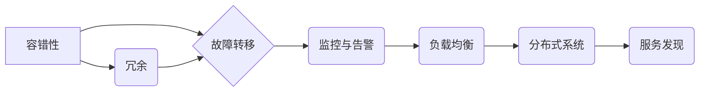

> 高可用性系统，容错设计，冗余机制，故障转移，监控与告警，负载均衡，分布式系统，服务发现

## 1. 背景介绍

在当今数字化时代，高可用性系统已成为企业核心业务的基石。用户对服务的期望越来越高，对系统稳定性和可靠性的要求也越来越严格。一旦系统出现故障，将导致业务中断、数据丢失、声誉受损等严重后果。因此，设计高可用性系统，确保系统能够持续稳定运行，成为企业IT架构的重要课题。

高可用性系统是指能够在发生故障或部分组件失效的情况下，仍然能够正常运行，并提供预期的服务质量的系统。其核心目标是最大程度地减少系统停机时间，提高系统可靠性和稳定性。

## 2. 核心概念与联系

高可用性系统的设计需要考虑多个核心概念和技术，这些概念相互关联，共同构成高可用性系统的架构和设计策略。

**2.1 核心概念**

* **容错性 (Fault Tolerance):** 系统能够识别和处理故障，并继续正常运行的能力。
* **冗余 (Redundancy):**  通过备份关键组件，确保系统即使部分组件失效也能继续运行。
* **故障转移 (Failover):** 当一个组件发生故障时，自动将工作负载转移到备用组件的能力。
* **监控与告警 (Monitoring & Alerting):**  实时监控系统状态，并及时发出告警，以便快速发现和解决问题。
* **负载均衡 (Load Balancing):** 将请求分发到多个服务器，避免单个服务器过载，提高系统吞吐量和响应速度。
* **分布式系统 (Distributed System):** 将系统分解成多个独立的组件，分布在不同的物理节点上，提高系统的扩展性和容错性。
* **服务发现 (Service Discovery):**  系统组件之间自动发现和注册服务，方便动态配置和故障转移。

**2.2 架构关系**



## 3. 核心算法原理 & 具体操作步骤

### 3.1 算法原理概述

高可用性系统的设计需要考虑多种算法和策略，例如：

* **一致性哈希算法 (Consistent Hashing):** 用于分布式系统中服务发现和负载均衡，保证数据分布均匀，提高系统性能和容错性。
* **Paxos算法 (Paxos):** 用于分布式系统中实现强一致性，解决多个节点之间数据同步和冲突问题。
* **Raft算法 (Raft):**  一种更易于理解和实现的分布式一致性算法，用于选举领导节点和保证数据一致性。

### 3.2 算法步骤详解

以一致性哈希算法为例，其具体步骤如下：

1. **虚拟节点:** 将每个服务器映射到多个虚拟节点，每个虚拟节点对应一个哈希值。
2. **环形结构:** 将所有虚拟节点按照哈希值排序，形成一个环形结构。
3. **数据分配:** 将数据按照哈希值分配到对应的虚拟节点上，每个虚拟节点负责存储和处理一部分数据。
4. **节点加入和离开:** 当新节点加入或现有节点离开时，需要重新计算哈希值，并调整数据分配，保证数据分布均匀。

### 3.3 算法优缺点

**一致性哈希算法的优点:**

* 数据分布均匀，提高系统性能和容错性。
* 节点加入和离开操作简单，不会导致大量数据迁移。

**一致性哈希算法的缺点:**

* 算法复杂度较高，需要一定的计算资源。
* 当节点数量较多时，哈希环的规模会很大，可能会影响性能。

### 3.4 算法应用领域

一致性哈希算法广泛应用于分布式系统中，例如：

* **缓存系统:**  将缓存数据分配到不同的服务器上，提高缓存命中率和吞吐量。
* **数据库系统:**  将数据分片到不同的服务器上，提高数据库的读写性能和容错性。
* **消息队列:**  将消息分配到不同的队列上，提高消息处理效率和可靠性。

## 4. 数学模型和公式 & 详细讲解 & 举例说明

### 4.1 数学模型构建

高可用性系统的设计可以利用数学模型来分析和优化系统性能。例如，可以使用马尔可夫链模型来分析系统故障概率和恢复时间，可以使用 queuing theory 来分析系统吞吐量和延迟。

### 4.2 公式推导过程

以马尔可夫链模型为例，其状态转移概率矩阵可以表示为：

$$
P = \begin{bmatrix}
p_{00} & p_{01} & \cdots & p_{0n} \\
p_{10} & p_{11} & \cdots & p_{1n} \\
\vdots & \vdots & \ddots & \vdots \\
p_{n0} & p_{n1} & \cdots & p_{nn}
\end{bmatrix}
$$

其中，$p_{ij}$ 表示从状态 $i$ 转移到状态 $j$ 的概率。

### 4.3 案例分析与讲解

假设一个系统有两种状态：正常运行 (0) 和故障 (1)。

* $p_{00}$ 表示系统从正常状态转移到正常状态的概率。
* $p_{01}$ 表示系统从正常状态转移到故障状态的概率。
* $p_{10}$ 表示系统从故障状态转移到正常状态的概率。
* $p_{11}$ 表示系统从故障状态转移到故障状态的概率。

通过分析这些概率，可以计算出系统在不同时间段内处于正常状态或故障状态的概率，从而评估系统的可靠性和可用性。

## 5. 项目实践：代码实例和详细解释说明

### 5.1 开发环境搭建

* 操作系统: Ubuntu 20.04 LTS
* 编程语言: Python 3.8
* 框架: Flask

### 5.2 源代码详细实现

```python
from flask import Flask, request, jsonify

app = Flask(__name__)

# 模拟数据库
data = {}

@app.route('/data/<key>', methods=['GET'])
def get_data(key):
    return jsonify(data.get(key, None))

@app.route('/data/<key>', methods=['POST'])
def set_data(key):
    value = request.json.get('value')
    data[key] = value
    return jsonify({'message': 'Data updated successfully'})

if __name__ == '__main__':
    app.run(host='0.0.0.0', port=5000)
```

### 5.3 代码解读与分析

* 该代码实现了一个简单的 RESTful API，用于存储和获取键值对数据。
* 使用 Flask 框架简化了 API 的开发。
* 模拟数据库使用字典存储数据，方便演示。
* GET 请求用于获取数据，POST 请求用于设置数据。

### 5.4 运行结果展示

* 启动服务后，访问 `http://localhost:5000/data/key` 可以获取对应 key 的数据。
* 发送 POST 请求到 `http://localhost:5000/data/key`，并携带 `value` 参数，可以设置对应 key 的数据。

## 6. 实际应用场景

高可用性系统在各个领域都有广泛的应用，例如：

* **电商平台:**  确保电商平台能够持续稳定运行，提供流畅的购物体验，避免交易失败和数据丢失。
* **金融系统:**  保障金融系统的安全性和可靠性，防止资金损失和系统崩溃。
* **社交媒体:**  保证社交媒体平台的稳定运行，避免用户数据丢失和服务中断。
* **云计算平台:**  提供高可用性的云计算服务，确保用户数据和应用程序的可靠性。

### 6.4 未来应用展望

随着云计算、大数据、人工智能等技术的快速发展，高可用性系统将面临新的挑战和机遇。未来，高可用性系统将更加智能化、自动化、分布式化，并更加注重用户体验和数据安全。

## 7. 工具和资源推荐

### 7.1 学习资源推荐

* **书籍:**
    * 《Designing Data-Intensive Applications》 by Martin Kleppmann
    * 《High Availability Design Patterns》 by Michael T. Nygard
* **在线课程:**
    * Coursera: Distributed Systems
    * Udemy: Building Highly Available Systems

### 7.2 开发工具推荐

* **监控工具:** Prometheus, Grafana
* **负载均衡工具:** Nginx, HAProxy
* **容器化平台:** Docker, Kubernetes

### 7.3 相关论文推荐

* **Paxos Made Live: An Engineering Perspective** by Leslie Lamport
* **The Raft Consensus Algorithm** by Diego Ongaro and John Ousterhout

## 8. 总结：未来发展趋势与挑战

### 8.1 研究成果总结

高可用性系统的设计已经取得了显著的成果，各种容错机制、故障转移策略和监控工具不断涌现，使得系统能够更加可靠和稳定。

### 8.2 未来发展趋势

* **微服务架构:** 将系统分解成多个独立的服务，提高系统的可扩展性和容错性。
* **Serverless 架构:** 将服务器管理的责任卸载到云平台，简化系统部署和维护。
* **人工智能:** 利用人工智能技术进行系统故障预测和自动修复。

### 8.3 面临的挑战

* **复杂性:** 高可用性系统的设计越来越复杂，需要更深入的理解和设计经验。
* **成本:** 实现高可用性系统需要投入更多的硬件资源和人力成本。
* **安全:** 高可用性系统需要更加注重安全防护，防止攻击和数据泄露。

### 8.4 研究展望

未来，高可用性系统研究将更加注重以下方面:

* **自动化:** 自动化系统部署、配置和故障恢复，降低运维成本和风险。
* **智能化:** 利用人工智能技术进行系统故障预测和自动修复，提高系统可靠性和可用性。
* **可持续性:** 设计更加节能环保的高可用性系统，降低对环境的影响。

## 9. 附录：常见问题与解答

* **什么是高可用性系统？**

高可用性系统是指能够在发生故障或部分组件失效的情况下，仍然能够正常运行，并提供预期的服务质量的系统。

* **高可用性系统有哪些核心技术？**

高可用性系统的设计需要考虑多种核心技术，例如容错性、冗余、故障转移、监控与告警、负载均衡、分布式系统和服务发现。

* **如何评估高可用性系统的性能？**

可以使用多种指标来评估高可用性系统的性能，例如系统停机时间、故障恢复时间、吞吐量、延迟和可用性。

* **如何设计一个高可用性系统？**

设计一个高可用性系统需要考虑多个因素，例如系统架构、组件选择、容错机制、故障转移策略、监控与告警机制和负载均衡策略。

* **高可用性系统有哪些应用场景？**

高可用性系统广泛应用于各个领域，例如电商平台、金融系统、社交媒体、云计算平台等。


作者：禅与计算机程序设计艺术 / Zen and the Art of Computer Programming 
<end_of_turn>