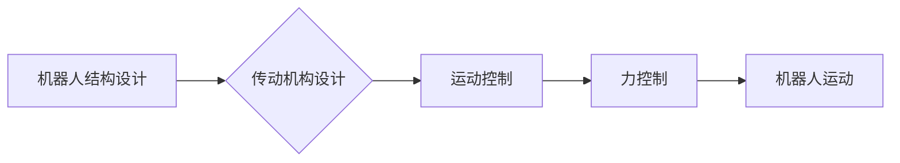

> 机器人结构设计，传动机构设计，高性能，高可靠性，冗余设计，运动控制，力控制，伺服电机，编码器，机械臂，机器人应用

## 1. 背景介绍

随着人工智能、物联网和自动化技术的快速发展，机器人技术已成为推动社会进步的重要力量。机器人应用领域不断拓展，从工业生产到服务业、医疗保健、探索领域，机器人扮演着越来越重要的角色。然而，高性能和高可靠性是机器人技术发展的关键瓶颈。

高性能机器人要求具有快速、精确、灵活的运动能力，能够完成复杂的任务。高可靠性机器人则需要能够在恶劣环境下稳定运行，并具有较强的故障容错能力。

## 2. 核心概念与联系

机器人结构设计和传动机构设计是实现高性能和高可靠性的关键环节。

**2.1 机器人结构设计**

机器人结构设计是指确定机器人各个部件的形状、尺寸、材料和连接方式，以满足其功能需求和性能要求。

**2.2 传动机构设计**

传动机构设计是指选择和设计机器人运动部件的驱动和控制系统，以实现机器人所需的运动轨迹和精度。

**2.3 核心概念联系**

机器人结构设计和传动机构设计相互关联，共同决定了机器人的运动性能和可靠性。

* **结构设计影响传动机构:** 机器人的结构设计会影响传动机构的安装空间、负载能力和运动范围。
* **传动机构影响结构设计:** 传动机构的类型和性能会影响机器人结构的设计方案。

**2.4 Mermaid 流程图**



## 3. 核心算法原理 & 具体操作步骤

**3.1 算法原理概述**

机器人运动控制算法是实现机器人运动精度的关键技术。常用的运动控制算法包括：

* **位置控制:** 根据目标位置指令，控制机器人关节角度，使机器人末端达到目标位置。
* **速度控制:** 根据目标速度指令，控制机器人关节速度，使机器人末端以目标速度运动。
* **加速度控制:** 根据目标加速度指令，控制机器人关节加速度，使机器人末端以目标加速度运动。

**3.2 算法步骤详解**

**位置控制算法步骤:**

1. **获取目标位置指令:** 从上位机接收目标位置指令。
2. **计算关节角度:** 根据机器人运动学模型，计算出达到目标位置所需的关节角度。
3. **生成控制信号:** 根据计算出的关节角度，生成控制信号，驱动伺服电机。
4. **反馈控制:** 通过编码器获取关节实际角度，与目标角度进行比较，并根据误差调整控制信号，实现位置跟踪。

**3.3 算法优缺点**

**位置控制算法优点:**

* 控制精度高。
* 实现简单。

**位置控制算法缺点:**

* 对负载变化敏感。
* 对环境干扰敏感。

**3.4 算法应用领域**

位置控制算法广泛应用于工业机器人、医疗机器人、服务机器人等领域。

## 4. 数学模型和公式 & 详细讲解 & 举例说明

**4.1 数学模型构建**

机器人运动学模型描述了机器人关节角度与末端位置之间的关系。常用的机器人运动学模型包括：

* **正运动学:** 给定关节角度，计算末端位置。
* **逆运动学:** 给定末端位置，计算关节角度。

**4.2 公式推导过程**

正运动学公式推导过程较为复杂，需要根据机器人结构参数和关节类型进行推导。

**4.3 案例分析与讲解**

假设一个具有两个关节的机器人，关节1和关节2分别绕X轴和Y轴旋转。

* **关节1角度:** $\theta_1$
* **关节2角度:** $\theta_2$
* **末端位置:** $(x, y)$

正运动学公式为:

$$
x = l_1 \cos(\theta_1) + l_2 \cos(\theta_1 + \theta_2)
$$

$$
y = l_1 \sin(\theta_1) + l_2 \sin(\theta_1 + \theta_2)
$$

其中，$l_1$和$l_2$分别为关节1和关节2的长度。

## 5. 项目实践：代码实例和详细解释说明

**5.1 开发环境搭建**

* 操作系统: Ubuntu 20.04
* 编程语言: Python
* 机器人控制库: ROS (Robot Operating System)

**5.2 源代码详细实现**

```python
import rospy
from geometry_msgs.msg import Pose

# 定义机器人末端位置
def move_to_pose(x, y):
    pose = Pose()
    pose.position.x = x
    pose.position.y = y
    # 发布目标位置指令
    pub.publish(pose)

# 初始化节点
rospy.init_node('robot_control')
# 获取目标位置指令
x = float(input("请输入目标X坐标: "))
y = float(input("请输入目标Y坐标: "))
# 移动到目标位置
move_to_pose(x, y)
```

**5.3 代码解读与分析**

* 该代码使用ROS框架发布目标位置指令。
* `move_to_pose()`函数接收目标位置坐标，并创建`Pose`消息对象，发布到指定话题。
* 用户输入目标位置坐标，程序调用`move_to_pose()`函数实现机器人运动。

**5.4 运行结果展示**

运行该代码后，机器人将按照用户输入的坐标移动到目标位置。

## 6. 实际应用场景

高性能和高可靠性的机器人应用场景广泛，包括：

* **工业自动化:** 机器人用于自动化生产线，提高生产效率和产品质量。
* **医疗保健:** 机器人用于手术辅助、康复治疗、药物配送等，提高医疗效率和安全性。
* **服务业:** 机器人用于餐饮服务、零售服务、酒店服务等，提高服务质量和效率。
* **探索领域:** 机器人用于太空探索、深海探测、灾害救援等，拓展人类探索范围。

**6.4 未来应用展望**

随着人工智能、物联网和机器人技术的不断发展，机器人将更加智能化、协作化和人性化，在更多领域发挥重要作用。

## 7. 工具和资源推荐

**7.1 学习资源推荐**

* **书籍:**
    * 《机器人学导论》
    * 《机器人控制》
* **在线课程:**
    * Coursera: 机器人学
    * edX: 机器人技术

**7.2 开发工具推荐**

* **ROS (Robot Operating System):** 开源机器人操作系统，提供丰富的工具和库，用于机器人开发和控制。
* **Gazebo:** 开源机器人仿真软件，用于模拟机器人运动和环境交互。

**7.3 相关论文推荐**

* **高性能机器人控制算法研究进展**
* **冗余设计在机器人可靠性中的应用**

## 8. 总结：未来发展趋势与挑战

**8.1 研究成果总结**

本文介绍了高性能和高可靠性机器人的结构设计和传动机构设计，并探讨了相关的算法原理、数学模型和代码实现。

**8.2 未来发展趋势**

* **人工智能驱动的机器人:** 机器人将更加智能化，能够自主学习和决策。
* **协作式机器人:** 机器人将与人类协作工作，提高工作效率和安全性。
* **柔性机器人:** 机器人将更加柔韧化，能够适应复杂环境和任务需求。

**8.3 面临的挑战**

* **算法复杂度:** 高性能和高可靠性的机器人算法设计面临着更高的复杂度挑战。
* **硬件限制:** 机器人硬件性能的提升需要突破材料科学和制造技术。
* **安全性和伦理问题:** 机器人技术的应用需要解决安全性和伦理问题。

**8.4 研究展望**

未来研究将重点关注人工智能、柔性机器人、协作式机器人等领域，推动机器人技术向更高性能、更高可靠性、更智能化方向发展。

## 9. 附录：常见问题与解答

**9.1 机器人运动精度如何提高？**

机器人运动精度可以通过以下方式提高:

* 使用高精度伺服电机和编码器。
* 优化机器人结构设计，减少运动误差。
* 采用先进的运动控制算法，提高控制精度。

**9.2 如何提高机器人的可靠性？**

机器人的可靠性可以通过以下方式提高:

* 使用高可靠性的机械部件和电子元件。
* 设计冗余系统，提高故障容错能力。
* 定期维护和保养机器人，及时发现和修复故障。


作者：禅与计算机程序设计艺术 / Zen and the Art of Computer Programming 
<end_of_turn>