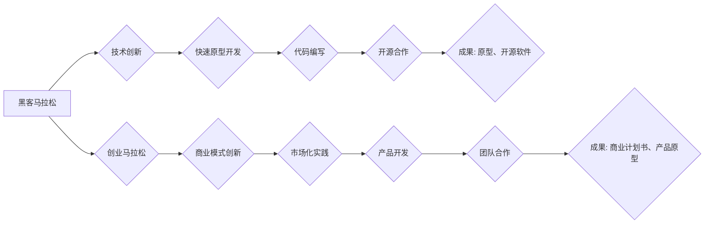

> 黑客马拉松，创业马拉松，创新，技术，商业化，团队合作，时间管理，产品开发

## 1. 背景介绍

在当今科技飞速发展的时代，黑客马拉松和创业马拉松已成为推动创新和商业化发展的重要引擎。这两类活动，虽然名称相似，但目标、流程和最终成果却截然不同。黑客马拉松侧重于技术创新，强调快速原型开发和代码编写；而创业马拉松则更注重商业模式的探索和产品市场化的实践。

黑客马拉松起源于科技圈，旨在聚集一群技术爱好者和开发者，在短时间内共同开发软件项目。参与者通常来自不同的背景和专业领域，通过协作和竞争，展现他们的技术实力和创意。黑客马拉松的成果往往是概念性较强的原型或开源软件，为技术创新提供了一个平台和机会。

创业马拉松则更注重商业价值的创造。它吸引了创业者、投资者、导师和企业代表等多方参与，旨在通过团队合作和市场调研，将创意转化为可行的商业模式和产品。创业马拉松的最终目标是孵化出具有市场竞争力的新产品或服务，并推动其商业化落地。

## 2. 核心概念与联系

黑客马拉松和创业马拉松虽然目标不同，但它们之间存在着密切的联系。

**黑客马拉松**

* **核心概念:** 技术创新、快速原型开发、代码编写、开源合作
* **流程:** 
    * 团队组建
    * 想法征集
    * 技术方案设计
    * 代码开发
    * 项目展示
* **成果:** 原型、开源软件、技术解决方案

**创业马拉松**

* **核心概念:** 商业模式创新、市场化实践、产品开发、团队合作
* **流程:**
    * 团队组建
    * 问题识别
    * 商业模式设计
    * 产品原型开发
    * 市场调研
    * 投资推介
* **成果:** 商业计划书、产品原型、投资机会

**联系:**

黑客马拉松的成果可以为创业马拉松提供技术基础，而创业马拉松的商业模式和市场需求可以为黑客马拉松提供方向和目标。两者相互补充，共同推动科技创新和商业化发展。

**Mermaid 流程图:**



## 3. 核心算法原理 & 具体操作步骤

### 3.1  算法原理概述

黑客马拉松和创业马拉松的成功离不开高效的算法和流程设计。

**黑客马拉松:**

* **算法:** 敏捷开发、迭代开发、Scrum框架
* **原理:** 强调快速迭代、持续反馈和团队协作，以提高开发效率和产品质量。

**创业马拉松:**

* **算法:** Lean Startup、Design Thinking
* **原理:** 强调快速验证假设、迭代产品和用户反馈，以降低风险和提高产品市场化成功率。

### 3.2  算法步骤详解

**黑客马拉松:**

1. **团队组建:** 聚集具有不同技能和经验的开发者。
2. **想法征集:** 团队成员共同提出项目创意和技术方案。
3. **技术方案设计:** 选择合适的技术栈和开发框架，设计项目架构和功能模块。
4. **代码开发:** 按照设计方案进行代码编写和测试，并进行持续集成和部署。
5. **项目展示:** 在马拉松结束时，团队成员展示项目成果并进行评判。

**创业马拉松:**

1. **团队组建:** 聚集创业者、投资者、导师和企业代表等多方参与。
2. **问题识别:** 团队成员共同识别市场痛点和用户需求。
3. **商业模式设计:** 设计可行的商业模式和收入来源。
4. **产品原型开发:** 开发产品原型，并进行用户测试和反馈收集。
5. **市场调研:** 对目标市场进行深入调研，分析竞争对手和市场趋势。
6. **投资推介:** 在马拉松结束时，团队成员向投资者进行项目推介。

### 3.3  算法优缺点

**黑客马拉松:**

* **优点:** 
    * 促进技术创新和交流
    * 提升开发者技能和经验
    * 提供开源软件和技术解决方案
* **缺点:** 
    * 成果商业化难度大
    * 项目缺乏长期规划和维护

**创业马拉松:**

* **优点:** 
    * 促进商业模式创新和市场化
    * 帮助创业者获得资源和支持
    * 缩短产品上市时间
* **缺点:** 
    * 竞争激烈，成功率较低
    * 需要具备一定的商业经验和市场敏感度

### 3.4  算法应用领域

**黑客马拉松:**

* 软件开发
* 数据科学
* 人工智能
* 区块链技术

**创业马拉松:**

* 互联网创业
* 移动互联网
* 金融科技
* 生物科技

## 4. 数学模型和公式 & 详细讲解 & 举例说明

### 4.1  数学模型构建

黑客马拉松和创业马拉松的成功可以看作是一个复杂的系统优化问题。我们可以使用数学模型来描述系统中的各个要素和相互关系，并通过优化算法来寻找最佳的解决方案。

**黑客马拉松:**

* **模型:** 团队效率模型
* **变量:** 团队规模、成员技能、沟通效率、代码质量
* **目标:** 提高团队开发效率，缩短项目开发时间

**创业马拉松:**

* **模型:** 商业模式可行性模型
* **变量:** 市场需求、竞争对手、成本结构、收入模式
* **目标:** 提高商业模式可行性，降低创业风险

### 4.2  公式推导过程

**团队效率模型:**

$$
效率 = \frac{产出}{投入}
$$

其中，产出指团队完成的开发任务量，投入指团队投入的时间和资源。

**商业模式可行性模型:**

$$
可行性 = \frac{收入 - 成本}{市场规模}
$$

其中，收入指产品的销售收入，成本指产品的开发和运营成本，市场规模指目标市场的潜在用户数量。

### 4.3  案例分析与讲解

**黑客马拉松案例:**

假设一个团队有5名成员，每个成员的技能水平相同，团队沟通效率较高，代码质量较高。根据团队效率模型，我们可以推断出该团队的开发效率较高。

**创业马拉松案例:**

假设一个创业团队的产品市场需求大，竞争对手较少，成本结构低，收入模式清晰。根据商业模式可行性模型，我们可以推断出该团队的商业模式具有较高的可行性。

## 5. 项目实践：代码实例和详细解释说明

### 5.1  开发环境搭建

黑客马拉松和创业马拉松的开发环境搭建需要根据项目的具体需求进行配置。一般来说，需要准备以下软件和工具：

* **代码编辑器:** VS Code、Sublime Text、Atom
* **版本控制系统:** Git、GitHub
* **数据库:** MySQL、MongoDB
* **云平台:** AWS、Azure、GCP

### 5.2  源代码详细实现

以下是一个简单的黑客马拉松项目代码实例，用于演示一个简单的在线投票系统：

```python
from flask import Flask, render_template, request

app = Flask(__name__)

votes = {}

@app.route("/", methods=["GET", "POST"])
def index():
    if request.method == "POST":
        choice = request.form["choice"]
        if choice in votes:
            votes[choice] += 1
        else:
            votes[choice] = 1
        return render_template("index.html", votes=votes)
    else:
        return render_template("index.html", votes=votes)

if __name__ == "__main__":
    app.run(debug=True)
```

**代码解释:**

* 使用Flask框架构建一个简单的Web应用程序。
* 使用字典`votes`存储投票结果。
* `index()`函数处理用户投票请求，并将投票结果更新到`votes`字典中。
* `render_template()`函数渲染HTML模板，并将投票结果传递给模板。

### 5.3  代码解读与分析

* 该代码示例展示了如何使用Flask框架构建一个简单的Web应用程序。
* 投票系统使用字典存储投票结果，方便统计和展示。
* 代码简洁易懂，易于理解和修改。

### 5.4  运行结果展示

运行该代码后，可以访问`http://127.0.0.1:5000/`，看到一个简单的在线投票页面。用户可以选择投票选项，提交后投票结果会实时更新。

## 6. 实际应用场景

### 6.1  黑客马拉松应用场景

* **开源软件开发:** 黑客马拉松可以促进开源软件的开发和维护，为开发者提供一个交流和合作的平台。
* **技术创新挑战:** 黑客马拉松可以作为技术创新挑战的平台，鼓励开发者探索新的技术和解决方案。
* **企业内部技术培训:** 企业可以组织内部黑客马拉松，提高员工的技术技能和创新能力。

### 6.2  创业马拉松应用场景

* **新产品孵化:** 创业马拉松可以帮助创业者快速验证产品概念，并获得投资和资源支持。
* **市场调研和用户反馈:** 创业马拉松可以为创业者提供一个收集用户反馈和市场调研的机会。
* **商业模式创新:** 创业马拉松可以鼓励创业者探索新的商业模式和收入来源。

### 6.4  未来应用展望

黑客马拉松和创业马拉松将继续在科技创新和商业化发展中发挥重要作用。未来，随着人工智能、大数据和云计算等技术的不断发展，黑客马拉松和创业马拉松将更加注重跨学科合作、数据驱动和智能化应用。

## 7. 工具和资源推荐

### 7.1  学习资源推荐

* **在线课程:** Coursera、edX、Udemy
* **技术博客:** Hacker News、Medium、GitHub Blog
* **开源社区:** GitHub、Stack Overflow

### 7.2  开发工具推荐

* **代码编辑器:** VS Code、Sublime Text、Atom
* **版本控制系统:** Git、GitHub
* **云平台:** AWS、Azure、GCP

### 7.3  相关论文推荐

* **黑客马拉松:** "Hackathons: A Review of the Literature"
* **创业马拉松:** "Lean Startup" by Eric Ries

## 8. 总结：未来发展趋势与挑战

### 8.1  研究成果总结

黑客马拉松和创业马拉松已经成为推动科技创新和商业化发展的重要引擎。通过团队合作、快速迭代和市场验证，它们帮助开发者和创业者将创意转化为现实。

### 8.2  未来发展趋势

* **跨学科合作:** 黑客马拉松和创业马拉松将更加注重跨学科合作，融合不同领域的知识和技能。
* **数据驱动:** 数据分析和机器学习将被更加广泛地应用于黑客马拉松和创业马拉松的各个环节。
* **智能化应用:** 人工智能和自动化技术将被用于优化黑客马拉松和创业马拉松的流程和效率。

### 8.3  面临的挑战

* **人才短缺:** 黑客马拉松和创业马拉松需要大量具备创新能力和实践经验的人才。
* **商业化难度