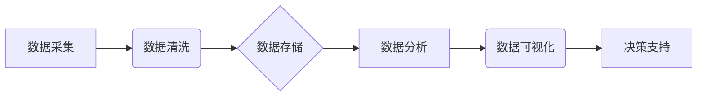

> AI DMP, 数据基建, 数据分析, 洞察, 数据驱动, 决策支持, 机器学习, 深度学习, 数据可视化

## 1. 背景介绍

在当今数据爆炸的时代，企业积累了海量的数据资产，如何有效地挖掘这些数据价值，转化为可操作的洞察，成为企业竞争力的关键。AI DMP（人工智能数据管理平台）应运而生，它通过人工智能技术，对企业数据进行智能分析、管理和洞察，为企业决策提供数据驱动的支持。

传统的DMP（数据管理平台）主要依靠规则引擎和人工干预，难以应对海量数据和复杂业务场景的挑战。而AI DMP则利用机器学习、深度学习等人工智能技术，实现数据自动分析、智能分类、个性化推荐等功能，能够更深入地挖掘数据价值，为企业提供更精准的洞察。

## 2. 核心概念与联系

**2.1 AI DMP 的核心概念**

* **数据采集:** 从各种数据源（例如网站、APP、CRM系统等）收集数据。
* **数据清洗:** 对收集到的数据进行清洗、转换和标准化，确保数据质量。
* **数据存储:** 将清洗后的数据存储在高效的数据库中。
* **数据分析:** 利用机器学习、深度学习等算法对数据进行分析，发现数据中的模式和趋势。
* **数据可视化:** 将分析结果以图表、报表等形式展示，方便用户理解和决策。

**2.2 AI DMP 的架构**



**2.3 AI DMP 与其他技术的联系**

AI DMP 与其他技术密切相关，例如：

* **大数据技术:** AI DMP 需要处理海量数据，大数据技术为其提供了强大的数据处理能力。
* **云计算技术:** AI DMP 可以部署在云平台上，利用云计算的弹性、可扩展性等优势。
* **人工智能技术:** AI DMP 的核心功能是利用人工智能技术进行数据分析和洞察。

## 3. 核心算法原理 & 具体操作步骤

**3.1 算法原理概述**

AI DMP 中常用的算法包括：

* **机器学习算法:** 
    * **分类算法:** 用于将数据分类到不同的类别，例如用户画像、产品推荐等。
    * **回归算法:** 用于预测连续值，例如用户购买金额、网站访问量等。
    * **聚类算法:** 用于将数据聚类到不同的组，例如用户行为分析、市场细分等。
* **深度学习算法:** 
    * **卷积神经网络 (CNN):** 用于图像识别、视频分析等。
    * **循环神经网络 (RNN):** 用于自然语言处理、时间序列分析等。

**3.2 算法步骤详解**

以机器学习中的分类算法为例，其步骤如下：

1. **数据准备:** 收集、清洗、转换数据，并将其分为训练集、验证集和测试集。
2. **模型选择:** 根据数据特点和业务需求选择合适的分类算法。
3. **模型训练:** 使用训练集训练模型，调整模型参数，使模型能够准确地分类数据。
4. **模型评估:** 使用验证集评估模型的性能，选择性能最好的模型。
5. **模型测试:** 使用测试集测试模型的性能，评估模型在实际应用中的效果。
6. **模型部署:** 将训练好的模型部署到生产环境中，用于实际数据分类。

**3.3 算法优缺点**

不同的算法具有不同的优缺点，需要根据具体情况选择合适的算法。

* **机器学习算法:** 
    * **优点:** 能够自动学习数据模式，无需人工特征工程。
    * **缺点:** 对数据质量要求较高，需要大量的训练数据。
* **深度学习算法:** 
    * **优点:** 能够学习更复杂的特征，性能更优异。
    * **缺点:** 对硬件资源要求较高，训练时间较长。

**3.4 算法应用领域**

AI DMP 的算法应用领域广泛，例如：

* **用户画像:** 根据用户行为、偏好等数据，构建用户画像，进行精准营销。
* **产品推荐:** 根据用户历史行为、兴趣等数据，推荐用户可能感兴趣的产品。
* **风险控制:** 根据用户行为、交易数据等，识别潜在的风险，进行风险控制。
* **市场分析:** 分析市场趋势、用户需求等，为企业决策提供数据支持。

## 4. 数学模型和公式 & 详细讲解 & 举例说明

**4.1 数学模型构建**

在 AI DMP 中，常用的数学模型包括：

* **线性回归模型:** 用于预测连续值，例如用户购买金额。
* **逻辑回归模型:** 用于分类数据，例如用户是否会购买产品。
* **支持向量机 (SVM):** 用于分类和回归，能够处理高维数据。

**4.2 公式推导过程**

以线性回归模型为例，其目标是找到一条直线，使得预测值与真实值之间的误差最小。

* **损失函数:** 均方误差 (MSE)
$$MSE = \frac{1}{n} \sum_{i=1}^{n} (y_i - \hat{y}_i)^2$$
* **参数更新:** 使用梯度下降算法更新模型参数。

**4.3 案例分析与讲解**

假设我们想要预测用户的购买金额，可以使用线性回归模型。

* **特征:** 用户年龄、收入、购买历史等。
* **目标变量:** 购买金额。
* **模型训练:** 使用训练数据训练线性回归模型，找到最佳的模型参数。
* **模型预测:** 使用训练好的模型预测新用户的购买金额。

## 5. 项目实践：代码实例和详细解释说明

**5.1 开发环境搭建**

* **操作系统:** Linux 或 Windows
* **编程语言:** Python
* **库依赖:** scikit-learn, pandas, numpy等

**5.2 源代码详细实现**

```python
import pandas as pd
from sklearn.linear_model import LinearRegression

# 加载数据
data = pd.read_csv('purchase_data.csv')

# 划分训练集和测试集
X = data[['age', 'income', 'purchase_history']]
y = data['purchase_amount']
from sklearn.model_selection import train_test_split
X_train, X_test, y_train, y_test = train_test_split(X, y, test_size=0.2, random_state=42)

# 创建线性回归模型
model = LinearRegression()

# 训练模型
model.fit(X_train, y_train)

# 预测测试集数据
y_pred = model.predict(X_test)

# 评估模型性能
from sklearn.metrics import mean_squared_error
mse = mean_squared_error(y_test, y_pred)
print(f'Mean Squared Error: {mse}')
```

**5.3 代码解读与分析**

* 代码首先加载数据，并划分训练集和测试集。
* 然后创建线性回归模型，并使用训练集训练模型。
* 接着使用训练好的模型预测测试集数据，并评估模型性能。

**5.4 运行结果展示**

运行代码后，会输出模型的均方误差 (MSE) 值，该值越小，模型的预测性能越好。

## 6. 实际应用场景

AI DMP 在各个行业都有广泛的应用场景，例如：

* **电商:** 用户画像、产品推荐、精准营销、风险控制等。
* **金融:** 风险评估、欺诈检测、客户服务等。
* **医疗:** 疾病诊断、药物研发、患者管理等。
* **教育:** 个性化学习、学生评估、教学优化等。

**6.4 未来应用展望**

随着人工智能技术的不断发展，AI DMP 将会有更广泛的应用场景，例如：

* **更精准的个性化推荐:** 利用深度学习算法，对用户行为进行更深入的分析，提供更精准的个性化推荐。
* **更智能的自动化决策:** 利用机器学习算法，自动完成一些决策任务，例如自动审批、自动客服等。
* **更深入的数据洞察:** 利用人工智能技术，挖掘更深层次的数据洞察，帮助企业更好地理解市场趋势和用户需求。

## 7. 工具和资源推荐

**7.1 学习资源推荐**

* **书籍:**
    * 《Python机器学习》
    * 《深度学习》
* **在线课程:**
    * Coursera: 机器学习
    * edX: 深度学习
* **博客:**
    * Towards Data Science
    * Machine Learning Mastery

**7.2 开发工具推荐**

* **Python:** 
    * scikit-learn: 机器学习库
    * TensorFlow: 深度学习库
    * PyTorch: 深度学习库
* **云平台:**
    * AWS
    * Azure
    * GCP

**7.3 相关论文推荐**

* 《Attention Is All You Need》
* 《BERT: Pre-training of Deep Bidirectional Transformers for Language Understanding》

## 8. 总结：未来发展趋势与挑战

**8.1 研究成果总结**

AI DMP 已经取得了显著的成果，能够帮助企业更好地利用数据，提高决策效率。

**8.2 未来发展趋势**

* **更强大的人工智能算法:** 
    * 更深层次的深度学习模型
    * 更智能的强化学习算法
* **更完善的数据基础设施:** 
    * 更高效的数据存储和处理技术
    * 更安全的隐私保护机制
* **更广泛的应用场景:** 
    * 更多行业应用
    * 更个性化的服务

**8.3 面临的挑战**

* **数据质量问题:** 
    * 数据不完整、不准确、不一致
* **算法解释性问题:** 
    * 难以理解人工智能算法的决策过程
* **隐私安全问题:** 
    * 如何保护用户隐私数据

**8.4 研究展望**

未来，AI DMP 将继续朝着更智能、更安全、更可解释的方向发展。


## 9. 附录：常见问题与解答

**9.1 如何选择合适的 AI DMP 平台？**

选择 AI DMP 平台时，需要考虑以下因素：

* **功能需求:** 平台是否支持您需要的功能，例如用户画像、产品推荐等。
* **数据规模:** 平台是否能够处理您的数据规模。
* **技术架构:** 平台的技术架构是否符合您的需求。
* **价格:** 平台的价格是否合理。

**9.2 如何保证数据安全？**

AI DMP 平台需要采取以下措施保证数据安全：

* **数据加密:** 对数据进行加密，防止未授权访问。
* **访问控制:** 对数据访问进行控制，只允许授权用户访问。
* **数据备份:** 定期备份数据，防止数据丢失。

**9.3 如何解释 AI 算法的决策？**

解释 AI 算法的决策是一个复杂的问题，目前还没有完美的解决方案。一些常用的方法包括：

* **可解释性模型:** 使用可解释性模型，例如线性回归模型，更容易理解模型的决策过程。
* **特征重要性分析:** 分析模型中哪些特征对决策影响最大。
* **案例分析:** 分析模型对特定案例的决策过程。


作者：禅与计算机程序设计艺术 / Zen and the Art of Computer Programming 
<end_of_turn>