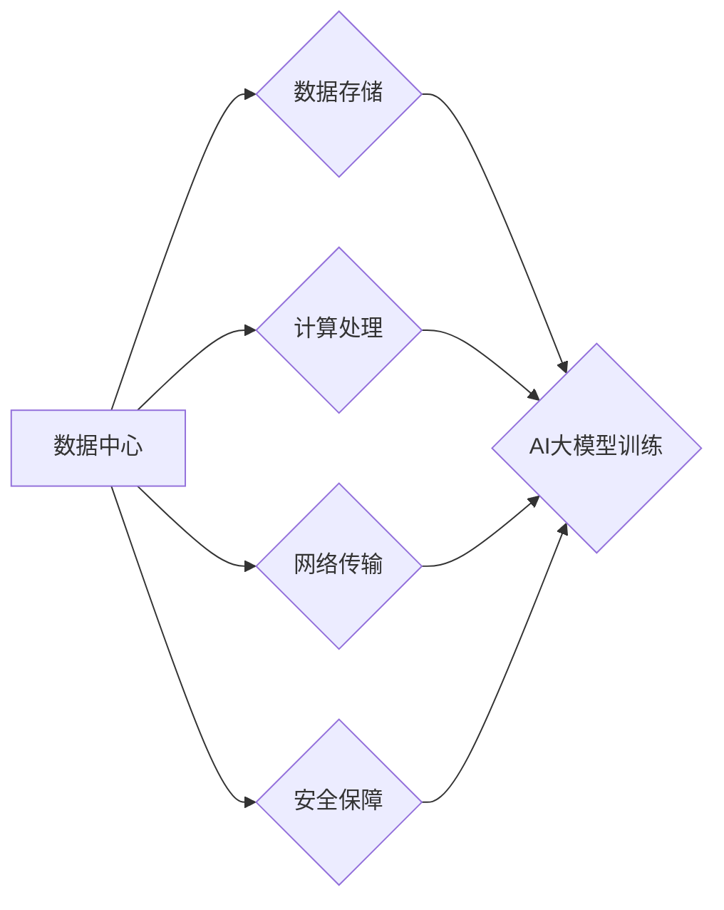

> AI大模型、数据中心、投资建设、架构设计、算力需求、数据存储、网络安全、可持续发展

## 1. 背景介绍

近年来，人工智能（AI）技术取得了飞速发展，特别是大模型的涌现，为各行各业带来了革命性的变革。从自然语言处理到计算机视觉，从药物研发到金融预测，AI大模型正在深刻地改变着我们的生活和工作方式。然而，大模型的训练和应用都需要海量的数据和强大的算力，这使得数据中心建设成为AI发展的重要基础设施。

数据中心作为AI大模型应用的核心支撑平台，承担着数据存储、计算处理、网络传输等关键任务。其建设和运营直接关系到AI应用的效率、成本和安全性。随着AI技术的不断进步和应用场景的不断拓展，数据中心建设面临着新的挑战和机遇。

## 2. 核心概念与联系

**2.1 数据中心概述**

数据中心是指集中存储、处理和管理海量数据的物理设施和软件系统。它通常由服务器、存储设备、网络设备、电源系统、制冷系统等硬件组成，并运行着各种操作系统、数据库、应用软件等软件系统。

**2.2 AI大模型概述**

AI大模型是指在海量数据上训练的具有强大泛化能力的深度学习模型。它们通常拥有数亿甚至数十亿的参数，能够处理复杂的任务，例如文本生成、图像识别、语音合成等。

**2.3 数据中心与AI大模型的关系**

数据中心为AI大模型的训练和应用提供了必要的硬件和软件基础设施。

* **数据存储:** 数据中心提供海量数据存储空间，满足AI大模型训练和应用的数据需求。
* **计算处理:** 数据中心拥有强大的计算能力，能够支撑AI大模型的训练和推理过程。
* **网络传输:** 数据中心提供高速网络连接，保证数据在训练和应用过程中快速传输。
* **安全保障:** 数据中心提供安全防护措施，保护AI大模型的数据和运行环境。

**2.4 数据中心架构设计**

数据中心架构设计需要考虑AI大模型的特殊需求，例如高算力、低延迟、高可靠性等。常见的架构设计模式包括：

* **集中式架构:** 所有资源集中在单个数据中心，适合规模较小的AI应用。
* **分布式架构:** 将资源分布在多个数据中心，提高可用性和扩展性，适合规模较大的AI应用。
* **云化架构:** 利用云计算平台提供弹性资源，降低成本，适合灵活的AI应用。

**2.5 Mermaid 流程图**



## 3. 核心算法原理 & 具体操作步骤

**3.1 算法原理概述**

AI大模型的训练通常采用深度学习算法，例如卷积神经网络（CNN）、循环神经网络（RNN）和Transformer等。这些算法通过多层神经网络结构，学习数据中的特征和模式，从而实现对数据的理解和预测。

**3.2 算法步骤详解**

1. **数据预处理:** 将原始数据清洗、转换和格式化，使其适合模型训练。
2. **模型构建:** 根据任务需求选择合适的深度学习模型架构，并设置模型参数。
3. **模型训练:** 使用训练数据训练模型，调整模型参数，使其能够准确地预测目标变量。
4. **模型评估:** 使用测试数据评估模型的性能，例如准确率、召回率和F1-score等。
5. **模型部署:** 将训练好的模型部署到生产环境中，用于实际应用。

**3.3 算法优缺点**

* **优点:** 深度学习算法能够学习复杂的数据模式，具有强大的泛化能力。
* **缺点:** 深度学习算法需要海量数据和强大的算力，训练时间长，参数调整复杂。

**3.4 算法应用领域**

深度学习算法广泛应用于各个领域，例如：

* **自然语言处理:** 文本分类、情感分析、机器翻译、对话系统等。
* **计算机视觉:** 图像识别、物体检测、图像分割、视频分析等。
* **语音识别:** 语音转文本、语音合成、语音助手等。
* **推荐系统:** 商品推荐、内容推荐、用户画像等。

## 4. 数学模型和公式 & 详细讲解 & 举例说明

**4.1 数学模型构建**

深度学习模型通常采用神经网络结构，其数学模型可以表示为一系列的线性变换和非线性激活函数。

**4.2 公式推导过程**

* **线性变换:** 
$$
y = Wx + b
$$
其中，$x$是输入向量，$W$是权重矩阵，$b$是偏置向量，$y$是输出向量。

* **非线性激活函数:** 
$$
f(y) = \sigma(y)
$$
其中，$\sigma$是激活函数，例如ReLU、Sigmoid、Tanh等。

**4.3 案例分析与讲解**

以卷积神经网络为例，其数学模型可以表示为：

* **卷积层:** 
$$
y = Conv(x, W) + b
$$
其中，$Conv$是卷积操作，$W$是卷积核权重矩阵。

* **池化层:** 
$$
y = Pool(x)
$$
其中，$Pool$是池化操作，例如最大池化、平均池化等。

* **全连接层:** 
$$
y = FC(x, W) + b
$$
其中，$FC$是全连接操作，$W$是全连接层权重矩阵。

## 5. 项目实践：代码实例和详细解释说明

**5.1 开发环境搭建**

* 操作系统: Ubuntu 20.04
* 编程语言: Python 3.8
* 深度学习框架: TensorFlow 2.0

**5.2 源代码详细实现**

```python
import tensorflow as tf

# 定义模型结构
model = tf.keras.models.Sequential([
    tf.keras.layers.Conv2D(32, (3, 3), activation='relu', input_shape=(28, 28, 1)),
    tf.keras.layers.MaxPooling2D((2, 2)),
    tf.keras.layers.Conv2D(64, (3, 3), activation='relu'),
    tf.keras.layers.MaxPooling2D((2, 2)),
    tf.keras.layers.Flatten(),
    tf.keras.layers.Dense(10, activation='softmax')
])

# 编译模型
model.compile(optimizer='adam',
              loss='sparse_categorical_crossentropy',
              metrics=['accuracy'])

# 训练模型
model.fit(x_train, y_train, epochs=5)

# 评估模型
loss, accuracy = model.evaluate(x_test, y_test)
print('Test loss:', loss)
print('Test accuracy:', accuracy)
```

**5.3 代码解读与分析**

* 代码定义了一个简单的卷积神经网络模型，用于手写数字识别任务。
* 模型包含两层卷积层、两层池化层、一层全连接层和一层输出层。
* 模型使用Adam优化器、交叉熵损失函数和准确率指标进行训练。
* 训练完成后，模型的性能在测试集上进行评估。

**5.4 运行结果展示**

训练完成后，模型的准确率通常在90%以上。

## 6. 实际应用场景

**6.1 图像识别**

AI大模型可以用于识别各种图像，例如人脸识别、物体检测、场景理解等。

**6.2 自然语言处理**

AI大模型可以用于处理自然语言，例如文本分类、情感分析、机器翻译、对话系统等。

**6.3 医疗诊断**

AI大模型可以辅助医生进行医疗诊断，例如图像分析、疾病预测、药物研发等。

**6.4 金融预测**

AI大模型可以用于金融预测，例如股票价格预测、风险评估、欺诈检测等。

**6.5 未来应用展望**

随着AI技术的不断发展，AI大模型将在更多领域得到应用，例如自动驾驶、机器人、个性化教育等。

## 7. 工具和资源推荐

**7.1 学习资源推荐**

* **书籍:**
    * 深度学习
    * 人工智能：一种现代方法
* **在线课程:**
    * Coursera: 深度学习
    * Udacity: AI编程
* **开源项目:**
    * TensorFlow
    * PyTorch

**7.2 开发工具推荐**

* **编程语言:** Python
* **深度学习框架:** TensorFlow, PyTorch
* **云计算平台:** AWS, Azure, GCP

**7.3 相关论文推荐**

* Attention Is All You Need
* BERT: Pre-training of Deep Bidirectional Transformers for Language Understanding
* GPT-3: Language Models are Few-Shot Learners

## 8. 总结：未来发展趋势与挑战

**8.1 研究成果总结**

近年来，AI大模型取得了显著的进展，在各个领域展现出强大的应用潜力。

**8.2 未来发展趋势**

* **模型规模和能力的提升:** 未来，AI大模型的规模和能力将继续提升，能够处理更复杂的任务。
* **模型训练效率的提高:** 研究人员将探索新的训练方法，提高模型训练效率。
* **模型解释性和可解释性的增强:** 研究人员将致力于提高AI模型的解释性和可解释性，使其更易于理解和信任。

**8.3 面临的挑战**

* **数据获取和隐私保护:** AI大模型的训练需要海量数据，如何获取高质量数据并保护用户隐私是一个挑战。
* **算力需求和能源消耗:** AI大模型的训练和应用需要大量的算力，这会导致能源消耗增加。
* **模型安全性和可控性:** AI大模型的安全性、可靠性和可控性需要得到保障。

**8.4 研究展望**

未来，AI大模型的研究将继续深入，探索新的应用场景和技术突破，为人类社会带来更多福祉。

## 9. 附录：常见问题与解答

**9.1 如何选择合适的AI大模型？**

选择合适的AI大模型需要根据具体的应用场景和需求进行考虑，例如任务类型、数据规模、算力资源等。

**9.2 如何训练和部署AI大模型？**

训练和部署AI大模型需要一定的技术基础和经验，可以参考相关的教程和文档进行学习。

**9.3 如何评估AI大模型的性能？**

AI大模型的性能可以通过各种指标进行评估，例如准确率、召回率、F1-score等。

**9.4 如何解决AI大模型的伦理问题？**

AI大模型的伦理问题需要得到重视，需要制定相应的规范和制度，确保AI技术安全、公平、可持续发展。


作者：禅与计算机程序设计艺术 / Zen and the Art of Computer Programming 
<end_of_turn>