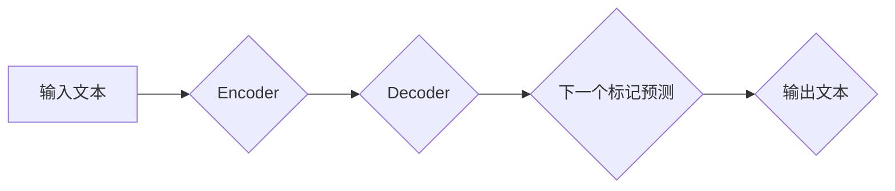

> GPT, Transformer, next token prediction, 自然语言处理, 深度学习, 神经网络

## 1. 背景介绍

在人工智能领域，自然语言处理 (NLP) 始终是研究的热点之一。从传统的统计语言模型到如今的深度学习时代，人们不断探索更有效、更智能的文本理解和生成方法。其中，基于 Transformer 架构的 GPT (Generative Pre-trained Transformer) 模型凭借其强大的文本生成能力和广泛的应用场景，迅速成为 NLP 领域的一颗明星。

GPT 模型的核心机制是 **next token prediction** (下一个标记预测)，它通过学习语言的统计规律和语义关系，预测下一个最可能的单词，从而生成流畅、连贯的文本。

## 2. 核心概念与联系

GPT 模型的核心概念包括：

* **Transformer:**  Transformer 是一个基于注意力机制的深度学习架构，它能够有效地处理长距离依赖关系，并大幅提升了 NLP 任务的性能。
* **Encoder-Decoder:** GPT 模型采用 Encoder-Decoder 架构，其中 Encoder 用于编码输入文本，Decoder 用于解码并生成输出文本。
* **Self-Attention:** Self-Attention 机制允许模型关注输入文本中的不同部分，并学习它们之间的关系，从而更好地理解文本语义。
* **Masked Self-Attention:** 在 Decoder 部分，为了防止模型看到未来信息，使用 Masked Self-Attention 机制，只允许模型关注历史信息。
* **Next Token Prediction:** GPT 模型的目标是预测下一个最可能的单词，这可以通过训练模型最小化预测错误的概率来实现。

**Mermaid 流程图:**



## 3. 核心算法原理 & 具体操作步骤

### 3.1  算法原理概述

GPT 模型的核心算法是基于 Transformer 架构的 **next token prediction** 算法。该算法通过训练一个深度神经网络，学习语言的统计规律和语义关系，从而预测下一个最可能的单词。

训练过程可以概括为以下步骤：

1. 将输入文本分割成一个个单词序列。
2. 将每个单词转换为其对应的词向量表示。
3. 将词向量输入到 Transformer 模型中进行编码和解码。
4. 在 Decoder 部分，使用 Masked Self-Attention 机制，预测下一个单词的概率分布。
5. 根据概率分布选择最可能的单词作为预测结果。
6. 计算预测结果与真实值的损失函数，并反向传播更新模型参数。

### 3.2  算法步骤详解

1. **词向量化:** 将输入文本中的每个单词转换为其对应的词向量表示。词向量可以理解为每个单词在语义空间中的一个向量，可以捕捉单词的语义信息。常用的词向量模型包括 Word2Vec 和 GloVe。

2. **编码:** 将词向量输入到 Transformer 模型的 Encoder 部分，Encoder 会通过多层 Transformer 块进行编码，学习输入文本的语义表示。

3. **解码:** 将 Encoder 输出的语义表示输入到 Transformer 模型的 Decoder 部分，Decoder 会通过多层 Transformer 块进行解码，并预测下一个单词的概率分布。

4. **预测:** 根据预测的概率分布，选择最可能的单词作为预测结果。

5. **损失函数:** 计算预测结果与真实值的损失函数，常用的损失函数包括交叉熵损失函数。

6. **反向传播:** 使用梯度下降算法，反向传播损失函数，更新模型参数。

### 3.3  算法优缺点

**优点:**

* **强大的文本生成能力:** GPT 模型能够生成流畅、连贯、语义相关的文本。
* **可迁移性强:** 预训练的 GPT 模型可以应用于各种 NLP 任务，例如文本摘要、机器翻译、对话系统等。
* **参数共享:** Transformer 架构的参数共享机制，使得模型训练效率更高。

**缺点:**

* **训练成本高:** GPT 模型参数量巨大，训练成本较高。
* **数据依赖性强:** GPT 模型的性能依赖于训练数据的质量和数量。
* **缺乏可解释性:** GPT 模型是一个黑盒模型，其内部决策机制难以解释。

### 3.4  算法应用领域

GPT 模型在以下领域具有广泛的应用场景:

* **文本生成:**  自动写作、故事创作、诗歌生成等。
* **机器翻译:**  将一种语言翻译成另一种语言。
* **对话系统:**  构建能够与人类进行自然对话的聊天机器人。
* **文本摘要:**  自动生成文本的简要摘要。
* **代码生成:**  自动生成代码。

## 4. 数学模型和公式 & 详细讲解 & 举例说明

### 4.1  数学模型构建

GPT 模型的核心数学模型是基于 Transformer 架构的 **自注意力机制** 和 **多层感知机**。

**自注意力机制:**

自注意力机制允许模型关注输入文本中的不同部分，并学习它们之间的关系。其计算公式如下:

$$
Attention(Q, K, V) = softmax(\frac{QK^T}{\sqrt{d_k}})V
$$

其中:

* $Q$ 是查询矩阵
* $K$ 是键矩阵
* $V$ 是值矩阵
* $d_k$ 是键向量的维度
* $softmax$ 函数将注意力权重归一化

**多层感知机:**

多层感知机 (MLP) 是一个简单的深度神经网络，它由多个全连接层组成。

### 4.2  公式推导过程

自注意力机制的公式推导过程如下:

1. 将输入序列 $X$ 转换为查询矩阵 $Q$, 键矩阵 $K$ 和值矩阵 $V$。
2. 计算注意力权重矩阵 $A$，其元素表示每个单词对其他单词的注意力权重。
3. 将注意力权重矩阵 $A$ 与值矩阵 $V$ 进行加权求和，得到输出向量 $O$。

### 4.3  案例分析与讲解

假设我们有一个输入序列 $X = ["我", "爱", "学习", "编程"]$, 其中每个单词都对应一个词向量表示。

1. 将 $X$ 转换为 $Q$, $K$ 和 $V$。
2. 计算 $A = softmax(\frac{QK^T}{\sqrt{d_k}})$。
3. 计算 $O = A \cdot V$。

通过上述步骤，我们可以得到每个单词的输出向量 $O$，这些向量包含了每个单词与其他单词之间的语义关系。

## 5. 项目实践：代码实例和详细解释说明

### 5.1  开发环境搭建

* Python 3.7+
* PyTorch 1.7+
* CUDA 10.2+ (可选)

### 5.2  源代码详细实现

```python
import torch
import torch.nn as nn

class Transformer(nn.Module):
    def __init__(self, vocab_size, embedding_dim, num_heads, num_layers):
        super(Transformer, self).__init__()
        self.embedding = nn.Embedding(vocab_size, embedding_dim)
        self.transformer_layers = nn.ModuleList([
            nn.TransformerEncoderLayer(embedding_dim, num_heads)
            for _ in range(num_layers)
        ])
        self.linear = nn.Linear(embedding_dim, vocab_size)

    def forward(self, x):
        x = self.embedding(x)
        x = self.transformer_layers(x)
        x = self.linear(x)
        return x

# 实例化模型
model = Transformer(vocab_size=10000, embedding_dim=512, num_heads=8, num_layers=6)

# 定义损失函数和优化器
criterion = nn.CrossEntropyLoss()
optimizer = torch.optim.Adam(model.parameters())

# 训练模型
for epoch in range(num_epochs):
    for batch in train_data:
        # 前向传播
        outputs = model(batch)
        # 计算损失
        loss = criterion(outputs, batch_labels)
        # 反向传播
        optimizer.zero_grad()
        loss.backward()
        # 更新参数
        optimizer.step()

```

### 5.3  代码解读与分析

* **Transformer 类:** 定义了 Transformer 模型的结构，包括嵌入层、Transformer 层和线性层。
* **embedding 层:** 将单词转换为词向量表示。
* **Transformer 层:** 使用自注意力机制和多层感知机进行编码和解码。
* **linear 层:** 将编码后的输出转换为预测概率分布。
* **训练循环:** 迭代训练模型，计算损失，反向传播更新参数。

### 5.4  运行结果展示

训练完成后，可以将模型应用于文本生成任务，例如生成一段关于人工智能的文本。

## 6. 实际应用场景

GPT 模型在以下实际应用场景中展现出强大的能力:

* **聊天机器人:** GPT 模型可以用于构建能够与人类进行自然对话的聊天机器人，例如 OpenAI 的 ChatGPT。
* **文本摘要:** GPT 模型可以自动生成文本的简要摘要，例如新闻文章的摘要、会议记录的摘要等。
* **机器翻译:** GPT 模型可以用于将一种语言翻译成另一种语言，例如英语翻译成中文。
* **代码生成:** GPT 模型可以自动生成代码，例如根据自然语言描述生成代码。

### 6.4  未来应用展望

GPT 模型在未来将有更广泛的应用场景，例如:

* **个性化教育:** 根据学生的学习情况，生成个性化的学习内容。
* **创意写作:** 帮助作家克服写作瓶颈，生成新的故事创意。
* **科学研究:** 自动生成科学论文，加速科学研究的进展。

## 7. 工具和资源推荐

### 7.1  学习资源推荐

* **论文:**
    * Vaswani, A., Shazeer, N., Parmar, N., Uszkoreit, J., Jones, L., Gomez, A. N., ... & Polosukhin, I. (2017). Attention is all you need. In Advances in neural information processing systems (pp. 5998-6008).
* **博客:**
    * The Illustrated Transformer: https://jalammar.github.io/illustrated-transformer/
* **在线课程:**
    * Deep Learning Specialization (Coursera): https://www.coursera.org/specializations/deep-learning

### 7.2  开发工具推荐

* **PyTorch:** https://pytorch.org/
* **TensorFlow:** https://www.tensorflow.org/

### 7.3  相关论文推荐

* BERT: https://arxiv.org/abs/1810.04805
* T5: https://arxiv.org/abs/1910.10683
* GPT-3: https://openai.com/blog/gpt-3/

## 8. 总结：未来发展趋势与挑战

### 8.1  研究成果总结

GPT 模型的出现标志着 NLP 领域取得了重大突破，其强大的文本生成能力和广泛的应用场景，为人工智能的未来发展提供了新的方向。

### 8.2  未来发展趋势

* **模型规模更大:** 未来 GPT 模型的规模将进一步扩大，参数量将达到数千亿甚至万亿级别，从而提升模型的性能和能力。
* **多模态学习:** GPT 模型将与其他模态数据，例如图像、音频、视频等进行融合，实现多模态学习，从而更好地理解和生成复杂信息。
* **可解释性增强:** 研究人员将致力于提高 GPT 模型的可解释性，使其决策过程更加透明和可理解。

### 8.3  面临的挑战

* **训练成本高:** 训练大型 GPT 模型需要大量的计算资源和时间，这对于资源有限的机构和个人来说是一个挑战。
* **数据安全和隐私:** GPT 模型的训练需要大量文本数据，如何保证数据的安全和隐私是一个重要的课题。
* **伦理问题:** GPT 模型