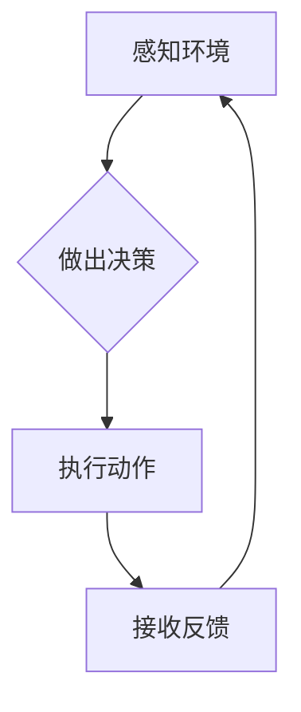

> AI代理，工作流，反馈，处理，机器学习，强化学习，自然语言处理，对话系统

## 1. 背景介绍

在人工智能领域，代理的概念扮演着至关重要的角色。AI代理是指能够感知环境、做出决策并与环境交互的智能体。它们可以是软件程序、机器人或其他形式的智能系统。随着人工智能技术的不断发展，AI代理在各个领域都得到了广泛的应用，例如：

* **客服机器人:** 处理客户咨询、提供产品信息和解决问题。
* **自动化流程:** 自动化重复性任务，提高工作效率。
* **个性化推荐:** 根据用户的喜好和行为推荐相关产品或服务。
* **游戏AI:** 控制游戏角色，提供更智能的游戏体验。

然而，构建高效、智能的AI代理面临着诸多挑战，其中之一就是如何有效地获取和处理反馈。反馈是AI代理学习和改进的关键信息，它可以帮助代理了解自己的行为是否正确，并根据反馈进行调整。

## 2. 核心概念与联系

**2.1 AI代理工作流**

AI代理工作流是指代理在执行任务过程中所经历的一系列步骤。每个步骤都可能涉及感知环境、做出决策、执行动作以及接收反馈等操作。

**2.2 反馈的获取与处理**

反馈是AI代理学习和改进的关键信息。它可以来自多种来源，例如：

* **用户反馈:** 用户对代理行为的评价或建议。
* **环境反馈:** 环境对代理行为的响应，例如任务完成情况或奖励信号。
* **监控数据:** 代理执行过程中的各种指标数据，例如执行时间、资源消耗等。

反馈的处理过程通常包括以下步骤：

* **收集反馈:** 从各种来源收集反馈信息。
* **过滤和清洗反馈:** 去除无效或噪声反馈，确保反馈信息的质量。
* **分析反馈:** 对反馈进行分析，提取有用的信息，例如代理行为的优缺点。
* **反馈到代理:** 将分析结果反馈给代理，帮助代理进行学习和调整。

**2.3  Mermaid 流程图**



## 3. 核心算法原理 & 具体操作步骤

**3.1 算法原理概述**

AI代理工作流中的反馈处理通常采用机器学习或强化学习算法。

* **机器学习:** 通过训练模型，学习从数据中提取规律，并根据这些规律预测未来结果。
* **强化学习:** 代理通过与环境交互，不断尝试不同的行为，并根据环境的奖励信号调整行为策略，最终学习到最优的行为策略。

**3.2 算法步骤详解**

1. **数据收集:** 收集代理执行任务过程中产生的数据，包括环境状态、代理行为和反馈信息。
2. **数据预处理:** 对收集到的数据进行清洗、转换和特征提取，以便于模型训练。
3. **模型选择:** 根据任务需求和数据特点选择合适的机器学习或强化学习算法。
4. **模型训练:** 使用训练数据训练模型，学习代理行为与反馈之间的关系。
5. **模型评估:** 使用测试数据评估模型的性能，例如准确率、召回率等。
6. **模型部署:** 将训练好的模型部署到实际环境中，用于指导代理的行为决策。

**3.3 算法优缺点**

* **优点:**

    * 可以自动学习和改进代理的行为策略。
    * 可以处理复杂、动态的环境。
    * 可以实现个性化定制。

* **缺点:**

    * 需要大量的训练数据。
    * 训练过程可能耗时且资源消耗大。
    * 模型的解释性和可解释性较差。

**3.4 算法应用领域**

* **机器人控制:** 训练机器人学习完成各种任务，例如导航、抓取、组装等。
* **游戏AI:** 训练游戏AI学习策略，提高游戏难度和体验。
* **个性化推荐:** 训练推荐系统学习用户喜好，提供个性化推荐。
* **医疗诊断:** 训练医疗诊断系统学习识别疾病，辅助医生诊断。

## 4. 数学模型和公式 & 详细讲解 & 举例说明

**4.1 数学模型构建**

在强化学习中，通常使用马尔可夫决策过程 (MDP) 来建模代理与环境的交互。MDP 由以下几个要素组成：

* **状态空间 (S):** 环境可能存在的各种状态。
* **动作空间 (A):** 代理可以执行的各种动作。
* **转移概率 (P):** 从一个状态执行一个动作后转移到另一个状态的概率。
* **奖励函数 (R):** 代理在某个状态执行某个动作后获得的奖励。
* **折扣因子 (γ):** 用于权衡未来奖励与当前奖励的比例。

**4.2 公式推导过程**

强化学习的目标是找到一个最优的策略 π，使得代理在与环境交互的过程中获得最大的累积奖励。最优策略可以利用贝尔曼方程来求解：

$$
V^{\pi}(s) = \max_{a \in A} \left[ R(s, a) + \gamma \sum_{s' \in S} P(s' | s, a) V^{\pi}(s') \right]
$$

其中：

* $V^{\pi}(s)$ 是状态 $s$ 下按照策略 $\pi$ 获得的期望累积奖励。
* $R(s, a)$ 是在状态 $s$ 执行动作 $a$ 后获得的奖励。
* $P(s' | s, a)$ 是从状态 $s$ 执行动作 $a$ 后转移到状态 $s'$ 的概率。

**4.3 案例分析与讲解**

例如，训练一个机器人学习在迷宫中找到出口。我们可以将迷宫的状态空间定义为迷宫中的每个位置，动作空间定义为机器人可以执行的移动方向（上、下、左、右）。转移概率可以根据迷宫的结构来确定，奖励函数可以设计为：

* 当机器人到达出口时，获得最大奖励。
* 当机器人撞墙时，获得负奖励。

通过训练强化学习模型，机器人可以学习到最优的移动策略，从而找到迷宫出口。

## 5. 项目实践：代码实例和详细解释说明

**5.1 开发环境搭建**

* Python 3.x
* TensorFlow 或 PyTorch
* OpenAI Gym

**5.2 源代码详细实现**

```python
import gym
import tensorflow as tf

# 定义代理模型
model = tf.keras.Sequential([
    tf.keras.layers.Dense(128, activation='relu'),
    tf.keras.layers.Dense(64, activation='relu'),
    tf.keras.layers.Dense(4, activation='softmax')
])

# 定义损失函数和优化器
loss_fn = tf.keras.losses.CategoricalCrossentropy()
optimizer = tf.keras.optimizers.Adam()

# 训练代理
for episode in range(1000):
    state = env.reset()
    done = False
    total_reward = 0

    while not done:
        # 选择动作
        action = model.predict(state)[0]
        # 执行动作
        next_state, reward, done, _ = env.step(action)
        # 更新状态
        state = next_state
        # 更新奖励
        total_reward += reward

    # 更新模型参数
    with tf.GradientTape() as tape:
        # 计算损失
        loss = loss_fn(labels, model.predict(state))
    # 反向传播
    gradients = tape.gradient(loss, model.trainable_variables)
    # 更新参数
    optimizer.apply_gradients(zip(gradients, model.trainable_variables))

    # 打印奖励
    print(f"Episode {episode+1}, Total Reward: {total_reward}")

```

**5.3 代码解读与分析**

* 代码首先定义了代理模型，这是一个简单的多层感知机。
* 然后定义了损失函数和优化器，用于训练模型。
* 训练过程是一个循环，每次循环代表一个episode。
* 在每个episode中，代理会与环境交互，执行动作，接收奖励，并更新模型参数。
* 最后，打印每个episode的总奖励，以便观察训练过程的进展。

**5.4 运行结果展示**

运行代码后，会看到每个episode的总奖励逐渐增加，表明代理正在学习并改进。最终，代理应该能够学会完成任务，例如在迷宫中找到出口。

## 6. 实际应用场景

**6.1 智能客服机器人**

AI代理可以被用于构建智能客服机器人，自动处理客户咨询、提供产品信息和解决问题。通过训练模型，机器人可以学习理解用户的自然语言输入，并提供准确、有用的回复。

**6.2 自动化流程**

AI代理可以自动化重复性任务，例如数据录入、文件处理、邮件发送等，提高工作效率。通过训练模型，代理可以学习完成这些任务，并根据需要进行调整。

**6.3 个性化推荐**

AI代理可以根据用户的喜好和行为推荐相关产品或服务。通过训练模型，代理可以学习用户的偏好，并提供个性化的推荐，提高用户体验。

**6.4 未来应用展望**

随着人工智能技术的不断发展，AI代理将在更多领域得到应用，例如：

* **医疗诊断:** 辅助医生诊断疾病，提高诊断准确率。
* **教育教学:** 提供个性化学习体验，帮助学生更好地理解知识。
* **金融投资:** 分析市场数据，提供投资建议。

## 7. 工具和资源推荐

**7.1 学习资源推荐**

* **书籍:**
    * 《Reinforcement Learning: An Introduction》 by Richard S. Sutton and Andrew G. Barto
    * 《Deep Learning》 by Ian Goodfellow, Yoshua Bengio, and Aaron Courville
* **在线课程:**
    * Coursera: Reinforcement Learning Specialization
    * Udacity: Deep Learning Nanodegree

**7.2 开发工具推荐**

* **TensorFlow:** 开源深度学习框架
* **PyTorch:** 开源深度学习框架
* **OpenAI Gym:** 强化学习环境库

**7.3 相关论文推荐**

* **Deep Reinforcement Learning with Double Q-learning**
* **Proximal Policy Optimization Algorithms**
* **Asynchronous Methods for Deep Reinforcement Learning**

## 8. 总结：未来发展趋势与挑战

**8.1 研究成果总结**

近年来，AI代理领域取得了显著进展，特别是强化学习算法取得了突破性进展。

**8.2 未来发展趋势**

* **更强大的模型:** 研究更强大的深度学习模型，提高代理的学习能力和泛化能力。
* **更复杂的场景:** 将AI代理应用于更复杂、更现实的场景，例如自动驾驶、机器人协作等。
* **更安全的代理:** 研究更安全的AI代理，确保代理的行为可控和可解释。

**8.3 面临的挑战**

* **数据获取:** 训练强大的AI代理需要大量的训练数据，而获取高质量的训练数据仍然是一个挑战。
* **计算资源:** 训练大型深度学习模型需要大量的计算资源，这对于资源有限的机构来说是一个瓶颈。
* **可解释性:** 深度学习模型的决策过程往往难以解释，这对于一些安全关键的应用来说是一个问题。

**8.4 研究展望**

未来，AI代理领域将继续朝着更智能、更安全、更可解释的方向发展。


## 9. 附录：常见问题与解答

**9.1 如何选择合适的强化学习算法？**

选择合适的强化学习算法取决于具体的应用场景和数据特点。例如，对于离散动作空间的场景，可以使用Q-learning算法；对于连续动作空间的场景，可以使用策略梯度算法。

**9.2 如何处理稀疏奖励？**

稀疏奖励是指代理在执行任务过程中获得奖励的频率较低。为了解决这个问题，可以使用奖励信号的预处理方法，例如将奖励信号转换为更频繁的奖励信号。

**9.3 如何评估AI代理的