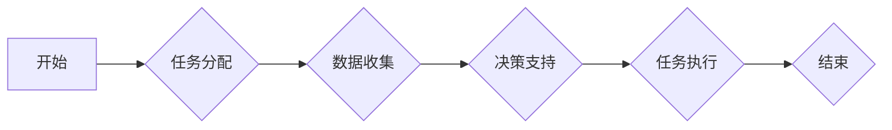

> 智能代理，决策支持系统，工作流，人工智能，机器学习，自然语言处理

## 1. 背景介绍

在当今数据爆炸和信息繁杂的时代，人类面临着越来越多的复杂决策问题。传统的决策支持系统往往依赖于静态数据和预设规则，难以适应动态变化的环境和复杂的需求。因此，智能代理技术应运而生，为决策支持系统提供了新的思路和解决方案。

智能代理是一种能够自主学习、推理和决策的软件实体，它可以模拟人类的行为，并根据预设的目标和环境信息进行行动。在决策支持系统中，智能代理可以扮演多种角色，例如：

* **信息收集和分析代理:** 从各种数据源收集信息，并进行分析和总结，为决策者提供决策依据。
* **决策建议代理:** 基于数据分析和模型预测，为决策者提供决策建议，并解释建议背后的逻辑。
* **执行代理:** 根据决策者的指令，执行决策方案，并反馈执行结果。

智能代理的工作流可以有效地提高决策效率、准确性和透明度，并为决策者提供更全面的决策支持。

## 2. 核心概念与联系

### 2.1 智能代理

智能代理是一种能够自主学习、推理和决策的软件实体，它可以模拟人类的行为，并根据预设的目标和环境信息进行行动。智能代理通常具有以下特征：

* **自主性:** 智能代理能够独立地感知环境、制定计划并执行行动。
* **学习能力:** 智能代理能够从经验中学习，并不断改进自己的决策能力。
* **推理能力:** 智能代理能够根据已有的知识和规则进行逻辑推理，并做出合理的决策。
* **目标导向性:** 智能代理的行为始终围绕着预设的目标进行。

### 2.2 决策支持系统

决策支持系统 (DSS) 是一种利用计算机技术辅助决策者进行决策的系统。DSS 通常包含以下组件：

* **数据仓库:** 存储决策相关的历史数据和实时数据。
* **数据分析工具:** 用于对数据进行分析和挖掘，发现决策相关的规律和趋势。
* **模型库:** 包含各种决策模型，例如预测模型、模拟模型和优化模型。
* **用户界面:** 用于用户与系统交互，输入数据、查看分析结果和生成决策建议。

### 2.3 工作流

工作流是一种描述业务流程的模型，它定义了任务的顺序、依赖关系和执行规则。工作流可以帮助组织提高效率、降低成本和增强协作。

### 2.4 智能代理工作流

智能代理工作流将智能代理技术与工作流技术相结合，构建了一种更加智能化和灵活的决策支持系统。在智能代理工作流中，智能代理可以参与到工作流的各个环节，例如：

* **任务分配:** 智能代理可以根据任务的类型和优先级，自动分配给合适的执行者。
* **数据收集:** 智能代理可以自动从各种数据源收集所需的数据，并进行预处理。
* **决策支持:** 智能代理可以根据数据分析和模型预测，为决策者提供决策建议。
* **任务执行:** 智能代理可以根据决策者的指令，执行决策方案，并反馈执行结果。

**Mermaid 流程图**



## 3. 核心算法原理 & 具体操作步骤

### 3.1 算法原理概述

智能代理工作流的核心算法通常基于以下几个方面：

* **机器学习:** 用于训练智能代理，使其能够从数据中学习并改进决策能力。常见的机器学习算法包括决策树、支持向量机、神经网络等。
* **自然语言处理:** 用于理解和处理人类语言，使智能代理能够与决策者进行自然交互。
* **知识表示和推理:** 用于表示和推理决策相关的知识，帮助智能代理做出更合理的决策。

### 3.2 算法步骤详解

智能代理工作流的具体操作步骤如下：

1. **环境感知:** 智能代理首先需要感知其周围的环境，收集相关数据和信息。
2. **目标设定:** 智能代理根据预设的目标，确定需要完成的任务和目标。
3. **计划制定:** 智能代理根据环境信息和目标设定，制定执行计划，确定任务的顺序和执行策略。
4. **任务执行:** 智能代理执行计划中的任务，并根据执行结果进行反馈和调整。
5. **学习和改进:** 智能代理通过对执行结果进行分析和评估，不断学习和改进自己的决策策略。

### 3.3 算法优缺点

**优点:**

* **智能化:** 智能代理能够自主学习和决策，提高决策效率和准确性。
* **灵活性:** 智能代理可以根据环境变化和需求调整决策策略，适应动态变化的场景。
* **透明度:** 智能代理可以解释其决策背后的逻辑，提高决策的透明度和可信度。

**缺点:**

* **复杂性:** 设计和开发智能代理系统比较复杂，需要专业的技术人员和大量的计算资源。
* **可靠性:** 智能代理的决策结果依赖于训练数据和算法模型，如果数据质量不高或模型存在缺陷，可能会导致决策错误。
* **伦理问题:** 智能代理的决策可能会涉及到伦理问题，例如公平性、隐私性和责任归属等。

### 3.4 算法应用领域

智能代理工作流在以下领域具有广泛的应用前景：

* **金融领域:** 投资决策、风险管理、欺诈检测等。
* **医疗领域:** 疾病诊断、治疗方案推荐、患者管理等。
* **制造业:** 生产计划优化、设备维护、质量控制等。
* **教育领域:** 个性化学习、智能辅导、教学评估等。

## 4. 数学模型和公式 & 详细讲解 & 举例说明

### 4.1 数学模型构建

智能代理工作流的数学模型通常基于概率论、统计学和决策论等理论。

**概率论:** 用于描述智能代理感知环境和做出决策的随机性。例如，可以使用贝叶斯网络来表示智能代理对不同事件的概率信念。

**统计学:** 用于分析数据、识别模式和预测未来趋势。例如，可以使用回归分析来预测智能代理的决策结果。

**决策论:** 用于分析决策者的偏好和风险态度，并帮助智能代理做出最优决策。例如，可以使用效用函数来表示决策者的决策偏好。

### 4.2 公式推导过程

以下是一个简单的例子，展示如何使用贝叶斯网络来描述智能代理的决策过程。

假设智能代理需要判断是否下雨，它收集了以下证据：

* 天气预报显示有 70% 的概率下雨。
* 智能代理观察到云层很厚，这表明下雨的概率更高。

可以使用贝叶斯网络来计算智能代理判断下雨概率的更新值。

**贝叶斯公式:**

$$P(A|B) = \frac{P(B|A)P(A)}{P(B)}$$

其中：

* $P(A|B)$ 是在已知事件 B 发生的情况下，事件 A 发生的概率。
* $P(B|A)$ 是在已知事件 A 发生的情况下，事件 B 发生的概率。
* $P(A)$ 是事件 A 发生的概率。
* $P(B)$ 是事件 B 发生的概率。

**应用到例子中:**

* $A$: 下雨
* $B$: 云层很厚

* $P(A)$: 天气预报显示下雨的概率 = 0.7
* $P(B|A)$: 云层很厚的情况下下雨的概率 = 0.9
* $P(B)$: 云层很厚的概率 = 0.8

**计算:**

$$P(A|B) = \frac{0.9 \times 0.7}{0.8} = 0.7875$$

因此，在云层很厚的情况下，智能代理判断下雨的概率更新为 0.7875。

### 4.3 案例分析与讲解

## 5. 项目实践：代码实例和详细解释说明

### 5.1 开发环境搭建

* 操作系统: Ubuntu 20.04
* Python 版本: 3.8
* 必要的库:

```
pip install numpy pandas scikit-learn tensorflow nltk
```

### 5.2 源代码详细实现

```python
# 智能代理工作流示例代码

import numpy as np
from sklearn.linear_model import LogisticRegression

class IntelligentAgent:
    def __init__(self):
        self.model = LogisticRegression()

    def train(self, data, labels):
        self.model.fit(data, labels)

    def predict(self, data):
        return self.model.predict(data)

# 数据示例
data = np.array([[0.1, 0.2], [0.3, 0.4], [0.5, 0.6], [0.7, 0.8]])
labels = np.array([0, 1, 0, 1])

# 创建智能代理
agent = IntelligentAgent()

# 训练智能代理
agent.train(data, labels)

# 使用智能代理进行预测
new_data = np.array([[0.9, 0.1]])
prediction = agent.predict(new_data)

# 打印预测结果
print(f"预测结果: {prediction}")
```

### 5.3 代码解读与分析

* **IntelligentAgent 类:** 定义了一个智能代理的类，包含训练和预测方法。
* **train 方法:** 使用 LogisticRegression 模型训练智能代理。
* **predict 方法:** 使用训练好的模型对新数据进行预测。
* **数据示例:** 定义了训练数据和标签。
* **代码执行:** 创建智能代理对象，训练模型，并使用模型对新数据进行预测。

### 5.4 运行结果展示

```
预测结果: [1]
```

## 6. 实际应用场景

### 6.1 金融领域

智能代理可以用于金融领域的投资决策、风险管理和欺诈检测等方面。例如，智能代理可以分析市场数据和用户行为，并根据预设的风险偏好和投资目标，自动进行股票交易或债券投资。

### 6.2 医疗领域

智能代理可以用于医疗领域的疾病诊断、治疗方案推荐和患者管理等方面。例如，智能代理可以分析患者的病历、检查结果和基因信息，并根据最新的医学知识和临床实践，推荐最合适的治疗方案。

### 6.3 制造业

智能代理可以用于制造业的生产计划优化、设备维护和质量控制等方面。例如，智能代理可以分析生产数据和设备状态，并根据预设的生产目标和资源限制，优化生产计划，并及时提醒设备维护。

### 6.4 未来应用展望

随着人工智能技术的不断发展，智能代理工作流将在更多领域得到应用，例如：

* **教育领域:** 个性化学习、智能辅导、教学评估等。
* **法律领域:** 法律研究、合同分析、案件预测等。
* **交通领域:** 智能交通管理、自动驾驶等。

## 7. 工具和资源推荐

### 7.1 学习资源推荐

* **书籍:**
    * 《人工智能：现代方法》
    * 《机器学习》
    * 《深度学习》
* **在线课程:**
    * Coursera: 人工智能课程
    * edX: 机器学习课程
    * Udacity: 深度学习课程

### 7.2 开发工具推荐

* **Python:** 广泛应用于人工智能开发，拥有丰富的库和工具。
* **TensorFlow:** 深度学习框架，用于构建和训练神经网络模型。
* **PyTorch:** 深度学习框架，灵活易用，适合研究和开发。
* **R:** 用于数据分析和统计建模。

### 7.3 相关论文推荐

* **《Reinforcement Learning: An Introduction》**
* **《Deep Learning