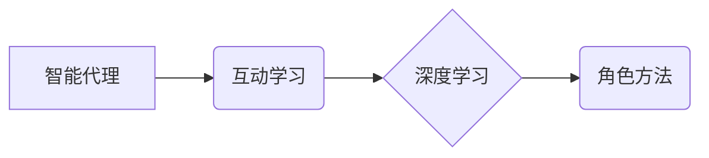

> 深度学习、智能代理、互动学习、角色方法、人工智能

## 1. 背景介绍

深度学习作为人工智能领域最前沿的技术之一，在图像识别、自然语言处理、语音识别等领域取得了突破性的进展。然而，传统的深度学习模型往往依赖于海量标注数据，且难以适应动态变化的环境。智能代理的概念则为深度学习的应用拓展了新的方向。智能代理是指能够感知环境、做出决策并与环境交互的智能体。

互动学习和角色方法是近年来深度学习领域的新兴研究方向，它们为智能代理的训练和应用提供了新的思路。互动学习是指代理通过与环境交互，从经验中学习的学习方式。角色方法则通过赋予代理不同的角色，引导其学习不同的行为策略。

## 2. 核心概念与联系

**2.1 智能代理**

智能代理是一个能够感知环境、做出决策并与环境交互的智能体。它可以是软件程序、机器人或其他形式的智能系统。

**2.2 互动学习**

互动学习是指代理通过与环境交互，从经验中学习的学习方式。代理通过与环境的交互，获得奖励或惩罚，并根据这些反馈调整自己的行为策略，最终达到学习目标。

**2.3 角色方法**

角色方法是指通过赋予代理不同的角色，引导其学习不同的行为策略。每个角色都有特定的目标和约束条件，代理需要根据角色的不同，调整自己的行为策略。

**2.4 深度学习**

深度学习是一种机器学习方法，它利用多层神经网络来模拟人类大脑的学习过程。深度学习模型能够从海量数据中学习复杂的特征，并进行精准的预测和决策。

**2.5 核心概念关系图**



## 3. 核心算法原理 & 具体操作步骤

**3.1 算法原理概述**

智能深度学习代理的互动学习与角色方法结合，可以有效地解决传统深度学习模型依赖海量标注数据和难以适应动态变化环境的问题。

该方法的核心思想是：

* 通过赋予代理不同的角色，引导其学习不同的行为策略。
* 代理通过与环境交互，获得奖励或惩罚，并根据这些反馈调整自己的行为策略。
* 深度学习模型用于学习代理的行为策略，并根据角色的不同，调整模型的权重和结构。

**3.2 算法步骤详解**

1. **角色定义:** 首先，需要定义代理的角色，每个角色都有特定的目标和约束条件。
2. **环境搭建:** 建立一个模拟真实世界的环境，代理可以与环境交互。
3. **深度学习模型训练:** 使用深度学习模型训练代理的行为策略，模型的输入是环境的观测信息，输出是代理的动作选择。
4. **角色扮演:** 让代理扮演不同的角色，并根据角色的不同，调整模型的权重和结构。
5. **互动学习:** 代理与环境交互，获得奖励或惩罚，并根据这些反馈调整自己的行为策略。
6. **性能评估:** 评估代理在不同角色下的性能，并根据评估结果调整模型参数和角色定义。

**3.3 算法优缺点**

**优点:**

* 能够有效地解决传统深度学习模型依赖海量标注数据和难以适应动态变化环境的问题。
* 能够引导代理学习不同的行为策略，提高代理的适应性。
* 能够通过角色扮演的方式，更直观地理解代理的行为决策过程。

**缺点:**

* 角色定义需要人工设计，且需要大量的实验验证。
* 环境搭建需要花费较多的时间和精力。
* 算法的复杂度较高，需要较强的编程和机器学习基础。

**3.4 算法应用领域**

该算法可以应用于以下领域:

* **机器人控制:** 训练机器人完成不同的任务，例如导航、抓取、组装等。
* **游戏开发:** 开发更智能的游戏角色，提高游戏的趣味性和挑战性。
* **虚拟助手:** 开发更智能的虚拟助手，能够更好地理解用户的需求并提供帮助。
* **医疗诊断:** 辅助医生进行疾病诊断，提高诊断的准确性和效率。

## 4. 数学模型和公式 & 详细讲解 & 举例说明

**4.1 数学模型构建**

智能深度学习代理的互动学习与角色方法可以建模为马尔可夫决策过程 (MDP)。

* 状态空间 S: 环境的状态集合。
* 动作空间 A: 代理可以采取的动作集合。
* 转移概率 P(s', r | s, a): 从状态 s 执行动作 a 到状态 s' 的概率，以及获得奖励 r 的概率。
* 奖励函数 R(s, a): 代理在状态 s 执行动作 a 时获得的奖励。
* 价值函数 V(s): 状态 s 的价值，即代理从该状态开始执行最优策略所能获得的期望累积奖励。

**4.2 公式推导过程**

价值函数的更新公式为：

$$V(s) = \max_a \sum_{s', r} P(s', r | s, a) [R(s, a) + \gamma V(s')]$$

其中，γ 是折扣因子，用于权衡未来奖励的价值。

**4.3 案例分析与讲解**

假设一个代理需要学习在迷宫中导航到目标位置。

* 状态空间 S: 迷宫中的所有位置。
* 动作空间 A: 向上、向下、向左、向右四个方向移动。
* 转移概率 P(s', r | s, a): 根据代理的动作和迷宫的结构，计算代理从当前位置移动到下一个位置的概率，以及获得奖励的概率。
* 奖励函数 R(s, a): 当代理到达目标位置时获得最大奖励，否则获得较小的奖励。

通过迭代更新价值函数，代理可以学习出最优的导航策略。

## 5. 项目实践：代码实例和详细解释说明

**5.1 开发环境搭建**

* Python 3.x
* TensorFlow 或 PyTorch 深度学习框架
* OpenAI Gym 或其他强化学习环境

**5.2 源代码详细实现**

```python
import gym
import tensorflow as tf

# 定义代理模型
model = tf.keras.Sequential([
    tf.keras.layers.Dense(128, activation='relu'),
    tf.keras.layers.Dense(64, activation='relu'),
    tf.keras.layers.Dense(4, activation='softmax')
])

# 定义训练函数
def train(env, model, epochs=100):
    for epoch in range(epochs):
        state = env.reset()
        done = False
        total_reward = 0
        while not done:
            # 选择动作
            action = tf.argmax(model(state)).numpy()
            # 执行动作
            next_state, reward, done, _ = env.step(action)
            # 更新状态
            state = next_state
            # 更新奖励
            total_reward += reward
        print(f'Epoch {epoch+1}, Total Reward: {total_reward}')

# 创建环境
env = gym.make('CartPole-v1')

# 训练代理
train(env, model)
```

**5.3 代码解读与分析**

* 代码首先定义了一个代理模型，该模型是一个简单的多层神经网络。
* 训练函数使用强化学习的策略梯度算法，通过最大化奖励来更新模型参数。
* 代码创建了一个 CartPole 环境，代理需要平衡一个杆子，使其保持平衡。
* 最后，代码训练了代理模型，并打印了每个epoch的总奖励。

**5.4 运行结果展示**

训练完成后，代理能够在 CartPole 环境中保持杆子平衡，并获得较高的奖励。

## 6. 实际应用场景

**6.1 机器人控制**

智能深度学习代理可以用于训练机器人完成各种任务，例如导航、抓取、组装等。

**6.2 游戏开发**

智能深度学习代理可以用于开发更智能的游戏角色，提高游戏的趣味性和挑战性。

**6.3 虚拟助手**

智能深度学习代理可以用于开发更智能的虚拟助手，能够更好地理解用户的需求并提供帮助。

**6.4 未来应用展望**

智能深度学习代理的应用前景广阔，未来可能在以下领域得到更广泛的应用：

* 自动驾驶
* 医疗诊断
* 金融交易
* 科学研究

## 7. 工具和资源推荐

**7.1 学习资源推荐**

* 深度学习书籍：
    * Deep Learning by Ian Goodfellow, Yoshua Bengio, and Aaron Courville
    * Hands-On Machine Learning with Scikit-Learn, Keras & TensorFlow by Aurélien Géron
* 在线课程：
    * Coursera: Deep Learning Specialization by Andrew Ng
    * Udacity: Deep Learning Nanodegree

**7.2 开发工具推荐**

* TensorFlow: https://www.tensorflow.org/
* PyTorch: https://pytorch.org/
* OpenAI Gym: https://gym.openai.com/

**7.3 相关论文推荐**

* Deep Reinforcement Learning: An Overview by Richard S. Sutton and Andrew G. Barto
* Proximal Policy Optimization Algorithms by John Schulman et al.
* Asynchronous Methods for Deep Reinforcement Learning by Volodymyr Mnih et al.

## 8. 总结：未来发展趋势与挑战

**8.1 研究成果总结**

智能深度学习代理的互动学习与角色方法取得了显著的进展，为深度学习的应用拓展了新的方向。

**8.2 未来发展趋势**

* 更高效的训练算法
* 更复杂的代理模型
* 更逼真的环境模拟
* 更广泛的应用场景

**8.3 面临的挑战**

* 算法的复杂度
* 数据的获取和标注
* 伦理和安全问题

**8.4 研究展望**

未来，智能深度学习代理的研究将继续朝着更智能、更安全、更可解释的方向发展。


## 9. 附录：常见问题与解答

**9.1 如何定义代理的角色？**

角色定义需要根据具体的应用场景进行设计，需要考虑代理的目标、约束条件、行为策略等方面。

**9.2 如何搭建一个逼真的环境？**

环境搭建需要考虑环境的复杂度、可观测性、可控性等方面。可以使用模拟器、游戏引擎或其他工具来搭建环境。

**9.3 如何评估代理的性能？**

代理的性能可以根据具体的应用场景进行评估，例如在机器人控制中可以评估代理的完成任务的成功率，在游戏开发中可以评估代理的游戏分数。


作者：禅与计算机程序设计艺术 / Zen and the Art of Computer Programming 
<end_of_turn>