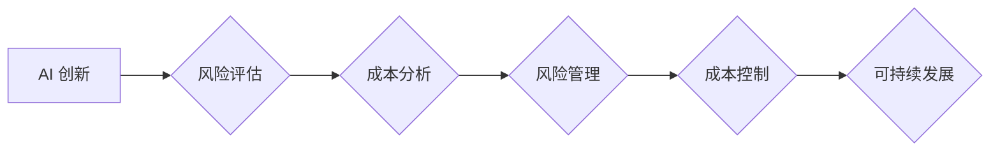

> 人工智能，创新，风险，成本，伦理，可持续性，监管

## 1. 背景介绍

人工智能（AI）正以惊人的速度发展，其应用领域不断扩展，从医疗保健和金融到交通和娱乐，AI正在改变着我们的世界。然而，这种快速发展也带来了新的风险和挑战，其中高风险和成本是需要认真对待的两个关键问题。

### 1.1 AI 创新带来的机遇

AI 创新为人类社会带来了前所未有的机遇：

* **提高效率和生产力:** AI 可以自动化重复性任务，解放人力，提高工作效率和生产力。
* **推动科学发现:** AI 可以分析海量数据，发现隐藏的模式和规律，加速科学研究和技术创新。
* **改善生活质量:** AI 可以帮助我们解决医疗保健、教育、交通等方面的难题，提高生活质量。

### 1.2 AI 创新带来的风险

尽管 AI 创新带来了巨大的机遇，但也存在着不可忽视的风险：

* **算法偏见:** AI 算法的训练数据可能存在偏见，导致算法输出结果存在偏差，甚至歧视。
* **隐私泄露:** AI 系统可能收集和处理大量个人数据，存在隐私泄露的风险。
* **安全威胁:** AI 系统可能被恶意攻击，导致系统崩溃或数据泄露。
* **失业风险:** AI 自动化可能会导致部分工作岗位被取代，增加失业风险。

## 2. 核心概念与联系

### 2.1 AI 创新风险与成本

AI 创新的风险和成本可以从多个方面进行分析：

* **技术风险:** AI 技术本身存在不确定性，算法的可靠性和安全性难以保证。
* **经济风险:** AI 创新需要大量的资金投入，回报率难以预测。
* **社会风险:** AI 创新可能对社会结构、就业市场和伦理道德造成冲击。

### 2.2 风险管理与成本控制

为了有效应对 AI 创新的风险和成本，需要采取相应的措施：

* **加强算法监管:** 制定规范和标准，确保 AI 算法的公平、透明和可解释性。
* **保护个人隐私:** 加强数据安全保护，制定隐私保护政策。
* **提升安全防护:** 加强 AI 系统的安全防护，防止恶意攻击。
* **促进社会共赢:** 鼓励 AI 创新与社会发展相结合，促进社会公平正义。

**Mermaid 流程图**



## 3. 核心算法原理 & 具体操作步骤

### 3.1  算法原理概述

深度学习是 AI 领域的重要分支，其核心算法是多层神经网络。

* **神经网络:** 仿照人脑神经网络结构，由多个神经元组成，通过连接和权重进行信息传递和处理。
* **深度学习:** 使用多层神经网络，能够学习更复杂的特征和模式。

### 3.2  算法步骤详解

深度学习算法的训练过程主要包括以下步骤：

1. **数据预处理:** 将原始数据进行清洗、转换和格式化，使其适合深度学习模型的训练。
2. **模型构建:** 根据任务需求，选择合适的深度学习模型架构，并设置模型参数。
3. **模型训练:** 使用训练数据，通过反向传播算法，调整模型参数，使模型输出结果与真实值尽可能接近。
4. **模型评估:** 使用测试数据，评估模型的性能，例如准确率、召回率等。
5. **模型部署:** 将训练好的模型部署到实际应用场景中，用于预测或分类等任务。

### 3.3  算法优缺点

**优点:**

* **学习能力强:** 可以学习复杂的数据模式和特征。
* **泛化能力强:** 可以应用于不同的数据和任务。

**缺点:**

* **训练成本高:** 需要大量的计算资源和训练数据。
* **解释性差:** 模型的决策过程难以理解。

### 3.4  算法应用领域

深度学习算法广泛应用于以下领域:

* **图像识别:** 人脸识别、物体检测、图像分类等。
* **自然语言处理:** 机器翻译、文本摘要、情感分析等。
* **语音识别:** 语音转文本、语音合成等。
* **推荐系统:** 商品推荐、内容推荐等。

## 4. 数学模型和公式 & 详细讲解 & 举例说明

### 4.1  数学模型构建

深度学习模型的数学基础是神经网络，其核心是激活函数和损失函数。

* **激活函数:** 用于引入非线性，使神经网络能够学习复杂的模式。常见的激活函数包括 sigmoid 函数、ReLU 函数等。
* **损失函数:** 用于衡量模型预测结果与真实值的差距，指导模型训练。常见的损失函数包括均方误差、交叉熵等。

### 4.2  公式推导过程

深度学习模型的训练过程基于梯度下降算法，其目标是通过调整模型参数，最小化损失函数的值。

**梯度下降公式:**

$$
\theta = \theta - \alpha \nabla L(\theta)
$$

其中:

* $\theta$ 是模型参数
* $\alpha$ 是学习率
* $\nabla L(\theta)$ 是损失函数对参数 $\theta$ 的梯度

### 4.3  案例分析与讲解

**举例说明:**

假设我们训练一个图像分类模型，目标是将图像分类为猫或狗。

* **输入数据:** 图像像素值
* **输出结果:** 猫或狗的类别标签
* **损失函数:** 交叉熵损失函数
* **梯度下降算法:** 使用随机梯度下降算法训练模型

通过训练，模型会学习到图像特征，并能够准确地预测图像类别。

## 5. 项目实践：代码实例和详细解释说明

### 5.1  开发环境搭建

* **操作系统:** Ubuntu 20.04
* **编程语言:** Python 3.8
* **深度学习框架:** TensorFlow 2.0

### 5.2  源代码详细实现

```python
import tensorflow as tf

# 定义模型架构
model = tf.keras.models.Sequential([
    tf.keras.layers.Conv2D(32, (3, 3), activation='relu', input_shape=(28, 28, 1)),
    tf.keras.layers.MaxPooling2D((2, 2)),
    tf.keras.layers.Conv2D(64, (3, 3), activation='relu'),
    tf.keras.layers.MaxPooling2D((2, 2)),
    tf.keras.layers.Flatten(),
    tf.keras.layers.Dense(10, activation='softmax')
])

# 编译模型
model.compile(optimizer='adam',
              loss='sparse_categorical_crossentropy',
              metrics=['accuracy'])

# 训练模型
model.fit(x_train, y_train, epochs=10)

# 评估模型
loss, accuracy = model.evaluate(x_test, y_test)
print('Test loss:', loss)
print('Test accuracy:', accuracy)
```

### 5.3  代码解读与分析

* **模型架构:** 使用了卷积神经网络 (CNN) 架构，适合图像分类任务。
* **激活函数:** 使用了 ReLU 函数，可以加速训练速度。
* **损失函数:** 使用了交叉熵损失函数，适合多分类任务。
* **优化器:** 使用了 Adam 优化器，可以有效地调整模型参数。

### 5.4  运行结果展示

训练完成后，模型可以用于预测新的图像类别。

## 6. 实际应用场景

### 6.1  医疗诊断

AI 算法可以辅助医生进行疾病诊断，例如分析医学影像，识别肿瘤等。

### 6.2  金融风险管理

AI 算法可以分析金融数据，识别欺诈行为，评估风险。

### 6.3  智能交通

AI 算法可以用于自动驾驶、交通流量预测等，提高交通效率和安全性。

### 6.4  未来应用展望

AI 创新将继续推动社会发展，未来应用场景将更加广泛，例如：

* **个性化教育:** 根据学生的学习情况，提供个性化的学习方案。
* **精准医疗:** 根据患者的基因信息，提供个性化的治疗方案。
* **智能制造:** 利用 AI 算法，提高生产效率和产品质量。

## 7. 工具和资源推荐

### 7.1  学习资源推荐

* **在线课程:** Coursera, edX, Udacity
* **书籍:** 深度学习，机器学习

### 7.2  开发工具推荐

* **深度学习框架:** TensorFlow, PyTorch, Keras
* **编程语言:** Python

### 7.3  相关论文推荐

* **深度学习论文:** ImageNet Classification with Deep Convolutional Neural Networks
* **机器学习论文:** The Elements of Statistical Learning

## 8. 总结：未来发展趋势与挑战

### 8.1  研究成果总结

AI 创新取得了显著成果，在多个领域取得了突破性进展。

### 8.2  未来发展趋势

* **模型规模和能力提升:** 模型规模将继续扩大，能力将进一步增强。
* **算法效率和鲁棒性提升:** 算法效率和鲁棒性将得到提升，能够处理更复杂的任务。
* **跨模态学习:** AI 系统将能够处理多种模态数据，例如文本、图像、音频等。

### 8.3  面临的挑战

* **算法可解释性:** AI 算法的决策过程难以理解，需要提高可解释性。
* **数据安全和隐私保护:** AI 系统需要处理大量数据，需要加强数据安全和隐私保护。
* **伦理道德问题:** AI 创新需要考虑伦理道德问题，避免造成负面影响。

### 8.4  研究展望

未来 AI 研究将继续探索算法的可解释性、数据安全和隐私保护、伦理道德等问题，推动 AI 技术的健康发展。

## 9. 附录：常见问题与解答

### 9.1  常见问题

* **什么是深度学习？**
* **深度学习有哪些应用场景？**
* **如何训练深度学习模型？**

### 9.2  解答

* **什么是深度学习？** 深度学习是一种机器学习方法，它使用多层神经网络来学习数据特征。
* **深度学习有哪些应用场景？** 深度学习应用广泛，例如图像识别、自然语言处理、语音识别等。
* **如何训练深度学习模型？** 训练深度学习模型需要准备数据、选择模型架构、设置参数、训练模型、评估模型等步骤。

作者：禅与计算机程序设计艺术 / Zen and the Art of Computer Programming


<end_of_turn>