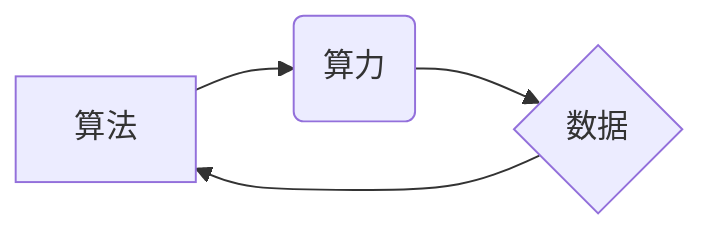

> 人工智能 (AI)
> 算法
> 算力
> 数据
> 深度学习
> 机器学习
> 计算机视觉

## 1. 背景介绍

人工智能 (AI) 作为一项前沿科技，近年来发展迅速，已渗透到各个领域，深刻地改变着我们的生活方式和工作模式。从智能语音助手到自动驾驶汽车，从医疗诊断到金融风险评估，AI技术的应用场景日益广泛。

AI的发展离不开三个关键驱动力：算法、算力和数据。这三个要素相互依存、相互促进，共同推动着AI技术的进步。

## 2. 核心概念与联系

**2.1 算法**

算法是AI的核心，它指解决特定问题的步骤或规则。不同的算法适用于不同的任务，例如，用于图像识别的卷积神经网络算法，用于自然语言处理的循环神经网络算法，等等。

**2.2 算力**

算力是指计算机处理信息的速率，是AI算法训练和运行的基础。随着算力的提升，AI模型可以处理更复杂的数据，学习更复杂的知识，从而实现更精细的预测和决策。

**2.3 数据**

数据是AI算法的燃料，是训练和优化AI模型的基石。高质量的数据可以帮助AI模型更好地理解世界，做出更准确的判断。

**2.4 核心概念联系**

算法、算力和数据相互关联，共同构成了AI发展的驱动力。



**2.5 核心概念关系**

* 算法提供解决问题的思路和步骤，
* 算力提供执行算法所需的计算能力，
* 数据提供算法学习和训练的素材。

这三个要素缺一不可，共同推动着AI技术的进步。

## 3. 核心算法原理 & 具体操作步骤

### 3.1  算法原理概述

深度学习是目前AI领域最热门的算法之一，它模拟了人脑神经网络的结构和功能，能够学习复杂的非线性关系。

深度学习算法的核心是多层神经网络，每一层神经元都连接着上一层的输出，并进行加权求和和激活函数处理。通过不断调整神经元的权重，深度学习算法可以学习到数据的特征和模式，从而实现对数据的预测和分类。

### 3.2  算法步骤详解

1. **数据预处理:** 将原始数据进行清洗、转换和特征工程，使其适合深度学习算法的训练。
2. **网络结构设计:** 根据任务需求设计神经网络的结构，包括层数、神经元数量、激活函数等。
3. **参数初始化:** 为神经网络的参数（权重和偏置）进行随机初始化。
4. **前向传播:** 将输入数据通过神经网络进行逐层传递，计算输出结果。
5. **反向传播:** 计算输出结果与真实值的误差，并根据误差反向传播，更新神经网络的参数。
6. **训练迭代:** 重复前向传播和反向传播的过程，直到模型的性能达到预期的水平。
7. **模型评估:** 使用测试数据评估模型的性能，并进行调参优化。

### 3.3  算法优缺点

**优点:**

* 能够学习复杂的非线性关系。
* 性能优异，在图像识别、自然语言处理等领域取得了突破性进展。

**缺点:**

* 训练数据量大，计算资源消耗高。
* 模型解释性差，难以理解模型的决策过程。

### 3.4  算法应用领域

深度学习算法广泛应用于以下领域:

* **计算机视觉:** 图像识别、物体检测、图像分割、人脸识别等。
* **自然语言处理:** 文本分类、情感分析、机器翻译、对话系统等。
* **语音识别:** 语音转文本、语音助手等。
* **推荐系统:** 商品推荐、内容推荐等。
* **医疗诊断:** 疾病诊断、影像分析等。

## 4. 数学模型和公式 & 详细讲解 & 举例说明

### 4.1  数学模型构建

深度学习算法的核心是多层神经网络，每个神经元接收来自上一层的输入信号，并进行加权求和和激活函数处理。

**4.1.1 神经元模型:**

一个神经元的数学模型可以表示为：

$$
y = f(w^T x + b)
$$

其中：

* $y$ 是神经元的输出值。
* $f$ 是激活函数，例如 sigmoid 函数、ReLU 函数等。
* $w$ 是神经元的权重向量。
* $x$ 是神经元的输入向量。
* $b$ 是神经元的偏置值。

**4.1.2 多层神经网络:**

多层神经网络由多个神经元层组成，每一层神经元都连接着上一层的输出。

### 4.2  公式推导过程

深度学习算法的训练过程是通过反向传播算法来实现的。反向传播算法的核心是计算误差梯度，并根据梯度更新神经网络的参数。

**4.2.1 损失函数:**

损失函数用于衡量模型的预测结果与真实值的差异。常见的损失函数包括均方误差 (MSE)、交叉熵损失等。

**4.2.2 梯度下降:**

梯度下降算法是一种优化算法，用于更新神经网络的参数，使其能够最小化损失函数。

**4.2.3 反向传播算法:**

反向传播算法通过链式法则计算误差梯度，并根据梯度更新神经网络的参数。

### 4.3  案例分析与讲解

**4.3.1 图像识别:**

在图像识别任务中，深度学习算法可以学习图像的特征，并将其映射到相应的类别。例如，卷积神经网络 (CNN) 是一种专门用于图像识别的深度学习算法，它可以学习图像的边缘、纹理等特征，并将其用于分类。

**4.3.2 自然语言处理:**

在自然语言处理任务中，深度学习算法可以学习文本的语义和语法结构，并将其用于各种任务，例如文本分类、机器翻译、情感分析等。例如，循环神经网络 (RNN) 是一种专门用于处理序列数据的深度学习算法，它可以学习文本的上下文信息，并将其用于文本生成、机器翻译等任务。

## 5. 项目实践：代码实例和详细解释说明

### 5.1  开发环境搭建

* Python 3.x
* TensorFlow 或 PyTorch 深度学习框架
* Jupyter Notebook 或 VS Code 代码编辑器

### 5.2  源代码详细实现

```python
import tensorflow as tf

# 定义模型结构
model = tf.keras.models.Sequential([
    tf.keras.layers.Conv2D(32, (3, 3), activation='relu', input_shape=(28, 28, 1)),
    tf.keras.layers.MaxPooling2D((2, 2)),
    tf.keras.layers.Conv2D(64, (3, 3), activation='relu'),
    tf.keras.layers.MaxPooling2D((2, 2)),
    tf.keras.layers.Flatten(),
    tf.keras.layers.Dense(10, activation='softmax')
])

# 编译模型
model.compile(optimizer='adam',
              loss='sparse_categorical_crossentropy',
              metrics=['accuracy'])

# 加载 MNIST 数据集
(x_train, y_train), (x_test, y_test) = tf.keras.datasets.mnist.load_data()

# 数据预处理
x_train = x_train.astype('float32') / 255.0
x_test = x_test.astype('float32') / 255.0
x_train = x_train.reshape((x_train.shape[0], 28, 28, 1))
x_test = x_test.reshape((x_test.shape[0], 28, 28, 1))

# 训练模型
model.fit(x_train, y_train, epochs=5)

# 评估模型
loss, accuracy = model.evaluate(x_test, y_test)
print('Test loss:', loss)
print('Test accuracy:', accuracy)
```

### 5.3  代码解读与分析

* 代码首先定义了模型结构，包括卷积层、池化层和全连接层。
* 然后编译模型，指定优化器、损失函数和评价指标。
* 加载 MNIST 数据集，并进行数据预处理，将图像数据转换为适合模型输入的格式。
* 训练模型，指定训练轮数。
* 最后评估模型，计算测试集上的损失和准确率。

### 5.4  运行结果展示

运行代码后，可以得到模型的训练过程和测试结果，例如：

```
Epoch 1/5
1875/1875 [==============================] - 10s 5ms/step - loss: 0.2878 - accuracy: 0.9219
Epoch 2/5
1875/1875 [==============================] - 9s 5ms/step - loss: 0.1197 - accuracy: 0.9654
Epoch 3/5
1875/1875 [==============================] - 9s 5ms/step - loss: 0.0908 - accuracy: 0.9741
Epoch 4/5
1875/1875 [==============================] - 9s 5ms/step - loss: 0.0729 - accuracy: 0.9797
Epoch 5/5
1875/1875 [==============================] - 9s 5ms/step - loss: 0.0607 - accuracy: 0.9829

Test loss: 0.0497
Test accuracy: 0.9841
```

## 6. 实际应用场景

### 6.1  医疗诊断

深度学习算法可以用于辅助医生进行疾病诊断，例如，通过分析医学影像数据，识别肿瘤、骨折等病变。

### 6.2  金融风险评估

深度学习算法可以用于评估金融风险，例如，识别欺诈交易、预测客户违约风险。

### 6.3  智能客服

深度学习算法可以用于构建智能客服系统，例如，通过自然语言处理技术，理解用户的需求，并提供相应的服务。

### 6.4  未来应用展望

随着算法、算力和数据的不断发展，AI技术将在更多领域得到应用，例如：

* **自动驾驶:** 深度学习算法可以用于训练自动驾驶汽车，使其能够感知周围环境，并做出安全可靠的决策。
* **个性化教育:** 深度学习算法可以根据学生的学习情况，提供个性化的学习方案。
* **药物研发:** 深度学习算法可以用于加速药物研发，例如，预测药物的活性、副作用等。

## 7. 工具和资源推荐

### 7.1  学习资源推荐

* **在线课程:** Coursera、edX、Udacity 等平台提供丰富的深度学习课程。
* **书籍:** 《深度学习》、《动手学深度学习》等书籍是深度学习学习的经典教材。
* **博客:** TensorFlow、PyTorch 等深度学习框架的官方博客提供最新的技术资讯和应用案例。

### 7.2  开发工具推荐

* **TensorFlow:** Google 开发的开源深度学习框架。
* **PyTorch:** Facebook 开发的开源深度学习框架。
* **Keras:** TensorFlow 上的深度学习 API，易于使用。

### 7.3  相关论文推荐

* **AlexNet:** ImageNet Large Scale Visual Recognition Challenge 2012 冠军论文。
* **VGGNet:** 2014 年 ImageNet 比赛中取得了优异成绩的论文。
* **ResNet:** 深度残差网络，解决了深度网络训练中的梯度消失问题。

## 8. 总结：未来发展趋势与挑战

### 8.1  研究成果总结

近年来，深度学习算法取得了显著的进展，在