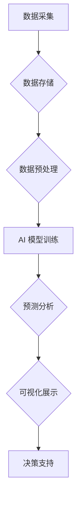

>  人工智能，商业智能，数据分析，机器学习，深度学习，预测分析，可视化

## 1. 背景介绍

商业智能 (BI) 已经成为企业决策的核心驱动力，它帮助企业从海量数据中提取有价值的洞察，从而做出更明智的决策。随着数据量的爆炸式增长和人工智能 (AI) 技术的快速发展，AI 在商业智能分析中扮演着越来越重要的角色。

传统 BI 系统主要依赖于人类专家对数据的分析和解读，而 AI 则可以自动学习数据模式，识别趋势和异常，并提供更准确、更深入的洞察。AI 驱动的 BI 系统能够帮助企业：

* **自动化数据分析**: AI 可以自动处理和分析海量数据，解放人力资源，提高分析效率。
* **发现隐藏的模式**: AI 算法能够识别人类难以察觉的模式和趋势，提供更深入的洞察。
* **做出更准确的预测**: AI 可以基于历史数据和当前趋势进行预测，帮助企业做出更明智的决策。
* **个性化体验**: AI 可以根据用户的需求和偏好提供个性化的分析和报告。

## 2. 核心概念与联系

**2.1 商业智能 (BI)**

商业智能 (BI) 是利用数据分析技术，从企业内部和外部数据中提取有价值的洞察，以支持企业决策和战略规划。BI 系统通常包括数据收集、数据存储、数据分析、数据可视化和报告生成等环节。

**2.2 人工智能 (AI)**

人工智能 (AI) 是模拟人类智能的一种计算机科学领域。AI 系统能够学习、推理、解决问题和做出决策，就像人类一样。AI 的核心技术包括机器学习、深度学习、自然语言处理等。

**2.3 AI 在 BI 中的作用**

AI 可以增强 BI 系统的功能，使其能够更智能、更自动化、更深入。AI 算法可以自动学习数据模式，识别趋势和异常，并提供更准确、更深入的洞察。

**2.4 AI 与 BI 的关系**

AI 和 BI 是相互补充的，共同构成了现代数据分析的核心理念。AI 提供了强大的数据分析能力，而 BI 提供了数据可视化和报告生成等功能，两者共同作用，帮助企业从数据中获取价值。

**2.5 AI 驱动的 BI 系统架构**



## 3. 核心算法原理 & 具体操作步骤

### 3.1  算法原理概述

AI 驱动的 BI 系统通常使用以下几种核心算法：

* **机器学习 (ML)**: 机器学习算法可以从数据中学习模式，并根据这些模式进行预测或分类。常见的机器学习算法包括线性回归、逻辑回归、决策树、支持向量机 (SVM) 和神经网络等。
* **深度学习 (DL)**: 深度学习是机器学习的一个子集，它使用多层神经网络来学习复杂的数据模式。深度学习算法在图像识别、自然语言处理和语音识别等领域取得了突破性进展。
* **预测分析**: 预测分析利用历史数据和统计模型来预测未来的趋势。常见的预测分析方法包括时间序列分析、回归分析和聚类分析。

### 3.2  算法步骤详解

以机器学习算法为例，其基本步骤如下：

1. **数据收集**: 收集与分析目标相关的原始数据。
2. **数据预处理**: 对数据进行清洗、转换和特征工程，使其适合机器学习算法的训练。
3. **模型选择**: 根据分析目标和数据特点选择合适的机器学习算法。
4. **模型训练**: 使用训练数据训练机器学习模型，使其能够学习数据模式。
5. **模型评估**: 使用测试数据评估模型的性能，并进行模型调优。
6. **模型部署**: 将训练好的模型部署到生产环境中，用于进行预测或分类。

### 3.3  算法优缺点

**机器学习算法**

* **优点**: 能够自动学习数据模式，无需人工特征工程；能够处理非线性关系；具有较高的预测精度。
* **缺点**: 需要大量的训练数据；训练过程可能比较耗时；模型解释性较差。

**深度学习算法**

* **优点**: 能够学习更复杂的特征；具有更高的预测精度；在图像识别、自然语言处理等领域取得了突破性进展。
* **缺点**: 需要更多的计算资源和训练数据；模型训练过程更复杂；模型解释性更差。

### 3.4  算法应用领域

* **客户关系管理 (CRM)**: 预测客户流失、识别潜在客户、个性化营销。
* **市场营销**: 分析市场趋势、预测产品销量、优化广告投放。
* **财务分析**: 预测财务指标、识别欺诈行为、优化投资组合。
* **运营管理**: 预测库存需求、优化物流配送、提高生产效率。

## 4. 数学模型和公式 & 详细讲解 & 举例说明

### 4.1  数学模型构建

在 AI 驱动的 BI 系统中，常用的数学模型包括线性回归模型、逻辑回归模型、决策树模型和神经网络模型等。

**4.1.1 线性回归模型**

线性回归模型假设数据之间存在线性关系，可以用以下公式表示：

$$y = \beta_0 + \beta_1x_1 + \beta_2x_2 + ... + \beta_nx_n + \epsilon$$

其中：

* $y$ 是预测变量
* $x_1, x_2, ..., x_n$ 是自变量
* $\beta_0, \beta_1, ..., \beta_n$ 是模型参数
* $\epsilon$ 是误差项

**4.1.2 逻辑回归模型**

逻辑回归模型用于分类问题，它将线性回归模型的输出映射到0到1之间的概率值，表示样本属于某个类别的概率。

$$P(y=1|x) = \frac{1}{1 + e^{-( \beta_0 + \beta_1x_1 + \beta_2x_2 + ... + \beta_nx_n )}}$$

其中：

* $P(y=1|x)$ 是样本属于类别1的概率
* $x_1, x_2, ..., x_n$ 是自变量
* $\beta_0, \beta_1, ..., \beta_n$ 是模型参数

### 4.2  公式推导过程

公式推导过程通常涉及微积分、概率论和统计学等知识。例如，线性回归模型的参数估计可以使用最小二乘法，逻辑回归模型的参数估计可以使用最大似然估计。

### 4.3  案例分析与讲解

以预测客户流失为例，可以使用逻辑回归模型进行分析。

* **数据收集**: 收集客户的历史数据，包括客户年龄、收入、购买频率、客户服务记录等。
* **数据预处理**: 对数据进行清洗、转换和特征工程，例如将年龄分组、将购买频率标准化等。
* **模型训练**: 使用训练数据训练逻辑回归模型，预测客户是否会流失。
* **模型评估**: 使用测试数据评估模型的性能，例如计算准确率、召回率和F1-score。
* **模型部署**: 将训练好的模型部署到生产环境中，用于预测新客户是否会流失。

## 5. 项目实践：代码实例和详细解释说明

### 5.1  开发环境搭建

* **操作系统**: Windows、macOS 或 Linux
* **编程语言**: Python
* **机器学习库**: scikit-learn、TensorFlow 或 PyTorch
* **数据可视化库**: Matplotlib、Seaborn 或 Plotly

### 5.2  源代码详细实现

```python
# 导入必要的库
import pandas as pd
from sklearn.model_selection import train_test_split
from sklearn.linear_model import LogisticRegression
from sklearn.metrics import accuracy_score

# 加载数据
data = pd.read_csv('customer_data.csv')

# 选择特征和目标变量
features = ['age', 'income', 'purchase_frequency']
target = 'churn'

# 将数据分割为训练集和测试集
X_train, X_test, y_train, y_test = train_test_split(data[features], data[target], test_size=0.2, random_state=42)

# 创建逻辑回归模型
model = LogisticRegression()

# 训练模型
model.fit(X_train, y_train)

# 预测测试集结果
y_pred = model.predict(X_test)

# 计算模型准确率
accuracy = accuracy_score(y_test, y_pred)
print(f'模型准确率: {accuracy}')
```

### 5.3  代码解读与分析

* **数据加载**: 使用 pandas 库加载数据文件。
* **特征选择**: 选择与分析目标相关的特征变量。
* **数据分割**: 将数据分割为训练集和测试集，用于模型训练和评估。
* **模型创建**: 创建逻辑回归模型实例。
* **模型训练**: 使用训练数据训练模型，学习数据模式。
* **模型预测**: 使用训练好的模型预测测试集结果。
* **模型评估**: 计算模型的准确率，评估模型性能。

### 5.4  运行结果展示

运行代码后，会输出模型的准确率，例如：

```
模型准确率: 0.85
```

这表示模型在预测客户流失方面准确率为85%。

## 6. 实际应用场景

### 6.1  客户关系管理 (CRM)

AI 驱动的 BI 系统可以帮助企业更好地理解客户行为，预测客户流失，识别潜在客户，并提供个性化的营销服务。例如，可以根据客户的历史购买记录、浏览行为和客户服务记录，预测客户是否会流失，并采取措施挽留客户。

### 6.2  市场营销

AI 驱动的 BI 系统可以帮助企业分析市场趋势，预测产品销量，优化广告投放，并提高营销效率。例如，可以根据市场数据、用户行为和竞争对手分析，预测产品的销量趋势，并调整营销策略。

### 6.3  财务分析

AI 驱动的 BI 系统可以帮助企业预测财务指标，识别欺诈行为，优化投资组合，并提高财务管理效率。例如，可以根据历史财务数据和市场趋势，预测公司的未来利润和现金流，并进行风险评估。

### 6.4  未来应用展望

随着 AI 技术的不断发展，AI 在商业智能分析中的应用将更加广泛和深入。未来，AI 驱动的 BI 系统将能够：

* **提供更深入的洞察**: AI 算法能够识别更复杂的模式和趋势，提供更深入的洞察。
* **自动化更多任务**: AI 可以自动化更多数据分析和报告生成任务，解放人力资源。
* **提供更个性化的体验**: AI 可以根据用户的需求和偏好提供个性化的分析和报告。

## 7. 工具和资源推荐

### 7.1  学习资源推荐

* **在线课程**: Coursera、edX、Udacity 等平台提供 AI 和机器学习相关的在线课程。
* **书籍**: 《Python机器学习》、《深度学习》等书籍可以帮助你深入了解 AI 和机器学习的原理和应用。
* **博客和论坛**: Kaggle、Towards Data Science 等平台上有许多 AI 和机器学习相关的博客和论坛，可以帮助你学习最新的技术和趋势。

### 7.2  开发工具推荐

* **Python**: Python 是 AI 和机器学习开发的常用语言，拥有丰富的库和工具。
* **Jupyter Notebook**: Jupyter Notebook 是一个交互式编程环境，方便进行数据分析和模型开发。
* **TensorFlow**: TensorFlow 是一个开源的机器学习框架，支持深度学习和各种机器学习算法。
* **PyTorch**: PyTorch 是另一个开源的机器学习框架，以其灵活性和易用性而闻名。

### 7.3  相关论文推荐

* **《ImageNet Classification with Deep Convolutional Neural Networks》**: 这篇论文介绍了 AlexNet 模型，标志着深度学习在图像识别领域的突破。
* **《Attention Is All You