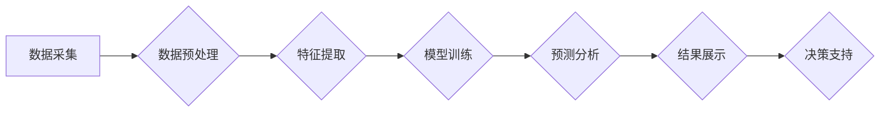

> AI, 地质勘探, 资源发现, 机器学习, 深度学习, 地质模型, 数据分析

## 1. 背景介绍

随着全球能源需求的不断增长和资源枯竭的趋势加剧，高效、精准的资源勘探成为当今世界面临的重大挑战。传统的地质勘探方法主要依赖于经验和人工分析，效率低下，成本高昂，且难以发现深埋或隐蔽的资源。近年来，人工智能（AI）技术突飞猛进，为地质勘探领域带来了革命性的变革。

AI技术能够利用海量地质数据进行智能分析和预测，大幅提高资源发现率，降低勘探成本，并为更精准、高效的资源开发提供支持。

## 2. 核心概念与联系

**2.1  AI在勘探中的应用**

AI在勘探中的应用主要体现在以下几个方面：

* **数据分析与处理:** AI算法能够快速处理海量地质数据，例如地震数据、钻井数据、地表物探数据等，提取隐藏的特征和模式，为地质学家提供更直观的分析结果。
* **地质模型构建:** AI可以辅助构建更精准的地质模型，模拟地质构造、矿物分布等复杂现象，预测资源分布和储量。
* **勘探目标识别:** AI算法能够识别潜在的勘探目标，例如矿体、油气藏等，提高勘探效率和成功率。
* **风险评估:** AI可以分析地质风险因素，评估勘探项目的风险程度，帮助决策者做出更明智的决策。

**2.2  AI技术与地质勘探的融合**

AI技术与地质勘探的融合，构建了一个智能化勘探系统，其核心架构如下：



**2.3  AI技术在勘探中的优势**

AI技术在勘探中的应用，具有以下优势：

* **提高效率:** AI算法能够快速处理海量数据，大幅缩短勘探周期，提高勘探效率。
* **降低成本:** AI技术可以减少人工成本，优化勘探方案，降低勘探成本。
* **提高精度:** AI算法能够识别隐藏的特征和模式，提高勘探精度，提高资源发现率。
* **降低风险:** AI可以分析地质风险因素，评估勘探项目的风险程度，帮助决策者做出更明智的决策。

## 3. 核心算法原理 & 具体操作步骤

**3.1  算法原理概述**

在AI驱动的勘探中，常用的算法包括机器学习、深度学习、神经网络等。这些算法能够从海量地质数据中学习，建立预测模型，实现对资源分布的预测和识别。

* **机器学习:** 机器学习算法通过训练数据，学习数据之间的关系，并根据已知数据预测未知数据。常用的机器学习算法包括支持向量机（SVM）、决策树、随机森林等。
* **深度学习:** 深度学习是机器学习的一种高级形式，利用多层神经网络，能够学习更复杂的特征和模式。常用的深度学习算法包括卷积神经网络（CNN）、循环神经网络（RNN）等。

**3.2  算法步骤详解**

AI驱动的勘探流程一般包括以下步骤：

1. **数据采集:** 收集各种地质数据，例如地震数据、钻井数据、地表物探数据、地质图、地质报告等。
2. **数据预处理:** 对采集到的数据进行清洗、格式转换、缺失值处理等操作，使其符合算法的输入要求。
3. **特征提取:** 从预处理后的数据中提取关键特征，例如地层厚度、岩性、地震波反射特征等，这些特征能够反映资源分布的潜在信息。
4. **模型训练:** 利用机器学习或深度学习算法，对提取的特征进行训练，建立预测模型。
5. **模型评估:** 对训练好的模型进行评估，验证其预测精度和可靠性。
6. **预测分析:** 利用训练好的模型，对新的地质数据进行预测分析，识别潜在的勘探目标。
7. **结果展示:** 将预测结果以图表、地图等形式展示，方便地质学家进行分析和决策。

**3.3  算法优缺点**

* **优点:** 提高效率、降低成本、提高精度、降低风险。
* **缺点:** 需要大量高质量数据进行训练，算法模型的解释性较差，对数据质量要求较高。

**3.4  算法应用领域**

AI算法在勘探领域的应用范围广泛，包括：

* **矿产勘探:** 识别矿体、预测矿产储量、评估矿山开发风险。
* **油气勘探:** 预测油气藏分布、评估油气储量、优化油气井开发方案。
* **水资源勘探:** 预测地下水资源分布、评估水资源利用潜力。
* **地质灾害预测:** 预测地震、滑坡、洪水等地质灾害发生风险。

## 4. 数学模型和公式 & 详细讲解 & 举例说明

**4.1  数学模型构建**

在AI驱动的勘探中，常用的数学模型包括回归模型、分类模型、聚类模型等。

* **回归模型:** 用于预测连续变量，例如矿产储量、油气藏厚度等。常用的回归模型包括线性回归、多项式回归、支持向量回归等。
* **分类模型:** 用于分类数据，例如识别矿体类型、预测地质灾害发生风险等。常用的分类模型包括逻辑回归、支持向量机、决策树等。
* **聚类模型:** 用于将数据分组，例如将地质体类型进行聚类分析，识别潜在的勘探目标。常用的聚类模型包括K-means聚类、层次聚类等。

**4.2  公式推导过程**

例如，线性回归模型的公式如下：

$$y = \beta_0 + \beta_1x_1 + \beta_2x_2 + ... + \beta_nx_n + \epsilon$$

其中：

* $y$ 是预测变量
* $x_1, x_2, ..., x_n$ 是自变量
* $\beta_0, \beta_1, ..., \beta_n$ 是回归系数
* $\epsilon$ 是误差项

通过最小二乘法，可以求解回归系数，建立预测模型。

**4.3  案例分析与讲解**

例如，利用机器学习算法对地震数据进行分析，可以预测油气藏的分布。

* **数据:** 收集地震数据、地质资料、油气井数据等。
* **特征提取:** 从地震数据中提取特征，例如反射波特征、地震波速度等。
* **模型训练:** 利用机器学习算法，例如支持向量机，对提取的特征进行训练，建立预测模型。
* **预测分析:** 利用训练好的模型，对新的地震数据进行预测分析，识别潜在的油气藏。

## 5. 项目实践：代码实例和详细解释说明

**5.1  开发环境搭建**

* 操作系统: Ubuntu 20.04 LTS
* Python 版本: 3.8.10
* 必要的库: pandas, numpy, scikit-learn, matplotlib, seaborn

**5.2  源代码详细实现**

```python
import pandas as pd
from sklearn.model_selection import train_test_split
from sklearn.linear_model import LogisticRegression
from sklearn.metrics import accuracy_score

# 加载数据
data = pd.read_csv('geological_data.csv')

# 特征选择
features = ['rock_type', 'depth', 'temperature']
target = 'mineral_presence'

# 数据分割
X_train, X_test, y_train, y_test = train_test_split(data[features], data[target], test_size=0.2, random_state=42)

# 模型训练
model = LogisticRegression()
model.fit(X_train, y_train)

# 模型评估
y_pred = model.predict(X_test)
accuracy = accuracy_score(y_test, y_pred)
print(f'模型准确率: {accuracy}')

# 预测新数据
new_data = pd.DataFrame({'rock_type': ['sandstone'], 'depth': [100], 'temperature': [25]})
prediction = model.predict(new_data)
print(f'新数据预测结果: {prediction}')
```

**5.3  代码解读与分析**

* 代码首先加载地质数据，并选择相关的特征和目标变量。
* 然后将数据分割为训练集和测试集。
* 接着使用逻辑回归模型对训练集进行训练。
* 最后对测试集进行预测，并计算模型的准确率。
* 最后，使用训练好的模型对新数据进行预测。

**5.4  运行结果展示**

运行代码后，会输出模型的准确率和对新数据的预测结果。

## 6. 实际应用场景

**6.1  矿产勘探**

AI技术可以帮助勘探人员识别潜在的矿体，预测矿产储量，评估矿山开发风险。例如，利用深度学习算法对地质图和钻井数据进行分析，可以识别潜在的铜矿体，并预测其储量。

**6.2  油气勘探**

AI技术可以帮助勘探人员预测油气藏的分布，评估油气储量，优化油气井开发方案。例如，利用机器学习算法对地震数据进行分析，可以预测油气藏的分布，并评估其储量。

**6.3  水资源勘探**

AI技术可以帮助勘探人员预测地下水资源的分布，评估水资源利用潜力。例如，利用神经网络算法对地质数据和水文数据进行分析，可以预测地下水资源的分布，并评估其利用潜力。

**6.4  未来应用展望**

随着AI技术的不断发展，其在勘探领域的应用将更加广泛和深入。未来，AI技术将能够：

* 更精准地预测资源分布，提高资源发现率。
* 更高效地优化勘探方案，降低勘探成本。
* 更全面地评估勘探风险，降低勘探风险。
* 为更智能化、可持续的资源开发提供支持。

## 7. 工具和资源推荐

**7.1  学习资源推荐**

* **书籍:**
    * "Deep Learning" by Ian Goodfellow, Yoshua Bengio, and Aaron Courville
    * "Hands-On Machine Learning with Scikit-Learn, Keras & TensorFlow" by Aurélien Géron
* **在线课程:**
    * Coursera: Machine Learning by Andrew Ng
    * Udacity: Deep Learning Nanodegree
* **网站:**
    * TensorFlow: https://www.tensorflow.org/
    * PyTorch: https://pytorch.org/

**7.2  开发工具推荐**

* **Python:** 
    * Scikit-learn: https://scikit-learn.org/
    * TensorFlow: https://www.tensorflow.org/
    * PyTorch: https://pytorch.org/
* **数据可视化工具:**
    * Matplotlib: https://matplotlib.org/
    * Seaborn: https://seaborn.pydata.org/

**7.3  相关论文推荐**

* "Deep Learning for Geoscience Applications" by A. K. Jain et al.
* "Machine Learning for Mineral Exploration" by S. A. Smith et al.
* "Artificial Intelligence in Oil and Gas Exploration" by M. A. Khan et al.

## 8. 总结：未来发展趋势与挑战

**8.1  研究成果总结**

AI技术在勘探领域的应用取得了显著成果，提高了资源发现率，降低了勘探成本，为更智能化、可持续的资源开发提供了支持。

**8.2  未来发展趋势**

* **模型更加精准:** 随着算法的不断改进和数据量的增加，AI模型的预测精度将进一步提高。
