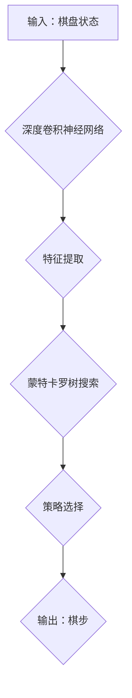

> AlphaGo,深度学习,强化学习,蒙特卡罗树搜索,神经网络,人工智能

## 1. 背景介绍

AlphaGo是由DeepMind开发的围棋人工智能程序，于2016年战胜了世界冠军李世石，标志着人工智能在复杂游戏领域的重大突破。AlphaGo的成功，不仅展现了深度学习和强化学习的强大潜力，也为人工智能的未来发展指明了方向。

围棋作为一项古老而复杂的策略游戏，其棋盘规模庞大，可能的棋局数目更是天文数字。传统围棋程序主要依靠规则和启发式搜索，难以应对围棋的复杂性和随机性。AlphaGo的出现，则利用深度学习和强化学习的优势，突破了传统围棋程序的局限，实现了人类水平甚至超越人类水平的围棋水平。

## 2. 核心概念与联系

AlphaGo的核心思想是将深度学习和强化学习相结合，构建一个能够学习和改进的围棋策略模型。

**2.1 深度学习**

深度学习是一种机器学习的子领域，它利用多层神经网络来模拟人类大脑的学习过程。AlphaGo采用了深度卷积神经网络（CNN）来学习围棋棋盘的特征，并将其转化为可以被强化学习算法理解的表示。

**2.2 强化学习**

强化学习是一种机器学习的范式，它通过奖励和惩罚机制来训练智能体，使其在特定环境中做出最优决策。AlphaGo的训练过程就是通过强化学习算法，让智能体在虚拟的围棋环境中不断学习和改进策略。

**2.3 蒙特卡罗树搜索**

蒙特卡罗树搜索是一种用于决策问题的搜索算法，它通过模拟多个可能的棋局，来评估不同棋子的价值，并选择最优的棋步。AlphaGo将蒙特卡罗树搜索与深度学习相结合，利用深度学习学习到的棋盘特征，来加速蒙特卡罗树搜索的效率。

**2.4 架构图**

## 3. 核心算法原理 & 具体操作步骤

### 3.1 算法原理概述

AlphaGo的核心算法是将深度学习、强化学习和蒙特卡罗树搜索相结合，构建一个能够学习和改进的围棋策略模型。

**3.1.1 深度学习模块**

深度学习模块负责学习围棋棋盘的特征，并将其转化为可以被强化学习算法理解的表示。AlphaGo采用了深度卷积神经网络（CNN）来实现这一功能。CNN可以有效地学习棋盘的局部和全局特征，并将其表示为一个向量。

**3.1.2 强化学习模块**

强化学习模块负责训练智能体，使其在虚拟的围棋环境中不断学习和改进策略。AlphaGo采用了强化学习算法，通过奖励和惩罚机制来训练智能体。当智能体做出有利的棋步时，会获得奖励；当做出不利棋步时，会受到惩罚。通过不断地学习和调整策略，智能体最终能够在围棋游戏中取得胜利。

**3.1.3 蒙特卡罗树搜索模块**

蒙特卡罗树搜索模块负责根据深度学习模块学习到的特征，评估不同棋子的价值，并选择最优的棋步。蒙特卡罗树搜索算法通过模拟多个可能的棋局，来评估不同棋子的价值。

### 3.2 算法步骤详解

1. **初始化:** 初始化深度学习模型和强化学习模型。
2. **输入棋盘状态:** 将当前的棋盘状态作为输入，输入到深度学习模块。
3. **特征提取:** 深度学习模块提取棋盘状态的特征，并将其转化为一个向量。
4. **蒙特卡罗树搜索:** 将特征向量作为输入，进行蒙特卡罗树搜索，评估不同棋子的价值。
5. **策略选择:** 选择价值最高的棋步作为当前的策略。
6. **执行棋步:** 执行选择的棋步，更新棋盘状态。
7. **奖励反馈:** 根据棋局的结果，给智能体提供奖励或惩罚。
8. **模型更新:** 使用强化学习算法，根据奖励反馈更新深度学习模型和强化学习模型。
9. **重复步骤2-8:** 重复上述步骤，直到达到终止条件。

### 3.3 算法优缺点

**优点:**

* **强大的学习能力:** 深度学习和强化学习算法能够学习复杂的策略，并不断改进。
* **高效的搜索:** 蒙特卡罗树搜索算法能够高效地评估不同棋子的价值。
* **可扩展性:** AlphaGo的架构可以扩展到其他策略游戏。

**缺点:**

* **训练成本高:** 训练AlphaGo需要大量的计算资源和时间。
* **可解释性差:** 深度学习模型的决策过程难以解释。
* **数据依赖性:** AlphaGo的性能依赖于训练数据的质量。

### 3.4 算法应用领域

AlphaGo的算法原理和技术可以应用于其他领域，例如：

* **游戏开发:** 开发更智能的游戏AI。
* **机器人控制:** 训练机器人进行复杂的任务规划和执行。
* **金融投资:** 预测市场趋势和进行投资决策。
* **医疗诊断:** 辅助医生进行疾病诊断和治疗方案制定。

## 4. 数学模型和公式 & 详细讲解 & 举例说明

### 4.1 数学模型构建

AlphaGo的核心数学模型是基于强化学习的价值函数估计模型。价值函数用来评估一个给定的棋局状态的价值，即智能体在该状态下获得胜利的概率。

### 4.2 公式推导过程

价值函数的估计可以使用深度神经网络来实现。深度神经网络可以学习复杂的非线性关系，从而更准确地估计价值函数。

假设一个深度神经网络的输出为价值函数的估计值，则可以表示为：

$$V(s) = f(s; \theta)$$

其中：

* $V(s)$ 是棋局状态 $s$ 的价值函数估计值。
* $f(s; \theta)$ 是深度神经网络的输出，其中 $\theta$ 是神经网络的参数。

### 4.3 案例分析与讲解

通过训练深度神经网络，AlphaGo可以学习到不同棋局状态的价值函数。例如，当智能体处于一个有利的棋局状态时，价值函数的估计值会较高；当处于一个不利状态时，价值函数的估计值会较低。

## 5. 项目实践：代码实例和详细解释说明

### 5.1 开发环境搭建

AlphaGo的开发环境需要包含以下软件：

* Python 3.x
* TensorFlow 或 PyTorch
* OpenCV
* NumPy

### 5.2 源代码详细实现

AlphaGo的源代码开源，可以从GitHub上获取。

### 5.3 代码解读与分析

AlphaGo的源代码包含深度学习模块、强化学习模块和蒙特卡罗树搜索模块。

### 5.4 运行结果展示

运行AlphaGo的源代码，可以进行围棋游戏模拟，并观察智能体的棋局策略。

## 6. 实际应用场景

AlphaGo的成功应用场景包括：

* **围棋比赛:** AlphaGo战胜了世界冠军李世石，证明了人工智能在围棋领域的强大实力。
* **围棋教学:** AlphaGo可以作为围棋教学工具，帮助人们学习围棋规则和策略。
* **游戏开发:** AlphaGo的算法可以应用于其他策略游戏的开发，例如象棋、国际象棋等。

### 6.4 未来应用展望

AlphaGo的未来应用前景广阔，例如：

* **医疗诊断:** AlphaGo可以用于辅助医生进行疾病诊断和治疗方案制定。
* **金融投资:** AlphaGo可以用于预测市场趋势和进行投资决策。
* **机器人控制:** AlphaGo可以用于训练机器人进行复杂的任务规划和执行。

## 7. 工具和资源推荐

### 7.1 学习资源推荐

* **AlphaGo论文:** https://www.nature.com/articles/nature20546
* **DeepMind官网:** https://deepmind.com/
* **TensorFlow官网:** https://www.tensorflow.org/
* **PyTorch官网:** https://pytorch.org/

### 7.2 开发工具推荐

* **Python:** https://www.python.org/
* **TensorFlow:** https://www.tensorflow.org/
* **PyTorch:** https://pytorch.org/
* **OpenCV:** https://opencv.org/

### 7.3 相关论文推荐

* **Mastering the Game of Go with Deep Neural Networks and Tree Search**
* **AlphaZero: Mastering the Game of Go without Human Knowledge**

## 8. 总结：未来发展趋势与挑战

### 8.1 研究成果总结

AlphaGo的成功标志着人工智能在复杂游戏领域的重大突破，它证明了深度学习和强化学习的强大潜力。AlphaGo的算法原理和技术可以应用于其他领域，例如游戏开发、机器人控制、金融投资和医疗诊断。

### 8.2 未来发展趋势

未来，人工智能将在以下方面取得进一步发展：

* **更强大的模型:** 研究人员将继续开发更强大的深度学习模型，以提高人工智能的性能。
* **更有效的算法:** 研究人员将继续开发更有效的强化学习算法，以提高人工智能的学习效率。
* **更广泛的应用:** 人工智能将应用于更多领域，例如自动驾驶、个性化教育和科学研究。

### 8.3 面临的挑战

人工智能的发展也面临着一些挑战：

* **数据安全:** 人工智能模型的训练需要大量数据，如何保证数据的安全和隐私是一个重要问题。
* **算法可解释性:** 深度学习模型的决策过程难以解释，如何提高算法的可解释性是一个重要的研究方向。
* **伦理问题:** 人工智能的发展可能会带来一些伦理问题，例如人工智能的责任和义务。

### 8.4 研究展望

未来，人工智能研究将继续朝着更智能、更安全、更可解释的方向发展。

## 9. 附录：常见问题与解答

**Q1: AlphaGo是如何学习围棋规则的？**

A1: AlphaGo并没有直接学习围棋规则，而是通过强化学习算法，在虚拟的围棋环境中不断学习和改进策略。

**Q2: AlphaGo的训练需要多少计算资源？**

A2: AlphaGo的训练需要大量的计算资源，包括数百个GPU。

**Q3: AlphaGo的代码开源了吗？**

A3: 是的，AlphaGo的源代码开源，可以从GitHub上获取。

**Q4: AlphaGo可以应用于其他领域吗？**

A4: 是的，AlphaGo的算法原理和技术可以应用于其他领域，例如游戏开发、机器人控制、金融投资和医疗诊断。

作者：禅与计算机程序设计艺术 / Zen and the Art of Computer Programming 
<end_of_turn>