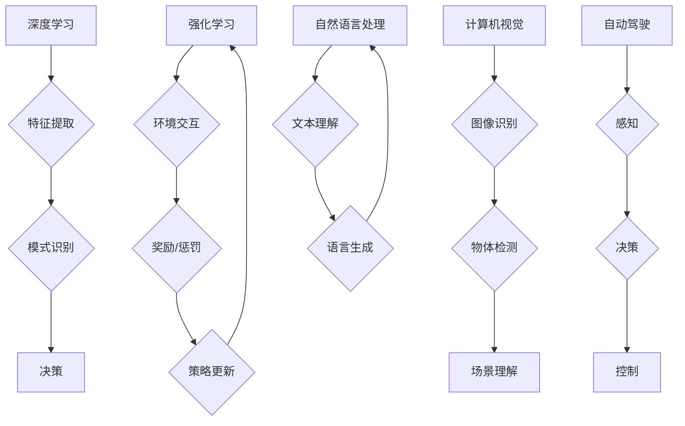

> 人工智能，深度学习，强化学习，计算机视觉，自然语言处理，自动驾驶，伦理

## 1. 背景介绍

人工智能（AI）正以惊人的速度发展，从自动驾驶到医疗诊断，AI正在改变着我们生活的方方面面。作为一名计算机领域大师，我深信AI技术将继续推动人类社会进步，但同时也面临着许多挑战和机遇。

在过去几十年中，深度学习算法取得了突破性的进展，推动了AI技术的飞速发展。然而，深度学习仍然存在一些局限性，例如数据依赖性强、解释性差、泛化能力有限等。因此，我们需要探索新的AI发展方向，以克服这些挑战，并实现更智能、更安全、更可持续的人工智能。

## 2. 核心概念与联系

**2.1 深度学习**

深度学习是一种机器学习的子领域，它利用多层神经网络来模拟人类大脑的学习过程。深度学习算法能够从海量数据中自动提取特征，并学习复杂的模式和关系。

**2.2 强化学习**

强化学习是一种基于奖励机制的机器学习方法。在强化学习中，一个智能体通过与环境交互，并根据环境的反馈（奖励或惩罚）来学习最优的行为策略。

**2.3 计算机视觉**

计算机视觉是人工智能的一个重要分支，它致力于使计算机能够“看”和理解图像和视频。计算机视觉技术广泛应用于图像识别、物体检测、场景理解等领域。

**2.4 自然语言处理**

自然语言处理（NLP）是人工智能的另一个重要分支，它致力于使计算机能够理解和处理人类语言。NLP技术广泛应用于机器翻译、文本摘要、情感分析等领域。

**2.5 自动驾驶**

自动驾驶是人工智能的一个应用领域，它利用计算机视觉、传感器数据和机器学习算法来控制车辆的自动驾驶。

**2.6 伦理问题**

随着人工智能技术的快速发展，其伦理问题也日益受到关注。例如，AI算法的偏见、隐私保护、责任归属等问题都需要得到认真思考和解决。

**Mermaid 流程图**



## 3. 核心算法原理 & 具体操作步骤

### 3.1 算法原理概述

深度学习算法的核心是多层神经网络。神经网络由许多相互连接的神经元组成，每个神经元接收来自其他神经元的输入，并根据权重进行计算，最终输出一个信号。通过训练神经网络，可以调整神经元的权重，使网络能够学习复杂的模式和关系。

### 3.2 算法步骤详解

1. **数据预处理:** 将原始数据转换为神经网络可以理解的格式。
2. **网络结构设计:** 根据任务需求设计神经网络的结构，包括层数、神经元数量、激活函数等。
3. **参数初始化:** 为神经网络的参数（权重和偏置）进行随机初始化。
4. **前向传播:** 将输入数据通过神经网络进行前向传播，得到输出结果。
5. **损失函数计算:** 计算输出结果与真实值的差异，即损失函数的值。
6. **反向传播:** 根据损失函数的梯度，反向传播误差，更新神经网络的参数。
7. **迭代训练:** 重复步骤4-6，直到损失函数达到预设的阈值。

### 3.3 算法优缺点

**优点:**

* 能够自动提取特征，无需人工特征工程。
* 能够学习复杂的模式和关系。
* 在许多任务上取得了突破性的性能。

**缺点:**

* 数据依赖性强，需要大量的训练数据。
* 解释性差，难以理解模型的决策过程。
* 泛化能力有限，可能在新的数据上表现不佳。

### 3.4 算法应用领域

* **计算机视觉:** 图像识别、物体检测、场景理解、图像生成等。
* **自然语言处理:** 机器翻译、文本摘要、情感分析、对话系统等。
* **语音识别:** 语音转文本、语音助手等。
* **推荐系统:** 商品推荐、内容推荐等。
* **医疗诊断:** 病情诊断、疾病预测等。

## 4. 数学模型和公式 & 详细讲解 & 举例说明

### 4.1 数学模型构建

深度学习算法的核心是神经网络，其数学模型可以表示为一系列的线性变换和非线性激活函数。

**线性变换:**

$$
y = Wx + b
$$

其中，$x$ 是输入向量，$W$ 是权重矩阵，$b$ 是偏置向量，$y$ 是输出向量。

**非线性激活函数:**

$$
f(y)
$$

激活函数的作用是引入非线性，使神经网络能够学习复杂的模式。常见的激活函数包括 sigmoid 函数、ReLU 函数、tanh 函数等。

### 4.2 公式推导过程

深度学习算法的训练过程是通过反向传播算法来实现的。反向传播算法的核心是计算损失函数的梯度，并根据梯度更新神经网络的参数。

**损失函数:**

$$
L(y, \hat{y})
$$

其中，$y$ 是真实值，$\hat{y}$ 是预测值。

**梯度:**

$$
\frac{\partial L}{\partial W}, \frac{\partial L}{\partial b}
$$

**参数更新:**

$$
W = W - \alpha \frac{\partial L}{\partial W}
$$

$$
b = b - \alpha \frac{\partial L}{\partial b}
$$

其中，$\alpha$ 是学习率。

### 4.3 案例分析与讲解

例如，在图像分类任务中，我们可以使用卷积神经网络（CNN）来训练一个模型，能够识别不同类型的图像。CNN 的结构包含多个卷积层、池化层和全连接层。

卷积层的作用是提取图像的特征，池化层的作用是降低特征的维度，全连接层的作用是将特征进行分类。

通过训练 CNN 模型，我们可以学习到图像特征和类别之间的映射关系，从而实现图像分类。

## 5. 项目实践：代码实例和详细解释说明

### 5.1 开发环境搭建

为了实现深度学习项目，我们需要搭建一个合适的开发环境。常用的开发环境包括：

* **Python:** 深度学习的编程语言。
* **TensorFlow/PyTorch:** 深度学习框架。
* **GPU:** 加速深度学习训练的硬件。

### 5.2 源代码详细实现

以下是一个简单的深度学习代码示例，使用 TensorFlow 框架实现一个简单的线性回归模型：

```python
import tensorflow as tf

# 定义模型
model = tf.keras.models.Sequential([
    tf.keras.layers.Dense(units=1, input_shape=[1])
])

# 编译模型
model.compile(optimizer='sgd', loss='mean_squared_error')

# 训练模型
model.fit(x=tf.constant([[1.0], [2.0], [3.0]]), y=tf.constant([[2.0], [4.0], [6.0]]), epochs=100)

# 预测
prediction = model.predict(tf.constant([[4.0]]))
print(prediction)
```

### 5.3 代码解读与分析

这段代码定义了一个简单的线性回归模型，包含一个全连接层。模型的输入是一个单一的特征，输出是一个预测值。

模型使用随机梯度下降（SGD）作为优化器，均方误差（MSE）作为损失函数。

模型训练了100个 epochs，并使用训练数据预测了新的数据点。

### 5.4 运行结果展示

运行这段代码后，会输出模型的预测结果。

## 6. 实际应用场景

### 6.1 自动驾驶

自动驾驶系统利用计算机视觉、传感器数据和机器学习算法来控制车辆的自动驾驶。深度学习算法可以帮助自动驾驶系统识别道路标志、交通信号灯、行人、车辆等，并做出相应的决策。

### 6.2 医疗诊断

深度学习算法可以用于辅助医生进行医疗诊断。例如，可以训练一个模型来识别肺部肿瘤、皮肤癌等疾病。

### 6.3 金融风险管理

深度学习算法可以用于金融风险管理，例如识别欺诈交易、预测股票价格等。

### 6.4 未来应用展望

未来，人工智能技术将应用于更多领域，例如教育、娱乐、制造业等。

## 7. 工具和资源推荐

### 7.1 学习资源推荐

* **课程:**
    * Andrew Ng 的机器学习课程
    * DeepLearning.AI 的深度学习专业证书课程
* **书籍:**
    * 深度学习
    * 人工智能：一种现代方法
* **网站:**
    * TensorFlow 官网
    * PyTorch 官网
    * arXiv

### 7.2 开发工具推荐

* **TensorFlow:** 开源深度学习框架
* **PyTorch:** 开源深度学习框架
* **Keras:** 高级深度学习API

### 7.3 相关论文推荐

* **ImageNet Classification with Deep Convolutional Neural Networks**
* **Attention Is All You Need**
* **Generative Adversarial Networks**

## 8. 总结：未来发展趋势与挑战

### 8.1 研究成果总结

近年来，人工智能技术取得了显著进展，深度学习算法在许多领域取得了突破性的成果。

### 8.2 未来发展趋势

* **更强大的模型:** 研究人员将继续开发更强大的深度学习模型，例如 Transformer 模型、生成对抗网络等。
* **更广泛的应用:** 人工智能技术将应用于更多领域，例如医疗、教育、金融等。
* **更强的解释性:** 研究人员将致力于提高深度学习模型的解释性，使模型的决策过程更加透明。

### 8.3 面临的挑战

* **数据隐私:** 人工智能算法依赖于大量数据，如何保护数据隐私是一个重要的挑战。
* **算法偏见:** 人工智能算法可能存在偏见，这可能导致不公平的结果。
* **安全性和可靠性:** 人工智能系统需要保证安全性和可靠性，避免出现意外情况。

### 8.4 研究展望

未来，人工智能研究将继续朝着更智能、更安全、更可持续的方向发展。

## 9. 附录：常见问题与解答

**Q1: 深度学习和机器学习有什么区别？**

**A1:** 机器学习是人工智能的一个子领域，它旨在让计算机从数据中学习，而深度学习是机器学习的一种特殊形式，它使用多层神经网络来模拟人类大脑的学习过程。

**Q2: 如何选择合适的深度学习框架？**

**A2:** TensorFlow 和 PyTorch 是两个流行的深度学习框架， TensorFlow 更适合于生产环境，而 PyTorch 更适合于研究。

**Q3: 如何解决深度学习模型的过拟合问题？**

**A3:** 过拟合是指模型在训练数据上表现很好，但在测试数据上表现较差。解决过拟合的方法包括：增加训练数据、使用正则化技术、使用 dropout 技术等。


作者：禅与计算机程序设计艺术 / Zen and the Art of Computer Programming 
<end_of_turn>