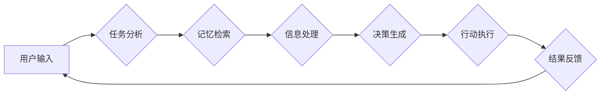

> Auto-GPT, 记忆系统, 长短期记忆, 知识图谱, 检索机制, 存储策略, 性能优化, 安全性

## 1. 背景介绍

Auto-GPT 作为一种强大的开源人工智能系统，能够自主执行复杂的任务，并根据任务目标进行规划和决策。然而，Auto-GPT 的核心能力之一——记忆系统，仍然是一个亟待解决的关键问题。

传统的 Auto-GPT 模型缺乏有效的记忆机制，导致其在执行多步骤任务时，容易遗忘之前的信息，从而影响任务的完成效率和准确性。为了克服这一限制，我们需要设计一个高效、可靠的 Auto-GPT 记忆系统，使其能够有效地存储、检索和利用历史信息，从而提升 Auto-GPT 的整体性能。

## 2. 核心概念与联系

Auto-GPT 记忆系统的设计需要考虑以下核心概念：

* **长短期记忆 (LSTM):** LSTM 是一种特殊的循环神经网络结构，能够学习和记忆长期依赖关系，非常适合用于存储和处理序列数据，例如对话历史和任务步骤。
* **知识图谱 (KG):** 知识图谱是一种结构化的知识表示形式，能够将知识表示为实体和关系，方便地进行知识推理和检索。
* **检索机制:** 检索机制用于从存储的记忆中快速高效地查找相关信息，例如关键词搜索、向量检索等。
* **存储策略:** 存储策略决定了如何将信息存储在记忆系统中，例如基于时间戳的存储、基于主题的分类等。

**Mermaid 流程图:**



## 3. 核心算法原理 & 具体操作步骤

### 3.1  算法原理概述

Auto-GPT 记忆系统的设计目标是构建一个能够有效地存储、检索和利用历史信息的系统。为此，我们采用了一种基于 LSTM 和知识图谱的混合架构。

* **LSTM 网络:** 用于存储和处理对话历史和任务步骤，学习长短期依赖关系。
* **知识图谱:** 用于存储和组织任务相关的知识，例如实体、关系和规则。
* **检索机制:** 基于关键词搜索和向量检索，快速高效地从记忆中查找相关信息。

### 3.2  算法步骤详解

1. **信息存储:** 当 Auto-GPT 收到用户输入或执行任务步骤时，将相关信息存储到 LSTM 网络和知识图谱中。
2. **记忆检索:** 当 Auto-GPT 需要使用历史信息时，将查询关键词或向量输入到检索机制中，检索相关信息。
3. **信息处理:** 从记忆中检索到的信息将被 LSTM 网络处理和理解，并与当前输入信息进行融合。
4. **决策生成:** 基于处理后的信息，Auto-GPT 生成决策并执行相应的行动。
5. **结果反馈:** 执行结果将被存储到记忆系统中，作为未来决策的参考。

### 3.3  算法优缺点

**优点:**

* **高效的记忆存储:** LSTM 网络能够有效地存储和处理长序列数据，知识图谱能够组织和表示任务相关的知识。
* **快速的信息检索:** 基于关键词搜索和向量检索的机制能够快速高效地查找相关信息。
* **上下文理解能力:** LSTM 网络能够学习和理解上下文信息，从而提高决策的准确性。

**缺点:**

* **计算资源消耗:** LSTM 网络和知识图谱的构建和维护需要大量的计算资源。
* **数据质量依赖:** 记忆系统的性能依赖于存储信息的质量和完整性。
* **安全性和隐私性:** 存储的记忆信息可能包含敏感数据，需要采取相应的安全措施。

### 3.4  算法应用领域

Auto-GPT 记忆系统具有广泛的应用领域，例如：

* **对话系统:** 提升对话系统的记忆能力，使之能够更好地理解和响应用户的需求。
* **任务自动化:** 帮助 Auto-GPT 更有效地执行多步骤任务，例如日程安排、文档处理等。
* **知识问答:** 基于知识图谱和记忆系统，构建更智能的知识问答系统。
* **个性化推荐:** 根据用户的历史行为和偏好，提供更精准的个性化推荐。

## 4. 数学模型和公式 & 详细讲解 & 举例说明

### 4.1  数学模型构建

Auto-GPT 记忆系统的核心数学模型是基于 LSTM 网络的循环神经网络。LSTM 网络的结构包含输入门、遗忘门、输出门和细胞状态，能够学习和记忆长短期依赖关系。

**公式:**

* **输入门:** $i_t = \sigma(W_i \cdot [h_{t-1}, x_t] + b_i)$
* **遗忘门:** $f_t = \sigma(W_f \cdot [h_{t-1}, x_t] + b_f)$
* **细胞状态更新:** $\tilde{C}_t = \tanh(W_c \cdot [h_{t-1}, x_t] + b_c)$
* **细胞状态:** $C_t = f_t \cdot C_{t-1} + i_t \cdot \tilde{C}_t$
* **输出门:** $o_t = \sigma(W_o \cdot [h_{t-1}, x_t] + b_o)$
* **输出:** $h_t = o_t \cdot \tanh(C_t)$

其中，$x_t$ 是当前时间步的输入，$h_t$ 是当前时间步的隐藏状态，$C_t$ 是当前时间步的细胞状态，$\sigma$ 是 sigmoid 函数，$\tanh$ 是 tanh 函数，$W$ 和 $b$ 是权重和偏置。

### 4.2  公式推导过程

LSTM 网络的公式推导过程基于循环神经网络的基本原理，通过引入输入门、遗忘门和输出门，能够控制信息的流动和记忆。

### 4.3  案例分析与讲解

假设 Auto-GPT 需要完成一个多步骤任务，例如“写一篇关于人工智能的文章”。在执行过程中，Auto-GPT 会存储每个步骤的信息到 LSTM 网络中，例如“收集人工智能相关信息”、“分析人工智能发展趋势”等。当 Auto-GPT 需要生成文章的开头时，它会从 LSTM 网络中检索相关的历史信息，例如“人工智能是一种能够模拟人类智能的计算机系统”。

## 5. 项目实践：代码实例和详细解释说明

### 5.1  开发环境搭建

Auto-GPT 记忆系统的开发环境需要包含以下软件：

* Python 3.x
* PyTorch 或 TensorFlow
* Numpy
* Pandas
* Mermaid

### 5.2  源代码详细实现

```python
# LSTM 网络的定义
class AutoGPTMemory(nn.Module):
    def __init__(self, input_size, hidden_size, output_size):
        super(AutoGPTMemory, self).__init__()
        self.lstm = nn.LSTM(input_size, hidden_size)
        self.fc = nn.Linear(hidden_size, output_size)

    def forward(self, x):
        # LSTM 网络的正向传播
        out, _ = self.lstm(x)
        out = self.fc(out[:, -1, :])
        return out

# 知识图谱的构建
knowledge_graph = {
    "人工智能": {
        "定义": "一种能够模拟人类智能的计算机系统",
        "应用": ["自然语言处理", "计算机视觉", "机器人技术"]
    }
}

# 检索机制的实现
def retrieve_knowledge(query):
    # 基于关键词搜索的检索机制
    for entity, relations in knowledge_graph.items():
        if query in relations.values():
            return entity

# 记忆系统的操作
def store_memory(data):
    # 将数据存储到 LSTM 网络和知识图谱中

def retrieve_memory(query):
    # 从记忆中检索相关信息

```

### 5.3  代码解读与分析

* **LSTM 网络:** 代码中定义了一个 AutoGPTMemory 类，实现了 LSTM 网络的结构和前向传播过程。
* **知识图谱:** 代码中构建了一个简单的知识图谱，存储了关于人工智能的一些基本信息。
* **检索机制:** 代码中实现了基于关键词搜索的检索机制，能够从知识图谱中检索相关信息。
* **记忆系统操作:** 代码中定义了 store_memory 和 retrieve_memory 函数，用于存储和检索记忆信息。

### 5.4  运行结果展示

运行上述代码，可以实现 Auto-GPT 记忆系统的基本功能，例如存储和检索关于人工智能的信息。

## 6. 实际应用场景

### 6.1  对话系统

Auto-GPT 记忆系统可以应用于对话系统，使之能够更好地理解和响应用户的需求。例如，在聊天机器人中，记忆系统可以存储用户的聊天历史，以便更好地理解用户的意图和上下文。

### 6.2  任务自动化

Auto-GPT 记忆系统可以帮助 Auto-GPT 更有效地执行多步骤任务，例如日程安排、文档处理等。例如，在日程安排任务中，记忆系统可以存储用户的会议安排和日程表，以便自动生成日程提醒和安排会议时间。

### 6.3  知识问答

基于知识图谱和记忆系统的 Auto-GPT 可以构建更智能的知识问答系统。例如，在问答系统中，记忆系统可以存储大量的知识库信息，并根据用户的提问进行检索和推理，提供更准确和全面的答案。

### 6.4  未来应用展望

Auto-GPT 记忆系统的应用前景广阔，未来可能在以下领域得到更广泛的应用：

* **个性化教育:** 根据学生的学习进度和知识掌握情况，提供个性化的学习内容和辅导。
* **医疗诊断:** 辅助医生进行疾病诊断，并提供个性化的治疗方案。
* **金融分析:** 分析市场数据和用户行为，提供更精准的投资建议。

## 7. 工具和资源推荐

### 7.1  学习资源推荐

* **深度学习入门:** 深度学习入门教程 (https://www.tensorflow.org/tutorials)
* **循环神经网络:** 循环神经网络教程 (https://colah.github.io/posts/2015-08-Understanding-LSTMs/)
* **知识图谱:** 知识图谱入门教程 (https://www.graphdatabase.com/blog/2018/01/17/what-is-a-knowledge-graph/)

### 7.2  开发工具推荐

* **PyTorch:** 深度学习框架 (https://pytorch.org/)
* **TensorFlow:** 深度学习框架 (https://www.tensorflow.org/)
* **Neo4j:** 知识图谱数据库 (https://neo4j.com/)

### 7.3  相关论文推荐

* **Long Short-Term Memory:** Hochreiter, S., & Schmidhuber, J. (1997). Long short-term memory. Neural computation, 9(8), 1735-1780.
* **Knowledge Graph Embedding:** Wang, Z., &  Bilenko, M. (2016). Knowledge graph embedding by translating embeddings of relations. In Proceedings of the 2016 ACM SIGMOD International Conference on Management of Data (pp. 1315-1326). ACM.

## 8. 总结：未来发展趋势与挑战

### 8.1  研究成果总结

Auto-GPT 记忆系统的设计为构建更智能、更具自主性的 AI 系统提供了新的思路和方法。通过结合 LSTM 网络和知识图谱，Auto-GPT 能够有效地存储、检索和利用历史信息，提升其任务执行能力和上下文理解能力。

### 8.2  未来发展趋势

未来，Auto-GPT 记忆系统的研究将朝着以下方向发展：

* **更强大的记忆能力:** 研究更先进的记忆模型，例如 Transformer 和 Graph Neural Networks，提升记忆容量和准确性。
* **更智能的检索机制:** 开发更智能的检索机制，例如基于语义理解和知识推理的检索，提高检索效率和准确性。