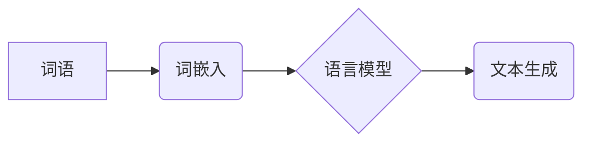

> Embedding, 语言模型, 词向量, 深度学习, 自然语言处理, 机器学习, Transformer, BERT, GPT

## 1. 背景介绍

在当今数据爆炸的时代，自然语言处理（NLP）领域取得了长足的进步。语言模型作为NLP的核心技术之一，能够理解和生成人类语言，在文本生成、机器翻译、问答系统等领域发挥着越来越重要的作用。而Embedding技术作为语言模型的基础，为理解和处理文本提供了强大的工具。

传统的词袋模型将文本表示为词频统计，忽略了词语之间的语义关系。Embedding技术通过将词语映射到低维向量空间中，捕捉了词语之间的语义相似性和上下文关系，从而提升了语言模型的理解和生成能力。

## 2. 核心概念与联系

**2.1 词嵌入 (Word Embedding)**

词嵌入是指将每个词语映射到一个低维向量空间中的技术。每个词语的向量表示包含了该词语的语义信息，相似的词语在向量空间中距离较近。

**2.2 语言模型 (Language Model)**

语言模型是一种能够预测文本序列中下一个词语的概率分布的统计模型。它学习了语言的语法和语义规则，能够生成流畅、合理的文本。

**2.3 关系图**



**2.4 Embedding在语言模型中的作用**

Embedding技术为语言模型提供了词语的语义表示，使得语言模型能够更好地理解和处理文本。

* **提升词语表示能力:** Embedding将词语映射到低维向量空间，捕捉了词语之间的语义关系，提升了词语的表示能力。
* **降低模型复杂度:** 使用Embedding技术可以将词语表示为稠密的向量，减少了模型参数的数量，降低了模型的复杂度。
* **提高模型性能:** Embedding技术可以提升语言模型的准确性和生成质量，例如在机器翻译、文本摘要等任务中。

## 3. 核心算法原理 & 具体操作步骤

**3.1 算法原理概述**

常见的词嵌入算法包括Word2Vec、GloVe和FastText等。这些算法都基于神经网络的训练，通过大量的文本数据学习词语的向量表示。

**3.2 算法步骤详解**

以Word2Vec为例，其训练过程主要包括以下步骤：

1. **构建词语上下文窗口:** 对于每个词语，选择其前后一定范围内的词语作为上下文窗口。
2. **训练神经网络:** 使用神经网络模型，将词语上下文窗口映射到词语的向量表示。
3. **优化模型参数:** 使用梯度下降算法，优化神经网络模型的参数，使得模型能够准确预测词语的上下文关系。
4. **得到词语向量:** 训练完成后，每个词语都将拥有一个唯一的向量表示。

**3.3 算法优缺点**

**Word2Vec:**

* **优点:** 训练速度快，效果好，能够捕捉词语之间的语义关系。
* **缺点:** 无法处理长距离依赖关系，对稀有词语的表示能力较弱。

**GloVe:**

* **优点:** 能够处理长距离依赖关系，对稀有词语的表示能力较强。
* **缺点:** 训练速度较慢，参数量较大。

**FastText:**

* **优点:** 能够利用词语的子词信息，对稀有词语的表示能力更强。
* **缺点:** 训练速度较慢，参数量较大。

**3.4 算法应用领域**

词嵌入技术广泛应用于NLP领域，例如：

* **机器翻译:** 使用词嵌入技术可以提高机器翻译的准确性和流畅度。
* **文本分类:** 使用词嵌入技术可以提高文本分类的准确率。
* **问答系统:** 使用词嵌入技术可以提高问答系统的准确性和相关性。
* **文本生成:** 使用词嵌入技术可以生成更流畅、更自然的文本。

## 4. 数学模型和公式 & 详细讲解 & 举例说明

**4.1 数学模型构建**

Word2Vec模型的核心是神经网络结构，其中包括输入层、隐藏层和输出层。

* **输入层:** 接收词语的one-hot编码。
* **隐藏层:** 使用神经网络单元对词语的one-hot编码进行处理，生成词语的向量表示。
* **输出层:** 预测词语的上下文关系。

**4.2 公式推导过程**

Word2Vec模型使用负采样技术来训练神经网络。负采样是指随机抽取一些不属于词语上下文的词语作为负样本，并训练模型预测正样本和负样本之间的差异。

**损失函数:**

$$
J(\theta) = -\frac{1}{N} \sum_{i=1}^{N} \log \sigma(u_i^T v_j)
$$

其中：

* $N$ 是训练样本的数量。
* $u_i$ 是词语 $i$ 的向量表示。
* $v_j$ 是词语 $j$ 的向量表示。
* $\sigma$ 是sigmoid函数。

**4.3 案例分析与讲解**

假设我们有一个句子 "The cat sat on the mat"，我们想要学习词语 "cat" 的向量表示。

1. 构建词语上下文窗口，例如 "The cat" 和 "sat on the"。
2. 使用Word2Vec模型训练，将词语上下文窗口映射到词语的向量表示。
3. 训练完成后，"cat" 的向量表示将包含了 "cat" 的语义信息，例如 "动物"、"猫" 等。

## 5. 项目实践：代码实例和详细解释说明

**5.1 开发环境搭建**

* Python 3.6+
* TensorFlow 2.0+
* NLTK

**5.2 源代码详细实现**

```python
import tensorflow as tf
from tensorflow.keras.layers import Embedding, Dense
from tensorflow.keras.models import Sequential

# 数据预处理
# ...

# 模型构建
model = Sequential()
model.add(Embedding(input_dim=vocab_size, output_dim=embedding_dim))
model.add(Dense(units=1, activation='sigmoid'))

# 模型编译
model.compile(optimizer='adam', loss='binary_crossentropy', metrics=['accuracy'])

# 模型训练
model.fit(x_train, y_train, epochs=10)

# 模型评估
loss, accuracy = model.evaluate(x_test, y_test)
print('Loss:', loss)
print('Accuracy:', accuracy)
```

**5.3 代码解读与分析**

* `Embedding` 层将词语映射到低维向量空间。
* `Dense` 层是一个全连接层，用于预测词语的上下文关系。
* `adam` 是常用的优化算法。
* `binary_crossentropy` 是用于二分类问题的损失函数。

**5.4 运行结果展示**

训练完成后，我们可以使用模型预测词语的上下文关系，例如预测 "cat" 的上下文词语。

## 6. 实际应用场景

**6.1 机器翻译**

使用词嵌入技术可以提高机器翻译的准确性和流畅度。例如，Google Translate 使用了词嵌入技术来翻译不同语言之间的文本。

**6.2 文本分类**

使用词嵌入技术可以提高文本分类的准确率。例如，垃圾邮件过滤系统可以使用词嵌入技术来识别垃圾邮件。

**6.3 问答系统**

使用词嵌入技术可以提高问答系统的准确性和相关性。例如，搜索引擎可以使用词嵌入技术来理解用户的问题并返回相关的答案。

**6.4 文本生成**

使用词嵌入技术可以生成更流畅、更自然的文本。例如，聊天机器人可以使用词嵌入技术来生成更自然的人机对话。

**6.5 未来应用展望**

随着深度学习技术的不断发展，词嵌入技术将在更多领域得到应用，例如：

* **个性化推荐:** 使用词嵌入技术可以理解用户的兴趣偏好，并推荐个性化的内容。
* **情感分析:** 使用词嵌入技术可以分析文本的情感倾向，例如判断用户对产品的评价是正面还是负面。
* **知识图谱构建:** 使用词嵌入技术可以构建知识图谱，并进行知识推理。

## 7. 工具和资源推荐

**7.1 学习资源推荐**

* **书籍:**
    * "Deep Learning" by Ian Goodfellow, Yoshua Bengio, and Aaron Courville
    * "Speech and Language Processing" by Daniel Jurafsky and James H. Martin
* **在线课程:**
    * Coursera: Natural Language Processing Specialization
    * Udacity: Deep Learning Nanodegree

**7.2 开发工具推荐**

* **TensorFlow:** 开源深度学习框架
* **PyTorch:** 开源深度学习框架
* **NLTK:** 自然语言处理工具包

**7.3 相关论文推荐**

* "Word2Vec: A Simple and Efficient Method for Learning Word Representations" by Tomas Mikolov et al.
* "GloVe: Global Vectors for Word Representation" by Stanford NLP Group
* "FastText. Enriching Word Vectors with Subword Information" by Facebook AI Research

## 8. 总结：未来发展趋势与挑战

**8.1 研究成果总结**

词嵌入技术在NLP领域取得了显著的成果，例如提高了机器翻译、文本分类、问答系统等任务的性能。

**8.2 未来发展趋势**

* **多模态嵌入:** 将文本、图像、音频等多模态数据融合到嵌入模型中，提升模型的理解能力。
* **动态嵌入:** 学习动态变化的词语向量表示，例如根据上下文或时间变化调整词语的向量表示。
* **可解释性嵌入:** 研究可解释的词嵌入模型，使得模型的决策过程更加透明。

**8.3 面临的挑战**

* **稀有词语表示:** 对于稀有词语，传统的词嵌入模型难以学习到有效的向量表示。
* **长距离依赖关系:** 传统的词嵌入模型难以捕捉长距离依赖关系。
* **数据偏见:** 词嵌入模型容易受到训练数据中的偏见影响。

**8.4 研究展望**

未来研究将继续探索新的词嵌入算法和模型，以解决上述挑战，提升词嵌入技术的性能和应用范围。

## 9. 附录：常见问题与解答

**9.1 什么是词嵌入？**

词嵌入是指将每个词语映射到一个低维向量空间中的技术。

**9.2 词嵌入有什么用？**

词嵌入可以捕捉词语之间的语义关系，提升语言模型的理解和生成能力。

**9.3 常用的词嵌入算法有哪些？**

常见的词嵌入算法包括Word2Vec、GloVe和FastText等。

**9.4 如何选择合适的词嵌入算法？**

选择合适的词嵌入算法需要根据具体的应用场景和数据特点进行选择。


作者：禅与计算机程序设计艺术 / Zen and the Art of Computer Programming 
<end_of_turn>