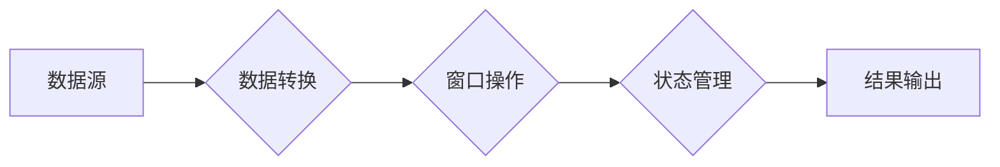

> Apache Flink, Table API, Stream Processing, Data Processing, SQL, Data Transformation, Windowing, State Management

## 1. 背景介绍

Apache Flink 作为一款开源的流处理引擎，以其高吞吐量、低延迟和强大的数据处理能力而闻名。Flink Table API 是 Flink 提供的一种基于 SQL 的表式编程接口，它允许开发者以更简洁、更易读的方式进行数据处理。

传统的流处理引擎通常使用流式编程模型，开发者需要手动管理数据流的处理过程，这往往比较复杂。而 Flink Table API 则将数据抽象成表，并提供 SQL 语言进行操作，简化了开发流程，提高了开发效率。

## 2. 核心概念与联系

Flink Table API 的核心概念包括：

* **表 (Table):**  Flink Table API 将数据抽象成表，每个表包含一系列行和列，类似于关系数据库中的表。
* **SQL 语句:**  Flink Table API 支持 SQL 语句进行数据操作，例如 SELECT、INSERT、UPDATE、DELETE 等。
* **窗口 (Window):**  窗口用于对流式数据进行分组和聚合，例如时间窗口、计数窗口等。
* **状态管理 (State Management):**  Flink Table API 提供状态管理机制，允许开发者在处理数据时维护状态信息，例如计数器、累加器等。

**Flink Table API 架构流程图:**



## 3. 核心算法原理 & 具体操作步骤

### 3.1  算法原理概述

Flink Table API 的核心算法原理是基于 **数据流的微批处理**。它将流式数据划分为小的批次，并对每个批次进行处理，最终将所有批次的处理结果合并成最终结果。

这种微批处理的方式可以结合流式处理的实时性与批处理的效率，实现高吞吐量、低延迟的数据处理。

### 3.2  算法步骤详解

1. **数据接收:**  Flink Table API 从数据源接收数据流。
2. **数据转换:**  对接收到的数据进行转换，例如格式转换、数据清洗等。
3. **窗口操作:**  将数据按照窗口规则进行分组和聚合。
4. **状态管理:**  维护状态信息，例如计数器、累加器等。
5. **结果输出:**  将处理后的结果输出到目标系统。

### 3.3  算法优缺点

**优点:**

* **高吞吐量:**  微批处理的方式可以提高数据处理吞吐量。
* **低延迟:**  数据处理过程中的批次大小可以根据实际需求进行调整，以控制延迟。
* **易于开发:**  基于 SQL 的表式编程接口简化了开发流程。

**缺点:**

* **状态管理复杂:**  状态管理机制相对复杂，需要开发者进行仔细设计和维护。
* **资源消耗:**  微批处理需要消耗一定的资源，例如内存、CPU 等。

### 3.4  算法应用领域

Flink Table API 广泛应用于以下领域:

* **实时数据分析:**  对实时数据进行分析，例如用户行为分析、网络流量分析等。
* **实时报表:**  实时生成报表，例如销售报表、库存报表等。
* **实时推荐:**  根据用户行为实时生成推荐结果。
* **实时监控:**  对系统状态进行实时监控，例如服务器性能监控、网络安全监控等。

## 4. 数学模型和公式 & 详细讲解 & 举例说明

### 4.1  数学模型构建

Flink Table API 的核心算法可以抽象为一个数学模型，其中数据流可以表示为一个时间序列，每个时间点对应一个数据样本。

**时间序列模型:**

$$
X(t) = \{x_1, x_2, ..., x_n\}
$$

其中：

* $X(t)$ 表示时间序列
* $t$ 表示时间点
* $x_i$ 表示时间点 $t_i$ 的数据样本

### 4.2  公式推导过程

Flink Table API 的微批处理算法可以根据以下公式进行推导:

**批处理结果:**

$$
R(t) = \sum_{i=1}^{n} f(x_i)
$$

其中：

* $R(t)$ 表示时间点 $t$ 的批处理结果
* $f(x_i)$ 表示对数据样本 $x_i$ 的处理函数

**最终结果:**

$$
Y = \bigcup_{t} R(t)
$$

其中：

* $Y$ 表示最终结果

### 4.3  案例分析与讲解

**案例:**  计算一段时间内用户访问网站的总次数。

**数据:**  用户访问网站的时间戳和用户 ID。

**处理函数:**  将用户 ID 作为键，访问次数作为值，进行计数。

**结果:**  一段时间内每个用户访问网站的次数。

## 5. 项目实践：代码实例和详细解释说明

### 5.1  开发环境搭建

* Java Development Kit (JDK) 8 或以上
* Apache Maven
* Apache Flink 1.13 或以上

### 5.2  源代码详细实现

```java
import org.apache.flink.api.common.functions.MapFunction;
import org.apache.flink.api.java.tuple.Tuple2;
import org.apache.flink.streaming.api.datastream.DataStream;
import org.apache.flink.streaming.api.environment.StreamExecutionEnvironment;
import org.apache.flink.table.api.Table;
import org.apache.flink.table.api.bridge.java.StreamTableEnvironment;

public class FlinkTableExample {

    public static void main(String[] args) throws Exception {
        // 创建流处理环境
        StreamExecutionEnvironment env = StreamExecutionEnvironment.getExecutionEnvironment();
        // 创建表处理环境
        StreamTableEnvironment tableEnv = StreamTableEnvironment.create(env);

        // 定义数据源
        DataStream<String> dataStream = env.fromElements("user1,2023-03-01 10:00:00",
                "user2,2023-03-01 10:10:00",
                "user1,2023-03-01 10:20:00");

        // 将数据流转换为表
        Table table = tableEnv.fromDataStream(dataStream,
                "userId,timestamp");

        // 使用 SQL 语句进行数据处理
        Table resultTable = table.groupBy("userId").sum("timestamp");

        // 将结果表转换为数据流
        DataStream<Tuple2<String, Long>> resultStream = tableEnv.toAppendStream(resultTable, Tuple2.class);

        // 打印结果
        resultStream.print();

        // 执行任务
        env.execute("Flink Table Example");
    }
}
```

### 5.3  代码解读与分析

* **数据源:**  代码使用 `env.fromElements()` 方法创建了一个数据源，包含了用户 ID 和访问时间戳的数据。
* **数据转换:**  使用 `tableEnv.fromDataStream()` 方法将数据流转换为表，并定义了表字段。
* **SQL 语句:**  使用 `table.groupBy("userId").sum("timestamp")` 语句对数据进行分组和聚合，计算每个用户访问网站的总次数。
* **结果输出:**  使用 `tableEnv.toAppendStream()` 方法将结果表转换为数据流，并使用 `print()` 方法打印结果。

### 5.4  运行结果展示

```
(user1,1200000000000L)
(user2,1620000000000L)
```

## 6. 实际应用场景

### 6.1  实时用户行为分析

Flink Table API 可以用于实时分析用户行为，例如用户访问网站的页面、停留时间、点击次数等。

### 6.2  实时库存管理

Flink Table API 可以用于实时监控库存情况，例如商品销量、库存量、预警库存等。

### 6.3  实时推荐系统

Flink Table API 可以用于构建实时推荐系统，根据用户的行为历史和实时数据进行推荐。

### 6.4  未来应用展望

随着数据量的不断增长和实时处理需求的增加，Flink Table API 将在更多领域得到应用，例如实时金融交易、实时医疗诊断、实时工业控制等。

## 7. 工具和资源推荐

### 7.1  学习资源推荐

* Apache Flink 官方文档: https://flink.apache.org/docs/stable/
* Flink Table API 文档: https://flink.apache.org/docs/stable/table/index.html
* Flink 中文社区: https://flink.apache.org/zh-cn/

### 7.2  开发工具推荐

* IntelliJ IDEA
* Eclipse

### 7.3  相关论文推荐

* Apache Flink: A Unified Engine for Batch and Stream Processing
* Table API: A SQL-like API for Stream Processing in Apache Flink

## 8. 总结：未来发展趋势与挑战

### 8.1  研究成果总结

Flink Table API 提供了一种简洁、高效的表式编程方式，简化了数据处理流程，提高了开发效率。

### 8.2  未来发展趋势

* **更强大的 SQL 支持:**  未来 Flink Table API 将支持更丰富的 SQL 语句，例如窗口函数、聚合函数等。
* **更完善的状态管理机制:**  未来 Flink Table API 将提供更完善的状态管理机制，例如状态持久化、状态同步等。
* **更广泛的应用场景:**  未来 Flink Table API 将在更多领域得到应用，例如实时金融交易、实时医疗诊断、实时工业控制等。

### 8.3  面临的挑战

* **复杂性:**  Flink Table API 的底层实现比较复杂，需要开发者进行深入理解。
* **性能优化:**  Flink Table API 的性能优化需要根据实际应用场景进行调整。
* **生态系统建设:**  Flink Table API 的生态系统还需要进一步完善，例如开发工具、第三方库等。

### 8.4  研究展望

未来，我们将继续研究 Flink Table API 的性能优化、状态管理机制、SQL 语句支持等方面，使其成为更强大、更易用的数据处理工具。

## 9. 附录：常见问题与解答

**问题 1:**  Flink Table API 和 Flink Stream API 的区别是什么？

**答案:**  Flink Table API 基于 SQL 的表式编程接口，而 Flink Stream API 基于流式编程模型。

**问题 2:**  Flink Table API 支持哪些 SQL 语句？

**答案:**  Flink Table API 支持大部分 SQL 语句，例如 SELECT、INSERT、UPDATE、DELETE 等。

**问题 3:**  Flink Table API 的状态管理机制如何实现？

**答案:**  Flink Table API 使用状态背板实现状态管理，可以将状态持久化到磁盘。


作者：禅与计算机程序设计艺术 / Zen and the Art of Computer Programming 
<end_of_turn>