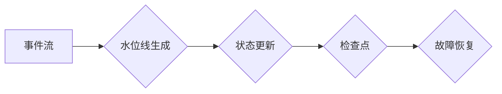

> Flink, Time, Watermark, Event Time, Processing Time, Asynchronous, Synchronous, Trigger, Checkpoint

## 1. 背景介绍

Apache Flink 作为一款强大的流处理引擎，在处理实时数据方面表现出色。其核心之一便是时间管理机制，它为处理事件流提供了强大的功能，例如窗口操作、状态维护和数据聚合。Flink 的时间管理机制基于事件时间和处理时间两种概念，并通过水位线机制来处理事件的延迟和乱序问题。

本文将深入探讨 Flink 的时间管理原理，包括事件时间、处理时间、水位线机制、触发器和检查点等关键概念。通过代码实例和详细讲解，帮助读者理解 Flink 时间管理的运作方式，并掌握如何有效地利用 Flink 处理实时数据。

## 2. 核心概念与联系

### 2.1 事件时间和处理时间

* **事件时间 (Event Time)**：指事件实际发生的时刻，通常由事件本身携带的时间戳信息决定。
* **处理时间 (Processing Time)**：指事件被 Flink 处理的时刻，即事件从进入 Flink 集群到被处理完成的时间。

Flink 支持两种时间观：事件时间和处理时间。

* **事件时间**：更符合业务逻辑，用于处理具有时间语义的事件流，例如股票交易、传感器数据等。
* **处理时间**：更关注事件的处理效率，用于处理需要实时响应的事件流，例如实时监控、告警系统等。

### 2.2 水位线机制

水位线机制是 Flink 处理事件延迟和乱序的关键。

* **水位线 (Watermark)**：表示事件时间上界，用于标记已经处理过的事件时间范围。
* **水位线生成**: Flink 会根据事件时间戳信息，不断更新水位线。当收到一个新的事件时，如果其事件时间戳大于当前水位线，则会更新水位线。

水位线机制可以帮助 Flink 识别已经处理过的事件，并避免重复处理。

### 2.3 触发器和检查点

* **触发器 (Trigger)**：用于控制 Flink 状态更新的时机。
* **检查点 (Checkpoint)**：用于保存 Flink 的状态信息，以便在发生故障时进行恢复。

Flink 的触发器和检查点机制可以保证状态的可靠性和一致性。

### 2.4 Mermaid 流程图



## 3. 核心算法原理 & 具体操作步骤

### 3.1  算法原理概述

Flink 的时间管理机制基于事件时间和处理时间两种时间观，并通过水位线机制来处理事件的延迟和乱序问题。

* **事件时间**: 
    * 事件时间是事件实际发生的时刻，通常由事件本身携带的时间戳信息决定。
    * Flink 使用事件时间来确定事件的排序和窗口划分。
* **处理时间**: 
    * 处理时间是事件被 Flink 处理的时刻，即事件从进入 Flink 集群到被处理完成的时间。
    * Flink 使用处理时间来控制事件的处理顺序和状态更新的时机。
* **水位线**: 
    * 水位线是事件时间上界，用于标记已经处理过的事件时间范围。
    * Flink 会根据事件时间戳信息，不断更新水位线。

### 3.2  算法步骤详解

1. **事件接收**: Flink 从数据源接收事件流，每个事件包含事件时间戳信息。
2. **水位线生成**: Flink 根据事件时间戳信息，不断更新水位线。当收到一个新的事件时，如果其事件时间戳大于当前水位线，则会更新水位线。
3. **事件排序**: Flink 根据事件时间戳信息，对事件进行排序。
4. **窗口划分**: Flink 根据事件时间和窗口定义，将事件划分为不同的窗口。
5. **状态更新**: Flink 根据窗口内容和状态更新规则，更新状态信息。
6. **输出结果**: Flink 将处理后的结果输出到指定的数据目的地。

### 3.3  算法优缺点

**优点**:

* **高可靠性**: Flink 的状态管理机制保证了状态的可靠性和一致性。
* **高吞吐量**: Flink 的并行处理能力和优化算法可以实现高吞吐量。
* **灵活的窗口操作**: Flink 支持多种窗口类型和操作，可以满足不同的业务需求。

**缺点**:

* **复杂性**: Flink 的时间管理机制相对复杂，需要一定的学习成本。
* **资源消耗**: Flink 的状态管理机制会消耗一定的资源，需要根据实际情况进行配置。

### 3.4  算法应用领域

Flink 的时间管理机制广泛应用于以下领域:

* **实时数据分析**: 
    * 股票交易分析
    * 互联网流量分析
    * 异常检测
* **实时监控**: 
    * 系统监控
    * 网络监控
    * 安全监控
* **实时推荐**: 
    * 用户行为分析
    * 商品推荐
    * 个性化服务

## 4. 数学模型和公式 & 详细讲解 & 举例说明

### 4.1  数学模型构建

Flink 的时间管理机制可以抽象为以下数学模型：

* **事件时间**: $t_e$
* **处理时间**: $t_p$
* **水位线**: $w$

其中，$t_e$ 表示事件实际发生的时刻，$t_p$ 表示事件被 Flink 处理的时刻，$w$ 表示事件时间上界。

### 4.2  公式推导过程

* **水位线更新**: 当收到一个新的事件 $e$ 时，如果 $t_e > w$，则更新水位线 $w = t_e$。
* **事件排序**: 根据事件时间戳 $t_e$ 对事件进行排序。
* **窗口划分**: 根据事件时间 $t_e$ 和窗口定义，将事件划分为不同的窗口。

### 4.3  案例分析与讲解

假设我们有一个传感器数据流，每个事件包含温度值和时间戳信息。

* **事件时间**: $t_e$ 表示温度值被传感器采集的时刻。
* **处理时间**: $t_p$ 表示温度值被 Flink 处理的时刻。
* **水位线**: $w$ 表示已经处理过的事件时间范围。

当收到一个新的温度值事件 $e$ 时，如果 $t_e > w$，则更新水位线 $w = t_e$。然后，根据 $t_e$ 和窗口定义，将事件 $e$ 分配到相应的窗口中。

## 5. 项目实践：代码实例和详细解释说明

### 5.1  开发环境搭建

* Java 8 或以上版本
* Apache Flink 1.13 或以上版本
* Maven 或 Gradle 构建工具

### 5.2  源代码详细实现

```java
import org.apache.flink.api.common.functions.MapFunction;
import org.apache.flink.streaming.api.datastream.DataStream;
import org.apache.flink.streaming.api.environment.StreamExecutionEnvironment;

public class FlinkTimeExample {

    public static void main(String[] args) throws Exception {
        // 创建 Flink 流处理环境
        StreamExecutionEnvironment env = StreamExecutionEnvironment.getExecutionEnvironment();

        // 定义事件数据
        DataStream<SensorReading> sensorReadings = env.fromElements(
                new SensorReading("sensor_1", 1547718199, 35.8),
                new SensorReading("sensor_1", 1547718201, 37.2),
                new SensorReading("sensor_2", 1547718202, 40.5),
                new SensorReading("sensor_1", 1547718203, 38.1)
        );

        // 将事件时间转换为处理时间
        DataStream<SensorReading> processedReadings = sensorReadings.map(new MapFunction<SensorReading, SensorReading>() {
            @Override
            public SensorReading map(SensorReading value) throws Exception {
                return new SensorReading(value.getId(), System.currentTimeMillis(), value.getTemperature());
            }
        });

        // 打印处理结果
        processedReadings.print();

        // 执行流处理任务
        env.execute("Flink Time Example");
    }

    // 定义传感器数据结构
    public static class SensorReading {
        public String id;
        public long timestamp;
        public double temperature;

        public SensorReading(String id, long timestamp, double temperature) {
            this.id = id;
            this.timestamp = timestamp;
            this.temperature = temperature;
        }

        // Getters and Setters
    }
}
```

### 5.3  代码解读与分析

* **事件数据**: 代码中定义了 `SensorReading` 数据结构，代表传感器数据，包含传感器 ID、时间戳和温度值。
* **事件时间转换为处理时间**: 使用 `map` 函数将事件时间转换为处理时间，以便 Flink 可以根据处理时间进行排序和窗口划分。
* **打印处理结果**: 使用 `print` 函数打印处理后的结果，可以观察到事件时间已经被转换为处理时间。

### 5.4  运行结果展示

运行代码后，会输出处理后的传感器数据，其中事件时间已经被转换为处理时间。

## 6. 实际应用场景

### 6.1  实时监控

Flink 可以用于实时监控系统状态，例如 CPU 使用率、内存使用率、网络流量等。通过设置告警阈值，可以及时发现异常情况并进行处理。

### 6.2  实时分析

Flink 可以用于实时分析数据流，例如用户行为分析、商品推荐、市场趋势分析等。通过对事件时间进行分析，可以获得更深入的业务洞察。

### 6.3  实时决策

Flink 可以用于实时决策，例如股票交易、风险控制、广告投放等。通过对事件时间进行分析，可以做出更快速、更准确的决策。

### 6.4  未来应用展望

随着数据量的不断增长和实时处理需求的增加，Flink 的应用场景将会更加广泛。未来，Flink 将在以下领域发挥更大的作用：

* **物联网**: 处理海量物联网数据，实现智能家居、智能城市等应用。
* **金融**: 处理金融交易数据，实现风险控制、欺诈检测等应用。
* **医疗**: 处理医疗数据，实现疾病诊断、个性化治疗等应用。

## 7. 工具和资源推荐

### 7.1  学习资源推荐

* **Apache Flink 官方文档**: https://flink.apache.org/docs/stable/
* **Flink 中文社区**: https://flink.apache.org/zh-cn/
* **Flink 入门教程**: https://flink.apache.org/docs/stable/getting_started.html

### 7.2  开发工具推荐

* **IntelliJ IDEA**: https://www.jetbrains.com/idea/
* **Eclipse**: https://www.eclipse.org/

### 7.3  相关论文推荐

* **Apache Flink: A Unified Engine for Batch and Stream Processing**: https://arxiv.org/abs/1803.08947

## 8. 总结：未来发展趋势与挑战

### 8.1  研究成果总结

Flink 的时间管理机制是一个重要的研究成果，它为处理实时数据提供了强大的功能。Flink 的开源特性和活跃的社区使得它成为实时数据处理领域的首选引擎之一。

### 8.2  未来发展趋势

* **更强大的时间管理功能**: Flink 将继续改进其时间管理功能，例如支持更复杂的窗口操作、更灵活的触发器机制等。
* **更优的性能**: Flink 将继续优化其性能，例如提高吞吐量、降低延迟等。
* **更广泛的应用场景**: Flink 将在更多领域发挥作用，例如物联网、