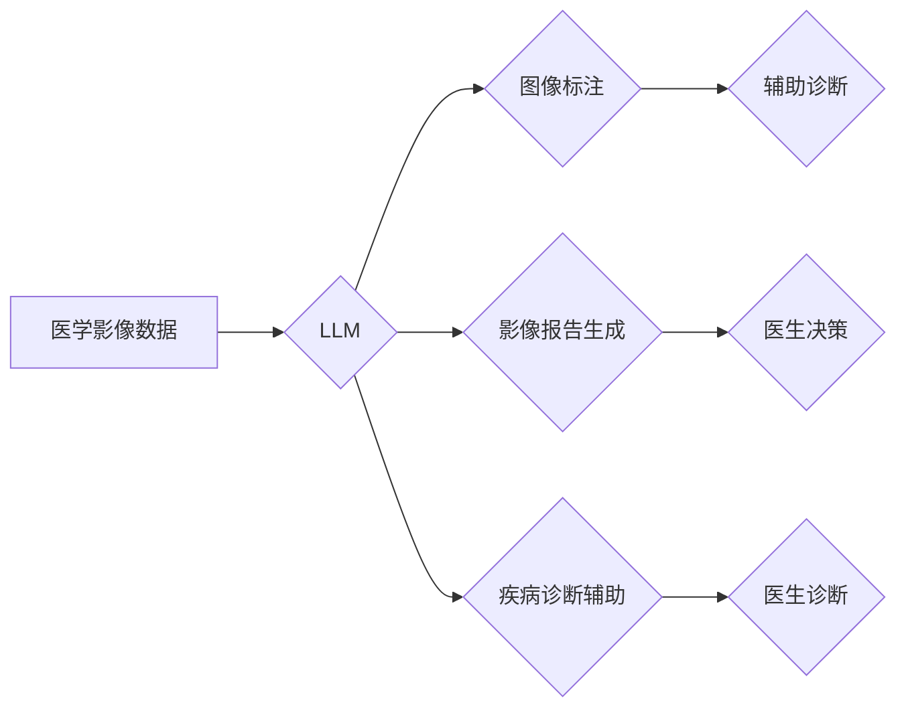

> 
> Large Language Model (LLM), 智能医疗影像分析, 图像识别, 疾病诊断, 医学图像分割, 自然语言处理, 深度学习

## 1. 背景介绍

医疗影像分析是现代医学诊断和治疗的重要组成部分。随着医学影像技术的不断发展，如X射线、CT、MRI等，产生的影像数据量呈指数级增长。然而，人工分析这些海量影像数据不仅耗时费力，而且容易受到主观因素的影响，导致诊断结果的准确性降低。因此，智能医疗影像分析技术应运而生，旨在利用人工智能技术自动识别、分析和解释医学影像，提高诊断效率和准确性。

近年来，大型语言模型（LLM）在自然语言处理领域取得了突破性的进展，其强大的文本理解和生成能力为智能医疗影像分析提供了新的思路和可能性。LLM能够理解和处理复杂的医学文本信息，例如病历、影像报告等，并将其与医学影像数据相结合，实现更精准、更全面的诊断辅助。

## 2. 核心概念与联系

**2.1 核心概念**

* **大型语言模型 (LLM):** 是一种基于深度学习的强大人工智能模型，能够理解和生成人类语言。LLM通过训练海量文本数据，学习语言的语法、语义和上下文关系，从而具备强大的文本理解、生成、翻译、问答等能力。

* **智能医疗影像分析:** 利用人工智能技术自动分析和解释医学影像，辅助医生进行诊断和治疗决策。

* **多模态学习:**  一种机器学习方法，能够处理多种类型的数据，例如文本、图像、音频等。

**2.2 核心概念联系**

LLM在智能医疗影像分析中的应用主要基于多模态学习的原理。LLM能够学习文本和图像之间的关系，从而实现以下功能：

* **图像标注:**  利用LLM对医学影像进行自动标注，例如识别肿瘤、血管等结构。
* **影像报告生成:**  根据医学影像和患者信息，利用LLM自动生成详细的影像报告。
* **疾病诊断辅助:**  结合LLM对医学文本和影像的理解能力，辅助医生进行疾病诊断。

**2.3  架构图**



## 3. 核心算法原理 & 具体操作步骤

**3.1 算法原理概述**

LLM在智能医疗影像分析中的应用主要基于以下核心算法：

* **卷积神经网络 (CNN):** 用于提取医学影像中的特征，例如边缘、纹理等。
* **循环神经网络 (RNN):** 用于处理医学文本信息，例如病历、影像报告等。
* **Transformer:**  一种新型的深度学习架构，能够有效处理长序列数据，例如医学文本。

**3.2 算法步骤详解**

1. **数据预处理:**  对医学影像数据进行预处理，例如裁剪、增强、归一化等。对医学文本数据进行预处理，例如分词、词性标注、去除停用词等。
2. **特征提取:**  利用CNN提取医学影像中的特征，利用RNN或Transformer提取医学文本中的特征。
3. **特征融合:**  将医学影像特征和医学文本特征进行融合，形成多模态特征。
4. **模型训练:**  利用多模态特征训练LLM模型，例如图像分类、图像分割、疾病诊断等任务。
5. **模型评估:**  利用测试数据评估模型的性能，例如准确率、召回率、F1-score等。

**3.3 算法优缺点**

* **优点:**  LLM能够学习文本和图像之间的关系，实现更精准、更全面的诊断辅助。
* **缺点:**  LLM模型训练需要大量的训练数据，并且计算资源消耗较大。

**3.4 算法应用领域**

* **肿瘤诊断:**  利用LLM识别肿瘤图像，辅助医生进行肿瘤诊断和分级。
* **心血管疾病诊断:**  利用LLM分析心脏影像，辅助医生诊断心血管疾病。
* **神经系统疾病诊断:**  利用LLM分析脑部影像，辅助医生诊断神经系统疾病。

## 4. 数学模型和公式 & 详细讲解 & 举例说明

**4.1 数学模型构建**

LLM模型通常基于Transformer架构，其核心是注意力机制。注意力机制能够学习文本中不同词语之间的关系，并赋予每个词语不同的权重，从而更好地理解文本语义。

**4.2 公式推导过程**

注意力机制的计算公式如下：

$$
Attention(Q, K, V) = softmax(\frac{QK^T}{\sqrt{d_k}})V
$$

其中：

* $Q$：查询矩阵
* $K$：键矩阵
* $V$：值矩阵
* $d_k$：键向量的维度
* $softmax$：softmax函数

**4.3 案例分析与讲解**

假设我们有一个句子：“我爱学习编程”。

* $Q$：查询矩阵，表示每个词语对其他词语的关注程度。
* $K$：键矩阵，表示每个词语的特征向量。
* $V$：值矩阵，表示每个词语的语义向量。

通过计算注意力机制，我们可以得到每个词语对其他词语的关注程度，例如，“学习”对“编程”的关注程度较高，因为它们是语义相关的词语。

## 5. 项目实践：代码实例和详细解释说明

**5.1 开发环境搭建**

* Python 3.7+
* PyTorch 1.7+
* TensorFlow 2.0+
* CUDA 10.1+

**5.2 源代码详细实现**

```python
import torch
import torch.nn as nn

class LLM(nn.Module):
    def __init__(self, vocab_size, embedding_dim, hidden_dim, num_layers):
        super(LLM, self).__init__()
        self.embedding = nn.Embedding(vocab_size, embedding_dim)
        self.transformer = nn.Transformer(d_model=embedding_dim, nhead=8, num_encoder_layers=num_layers, num_decoder_layers=num_layers)
        self.fc = nn.Linear(embedding_dim, vocab_size)

    def forward(self, x):
        x = self.embedding(x)
        x = self.transformer(x, x)
        x = self.fc(x)
        return x
```

**5.3 代码解读与分析**

* `LLM`类定义了一个基于Transformer架构的LLM模型。
* `embedding`层将词语转换为词向量。
* `transformer`层是一个Transformer模型，用于处理文本序列。
* `fc`层是一个全连接层，用于将文本序列映射到输出词汇表。

**5.4 运行结果展示**

训练完成后，LLM模型能够对文本进行理解和生成，例如：

* 文本分类
* 文本摘要
* 机器翻译

## 6. 实际应用场景

**6.1 图像识别**

LLM可以结合CNN模型，识别医学影像中的肿瘤、血管、骨折等结构。例如，LLM可以分析X射线图像，识别肺部结节，辅助医生进行肺癌诊断。

**6.2 影像报告生成**

LLM可以根据医学影像和患者信息，自动生成详细的影像报告。例如，LLM可以分析CT扫描图像，生成关于患者肺部疾病的报告。

**6.3 疾病诊断辅助**

LLM可以结合医学文本和影像数据，辅助医生进行疾病诊断。例如，LLM可以分析患者的病历、影像报告和实验室检查结果，辅助医生诊断心血管疾病。

**6.4 未来应用展望**

* **个性化医疗:**  LLM可以根据患者的基因信息、生活习惯等数据，提供个性化的医疗建议。
* **远程医疗:**  LLM可以帮助医生远程诊断患者，提高医疗服务的覆盖范围。
* **药物研发:**  LLM可以分析大量的医学文献和实验数据，加速药物研发过程。

## 7. 工具和资源推荐

**7.1 学习资源推荐**

* **课程:**  Coursera上的“深度学习”课程
* **书籍:**  《深度学习》
* **博客:**  Jay Alammar的博客

**7.2 开发工具推荐**

* **PyTorch:**  一个开源的深度学习框架
* **TensorFlow:**  另一个开源的深度学习框架
* **Hugging Face:**  一个开源的机器学习平台，提供预训练的LLM模型

**7.3 相关论文推荐**

* **BERT:**  Bidirectional Encoder Representations from Transformers
* **GPT-3:**  Generative Pre-trained Transformer 3
* **DALL-E:**  A system that generates images from text descriptions

## 8. 总结：未来发展趋势与挑战

**8.1 研究成果总结**

LLM在智能医疗影像分析领域取得了显著的进展，例如图像识别、影像报告生成、疾病诊断辅助等。

**8.2 未来发展趋势**

* **模型规模更大:**  更大的LLM模型能够学习更复杂的医学知识。
* **多模态学习更深入:**  LLM将与其他模态数据，例如音频、视频等，进行更深入的融合。
* **解释性更强:**  LLM的决策过程将更加透明，更容易被医生理解和信任。

**8.3 面临的挑战**

* **数据隐私和安全:**  医学数据具有高度敏感性，需要采取有效的措施保护数据隐私和安全。
* **模型可解释性:**  LLM的决策过程往往是复杂的，需要提高模型的可解释性，以便医生能够更好地理解模型的判断依据。
* **伦理问题:**  LLM在医疗领域的应用需要考虑伦理问题，例如算法偏见、责任归属等。

**8.4 研究展望**

未来，LLM在智能医疗影像分析领域将继续发挥重要作用，为医生提供更精准、更全面的诊断辅助，最终实现医疗服务的个性化、精准化和智能化。

## 9. 附录：常见问题与解答

**9.1  LLM模型训练需要多少数据？**

LLM模型训练需要大量的训练数据，通常需要百万甚至数十亿个样本。

**9.2  LLM模型的计算资源消耗大吗？**

是的，LLM模型的训练需要大量的计算资源，例如GPU和TPU。

**9.3  LLM模型的决策过程是否透明？**

LLM模型的决策过程往往是复杂的，需要提高模型的可解释性，以便医生能够更好地理解模型的判断依据。


作者：禅与计算机程序设计艺术 / Zen and the Art of Computer Programming 
<end_of_turn>