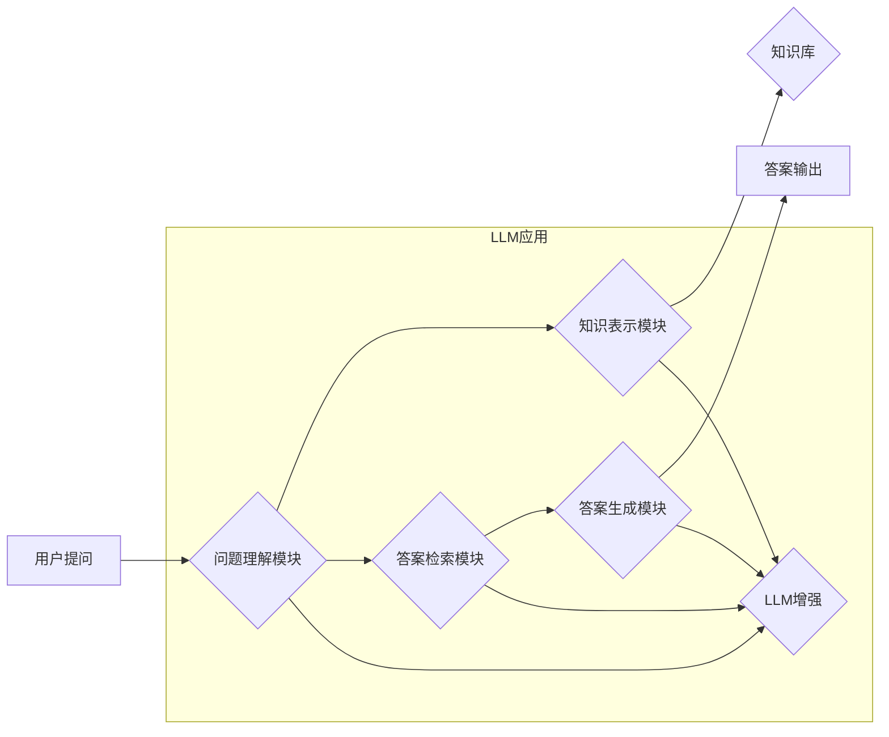

> Large Language Model (LLM), 智能问答系统, 自然语言处理 (NLP), 知识图谱, 检索式问答, 生成式问答, 对话式问答, 评估指标

## 1. 背景介绍

智能问答系统 (Question Answering System, Q&A) 旨在理解用户提出的问题，并从给定的知识库或文本语料中找到最准确、最相关的答案。近年来，随着深度学习技术的快速发展，特别是大型语言模型 (Large Language Model, LLM) 的出现，智能问答系统取得了显著的进展。

LLM 是一种训练规模庞大、参数数量众多的深度神经网络，能够理解和生成人类语言。它们通过学习海量文本数据，掌握了丰富的语言知识和语法规则，具备强大的文本理解和生成能力。将 LLM 引入智能问答系统，可以有效提升系统的性能，使其能够处理更复杂、更开放式的问答任务。

## 2. 核心概念与联系

**2.1 智能问答系统架构**

智能问答系统通常由以下几个核心模块组成：

* **问题理解模块:** 负责解析用户提出的问题，识别关键信息，例如问题类型、实体、关系等。
* **知识表示模块:** 将知识库中的信息以结构化的形式表示，例如知识图谱、语义网络等。
* **答案检索模块:** 根据问题理解结果，从知识库中检索出与问题相关的答案候选集。
* **答案生成模块:** 对答案候选集进行排序和筛选，生成最终的答案，并将其以自然语言形式呈现给用户。

**2.2 LLM在智能问答系统中的作用**

LLM 可以应用于智能问答系统的各个模块，发挥其强大的语言理解和生成能力。

* **问题理解模块:** LLM 可以用于识别问题类型、实体、关系等，提高问题理解的准确性。
* **知识表示模块:** LLM 可以用于将文本数据转换为知识图谱或语义网络，构建更丰富的知识表示。
* **答案检索模块:** LLM 可以用于理解问题语义，并根据语义相似度检索出更相关的答案候选集。
* **答案生成模块:** LLM 可以用于生成更流畅、更自然的答案，并根据上下文进行答案的补充和完善。

**2.3  LLM与智能问答系统架构的Mermaid流程图**



## 3. 核心算法原理 & 具体操作步骤

**3.1 算法原理概述**

LLM 在智能问答系统中的应用主要基于以下核心算法：

* **Transformer模型:** Transformer模型是一种基于注意力机制的深度神经网络，能够有效捕捉文本序列中的长距离依赖关系，在自然语言理解和生成任务中表现出色。
* **BERT模型:** BERT (Bidirectional Encoder Representations from Transformers) 是基于Transformer模型的预训练语言模型，通过双向语言建模训练，能够更好地理解文本语义。
* **RoBERTa模型:** RoBERTa (A Robustly Optimized BERT Pretraining Approach) 是对BERT模型进行改进的预训练语言模型，通过优化预训练策略和训练数据，进一步提升了模型性能。

**3.2 算法步骤详解**

1. **预训练:** LLM模型首先通过大量的文本数据进行预训练，学习语言的语法规则、语义关系等知识。
2. **微调:** 将预训练好的LLM模型微调到特定的问答任务上，例如检索式问答、生成式问答或对话式问答。微调过程通常使用问答数据集进行训练，调整模型参数，使其能够更好地理解问题和生成答案。
3. **推理:** 在推理阶段，将用户提出的问题输入到微调后的LLM模型中，模型会根据其学习到的知识和经验，生成最合适的答案。

**3.3 算法优缺点**

* **优点:**
    * 强大的语言理解和生成能力
    * 可以处理复杂、开放式的问答任务
    * 能够生成更流畅、更自然的答案
* **缺点:**
    * 训练成本高，需要大量的计算资源和数据
    * 容易受到训练数据质量的影响
    * 缺乏对真实世界知识的理解和推理能力

**3.4 算法应用领域**

LLM在智能问答系统中的应用领域广泛，例如：

* **搜索引擎:** 提升搜索结果的准确性和相关性
* **客服机器人:** 自动回答用户常见问题
* **教育领域:** 提供个性化的学习辅导
* **医疗领域:** 辅助医生诊断疾病

## 4. 数学模型和公式 & 详细讲解 & 举例说明

**4.1 数学模型构建**

LLM 的核心是 Transformer 模型，其数学模型构建基于以下几个关键组件：

* **注意力机制:** 注意力机制允许模型关注输入序列中与当前任务最相关的部分，提高模型的理解能力。
* **多头注意力:** 多头注意力机制使用多个注意力头，分别关注不同方面的输入信息，进一步提升模型的理解能力。
* **前馈神经网络:** 前馈神经网络用于对注意力机制输出进行非线性变换，提取更深层次的语义特征。

**4.2 公式推导过程**

注意力机制的核心公式如下：

$$
Attention(Q, K, V) = softmax(\frac{QK^T}{\sqrt{d_k}})V
$$

其中：

* $Q$：查询矩阵
* $K$：键矩阵
* $V$：值矩阵
* $d_k$：键向量的维度
* $softmax$：softmax函数用于归一化注意力权重

**4.3 案例分析与讲解**

假设我们有一个句子 "The cat sat on the mat"，我们想要计算 "cat" 这个词与整个句子的注意力权重。

1. 将句子转换为词嵌入向量，得到 $Q$, $K$, $V$ 三个矩阵。
2. 计算 $QK^T$，得到一个注意力权重矩阵。
3. 对注意力权重矩阵进行 softmax 归一化，得到每个词与 "cat" 的注意力权重。
4. 将注意力权重与值矩阵 $V$ 进行加权求和，得到 "cat" 这个词与整个句子的上下文表示。

## 5. 项目实践：代码实例和详细解释说明

**5.1 开发环境搭建**

* Python 3.7+
* PyTorch 或 TensorFlow
* CUDA 和 cuDNN (可选，用于 GPU 加速)

**5.2 源代码详细实现**

```python
import torch
from transformers import AutoModelForQuestionAnswering, AutoTokenizer

# 加载预训练模型和分词器
model_name = "bert-base-uncased"
model = AutoModelForQuestionAnswering.from_pretrained(model_name)
tokenizer = AutoTokenizer.from_pretrained(model_name)

# 定义输入数据
question = "What is the capital of France?"
context = "France is a country in Europe. Its capital is Paris."

# 将文本转换为模型输入格式
inputs = tokenizer(question, context, return_tensors="pt")

# 进行推理
outputs = model(**inputs)

# 获取答案
start_logits = outputs.start_logits
end_logits = outputs.end_logits
start_index = torch.argmax(start_logits).item()
end_index = torch.argmax(end_logits).item()

# 将答案从文本中提取出来
answer = tokenizer.decode(inputs["input_ids"][0][start_index:end_index+1])

# 打印答案
print(f"Answer: {answer}")
```

**5.3 代码解读与分析**

* 该代码首先加载预训练的 BERT 模型和分词器。
* 然后，将用户的问题和上下文文本转换为模型输入格式。
* 模型进行推理，输出答案的起始和结束位置。
* 最后，根据输出结果从文本中提取出答案。

**5.4 运行结果展示**

```
Answer: Paris
```

## 6. 实际应用场景

**6.1 搜索引擎**

LLM 可以用于提升搜索引擎的准确性和相关性。例如，当用户输入一个模糊的查询词时，LLM 可以理解用户的意图，并返回更相关的搜索结果。

**6.2 客服机器人**

LLM 可以用于构建更智能的客服机器人，能够自动回答用户常见问题，例如订单查询、退换货流程等。

**6.3 教育领域**

LLM 可以用于提供个性化的学习辅导，例如根据学生的学习进度和知识点，生成相应的学习内容和练习题。

**6.4 未来应用展望**

LLM 在智能问答系统中的应用前景广阔，未来可能在以下方面得到进一步发展：

* **更强大的语言理解能力:** 随着模型规模和训练数据的增加，LLM 的语言理解能力将进一步提升，能够处理更复杂、更开放式的问答任务。
* **更个性化的问答体验:** LLM 可以根据用户的个人喜好和知识背景，生成更个性化的答案，提供更贴心的问答体验。
* **跨模态问答:** LLM 可以与其他模态信息，例如图像、音频等进行融合，实现跨模态问答，提供更丰富的问答体验。

## 7. 工具和资源推荐

**7.1 学习资源推荐**

* **论文:**
    * Vaswani, A., Shazeer, N., Parmar, N., Uszkoreit, J., Jones, L., Gomez, A. N., ... & Polosukhin, I. (2017). Attention is all you need. In Advances in neural information processing systems (pp. 5998-6008).
    * Devlin, J., Chang, M. W., Lee, K., & Toutanova, K. (2018). BERT: Pre-training of deep bidirectional transformers for language understanding. arXiv preprint arXiv:1810.04805.
* **博客:**
    * Jay Alammar's Blog: https://jalammar.github.io/
    * The Illustrated Transformer: https://jalammar.github.io/illustrated-transformer/

**7.2 开发工具推荐**

* **Hugging Face Transformers:** https://huggingface.co/transformers/
* **PyTorch:** https://pytorch.org/
* **TensorFlow:** https://www.tensorflow.org/

**7.3 相关论文推荐**

* **T5:** https://arxiv.org/abs/1910.10683
* **XLNet:** https://arxiv.org/abs/1906.08237
* **GPT-3:** https://openai.com/blog/gpt-3/

## 8. 总结：未来发展趋势与挑战

**8.1 研究成果总结**

近年来，LLM 在智能问答系统中的应用取得了显著的进展，能够处理更复杂、更开放式的问答任务，并生成更流畅、更自然的答案。

**8.2 未来发展趋势**

* 模型规模和训练数据规模的进一步扩大
* 多模态问答的深入研究
* 知识图谱与LLM的深度融合
* 更加个性化、交互式的问答体验

**8.3 面临的挑战**

* 训练成本高，需要大量的计算资源和数据
* 容易受到训练数据质量的影响
* 缺乏对真实世界知识的理解和推理能力
* 存在潜在的偏见和误导性问题

**8.4 研究展望**

未来，LLM 在智能问答系统中的应用将继续深入发展，并解决当前面临的挑战，为用户提供更加智能、更加便捷的交互体验。

## 9. 附录：常见问题与解答

**9.1 如何选择合适的LLM模型？**

选择合适的LLM模型取决于具体的应用场景和需求。例如，对于需要处理长文本的应用场景，可以选择BERT-Large等规模更大的模型；对于需要快速响应的应用场景，可以选择BERT-