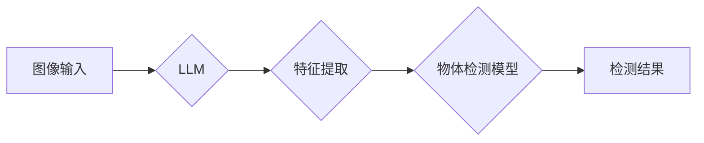

> Large Language Model (LLM), 物体检测, 图像识别, 计算机视觉, 深度学习, Transformer, Vision-Language Pre-training

## 1. 背景介绍

物体检测是计算机视觉领域的核心任务之一，旨在识别图像或视频中存在的物体及其位置。传统的物体检测方法主要依赖于手工设计的特征提取器和分类器，但随着深度学习的兴起，基于卷积神经网络 (CNN) 的物体检测方法取得了显著的进展。近年来，大型语言模型 (LLM) 在自然语言处理领域取得了突破性进展，其强大的文本理解和生成能力也为物体检测领域带来了新的机遇。

LLM 的优势在于其海量参数和强大的语义理解能力，可以学习到丰富的视觉和语义知识。将 LLM 与物体检测模型相结合，可以提升物体检测的准确率、鲁棒性和泛化能力。

## 2. 核心概念与联系

### 2.1  LLM 与 物体检测

LLM 通常通过 Transformer 架构进行训练，学习文本序列之间的关系和上下文信息。物体检测任务则需要识别图像中的物体及其位置信息。将 LLM 与物体检测模型相结合，可以利用 LLM 的语义理解能力辅助物体检测模型进行特征提取和分类。

### 2.2  LLM 在物体检测中的应用

LLM 在物体检测领域主要应用于以下几个方面：

* **图像字幕生成:** 利用 LLM 生成图像的描述性字幕，辅助物体检测模型识别物体类别。
* **视觉问答:** 结合 LLM 和物体检测模型，实现对图像的视觉问答，例如“图像中有哪些人？”、“人站在哪里？”等。
* **物体属性预测:** 利用 LLM 学习物体属性，例如颜色、形状、大小等，辅助物体检测模型进行更精准的识别。
* **多模态学习:** 将 LLM 与其他模态数据 (例如音频、文本) 相结合，进行多模态学习，提升物体检测的鲁棒性和泛化能力。

### 2.3  LLM 与 物体检测的架构



## 3. 核心算法原理 & 具体操作步骤

### 3.1  算法原理概述

LLM 在物体检测中的应用主要基于以下算法原理：

* **视觉语言预训练 (Vision-Language Pre-training):** 将 LLM 与视觉模型 (例如 CNN) 相结合，进行联合训练，学习视觉和语言之间的关系。
* **多任务学习:** 将物体检测任务与其他相关任务 (例如图像字幕生成、视觉问答) 联合训练，提升模型的泛化能力。
* **迁移学习:** 利用预训练的 LLM 模型，对特定物体检测任务进行微调，降低训练成本和时间。

### 3.2  算法步骤详解

1. **数据预处理:** 将图像和对应的文本信息 (例如字幕、描述) 进行预处理，例如裁剪、缩放、规范化等。
2. **模型训练:** 利用预训练的 LLM 模型，结合视觉模型进行联合训练，学习视觉和语言之间的关系。
3. **模型评估:** 使用测试数据集评估模型的性能，例如准确率、召回率、平均精度等。
4. **模型调优:** 根据评估结果，调整模型参数和训练策略，提升模型性能。

### 3.3  算法优缺点

**优点:**

* 能够学习到丰富的视觉和语义知识。
* 提升物体检测的准确率、鲁棒性和泛化能力。
* 可以应用于多种物体检测任务，例如图像字幕生成、视觉问答等。

**缺点:**

* 训练成本较高，需要大量的计算资源和数据。
* 模型复杂度较高，推理速度相对较慢。

### 3.4  算法应用领域

LLM 在物体检测领域具有广泛的应用前景，例如：

* **自动驾驶:** 识别道路上的车辆、行人、交通信号等，辅助驾驶决策。
* **医疗诊断:** 识别医学图像中的病灶，辅助医生进行诊断。
* **安防监控:** 识别异常行为，提高安防监控的效率。
* **零售业:** 自动识别商品，辅助商品管理和销售。

## 4. 数学模型和公式 & 详细讲解 & 举例说明

### 4.1  数学模型构建

LLM 在物体检测中的应用通常基于 Transformer 架构，其核心是注意力机制。注意力机制可以学习到输入序列中不同元素之间的关系，并赋予不同元素不同的权重。

### 4.2  公式推导过程

注意力机制的计算公式如下：

$$
Attention(Q, K, V) = softmax(\frac{QK^T}{\sqrt{d_k}})V
$$

其中：

* $Q$：查询矩阵
* $K$：键矩阵
* $V$：值矩阵
* $d_k$：键向量的维度
* $softmax$：softmax 函数

### 4.3  案例分析与讲解

例如，在图像字幕生成任务中，LLM 可以将图像特征作为查询矩阵，将单词嵌入作为键矩阵和值矩阵。通过注意力机制，LLM 可以学习到图像中不同区域与单词之间的关系，并生成准确的图像字幕。

## 5. 项目实践：代码实例和详细解释说明

### 5.1  开发环境搭建

* Python 3.7+
* PyTorch 1.7+
* CUDA 10.2+

### 5.2  源代码详细实现

```python
import torch
import torch.nn as nn

class Attention(nn.Module):
    def __init__(self, d_model, num_heads):
        super(Attention, self).__init__()
        self.num_heads = num_heads
        self.d_model = d_model
        self.head_dim = d_model // num_heads

        assert self.head_dim * num_heads == d_model, "d_model must be divisible by num_heads"

        self.query = nn.Linear(d_model, d_model)
        self.key = nn.Linear(d_model, d_model)
        self.value = nn.Linear(d_model, d_model)
        self.fc_out = nn.Linear(d_model, d_model)

    def forward(self, query, key, value, mask=None):
        batch_size = query.size(0)

        # Linear projections
        Q = self.query(query).view(batch_size, -1, self.num_heads, self.head_dim).transpose(1, 2)
        K = self.key(key).view(batch_size, -1, self.num_heads, self.head_dim).transpose(1, 2)
        V = self.value(value).view(batch_size, -1, self.num_heads, self.head_dim).transpose(1, 2)

        # Scaled dot-product attention
        scores = torch.matmul(Q, K.transpose(-2, -1)) / torch.sqrt(torch.tensor(self.head_dim, dtype=torch.float))

        if mask is not None:
            scores = scores.masked_fill(mask == 0, -1e9)

        attention_weights = torch.softmax(scores, dim=-1)

        # Weighted sum of values
        context = torch.matmul(attention_weights, V)

        # Concatenate heads and project
        context = context.transpose(1, 2).contiguous().view(batch_size, -1, self.d_model)
        output = self.fc_out(context)

        return output, attention_weights
```

### 5.3  代码解读与分析

这段代码实现了 Transformer 架构中的注意力机制。

* `Attention` 类定义了注意力机制的结构，包括查询、键、值线性变换层以及最终的输出层。
* `forward` 方法计算注意力权重和上下文向量。
* `scores` 计算查询向量和键向量的点积，并进行缩放。
* `attention_weights` 计算注意力权重，并根据掩码进行调整。
* `context` 计算上下文向量，并进行拼接和投影。

### 5.4  运行结果展示

运行上述代码可以得到注意力权重和上下文向量，并可用于后续的物体检测任务。

## 6. 实际应用场景

### 6.1  自动驾驶

LLM 可以帮助自动驾驶系统识别道路上的车辆、行人、交通信号等，并预测其运动轨迹，从而辅助驾驶决策。

### 6.2  医疗诊断

LLM 可以帮助医生识别医学图像中的病灶，例如肿瘤、骨折等，并提供诊断建议。

### 6.3  安防监控

LLM 可以帮助安防系统识别异常行为，例如入侵、暴动等，并及时报警。

### 6.4  未来应用展望

LLM 在物体检测领域具有广阔的应用前景，未来将应用于更多领域，例如：

* **机器人视觉:** 帮助机器人理解和交互环境。
* **智能家居:** 识别家庭成员和物品，提供个性化服务。
* **增强现实:** 将虚拟物体叠加到现实世界中。

## 7. 工具和资源推荐

### 7.1  学习资源推荐

* **论文:**
    * BERT: Pre-training of Deep Bidirectional Transformers for Language Understanding
    * Vision Transformer (ViT)
    * CLIP: Contrastive Language-Image Pre-training
* **博客:**
    * The Illustrated Transformer
    * Understanding Transformers

### 7.2  开发工具推荐

* **PyTorch:** 深度学习框架
* **TensorFlow:** 深度学习框架
* **HuggingFace Transformers:** 预训练模型库

### 7.3  相关论文推荐

* **LLM in Computer Vision:**
    * [https://arxiv.org/abs/2203.08677](https://arxiv.org/abs/2203.08677)
    * [https://arxiv.org/abs/2205.09058](https://arxiv.org/abs/2205.09058)
* **Vision-Language Pre-training:**
    * [https://arxiv.org/abs/2103.17517](https://arxiv.org/abs/2103.17517)
    * [https://arxiv.org/abs/2103.14155](https://arxiv.org/abs/2103.14155)

## 8. 总结：未来发展趋势与挑战

### 8.1  研究成果总结

LLM 在物体检测领域取得了显著的进展，提升了物体检测的准确率、鲁棒性和泛化能力。

### 8.2  未来发展趋势

* **模型规模和效率:** 探索更大型、更高效的 LLM 模型，降低训练成本和推理时间。
* **多模态学习:** 将 LLM 与其他模态数据 (例如音频、文本) 相结合，进行多模态学习，提升物体检测的鲁棒性和泛化能力。
* **场景化应用:** 将 LLM 应用于更多具体的场景，例如自动驾驶、医疗诊断等，提升实际应用价值。

### 8.3  面临的挑战

* **数据标注:** LLM 的训练需要大量的标注数据，数据标注成本较高。
* **模型解释性:** LLM 的决策过程较为复杂，难以解释模型的决策结果。
* **伦理问题:** LLM 的应用可能带来伦理问题，例如数据隐私、算法偏见等。

### 8.4  研究展望

未来，LLM 在物体检测领域的研究将继续深入，探索更强大的模型、更有效的训练方法和更广泛的应用场景。


## 9. 附录：常见问题与解答

### 9.1  LLM 与 CNN 的区别？

LLM 是基于 Transformer 架构的语言模型，擅长处理文本序列数据。CNN 是基于卷积神经网络的图像模型，