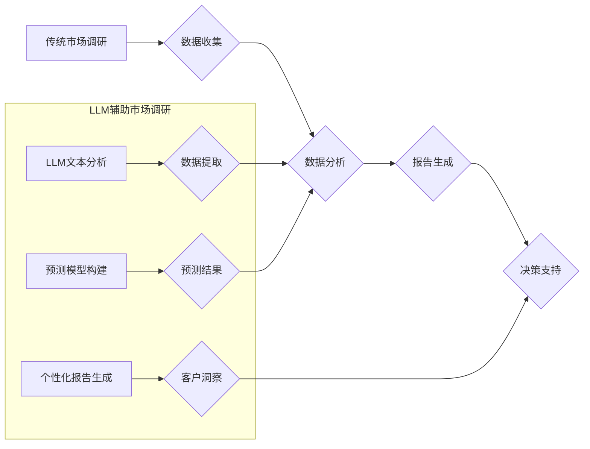

> Large Language Model (LLM), 市场调研, 数据分析, 自然语言处理 (NLP), 人工智能 (AI), 预测模型, 消费者行为

## 1. 背景介绍

市场调研是企业了解目标市场、消费者需求和竞争环境的重要手段。传统市场调研主要依赖于问卷调查、焦点小组讨论、观察研究等方法，这些方法虽然有效，但存在着成本高、时间长、数据分析复杂等问题。近年来，随着人工智能 (AI) 技术的快速发展，特别是大型语言模型 (LLM) 的出现，为市场调研带来了新的机遇和挑战。

LLM 是一种能够理解和生成人类语言的强大 AI 模型，它拥有海量文本数据训练，具备强大的文本处理能力，可以自动分析和提取文本中的关键信息，并进行预测和总结。LLM 的应用可以极大地提高市场调研的效率和准确性，但也带来了新的挑战，例如数据隐私、模型偏见、解释性等问题。

## 2. 核心概念与联系

### 2.1 市场调研

市场调研是指企业为了了解市场状况、消费者需求、竞争环境等信息，而进行的系统性的调查和分析活动。其目标是为企业决策提供依据，帮助企业制定有效的市场策略。

### 2.2 大型语言模型 (LLM)

LLM 是一种基于深度学习的 AI 模型，通过训练海量文本数据，学习语言的语法、语义和上下文关系。它能够理解和生成人类语言，并执行各种自然语言处理 (NLP) 任务，例如文本分类、情感分析、机器翻译、文本摘要等。

### 2.3 核心概念联系

LLM 可以通过以下方式与市场调研相结合：

* **自动文本分析:** LLM 可以自动分析大量的市场调研数据，例如问卷调查结果、社交媒体评论、新闻报道等，提取关键信息，例如消费者需求、市场趋势、竞争对手分析等。
* **预测模型构建:** LLM 可以根据历史数据和市场趋势，构建预测模型，预测未来的市场需求、消费者行为等。
* **个性化市场调研:** LLM 可以根据用户的个人信息和行为数据，提供个性化的市场调研报告，帮助企业更好地了解目标客户。

**Mermaid 流程图**



## 3. 核心算法原理 & 具体操作步骤

### 3.1 算法原理概述

LLM 的核心算法原理是基于 Transformer 架构，它利用注意力机制来捕捉文本中的长距离依赖关系，从而实现更准确的文本理解和生成。

Transformer 架构由编码器和解码器组成。编码器将输入文本序列编码成一个固定长度的向量表示，解码器则根据编码器的输出生成目标文本序列。注意力机制在 Transformer 架构中扮演着至关重要的角色，它允许模型关注输入文本中与当前生成词语相关的部分，从而提高生成结果的准确性和流畅度。

### 3.2 算法步骤详解

1. **数据预处理:** 将原始文本数据进行清洗、分词、标记等预处理操作，使其适合模型训练。
2. **模型训练:** 使用训练数据训练 LLM 模型，通过反向传播算法不断调整模型参数，使其能够准确地理解和生成文本。
3. **模型评估:** 使用测试数据评估模型的性能，例如准确率、召回率、BLEU 等指标。
4. **模型部署:** 将训练好的模型部署到生产环境中，用于实际应用。

### 3.3 算法优缺点

**优点:**

* 强大的文本处理能力
* 能够理解和生成自然语言
* 训练效率高

**缺点:**

* 需要大量的训练数据
* 模型参数量大，计算资源需求高
* 模型解释性差

### 3.4 算法应用领域

LLM 的应用领域非常广泛，包括：

* 自然语言处理 (NLP)
* 机器翻译
* 文本摘要
* 情感分析
* 聊天机器人
* 代码生成

## 4. 数学模型和公式 & 详细讲解 & 举例说明

### 4.1 数学模型构建

LLM 的核心数学模型是 Transformer 架构，它基于注意力机制，可以捕捉文本中的长距离依赖关系。

**注意力机制公式:**

$$
Attention(Q, K, V) = softmax(\frac{QK^T}{\sqrt{d_k}})V
$$

其中：

* Q: 查询矩阵
* K: 键矩阵
* V: 值矩阵
* $d_k$: 键向量的维度
* softmax: 归一化函数

### 4.2 公式推导过程

注意力机制的目的是计算查询向量 Q 与键向量 K 之间的相似度，然后根据相似度加权求和值向量 V，得到最终的注意力输出。

* $QK^T$: 计算查询向量 Q 与键向量 K 的点积，得到一个得分矩阵。
* $\frac{QK^T}{\sqrt{d_k}}$: 对得分矩阵进行缩放，以防止梯度爆炸。
* softmax: 对缩放后的得分矩阵进行 softmax 操作，得到每个键向量的权重。
* $softmax(\frac{QK^T}{\sqrt{d_k}})V$: 将权重与值向量 V 进行加权求和，得到最终的注意力输出。

### 4.3 案例分析与讲解

例如，在机器翻译任务中，查询向量 Q 是源语言句子中的每个词，键向量 K 是目标语言词典中的每个词，值向量 V 是目标语言词典中的每个词的嵌入向量。注意力机制可以计算每个源语言词与每个目标语言词之间的相似度，然后根据相似度选择最合适的目标语言词来翻译源语言词。

## 5. 项目实践：代码实例和详细解释说明

### 5.1 开发环境搭建

* Python 3.7+
* TensorFlow 或 PyTorch
* CUDA 和 cuDNN (可选)

### 5.2 源代码详细实现

```python
# 使用 HuggingFace Transformers 库加载预训练的 LLM 模型
from transformers import AutoModelForSequenceClassification, AutoTokenizer

model_name = "bert-base-uncased"
tokenizer = AutoTokenizer.from_pretrained(model_name)
model = AutoModelForSequenceClassification.from_pretrained(model_name)

# 对文本进行预处理
text = "This is a sample text."
inputs = tokenizer(text, return_tensors="pt")

# 将预处理后的文本输入模型进行预测
outputs = model(**inputs)

# 获取预测结果
predicted_class = outputs.logits.argmax().item()
```

### 5.3 代码解读与分析

* 使用 HuggingFace Transformers 库加载预训练的 LLM 模型，例如 BERT。
* 使用 tokenizer 将文本转换为模型可理解的格式。
* 将预处理后的文本输入模型进行预测。
* 获取预测结果，例如文本分类结果。

### 5.4 运行结果展示

运行上述代码，可以得到文本分类的结果，例如 "This is a sample text." 可能被分类为 "neutral"。

## 6. 实际应用场景

### 6.1 市场调研数据分析

LLM 可以自动分析大量的市场调研数据，例如问卷调查结果、社交媒体评论、新闻报道等，提取关键信息，例如消费者需求、市场趋势、竞争对手分析等。

### 6.2 消费者行为预测

LLM 可以根据历史数据和市场趋势，构建预测模型，预测未来的市场需求、消费者行为等。

### 6.3 个性化市场调研

LLM 可以根据用户的个人信息和行为数据，提供个性化的市场调研报告，帮助企业更好地了解目标客户。

### 6.4 未来应用展望

LLM 在市场调研领域的应用前景广阔，未来可能应用于：

* 更智能化的市场调研工具
* 更精准的市场预测模型
* 更个性化的市场营销策略

## 7. 工具和资源推荐

### 7.1 学习资源推荐

* **HuggingFace Transformers:** https://huggingface.co/docs/transformers/index
* **OpenAI API:** https://beta.openai.com/docs/api-reference/introduction
* **Stanford NLP Group:** https://nlp.stanford.edu/

### 7.2 开发工具推荐

* **Jupyter Notebook:** https://jupyter.org/
* **Google Colab:** https://colab.research.google.com/

### 7.3 相关论文推荐

* **Attention Is All You Need:** https://arxiv.org/abs/1706.03762
* **BERT: Pre-training of Deep Bidirectional Transformers for Language Understanding:** https://arxiv.org/abs/1810.04805

## 8. 总结：未来发展趋势与挑战

### 8.1 研究成果总结

LLM 在市场调研领域展现出巨大的潜力，可以提高效率、准确性和个性化程度。

### 8.2 未来发展趋势

* 模型规模和能力的进一步提升
* 更广泛的应用场景和功能
* 更强的解释性和可解释性

### 8.3 面临的挑战

* 数据隐私和安全问题
* 模型偏见和公平性问题
* 模型解释性和可信度问题

### 8.4 研究展望

未来研究方向包括：

* 开发更安全、更可靠的 LLM 模型
* 探索 LLM 在市场调研中的更多应用场景
* 研究 LLM 的解释性和可信度问题

## 9. 附录：常见问题与解答

### 9.1 如何选择合适的 LLM 模型？

选择合适的 LLM 模型取决于具体的应用场景和需求。例如，对于文本分类任务，可以使用 BERT 或 RoBERTa 等预训练模型；对于机器翻译任务，可以使用 T5 或 BART 等模型。

### 9.2 如何处理 LLM 模型的输出结果？

LLM 模型的输出结果通常需要进行进一步的处理，例如过滤噪声、进行实体识别、进行情感分析等。

### 9.3 如何评估 LLM 模型的性能？

LLM 模型的性能可以根据具体的应用场景进行评估，例如使用准确率、召回率、BLEU 等指标进行评估。

作者：禅与计算机程序设计艺术 / Zen and the Art of Computer Programming


<end_of_turn>