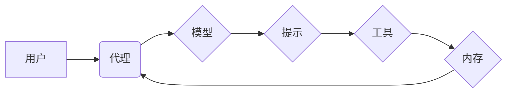

> LangChain, 大语言模型, 应用场景, 聊天机器人, 文本生成, 代码生成, 数据分析, 知识图谱

## 1. 背景介绍

近年来，大语言模型（LLM）的快速发展，如OpenAI的GPT-3、Google的LaMDA等，为人工智能领域带来了革命性的变革。这些模型拥有强大的文本理解和生成能力，能够完成各种复杂的任务，例如翻译、写作、问答等。然而，直接使用LLM往往需要复杂的开发和部署流程，并且难以与其他应用程序和数据源进行集成。

为了解决这些问题，LangChain应运而生。LangChain是一个开源框架，旨在简化LLM的开发和应用。它提供了一套工具和组件，可以帮助开发者将LLM与其他系统和数据源连接起来，构建更强大的应用程序。

## 2. 核心概念与联系

LangChain的核心概念包括：

* **代理 (Agent):**  一个能够与外部世界交互的智能实体，它可以利用LLM和其他工具来完成任务。
* **模型 (Model):**  LLM，例如GPT-3、BLOOM等。
* **提示 (Prompt):**  用于引导LLM生成特定输出的文本指令。
* **链 (Chain):**  将多个组件（例如模型、提示、工具）串联在一起的流程，用于完成特定任务。
* **内存 (Memory):**  用于存储和检索历史信息，帮助代理更好地理解上下文。

**LangChain 架构图**



## 3. 核心算法原理 & 具体操作步骤

### 3.1  算法原理概述

LangChain的核心算法原理是基于**提示工程**和**链式调用**。

* **提示工程:** 通过精心设计提示，引导LLM生成更准确、更有针对性的输出。
* **链式调用:** 将多个组件串联起来，形成一个完整的任务流程，例如：

    1. 用户输入一个问题。
    2. 代理根据问题生成一个提示。
    3. 模型根据提示生成文本输出。
    4. 代理根据输出结果进行判断和操作。

### 3.2  算法步骤详解

1. **定义任务:** 明确需要完成的任务目标。
2. **选择模型:** 根据任务需求选择合适的LLM模型。
3. **设计提示:** 设计一个清晰、简洁、准确的提示，引导模型生成期望的输出。
4. **构建链:** 将模型、提示、工具和其他组件串联起来，形成一个完整的任务流程。
5. **训练和测试:** 对链进行训练和测试，优化提示和链结构，提高任务完成率。

### 3.3  算法优缺点

**优点:**

* 简化LLM开发和应用流程。
* 提高LLM的灵活性和可扩展性。
* 允许LLM与其他系统和数据源进行集成。

**缺点:**

* 仍然需要一定的开发和调试经验。
* 提示工程需要花费大量时间和精力。
* 模型性能受限于所选模型的能力。

### 3.4  算法应用领域

* **聊天机器人:**  构建更智能、更自然的对话系统。
* **文本生成:**  自动生成各种类型的文本，例如文章、故事、诗歌等。
* **代码生成:**  根据自然语言描述自动生成代码。
* **数据分析:**  利用LLM对文本数据进行分析和理解。
* **知识图谱:**  构建和维护知识图谱，提取和组织知识。

## 4. 数学模型和公式 & 详细讲解 & 举例说明

### 4.1  数学模型构建

LangChain的数学模型主要基于**概率论**和**统计学**。

* **概率论:** 用于描述LLM生成文本的概率分布。
* **统计学:** 用于评估模型性能和优化模型参数。

### 4.2  公式推导过程

由于LangChain的数学模型比较复杂，这里只列举一些常用的公式：

* **交叉熵损失函数:** 用于评估模型预测结果与真实值的差异。

$$
Loss = -\sum_{i=1}^{n} y_i \log(p_i)
$$

其中：

* $y_i$ 是真实标签。
* $p_i$ 是模型预测的概率。

* **梯度下降算法:** 用于优化模型参数，降低损失函数的值。

$$
\theta = \theta - \alpha \nabla Loss(\theta)
$$

其中：

* $\theta$ 是模型参数。
* $\alpha$ 是学习率。
* $\nabla Loss(\theta)$ 是损失函数对参数的梯度。

### 4.3  案例分析与讲解

假设我们训练一个LLM模型用于文本分类任务，例如判断文本是正面评价还是负面评价。我们可以使用交叉熵损失函数和梯度下降算法来优化模型参数。

通过训练数据，模型会学习到不同词语和句子的特征，并根据这些特征预测文本的类别。

## 5. 项目实践：代码实例和详细解释说明

### 5.1  开发环境搭建

* Python 3.7+
* pip install langchain transformers

### 5.2  源代码详细实现

```python
from langchain.llms import OpenAI
from langchain.chains import ConversationChain
from langchain.memory import ConversationBufferMemory

# 初始化LLM模型
llm = OpenAI(temperature=0.7)

# 初始化内存
memory = ConversationBufferMemory()

# 初始化对话链
conversation = ConversationChain(
    llm=llm,
    memory=memory,
    prompt=f"你好，我是你的聊天机器人。请问有什么可以帮你的吗？"
)

# 与用户进行对话
while True:
    user_input = input("用户: ")
    if user_input.lower() == "exit":
        break
    response = conversation.run(user_input)
    print("机器人:", response)
```

### 5.3  代码解读与分析

* **初始化LLM模型:** 使用OpenAI类实例化OpenAI模型。
* **初始化内存:** 使用ConversationBufferMemory类实例化对话内存，用于存储对话历史信息。
* **初始化对话链:** 使用ConversationChain类实例化对话链，将LLM模型、内存和提示参数传入。
* **与用户进行对话:** 使用循环结构，不断获取用户输入，并通过对话链生成机器人回复。

### 5.4  运行结果展示

```
用户: 你好
机器人: 你好，我是你的聊天机器人。请问有什么可以帮你的吗？
用户: 你叫什么名字？
机器人: 我没有名字。
用户: 你能写一首诗吗？
机器人: 当然可以，这是一首关于春天的诗：
春风拂面，花开满园，
鸟语花香，生机勃勃。

用户: 谢谢
机器人: 不客气。
用户: exit
```

## 6. 实际应用场景

### 6.1  聊天机器人

LangChain可以用于构建更智能、更自然的聊天机器人，例如客服机器人、陪伴机器人等。

### 6.2  文本生成

LangChain可以用于自动生成各种类型的文本，例如文章、故事、诗歌、代码等。

### 6.3  代码生成

LangChain可以根据自然语言描述自动生成代码，例如Python、Java、C++等语言的代码。

### 6.4  数据分析

LangChain可以利用LLM对文本数据进行分析和理解，例如提取关键信息、识别主题、进行情感分析等。

### 6.5  知识图谱

LangChain可以用于构建和维护知识图谱，提取和组织知识。

## 7. 工具和资源推荐

### 7.1  学习资源推荐

* **LangChain官方文档:** https://python.langchain.com/docs/
* **LangChain GitHub仓库:** https://github.com/langchain-org/langchain
* **HuggingFace Transformers:** https://huggingface.co/docs/transformers/index

### 7.2  开发工具推荐

* **Python:** https://www.python.org/
* **Jupyter Notebook:** https://jupyter.org/

### 7.3  相关论文推荐

* **Attention Is All You Need:** https://arxiv.org/abs/1706.03762
* **BERT: Pre-training of Deep Bidirectional Transformers for Language Understanding:** https://arxiv.org/abs/1810.04805

## 8. 总结：未来发展趋势与挑战

### 8.1  研究成果总结

LangChain为LLM的开发和应用提供了强大的工具和框架，简化了LLM的集成和部署，并促进了LLM在更多领域的应用。

### 8.2  未来发展趋势

* **更强大的LLM模型:** 未来将会有更强大的LLM模型问世，拥有更强的理解和生成能力。
* **更智能的代理:** 代理将变得更智能，能够更好地理解用户需求并完成更复杂的任务。
* **更广泛的应用场景:** LangChain将应用于更多领域，例如教育、医疗、金融等。

### 8.3  面临的挑战

* **模型可解释性:** LLM的决策过程难以理解，这可能会导致模型的不可信赖性。
* **数据安全和隐私:** LLMs需要大量数据进行训练，这可能会带来数据安全和隐私问题。
* **伦理问题:** LLMs可能会被用于生成虚假信息或进行恶意攻击，这需要我们认真考虑伦理问题。

### 8.4  研究展望

未来研究将集中在以下几个方面：

* **提高模型可解释性:** 研究更可解释的LLM模型，以便更好地理解模型的决策过程。
* **解决数据安全和隐私问题:** 研究新的数据安全和隐私保护技术，确保LLM的训练和应用安全可靠。
* **制定LLM伦理规范:** 制定LLM的伦理规范，确保LLM技术被用于良善的目的。

## 9. 附录：常见问题与解答

**Q1: LangChain只能使用OpenAI模型吗？**

A1: 不，LangChain支持多种LLM模型，例如HuggingFace Transformers中的模型。

**Q2: 如何训练自己的LLM模型？**

A2: LangChain本身不提供模型训练功能，需要使用其他工具，例如HuggingFace Transformers。

**Q3: 如何解决LLM生成的文本质量问题？**

A3: 可以通过调整模型参数、优化提示、使用更优质的训练数据等方法来提高LLM生成的文本质量。


作者：禅与计算机程序设计艺术 / Zen and the Art of Computer Programming 
<end_of_turn>