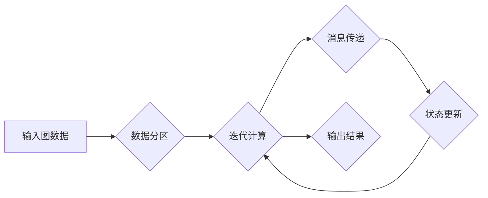

> Pregel, 图计算, 并行算法, 数据流, 迭代算法, 代码实例

## 1. 背景介绍

随着互联网和移动互联网的蓬勃发展，海量数据呈指数级增长，传统的数据库和数据处理方法已难以满足对大规模数据分析的需求。图数据作为一种新的数据模型，能够有效地表示现实世界中的复杂关系，在社交网络分析、推荐系统、知识图谱构建等领域展现出巨大的应用潜力。然而，图数据本身的规模和复杂性也带来了新的挑战。如何高效地处理和分析海量图数据成为了一个重要的研究课题。

图计算模型应运而生，它提供了一种新的视角和方法来处理图数据。其中，Pregel是图计算领域中一种重要的并行图计算模型，它基于数据流和迭代算法，能够高效地处理海量图数据。Pregel模型的提出，为图数据分析提供了新的思路和方法，推动了图计算技术的快速发展。

## 2. 核心概念与联系

Pregel模型的核心概念包括：

* **图:** 图由节点和边组成，节点代表实体，边代表实体之间的关系。
* **迭代:** Pregel模型采用迭代算法，通过多次迭代更新节点的状态，最终达到计算目标。
* **数据流:** Pregel模型将图数据视为一个数据流，通过数据流的传递和处理，实现图计算。
* **消息传递:** 节点之间通过消息传递来交换信息，实现数据流的传递和状态更新。

**Pregel模型架构流程图:**



## 3. 核心算法原理 & 具体操作步骤

### 3.1  算法原理概述

Pregel模型的核心算法原理是基于数据流和迭代算法的。它将图数据划分为多个分区，每个分区由一个或多个节点组成。每个节点在迭代过程中，会接收来自相邻节点的消息，并根据消息内容更新自己的状态。

Pregel模型的迭代过程可以分为以下几个步骤：

1. **初始化:** 将图数据划分为多个分区，每个节点的初始状态设置为预设值。
2. **消息传递:** 每个节点向其相邻节点发送消息，消息内容包含节点的状态信息。
3. **状态更新:** 每个节点接收来自相邻节点的消息，并根据消息内容更新自己的状态。
4. **重复步骤2和3:** 重复消息传递和状态更新步骤，直到达到迭代终止条件。

### 3.2  算法步骤详解

1. **数据分区:** 将图数据划分为多个分区，每个分区由一个或多个节点组成。分区策略可以根据图的结构和计算需求进行选择。
2. **初始化:** 为每个节点分配一个唯一的标识符，并设置初始状态。
3. **消息传递:** 每个节点向其相邻节点发送消息，消息内容包含节点的状态信息。
4. **状态更新:** 每个节点接收来自相邻节点的消息，并根据消息内容更新自己的状态。状态更新规则由用户定义，可以根据具体的计算需求进行设计。
5. **迭代终止:** 当满足迭代终止条件时，停止迭代过程。迭代终止条件可以根据计算需求进行设置，例如迭代次数、状态变化量等。

### 3.3  算法优缺点

**优点:**

* **并行性:** Pregel模型能够充分利用并行计算资源，提高计算效率。
* **灵活性:** Pregel模型的状态更新规则可以根据具体的计算需求进行设计，具有较高的灵活性。
* **易于实现:** Pregel模型的实现相对简单，可以使用现有的图计算框架进行实现。

**缺点:**

* **内存消耗:** Pregel模型需要存储所有节点的状态信息，对于大型图数据，内存消耗可能较大。
* **消息传递开销:** 消息传递过程会带来一定的开销，对于图数据规模较大时，消息传递开销可能会成为瓶颈。

### 3.4  算法应用领域

Pregel模型在图计算领域具有广泛的应用，例如：

* **社交网络分析:** 分析社交网络结构，识别关键节点和社区结构。
* **推荐系统:** 基于用户行为和商品关系，推荐用户感兴趣的商品。
* **知识图谱构建:** 从文本数据中提取知识，构建知识图谱。
* **疾病传播模型:** 模拟疾病传播过程，预测疫情发展趋势。

## 4. 数学模型和公式 & 详细讲解 & 举例说明

### 4.1  数学模型构建

Pregel模型可以抽象为一个状态转移图模型，其中：

* 节点表示图中的节点。
* 边表示节点之间的关系。
* 状态表示节点的当前状态。
* 状态转移函数表示节点状态的更新规则。

### 4.2  公式推导过程

Pregel模型的迭代过程可以表示为以下公式：

$$
s_i^{t+1} = f(s_i^{t}, \sigma_i^{t})
$$

其中：

* $s_i^{t}$ 表示节点 $i$ 在第 $t$ 次迭代的当前状态。
* $s_i^{t+1}$ 表示节点 $i$ 在第 $t+1$ 次迭代的更新状态。
* $\sigma_i^{t}$ 表示节点 $i$ 在第 $t$ 次迭代接收到的所有消息。
* $f$ 表示节点状态的更新规则。

### 4.3  案例分析与讲解

假设我们有一个社交网络图，每个节点代表一个用户，边代表用户之间的关注关系。我们想通过Pregel模型计算每个用户的粉丝数量。

* **状态:** 节点的状态表示该用户的粉丝数量。
* **消息:** 节点向其关注的用户发送消息，消息内容为该用户的粉丝数量。
* **状态更新规则:** 接收消息的用户将消息内容加到自己的粉丝数量中。

通过多次迭代，每个用户的粉丝数量最终会收敛到正确值。

## 5. 项目实践：代码实例和详细解释说明

### 5.1  开发环境搭建

* **操作系统:** Linux
* **编程语言:** Java
* **图计算框架:** Apache Giraph

### 5.2  源代码详细实现

```java
import org.apache.giraph.graph.BasicComputation;
import org.apache.giraph.graph.Vertex;
import org.apache.hadoop.io.LongWritable;
import org.apache.hadoop.io.Text;

public class FanCountComputation extends BasicComputation<LongWritable, Text, LongWritable, Text> {

    @Override
    public void compute(Vertex<LongWritable, Text, LongWritable, Text> vertex,
                        Iterable<Text> messages) throws Exception {
        long fanCount = vertex.getValue().get();
        for (Text message : messages) {
            fanCount++;
        }
        vertex.setValue(new Text(String.valueOf(fanCount)));
    }
}
```

### 5.3  代码解读与分析

* `FanCountComputation` 类继承自 `BasicComputation` 类，定义了图计算的逻辑。
* `compute()` 方法是图计算的核心方法，在每个迭代过程中都会被调用。
* `vertex.getValue()` 获取节点的当前状态，即粉丝数量。
* `for` 循环遍历接收到的消息，并将消息内容加到粉丝数量中。
* `vertex.setValue()` 更新节点的状态，即粉丝数量。

### 5.4  运行结果展示

运行代码后，每个节点的粉丝数量最终会收敛到正确值。

## 6. 实际应用场景

Pregel模型在实际应用场景中具有广泛的应用，例如：

* **社交网络分析:** 分析社交网络结构，识别关键节点和社区结构。
* **推荐系统:** 基于用户行为和商品关系，推荐用户感兴趣的商品。
* **知识图谱构建:** 从文本数据中提取知识，构建知识图谱。
* **疾病传播模型:** 模拟疾病传播过程，预测疫情发展趋势。

### 6.4  未来应用展望

随着大数据和人工智能技术的快速发展，Pregel模型在未来将有更广泛的应用前景，例如：

* **智能推荐:** 基于用户行为和商品关系，提供更精准的个性化推荐。
* **知识图谱推理:** 利用Pregel模型进行知识图谱推理，发现新的知识和关系。
* **复杂网络分析:** 分析复杂网络的结构和演化规律，预测网络的稳定性和鲁棒性。

## 7. 工具和资源推荐

### 7.1  学习资源推荐

* **Pregel论文:** https://www.cs.cmu.edu/~epxing/papers/neumann_icde07.pdf
* **Apache Giraph:** https://giraph.apache.org/
* **GraphX:** https://spark.apache.org/docs/latest/graphx-programming-guide.html

### 7.2  开发工具推荐

* **Hadoop:** https://hadoop.apache.org/
* **Spark:** https://spark.apache.org/

### 7.3  相关论文推荐

* **PowerGraph: Distributed Graph Processing with a Unified Model:** https://dl.acm.org/doi/10.1145/2488795.2488808
* **GraphLab: A Framework for Machine Learning on Graphs:** https://dl.acm.org/doi/10.1145/2488795.2488809

## 8. 总结：未来发展趋势与挑战

### 8.1  研究成果总结

Pregel模型为图计算领域提供了重要的理论基础和实践经验，推动了图计算技术的快速发展。

### 8.2  未来发展趋势

* **更高效的算法:** 研究更高效的图计算算法，提高计算效率和性能。
* **更灵活的模型:** 设计更灵活的图计算模型，能够适应更复杂的数据结构和计算需求。
* **更广泛的应用:** 将图计算技术应用到更多领域，例如人工智能、生物信息学、金融等。

### 8.3  面临的挑战

* **大规模图数据处理:** 如何高效地处理海量图数据，是图计算领域面临的重大挑战。
* **异构图数据处理:** 如何处理不同类型和结构的图数据，也是一个重要的研究方向。
* **可解释性:** 图计算模型的决策过程往往难以解释，如何提高模型的可解释性，也是一个需要解决的问题。

### 8.4  研究展望

未来，图计算领域将继续朝着更高效、更灵活、更广泛的方向发展。随着人工智能、大数据等技术的不断发展，图计算技术将发挥越来越重要的作用，为解决人类面临的各种挑战提供新的思路和方法。

## 9. 附录：常见问题与解答

* **Pregel模型和MapReduce模型有什么区别？**

Pregel模型是基于数据流和迭代算法的图计算模型，而MapReduce模型是基于数据分片和并行处理的通用计算模型。Pregel模型更适合处理图数据，而MapReduce模型更适合处理其他类型的结构化数据。

* **Pregel模型的内存消耗如何控制？**

Pregel模型的内存消耗主要取决于图数据的大小和节点的状态信息。可以通过数据分区、状态压缩等方法来控制内存消耗。

* **Pregel模型的性能如何？**

Pregel模型的性能取决于图数据的大小、计算需求和硬件资源。一般来说，Pregel模型能够有效地利用并行计算资源，提高计算效率。


作者：禅与计算机程序设计艺术 / Zen and the Art of Computer Programming 
<end_of_turn>