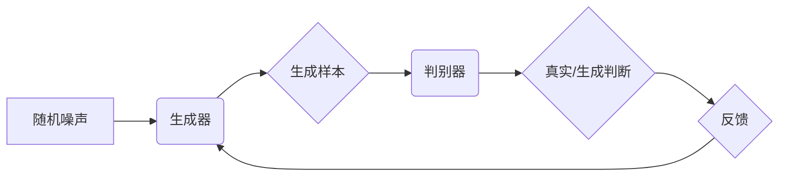

> 生成对抗网络(GAN)、机器学习、深度学习、图像生成、数据合成、对抗训练

## 1. 背景介绍

生成对抗网络(Generative Adversarial Networks, GANs) 是一类近年来在机器学习领域迅速兴起的生成模型，其核心思想是通过两个相互竞争的神经网络——生成器(Generator)和判别器(Discriminator)——来实现数据生成。生成器试图生成逼真的数据样本，而判别器则试图区分真实数据和生成数据。这种对抗性的训练机制使得 GANs 在图像生成、数据合成、文本生成等领域展现出强大的潜力。

传统的生成模型通常依赖于概率模型，例如变分自编码器(Variational Autoencoders, VAEs)，但它们往往难以生成高质量、多样化的样本。GANs 则通过对抗训练，使得生成器不断逼近真实数据分布，从而生成更逼真的样本。

## 2. 核心概念与联系

GANs 由两个相互竞争的神经网络组成：

* **生成器(Generator):** 负责生成新的数据样本，其输入是一个随机噪声向量，输出是一个模拟真实数据样本的数据。
* **判别器(Discriminator):** 负责区分真实数据和生成数据，其输入是数据样本，输出是一个概率值，表示该样本是真实数据还是生成数据。

这两个网络在训练过程中相互竞争：

* 生成器试图生成能够欺骗判别器的样本，使其误判为真实数据。
* 判别器试图准确区分真实数据和生成数据，提高其识别能力。

这种对抗性的训练机制使得 GANs 在生成高质量数据方面具有优势。

**Mermaid 流程图:**



## 3. 核心算法原理 & 具体操作步骤

### 3.1  算法原理概述

GANs 的训练过程可以看作是一个博弈过程，生成器和判别器不断地相互学习和改进。

* **生成器训练:** 生成器试图生成能够欺骗判别器的样本。它接收随机噪声向量作为输入，并将其映射到数据样本空间。生成器的目标是最大化判别器对生成样本的误判概率。
* **判别器训练:** 判别器试图区分真实数据和生成数据。它接收真实数据和生成数据作为输入，并输出一个概率值，表示该样本是真实数据还是生成数据。判别器的目标是最大化对真实数据的正确识别率，以及对生成数据的错误识别率。

### 3.2  算法步骤详解

1. **初始化:** 初始化生成器和判别器网络参数。
2. **生成样本:** 生成器根据随机噪声向量生成样本。
3. **判别样本:** 判别器对真实数据和生成样本进行分类。
4. **计算损失:** 计算生成器和判别器的损失函数值。
5. **更新参数:** 根据损失函数值，更新生成器和判别器的网络参数。
6. **重复步骤2-5:** 重复上述步骤，直到生成器能够生成逼真的样本，判别器无法区分真实数据和生成数据。

### 3.3  算法优缺点

**优点:**

* **生成高质量样本:** GANs 可以生成逼真、多样化的样本，在图像生成、文本生成等领域表现出色。
* **无监督学习:** GANs 可以进行无监督学习，不需要大量的标注数据。

**缺点:**

* **训练困难:** GANs 的训练过程比较复杂，容易出现模式崩溃等问题。
* **评价指标不完善:** 目前还没有一个完善的指标来评价 GANs 的生成质量。

### 3.4  算法应用领域

* **图像生成:** 生成逼真的图像，例如人脸、风景、物体等。
* **数据合成:** 合成新的数据样本，用于训练其他机器学习模型。
* **文本生成:** 生成自然语言文本，例如文章、对话、诗歌等。
* **视频生成:** 生成逼真的视频序列。
* **音频生成:** 生成逼真的音频信号，例如音乐、语音等。

## 4. 数学模型和公式 & 详细讲解 & 举例说明

### 4.1  数学模型构建

GANs 的核心数学模型是两个神经网络之间的对抗博弈。

* **生成器网络:** $G(z)$，其中 $z$ 是一个随机噪声向量，$G(z)$ 输出一个模拟真实数据样本的数据。
* **判别器网络:** $D(x)$，其中 $x$ 是一个数据样本，$D(x)$ 输出一个概率值，表示该样本是真实数据还是生成数据。

### 4.2  公式推导过程

* **判别器损失函数:** $L_D = E_{x \sim p_{data}(x)}[log D(x)] + E_{z \sim p_z(z)}[log(1 - D(G(z)))]$
* **生成器损失函数:** $L_G = E_{z \sim p_z(z)}[log(D(G(z)))]$

其中:

* $p_{data}(x)$ 是真实数据分布。
* $p_z(z)$ 是随机噪声分布。
* $E_{x \sim p_{data}(x)}[log D(x)]$ 表示对真实数据进行采样，计算判别器对真实数据的识别概率的期望值。
* $E_{z \sim p_z(z)}[log(1 - D(G(z)))]$ 表示对随机噪声进行采样，生成样本，计算判别器对生成数据的错误识别概率的期望值。
* $E_{z \sim p_z(z)}[log(D(G(z)))]$ 表示对随机噪声进行采样，生成样本，计算判别器对生成数据的正确识别概率的期望值。

### 4.3  案例分析与讲解

假设我们想要使用 GANs 生成人脸图像。

* **真实数据:** 我们收集了一组真实的人脸图像作为训练数据。
* **生成器:** 我们使用一个卷积神经网络作为生成器，其输入是一个随机噪声向量，输出是一个模拟人脸图像的数据。
* **判别器:** 我们使用另一个卷积神经网络作为判别器，其输入是一个图像，输出一个概率值，表示该图像是真实人脸图像还是生成人脸图像。

在训练过程中，生成器不断地生成新的人脸图像，并将其传递给判别器进行识别。判别器根据识别结果，反馈给生成器，指导生成器生成更逼真的图像。

## 5. 项目实践：代码实例和详细解释说明

### 5.1  开发环境搭建

* Python 3.6+
* TensorFlow 或 PyTorch
* CUDA 和 cuDNN (可选，用于 GPU 加速)

### 5.2  源代码详细实现

```python
import tensorflow as tf

# 定义生成器网络
def generator(z):
    # ... (卷积层、激活函数、池化层等)
    return output

# 定义判别器网络
def discriminator(x):
    # ... (卷积层、激活函数、池化层等)
    return output

# 定义损失函数和优化器
optimizer_G = tf.keras.optimizers.Adam(learning_rate=0.0002, beta_1=0.5)
optimizer_D = tf.keras.optimizers.Adam(learning_rate=0.0002, beta_1=0.5)
loss_fn = tf.keras.losses.BinaryCrossentropy()

# 训练循环
for epoch in range(num_epochs):
    for batch in dataset:
        # 训练判别器
        with tf.GradientTape() as tape_D:
            real_output = discriminator(real_data)
            fake_output = discriminator(generator(noise))
            d_loss_real = loss_fn(tf.ones_like(real_output), real_output)
            d_loss_fake = loss_fn(tf.zeros_like(fake_output), fake_output)
            d_loss = d_loss_real + d_loss_fake
        gradients_D = tape_D.gradient(d_loss, discriminator.trainable_variables)
        optimizer_D.apply_gradients(zip(gradients_D, discriminator.trainable_variables))

        # 训练生成器
        with tf.GradientTape() as tape_G:
            fake_output = discriminator(generator(noise))
            g_loss = loss_fn(tf.ones_like(fake_output), fake_output)
        gradients_G = tape_G.gradient(g_loss, generator.trainable_variables)
        optimizer_G.apply_gradients(zip(gradients_G, generator.trainable_variables))

    # 打印损失值
    print(f"Epoch {epoch+1}, D Loss: {d_loss.numpy()}, G Loss: {g_loss.numpy()}")

# 保存生成器模型
generator.save("generator_model.h5")
```

### 5.3  代码解读与分析

* **生成器网络:** 使用卷积神经网络构建，从随机噪声向量生成人脸图像。
* **判别器网络:** 使用卷积神经网络构建，判断图像是否为真实人脸图像。
* **损失函数:** 使用二元交叉熵损失函数，判别器试图最大化对真实数据的正确识别率，以及对生成数据的错误识别率，生成器试图最大化判别器对生成数据的正确识别率。
* **优化器:** 使用 Adam 优化器，更新生成器和判别器的网络参数。
* **训练循环:** 迭代训练生成器和判别器，直到生成器能够生成逼真的人脸图像。

### 5.4  运行结果展示

训练完成后，可以使用生成器生成新的人脸图像。

## 6. 实际应用场景

### 6.1  图像生成

* **艺术创作:** 生成新的艺术作品，例如绘画、雕塑等。
* **游戏开发:** 生成游戏中的角色、场景、道具等。
* **电影制作:** 生成电影中的特效、场景等。

### 6.2  数据合成

* **医疗领域:** 合成医学图像，用于训练疾病诊断模型。
* **金融领域:** 合成金融数据，用于风险评估、欺诈检测等。
* **制造业:** 合成产品设计数据，用于产品优化、质量控制等。

### 6.3  文本生成

* **写作辅助:** 生成文章、故事、诗歌等文本内容。
* **聊天机器人:** 生成自然语言对话，提高聊天机器人的交互体验。
* **机器翻译:** 生成目标语言文本，提高机器翻译的准确率。

### 6.4  未来应用展望

GANs 在未来将有更广泛的应用场景，例如：

* **虚拟现实和增强现实:** 生成逼真的虚拟环境和增强现实内容。
* **个性化推荐:** 生成个性化的商品推荐、内容推荐等。
* **药物研发:** 生成新的药物分子，加速药物研发过程。

## 7. 工具和资源推荐

### 7.1  学习资源推荐

* **书籍:**
    * 《深度学习》
    * 《Generative Adversarial Networks》
* **在线课程:**
    * Coursera: Deep Learning Specialization
    * Udacity: Deep Learning Nanodegree
* **博客和网站:**
    * Distill.pub
    * Towards Data Science

### 7.2  开发工具推荐

* **TensorFlow:** 开源深度学习框架，支持 GPU 加速。
* **PyTorch:** 开源深度学习框架，灵活易用。
* **Keras:** 高级深度学习 API，可以运行在 TensorFlow 或 Theano 后端。

### 7.3  相关论文推荐

* **Generative Adversarial Networks** (Goodfellow et al., 2014)
* **Improved Techniques for Training GANs** (Radford et al., 2015)
*