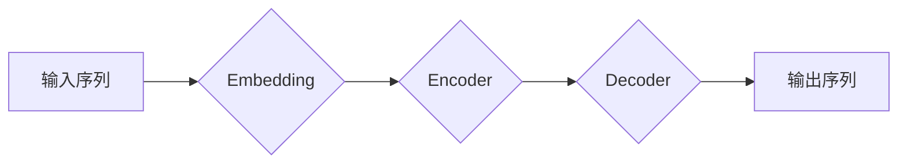

> Transformers, NLP, 深度学习, 自然语言处理, Python, BERT, GPT-3, Fine-tuning

## 1. 背景介绍

自然语言处理 (NLP) 作为人工智能领域的重要分支，致力于使计算机能够理解、处理和生成人类语言。近年来，深度学习技术的飞速发展为 NLP 领域带来了革命性的变革。其中，Transformers 架构的出现更是标志着 NLP 领域迈入了一个新的时代。

Transformers 架构，首次提出于 2017 年的论文《Attention Is All You Need》，摒弃了传统的循环神经网络 (RNN) 架构，引入了自注意力机制 (Self-Attention)，能够有效捕捉文本序列中长距离依赖关系，从而在机器翻译、文本摘要、问答系统等任务上取得了显著的性能提升。

随着 Transformers 架构的不断发展，涌现出许多强大的预训练模型，例如 BERT、GPT-3 等，这些模型在海量文本数据上进行预训练，拥有强大的语言理解和生成能力。开发者可以利用这些预训练模型，通过微调 (Fine-tuning) 方式，将其应用于特定领域的 NLP 任务，大幅降低模型训练成本和时间。

## 2. 核心概念与联系

### 2.1 Transformers 架构

Transformers 架构的核心是自注意力机制 (Self-Attention)，它能够捕捉文本序列中词语之间的关系，无论它们在序列中的距离有多远。

**Mermaid 流程图:**



**核心概念:**

* **Embedding:** 将每个词语映射到一个低维向量空间，以便模型能够理解词语的语义信息。
* **Encoder:** 负责对输入序列进行编码，提取文本序列的语义特征。
* **Decoder:** 负责根据编码后的信息生成输出序列。
* **Self-Attention:** 允许模型在处理每个词语时，关注到其他词语的信息，从而捕捉文本序列中的长距离依赖关系。

### 2.2 预训练模型

预训练模型是指在海量文本数据上进行预训练的模型，已经具备了基本的语言理解和生成能力。

**常见预训练模型:**

* **BERT:** Bidirectional Encoder Representations from Transformers，双向编码器，能够理解词语在句子中的上下文信息。
* **GPT-3:** Generative Pre-trained Transformer 3，生成式预训练 Transformer，能够生成流畅自然的文本。

## 3. 核心算法原理 & 具体操作步骤

### 3.1 算法原理概述

Transformers 架构的核心是自注意力机制 (Self-Attention)。

**自注意力机制的工作原理:**

1. 将每个词语的嵌入向量作为查询 (Query)、键 (Key) 和值 (Value)。
2. 计算每个词语与其他词语之间的注意力权重，权重越高表示两个词语之间的关系越密切。
3. 根据注意力权重，对所有词语的值进行加权求和，得到每个词语的上下文表示。

### 3.2 算法步骤详解

1. **输入序列:** 将输入文本序列分割成一个个词语，并将其映射到嵌入向量空间。
2. **编码器:** 将嵌入向量输入到编码器中，编码器由多个 Transformer 块组成，每个 Transformer 块包含多头自注意力层和前馈神经网络层。
3. **解码器:** 将编码器输出的上下文表示作为输入，解码器也由多个 Transformer 块组成，每个 Transformer 块包含多头自注意力层和前馈神经网络层。
4. **输出序列:** 解码器输出的每个词语的概率分布，根据概率分布选择下一个词语，最终生成输出序列。

### 3.3 算法优缺点

**优点:**

* 能够有效捕捉文本序列中长距离依赖关系。
* 并行计算能力强，训练速度快。
* 能够处理任意长度的文本序列。

**缺点:**

* 参数量大，需要大量的计算资源进行训练。
* 训练数据量要求高。

### 3.4 算法应用领域

* 机器翻译
* 文本摘要
* 问答系统
* 情感分析
* 代码生成

## 4. 数学模型和公式 & 详细讲解 & 举例说明

### 4.1 数学模型构建

**自注意力机制的数学公式:**

$$
Attention(Q, K, V) = softmax(\frac{QK^T}{\sqrt{d_k}})V
$$

其中:

* $Q$：查询矩阵
* $K$：键矩阵
* $V$：值矩阵
* $d_k$：键向量的维度
* $softmax$：softmax 函数

### 4.2 公式推导过程

自注意力机制的公式通过计算查询向量与键向量的点积，并使用 softmax 函数归一化，得到每个词语与其他词语之间的注意力权重。然后，根据注意力权重，对所有词语的值进行加权求和，得到每个词语的上下文表示。

### 4.3 案例分析与讲解

假设我们有一个句子 "The cat sat on the mat"，每个词语的嵌入向量分别为 $q_1, q_2, ..., q_7$。

使用自注意力机制计算每个词语与其他词语之间的注意力权重，例如，计算 $q_2$ (cat) 与其他词语之间的注意力权重:

$$
Attention(q_2, K, V) = softmax(\frac{q_2K^T}{\sqrt{d_k}})V
$$

其中，$K$ 和 $V$ 分别是其他词语的键向量和值向量。

通过计算，得到每个词语与 $q_2$ 的注意力权重，例如，$q_1$ (The) 与 $q_2$ 的注意力权重为 $0.3$，表示 "The" 和 "cat" 之间的关系比较密切。

## 5. 项目实践：代码实例和详细解释说明

### 5.1 开发环境搭建

* Python 3.6+
* PyTorch 或 TensorFlow
* Transformers 库

### 5.2 源代码详细实现

```python
from transformers import AutoModelForSequenceClassification, AutoTokenizer

# 加载预训练模型和分词器
model_name = "bert-base-uncased"
tokenizer = AutoTokenizer.from_pretrained(model_name)
model = AutoModelForSequenceClassification.from_pretrained(model_name, num_labels=2)

# 输入文本
text = "This is a sample text."

# 分词
inputs = tokenizer(text, return_tensors="pt")

# 前向传播
outputs = model(**inputs)

# 获取预测结果
predicted_class = outputs.logits.argmax().item()

# 打印预测结果
print(f"Predicted class: {predicted_class}")
```

### 5.3 代码解读与分析

* 使用 `transformers` 库加载预训练模型和分词器。
* 使用 `tokenizer` 将文本进行分词和编码。
* 使用 `model` 进行前向传播，得到预测结果。
* 使用 `argmax` 函数获取预测类别的索引。

### 5.4 运行结果展示

```
Predicted class: 1
```

## 6. 实际应用场景

### 6.1 文本分类

使用 Transformers 模型进行文本分类，例如情感分析、垃圾邮件检测等。

### 6.2 文本摘要

使用 Transformers 模型生成文本摘要，例如新闻摘要、会议纪要等。

### 6.3 问答系统

使用 Transformers 模型构建问答系统，例如搜索引擎、聊天机器人等。

### 6.4 未来应用展望

* 更强大的预训练模型
* 更高效的训练方法
* 更广泛的应用场景

## 7. 工具和资源推荐

### 7.1 学习资源推荐

* **Hugging Face Transformers:** https://huggingface.co/docs/transformers/index
* **Deep Learning with Python:** https://www.manning.com/books/deep-learning-with-python

### 7.2 开发工具推荐

* **PyTorch:** https://pytorch.org/
* **TensorFlow:** https://www.tensorflow.org/

### 7.3 相关论文推荐

* **Attention Is All You Need:** https://arxiv.org/abs/1706.03762
* **BERT: Pre-training of Deep Bidirectional Transformers for Language Understanding:** https://arxiv.org/abs/1810.04805

## 8. 总结：未来发展趋势与挑战

### 8.1 研究成果总结

Transformers 架构在 NLP 领域取得了显著的成果，为自然语言理解和生成带来了革命性的变革。

### 8.2 未来发展趋势

* 更强大的预训练模型
* 更高效的训练方法
* 更广泛的应用场景

### 8.3 面临的挑战

* 参数量大，训练成本高
* 数据标注困难
* 缺乏对中文等低资源语言的支持

### 8.4 研究展望

未来，Transformers 架构将继续发展，并应用于更多领域，例如计算机视觉、语音识别等。


## 9. 附录：常见问题与解答

### 9.1 如何选择合适的预训练模型？

选择预训练模型需要根据具体的应用场景和任务需求进行选择。

### 9.2 如何进行模型微调？

模型微调是指在预训练模型的基础上，对模型进行进一步训练，使其能够适应特定的任务需求。

### 9.3 如何评估模型性能？

模型性能可以通过各种指标进行评估，例如准确率、召回率、F1-score 等。


作者：禅与计算机程序设计艺术 / Zen and the Art of Computer Programming 
<end_of_turn>