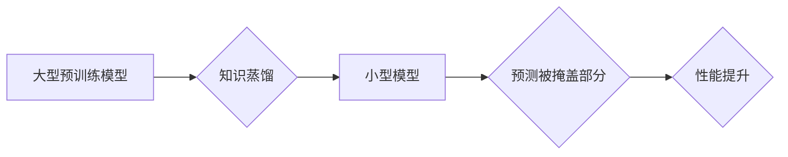

> SimMIM, 视觉Transformer, 知识蒸馏, 模型压缩, 代码实例

## 1. 背景介绍

近年来，基于Transformer的视觉模型在图像识别、目标检测、语义分割等视觉任务上取得了显著的成果。然而，这些模型通常具有参数量庞大、计算复杂度高的特点，难以部署在资源有限的设备上。为了解决这个问题，研究者们提出了多种模型压缩和高效训练方法，其中SimMIM（Simplified Masked Image Modeling）作为一种新的知识蒸馏方法，引起了广泛关注。

SimMIM的核心思想是通过将大型预训练模型的知识蒸馏到小型模型中，从而实现模型压缩和性能提升。它巧妙地利用了图像掩码机制，通过训练一个小型模型来预测被掩盖的部分，从而学习到大型模型的特征表示和知识。

## 2. 核心概念与联系

SimMIM的核心概念包括：

* **知识蒸馏:** 将大型模型的知识迁移到小型模型中，以提高小型模型的性能。
* **掩码图像建模 (Masked Image Modeling):** 通过随机掩盖图像的一部分，训练模型预测被掩盖的部分，从而学习到图像的全局特征表示。
* **教师学生模型:** SimMIM采用教师学生模型的训练策略，其中大型模型作为教师模型，小型模型作为学生模型。

**SimMIM 知识蒸馏流程图:**



## 3. 核心算法原理 & 具体操作步骤

### 3.1  算法原理概述

SimMIM的核心算法原理是基于知识蒸馏和掩码图像建模的。

1. **预训练阶段:** 大型预训练模型在大量图像数据上进行预训练，学习到丰富的图像特征表示。
2. **蒸馏阶段:** 将大型模型的知识蒸馏到小型模型中。具体来说，SimMIM采用以下步骤：
    * 将图像随机掩盖一部分，作为输入给教师模型和学生模型。
    * 教师模型预测被掩盖部分的像素值。
    * 学生模型预测被掩盖部分的像素值，并根据教师模型的预测结果进行调整。
    * 通过交叉熵损失函数，优化学生模型的参数，使其学习到教师模型的知识。

### 3.2  算法步骤详解

1. **数据准备:** 准备一个包含大量图像的数据集。
2. **预训练大型模型:** 使用预训练模型，例如ViT或Swin Transformer，在大型数据集上进行预训练。
3. **构建小型模型:** 根据需要，构建一个小型模型，例如一个更小的Transformer网络。
4. **知识蒸馏:**
    * 将图像随机掩盖一部分，作为输入给教师模型和学生模型。
    * 教师模型预测被掩盖部分的像素值。
    * 学生模型预测被掩盖部分的像素值，并根据教师模型的预测结果进行调整。
    * 使用交叉熵损失函数，优化学生模型的参数，使其学习到教师模型的知识。
5. **评估模型性能:** 使用测试集评估学生模型的性能，例如图像分类、目标检测等任务。

### 3.3  算法优缺点

**优点:**

* 模型压缩: SimMIM可以有效地压缩大型模型，使其更易于部署在资源有限的设备上。
* 性能提升: SimMIM可以提高小型模型的性能，使其接近大型模型的水平。
* 训练效率: SimMIM的训练效率较高，因为它只需要训练一个小型模型。

**缺点:**

* 依赖于大型模型: SimMIM需要一个预训练好的大型模型作为教师模型，否则无法进行知识蒸馏。
* 知识迁移: 知识迁移的过程并非完美，小型模型可能无法完全学习到教师模型的知识。

### 3.4  算法应用领域

SimMIM在以下领域具有广泛的应用前景:

* **移动设备:** 将大型视觉模型压缩到移动设备上，实现高效的图像识别和处理。
* **嵌入式系统:** 将SimMIM部署在嵌入式系统中，用于图像识别、目标检测等任务。
* **边缘计算:** 将SimMIM部署在边缘计算设备上，实现实时图像处理和分析。

## 4. 数学模型和公式 & 详细讲解 & 举例说明

### 4.1  数学模型构建

SimMIM的数学模型主要包括以下几个部分:

* **教师模型:** 通常是一个大型预训练模型，例如ViT或Swin Transformer。
* **学生模型:** 一个小型模型，用于学习教师模型的知识。
* **掩码函数:** 用于随机掩盖图像的一部分。
* **损失函数:** 用于衡量学生模型预测结果与教师模型预测结果之间的差异。

### 4.2  公式推导过程

SimMIM的损失函数通常采用交叉熵损失函数，其公式如下:

$$
L = -\sum_{i=1}^{N} \sum_{j=1}^{M} y_{i,j} \log(p_{i,j})
$$

其中:

* $N$ 是图像的高度。
* $M$ 是图像的宽度。
* $y_{i,j}$ 是真实标签，表示图像像素 $(i,j)$ 的值。
* $p_{i,j}$ 是学生模型预测的像素值 $(i,j)$ 的概率分布。

### 4.3  案例分析与讲解

假设我们有一个图像大小为 224x224 的彩色图像，其中每个像素有 3 个通道（RGB）。我们使用 SimMIM 将一个大型预训练模型的知识蒸馏到一个小型模型中。

在训练过程中，我们随机掩盖图像的一部分，例如 50% 的像素。然后，我们将掩盖后的图像作为输入给教师模型和学生模型。教师模型预测被掩盖部分的像素值，学生模型也预测被掩盖部分的像素值。

最后，我们使用交叉熵损失函数计算学生模型预测结果与教师模型预测结果之间的差异，并通过反向传播算法更新学生模型的参数。

## 5. 项目实践：代码实例和详细解释说明

### 5.1  开发环境搭建

SimMIM 的开发环境搭建需要以下软件和工具:

* Python 3.7+
* PyTorch 1.7+
* CUDA 10.2+
* torchvision

### 5.2  源代码详细实现

```python
import torch
import torch.nn as nn
from torchvision.models import vit_b_16

class SimMIM(nn.Module):
    def __init__(self, num_classes=1000):
        super(SimMIM, self).__init__()
        self.teacher_model = vit_b_16(pretrained=True)
        self.student_model = nn.Sequential(
            # ... 学生模型结构 ...
        )
        self.fc = nn.Linear(self.student_model.out_features, num_classes)

    def forward(self, x):
        # 教师模型预测
        teacher_output = self.teacher_model(x)
        # 学生模型预测
        student_output = self.student_model(x)
        # 损失计算
        loss = ...

        return loss

# 实例化模型
model = SimMIM(num_classes=1000)

# 训练模型
optimizer = torch.optim.Adam(model.parameters(), lr=0.001)
for epoch in range(num_epochs):
    for images, labels in dataloader:
        # 前向传播
        loss = model(images, labels)
        # 反向传播
        optimizer.zero_grad()
        loss.backward()
        optimizer.step()

```

### 5.3  代码解读与分析

* **模型结构:** SimMIM 的代码实现包含了教师模型、学生模型和损失函数。教师模型通常是一个预训练好的大型模型，例如 ViT 或 Swin Transformer。学生模型是一个小型模型，用于学习教师模型的知识。
* **训练过程:** SimMIM 的训练过程包括以下步骤:
    * 将图像随机掩盖一部分。
    * 将掩盖后的图像作为输入给教师模型和学生模型。
    * 计算学生模型预测结果与教师模型预测结果之间的差异。
    * 使用反向传播算法更新学生模型的参数。
* **参数设置:** SimMIM 的训练过程需要设置一些参数，例如学习率、批处理大小、训练 epochs 等。

### 5.4  运行结果展示

SimMIM 的运行结果可以根据具体的任务和数据集进行评估。例如，对于图像分类任务，可以评估学生模型在测试集上的准确率。

## 6. 实际应用场景

SimMIM 在以下实际应用场景中具有广泛的应用前景:

### 6.1  移动设备图像识别

SimMIM 可以将大型视觉模型压缩到移动设备上，实现高效的图像识别和处理。例如，可以用于识别物体、场景、人脸等。

### 6.2  嵌入式系统目标检测

SimMIM 可以部署在嵌入式系统中，用于目标检测任务。例如，可以用于自动驾驶、安防监控等领域。

### 6.3  边缘计算图像分析

SimMIM 可以部署在边缘计算设备上，实现实时图像分析和处理。例如，可以用于医疗影像分析、工业缺陷检测等领域。

### 6.4  未来应用展望

随着计算机视觉技术的不断发展，SimMIM 还有着巨大的发展潜力。未来，SimMIM 可以应用于更多领域，例如：

* **3D 场景重建:** SimMIM 可以用于重建三维场景，例如建筑物、室内环境等。
* **视频分析:** SimMIM 可以用于视频分析，例如动作识别、事件检测等。
* **生成式模型:** SimMIM 可以用于生成图像、视频等内容。

## 7. 工具和资源推荐

### 7.1  学习资源推荐

* **论文:** SimMIM: Simplified Masked Image Modeling for Efficient Vision Transformer Training
* **博客:** https://blog.openai.com/sim-mim/
* **GitHub:** https://github.com/facebookresearch/SimMIM

### 7.2  开发工具推荐

* **PyTorch:** https://pytorch.org/
* **TensorFlow:** https://www.tensorflow.org/

### 7.3  相关论文推荐

* **Vision Transformer (ViT):** https://arxiv.org/abs/2010.11929
* **Swin Transformer:** https://arxiv.org/abs/2103.14030
* **EfficientNet:** https://arxiv.org/abs/1905.11946

## 8. 总结：未来发展趋势与挑战

### 8.1  研究成果总结

SimMIM 作为一种新的知识蒸馏方法，取得了显著的成果，有效地压缩了大型视觉模型，提高了小型模型的性能。

### 8.2  未来发展趋势

未来，SimMIM 的发展趋势包括:

* **模型架构优化:** 研究更有效的模型架构，进一步提高模型压缩率和性能。
* **训练策略改进:** 研究更有效的训练策略，例如自监督学习、迁移学习等，提高模型的泛化能力。
* **应用场景拓展:** 将 SimMIM 应用于更多领域，例如 3D 场景重建、视频分析等。

### 8.3  面临的挑战

SimMIM 还面临一些挑战:

* **知识迁移:** 知识迁移的过程并非完美，如何更有效地将大型模型的知识迁移到小型模型中仍然是一个难题。
* **模型复杂度:** SimMIM 的模型复杂度较高，需要大量的计算资源进行训练。
* **数据需求:** SimMIM 的训练需要大量的图像数据，数据获取和标注成本较高。

### 8.4  研究展望

未来，SimMIM 将继续是一个重要的研究方向，研究者们将致力于解决上述挑战，开发更有效的模型压缩和高效训练方法，推动计算机视觉技术的进步。

## 9. 附录：常见问题与解答

**Q1: SimMIM 与其他模型压缩方法相比有什么优势？**

**A1:** SimMIM 相比于其他模型压缩方法，例如剪枝、量化等，具有以下优势:

* **性能提升:** SimMIM 可以有效地提高小型模型的性能，使其