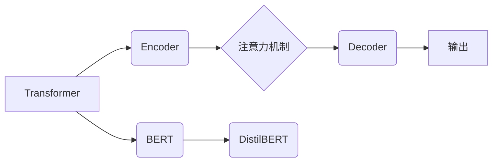

> Transformer, BERT, DistilBERT, 自然语言处理, 大模型, 训练, 实战

## 1. 背景介绍

自然语言处理 (NLP) 领域近年来取得了飞速发展，深度学习模型在该领域扮演着越来越重要的角色。BERT (Bidirectional Encoder Representations from Transformers) 模型的出现，标志着 NLP 领域迈入了一个新的时代。BERT 模型凭借其强大的语言理解能力，在各种 NLP 任务中取得了优异的成绩，例如文本分类、问答系统、机器翻译等。

然而，BERT 模型的规模庞大，训练成本高昂，部署也较为困难。针对这些问题，Google 研究人员提出了 DistilBERT 模型，它是一个经过量化和压缩的 BERT 模型，在保持较好性能的同时，显著降低了模型大小和训练成本。

本文将详细介绍 DistilBERT 模型的原理、训练方法以及实际应用场景，并通过代码实例，帮助读者深入理解 DistilBERT 模型的训练过程。

## 2. 核心概念与联系

### 2.1 Transformer 模型

Transformer 模型是 BERT 模型的基础架构，它是一种基于注意力机制的序列到序列模型，能够有效地捕捉长距离依赖关系。

Transformer 模型主要由以下几个部分组成：

* **编码器 (Encoder):** 用于将输入序列编码成语义表示。
* **解码器 (Decoder):** 用于根据编码后的语义表示生成输出序列。
* **注意力机制:** 用于计算输入序列中不同词之间的相关性，并根据相关性权重进行加权求和，从而捕捉长距离依赖关系。

### 2.2 BERT 模型

BERT 模型是一种基于 Transformer 模型的预训练语言模型，它通过在大量的文本数据上进行预训练，学习到丰富的语言表示。BERT 模型的训练目标是预测句子中某个词的上下文信息，从而学习到词语的语义和语法信息。

BERT 模型主要分为两种训练模式：

* **Masked Language Modeling (MLM):** 随机遮盖输入序列中的部分词，然后预测被遮盖词的词语。
* **Next Sentence Prediction (NSP):** 判断两个句子是否连续。

### 2.3 DistilBERT 模型

DistilBERT 模型是 BERT 模型的压缩版本，它通过以下方法降低了模型大小和训练成本：

* **量化:** 将模型参数的精度降低，例如将 32 位浮点数转换为 8 位整数。
* **知识蒸馏:** 使用一个较小的模型 (学生模型) 来学习一个较大的模型 (教师模型) 的知识。

DistilBERT 模型在保持较好性能的同时，显著降低了模型大小和训练成本，使其更适合部署在资源有限的设备上。



## 3. 核心算法原理 & 具体操作步骤

### 3.1  算法原理概述

DistilBERT 模型的核心算法原理是基于 Transformer 模型和知识蒸馏技术的。它通过将 BERT 模型的结构进行压缩和量化，并使用知识蒸馏技术来学习 BERT 模型的知识，从而构建出一个更小、更轻量级的模型。

### 3.2  算法步骤详解

1. **预训练 BERT 模型:** 使用大量的文本数据对 BERT 模型进行预训练，学习到丰富的语言表示。
2. **知识蒸馏:** 使用预训练好的 BERT 模型作为教师模型，训练一个较小的 DistilBERT 模型作为学生模型。
3. **模型压缩:** 对 DistilBERT 模型进行量化和结构压缩，例如减少 Transformer 层数、隐藏单元数量等。
4. **微调:** 使用特定任务的数据对 DistilBERT 模型进行微调，使其能够在目标任务上取得更好的性能。

### 3.3  算法优缺点

**优点:**

* 模型规模小，训练成本低。
* 在保持较好性能的同时，显著降低了模型大小和训练成本。
* 更适合部署在资源有限的设备上。

**缺点:**

* 相比 BERT 模型，性能略有下降。
* 训练过程需要预训练好的 BERT 模型作为教师模型。

### 3.4  算法应用领域

DistilBERT 模型在各种 NLP 任务中都有着广泛的应用，例如：

* 文本分类
* 问答系统
* 机器翻译
* 情感分析
* 文本摘要

## 4. 数学模型和公式 & 详细讲解 & 举例说明

### 4.1  数学模型构建

DistilBERT 模型的数学模型构建主要基于 Transformer 模型的架构，包括编码器和解码器。

* **编码器:** 编码器由多个 Transformer 块组成，每个 Transformer 块包含多头注意力机制和前馈神经网络。
* **解码器:** 解码器也由多个 Transformer 块组成，每个 Transformer 块包含多头注意力机制、masked multi-head attention 和前馈神经网络。

### 4.2  公式推导过程

Transformer 模型的核心是注意力机制，其计算公式如下：

$$
Attention(Q, K, V) = softmax(\frac{QK^T}{\sqrt{d_k}})V
$$

其中：

* $Q$：查询矩阵
* $K$：键矩阵
* $V$：值矩阵
* $d_k$：键向量的维度

### 4.3  案例分析与讲解

例如，在文本分类任务中，DistilBERT 模型可以将输入文本编码成一个固定长度的向量表示，然后将该向量表示输入到一个分类器中，进行分类预测。

## 5. 项目实践：代码实例和详细解释说明

### 5.1  开发环境搭建

* Python 3.6+
* TensorFlow 2.0+
* PyTorch 1.0+
* CUDA 10.0+

### 5.2  源代码详细实现

```python
# 导入必要的库
import tensorflow as tf

# 定义 DistilBERT 模型
class DistilBERT(tf.keras.Model):
    def __init__(self, vocab_size, embedding_dim, num_heads, num_layers):
        super(DistilBERT, self).__init__()
        self.embedding = tf.keras.layers.Embedding(vocab_size, embedding_dim)
        self.transformer_blocks = [
            tf.keras.layers.TransformerBlock(num_heads, embedding_dim)
            for _ in range(num_layers)
        ]

    def call(self, inputs):
        # 将输入文本编码成向量表示
        embeddings = self.embedding(inputs)
        # 将向量表示输入到 Transformer 块中进行编码
        for transformer_block in self.transformer_blocks:
            embeddings = transformer_block(embeddings)
        # 返回编码后的向量表示
        return embeddings

# 实例化 DistilBERT 模型
model = DistilBERT(vocab_size=30000, embedding_dim=128, num_heads=8, num_layers=6)

# 定义损失函数和优化器
loss_fn = tf.keras.losses.CategoricalCrossentropy()
optimizer = tf.keras.optimizers.Adam(learning_rate=1e-5)

# 训练模型
# ...

```

### 5.3  代码解读与分析

* **模型定义:** DistilBERT 模型的代码实现主要包括以下几个部分：
    * **Embedding 层:** 将输入文本转换为向量表示。
    * **Transformer 块:** 用于编码输入文本，捕捉长距离依赖关系。
    * **模型调用:** 定义了模型的调用方法，将输入文本编码成向量表示。
* **训练过程:** 训练 DistilBERT 模型需要使用训练数据，定义损失函数和优化器，然后进行迭代训练。

### 5.4  运行结果展示

训练完成后，可以将 DistilBERT 模型应用于实际任务中，例如文本分类、问答系统等。

## 6. 实际应用场景

DistilBERT 模型在各种 NLP 任务中都有着广泛的应用，例如：

* **文本分类:** DistilBERT 模型可以用于分类文本，例如判断文本的主题、情感等。
* **问答系统:** DistilBERT 模型可以用于构建问答系统，例如回答用户提出的问题。
* **机器翻译:** DistilBERT 模型可以用于机器翻译，例如将文本从一种语言翻译成另一种语言。
* **情感分析:** DistilBERT 模型可以用于分析文本的情感，例如判断文本的积极、消极或中性。
* **文本摘要:** DistilBERT 模型可以用于生成文本摘要，例如提取文本的关键信息。

### 6.4  未来应用展望

随着深度学习技术的不断发展，DistilBERT 模型的应用场景将会更加广泛。例如，它可以应用于：

* **对话系统:** DistilBERT 模型可以用于构建更智能的对话系统，例如聊天机器人。
* **个性化推荐:** DistilBERT 模型可以用于个性化推荐，例如推荐用户感兴趣的商品或内容。
* **代码生成:** DistilBERT 模型可以用于生成代码，例如根据自然语言描述生成代码。

## 7. 工具和资源推荐

### 7.1  学习资源推荐

* **DistilBERT 官方文档:** https://huggingface.co/docs/transformers/model_doc/distilbert
* **BERT 官方论文:** https://arxiv.org/abs/1810.04805
* **Transformer 官方论文:** https://arxiv.org/abs/1706.03762

### 7.2  开发工具推荐

* **TensorFlow:** https://www.tensorflow.org/
* **PyTorch:** https://pytorch.org/
* **HuggingFace Transformers:** https://huggingface.co/transformers/

### 7.3  相关论文推荐

* **DistilBERT: A distilled version of BERT: ** https://arxiv.org/abs/1910.01108
* **BERT: Pre-training of Deep Bidirectional Transformers for Language Understanding:** https://arxiv.org/abs/1810.04805
* **Attention Is All You Need:** https://arxiv.org/abs/1706.03762

## 8. 总结：未来发展趋势与挑战

### 8.1  研究成果总结

DistilBERT 模型的提出，为 NLP 领域带来了新的突破，它有效地降低了 BERT 模型的训练成本和部署难度，使其更易于应用于实际场景。

### 8.2  未来发展趋势

未来，DistilBERT 模型将会朝着以下几个方向发展：

* **模型压缩:** 进一步压缩 DistilBERT 模型的规模，使其更轻量化，更适合部署在移动设备上。
* **多模态学习:** 将 DistilBERT 模型与其他模态数据 (例如图像、音频) 结合，进行多模态学习，提升模型的理解能力。
* **自监督学习:** 利用自监督学习方法，进一步提升 DistilBERT 模型的预训练效果。

### 8.3  面临的挑战

DistilBERT 模型也面临着一些挑战，例如：

* **性能提升:** 尽管 DistilBERT 模型在保持较好性能的同时，降低了模型规模，但其性能仍然略逊于 BERT 模型。如何进一步提升 DistilBERT 模型的性能，是未来研究的一个重要方向。
* **数据效率:** DistilBERT 模型的训练需要大量的文本数据，如何提高模型的数据效率，使其能够在更少的数据下取得较好的性能，也是一个值得探索的问题。

### 8.4  研究展望

DistilBERT 模型作为一种轻量级、高效的预训练语言模型，在 NLP 领域具有广阔的应用前景。未来，我们将继续研究 DistilBERT 模型的改进方法，使其能够更好地服务于 NLP 领域的各种应用场景。

## 9. 附录：常见问题与解答

**Q1: DistilBERT 模型与 BERT 模型相比，有什么优势？**

**A1:** DistilBERT 模型相对于 BERT 模型，具有以下优势：

* 模型规模更小，训练成本更低。
* 部