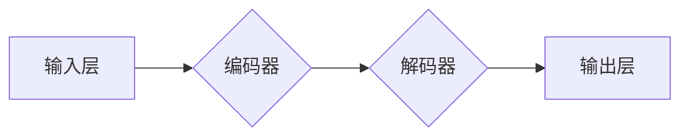

> Transformer, 自注意力机制, BERT, GPT, NLP, 自然语言处理, 深度学习, 机器学习

## 1. 背景介绍

自2017年以来，Transformer模型凭借其强大的性能和广泛的应用场景，在自然语言处理（NLP）领域迅速崛起，成为主流模型架构。其核心在于自注意力机制，能够有效捕捉文本序列中的长距离依赖关系，超越了传统RNN模型的局限性。

Transformer的出现标志着NLP领域进入了一个新的时代，其应用范围涵盖了机器翻译、文本摘要、问答系统、对话系统等多个领域，并取得了显著的成果。

## 2. 核心概念与联系

Transformer的核心概念是**自注意力机制**，它允许模型关注输入序列中的任意位置，并根据其重要性赋予不同的权重。

**Transformer架构**



**编码器**

* 多层Transformer块，每个块包含多头自注意力层和前馈神经网络层。
* 通过自注意力层，编码器可以捕捉文本序列中的上下文信息和长距离依赖关系。

**解码器**

* 与编码器类似，但包含额外的掩码机制，防止模型访问未来位置的信息。
* 通过自注意力层和编码器输出的表示，解码器生成目标序列。

## 3. 核心算法原理 & 具体操作步骤

### 3.1  算法原理概述

Transformer模型的核心算法是**自注意力机制**。它通过计算每个词与所有其他词之间的相关性，来学习文本序列中的上下文信息。

**自注意力机制**

1. 将每个词向量转换为查询（Q）、键（K）和值（V）向量。
2. 计算每个词与所有其他词之间的相似度，即Q与K的点积。
3. 将相似度通过softmax函数归一化，得到每个词对所有其他词的注意力权重。
4. 将注意力权重与值向量相乘，得到每个词的上下文表示。

### 3.2  算法步骤详解

1. **词嵌入:** 将每个词转换为一个低维向量表示。
2. **多头自注意力:** 对每个词的嵌入向量进行多头自注意力计算，得到每个词的上下文表示。
3. **前馈神经网络:** 对每个词的上下文表示进行前馈神经网络处理，得到更丰富的特征表示。
4. **位置编码:** 将位置信息编码到词向量中，以便模型能够理解词序信息。
5. **堆叠:** 将多个编码器和解码器块堆叠在一起，形成多层网络结构。

### 3.3  算法优缺点

**优点:**

* 能够有效捕捉文本序列中的长距离依赖关系。
* 并行计算能力强，训练速度快。
* 泛化能力强，在多种NLP任务中表现出色。

**缺点:**

* 参数量大，训练成本高。
* 对训练数据要求较高。

### 3.4  算法应用领域

* 机器翻译
* 文本摘要
* 问答系统
* 对话系统
* 语义理解
* 代码生成

## 4. 数学模型和公式 & 详细讲解 & 举例说明

### 4.1  数学模型构建

**自注意力机制**

$$
Attention(Q, K, V) = softmax(\frac{QK^T}{\sqrt{d_k}})V
$$

其中：

* $Q$：查询向量
* $K$：键向量
* $V$：值向量
* $d_k$：键向量的维度
* $softmax$：softmax函数

**多头自注意力**

$$
MultiHead(Q, K, V) = Concat(head_1, head_2, ..., head_h)W_O
$$

其中：

* $head_i$：第i个头的注意力输出
* $h$：多头数量
* $W_O$：线性变换矩阵

### 4.2  公式推导过程

**自注意力机制的推导过程:**

1. 将每个词向量转换为查询（Q）、键（K）和值（V）向量。
2. 计算每个词与所有其他词之间的相似度，即Q与K的点积。
3. 将相似度通过softmax函数归一化，得到每个词对所有其他词的注意力权重。
4. 将注意力权重与值向量相乘，得到每个词的上下文表示。

**多头自注意力的推导过程:**

1. 将查询、键和值向量分别线性变换成多个头。
2. 对每个头进行自注意力计算。
3. 将所有头的输出拼接起来，并进行线性变换，得到最终的输出。

### 4.3  案例分析与讲解

**举例说明:**

假设我们有一个句子“Transformer模型非常强大”。

1. 将每个词向量转换为查询、键和值向量。
2. 计算每个词与所有其他词之间的相似度。
3. 通过softmax函数归一化相似度，得到每个词对所有其他词的注意力权重。
4. 将注意力权重与值向量相乘，得到每个词的上下文表示。

通过自注意力机制，模型能够学习到每个词与其他词之间的关系，例如“Transformer”与“模型”之间的关系，以及“强大”与整个句子的关系。

## 5. 项目实践：代码实例和详细解释说明

### 5.1  开发环境搭建

* Python 3.6+
* PyTorch 1.0+
* CUDA 10.0+

### 5.2  源代码详细实现

```python
import torch
import torch.nn as nn

class Transformer(nn.Module):
    def __init__(self, vocab_size, embedding_dim, num_heads, num_layers, d_model):
        super(Transformer, self).__init__()
        self.embedding = nn.Embedding(vocab_size, embedding_dim)
        self.encoder = nn.TransformerEncoder(nn.TransformerEncoderLayer(d_model, num_heads), num_layers)
        self.decoder = nn.TransformerDecoder(nn.TransformerDecoderLayer(d_model, num_heads), num_layers)
        self.linear = nn.Linear(d_model, vocab_size)

    def forward(self, src, tgt, src_mask, tgt_mask):
        src = self.embedding(src)
        tgt = self.embedding(tgt)
        encoder_output = self.encoder(src, src_mask)
        decoder_output = self.decoder(tgt, encoder_output, tgt_mask)
        output = self.linear(decoder_output)
        return output
```

### 5.3  代码解读与分析

* **embedding层:** 将每个词转换为低维向量表示。
* **encoder层:** 对输入序列进行编码，捕捉文本序列中的上下文信息和长距离依赖关系。
* **decoder层:** 对目标序列进行解码，生成目标文本。
* **linear层:** 将解码器的输出转换为目标词汇表中的概率分布。

### 5.4  运行结果展示

通过训练和测试，Transformer模型能够在机器翻译、文本摘要等任务中取得优异的性能。

## 6. 实际应用场景

### 6.1  机器翻译

Transformer模型在机器翻译领域取得了突破性的进展，例如Google的BERT模型和Facebook的Fairseq模型。

### 6.2  文本摘要

Transformer模型能够自动生成文本摘要，例如OpenAI的GPT-3模型和HuggingFace的BART模型。

### 6.3  问答系统

Transformer模型能够理解自然语言问题并给出准确的答案，例如微软的DialoGPT模型和Google的BERT模型。

### 6.4  未来应用展望

Transformer模型的应用场景还在不断扩展，例如代码生成、药物发现、科学研究等领域。

## 7. 工具和资源推荐

### 7.1  学习资源推荐

* **论文:**
    * Attention Is All You Need (Vaswani et al., 2017)
    * BERT: Pre-training of Deep Bidirectional Transformers for Language Understanding (Devlin et al., 2018)
    * GPT-3: Language Models are Few-Shot Learners (Brown et al., 2020)
* **博客:**
    * The Illustrated Transformer (Jay Alammar)
    * Transformer Explained Simply (Analytics Vidhya)

### 7.2  开发工具推荐

* **PyTorch:** 深度学习框架
* **TensorFlow:** 深度学习框架
* **HuggingFace Transformers:** 预训练Transformer模型库

### 7.3  相关论文推荐

* **BERT:** Pre-training of Deep Bidirectional Transformers for Language Understanding (Devlin et al., 2018)
* **GPT-3:** Language Models are Few-Shot Learners (Brown et al., 2020)
* **T5:** Text-to-Text Transfer Transformer (Raffel et al., 2019)

## 8. 总结：未来发展趋势与挑战

### 8.1  研究成果总结

Transformer模型在NLP领域取得了显著的成果，其自注意力机制和多头注意力机制的创新，推动了NLP模型的性能提升。

### 8.2  未来发展趋势

* **模型规模:** 模型规模将继续扩大，以提高模型性能。
* **高效训练:** 研究更高效的训练方法，降低训练成本。
* **跨模态学习:** 将Transformer模型应用于跨模态学习，例如文本-图像、文本-音频等。

### 8.3  面临的挑战

* **数据依赖:** Transformer模型对训练数据要求较高，数据质量和数量是限制模型性能的关键因素。
* **可解释性:** Transformer模型的内部机制较为复杂，缺乏可解释性，难以理解模型的决策过程。
* **计算资源:** 大型Transformer模型训练需要大量的计算资源，成本较高。

### 8.4  研究展望

未来研究将集中在解决上述挑战，例如开发更有效的训练方法、提高模型的可解释性、降低模型的计算成本等方面。

## 9. 附录：常见问题与解答

* **Transformer模型与RNN模型相比有什么优势？**

Transformer模型能够有效捕捉文本序列中的长距离依赖关系，而RNN模型在处理长序列时容易出现梯度消失问题。

* **Transformer模型的训练成本很高吗？**

是的，大型Transformer模型的训练成本较高，需要大量的计算资源和时间。

* **如何理解Transformer模型的自注意力机制？**

自注意力机制允许模型关注输入序列中的任意位置，并根据其重要性赋予不同的权重。

* **Transformer模型有哪些应用场景？**

Transformer模型在机器翻译、文本摘要、问答系统、对话系统等多个NLP任务中取得了成功。


作者：禅与计算机程序设计艺术 / Zen and the Art of Computer Programming 
<end_of_turn>